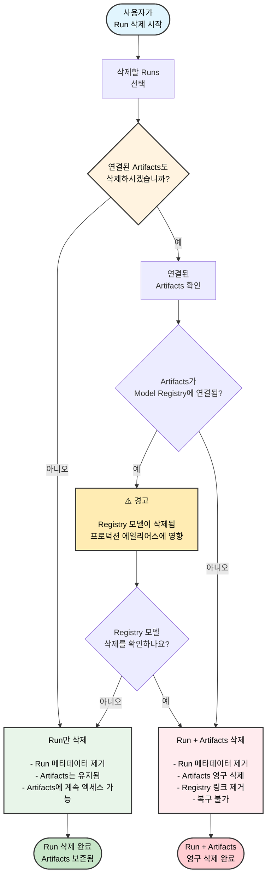

W&B App을 사용하여 프로젝트에서 하나 이상의 Runs를 삭제합니다.

1. 삭제하려는 Runs가 포함된 프로젝트로 이동합니다.
2. **Runs** 탭을 선택합니다.
3. 삭제하려는 Runs 옆의 체크박스를 선택합니다.
4. 테이블 상단의 **Delete** 버튼 (휴지통 아이콘)을 선택합니다.
5. 나타나는 드로어에서 **Delete**를 선택합니다.

<Note>
Run ID는 삭제된 후에도 재사용할 수 없습니다. 대신 해당 run은 오류와 함께 실패하게 됩니다.
</Note>

<Note>
Runs 수가 많은 프로젝트의 경우, 검색창을 사용하여 Regex로 삭제할 runs를 필터링하거나, 필터 버튼을 사용하여 상태, 태그 또는 기타 속성을 기준으로 runs를 필터링할 수 있습니다.
</Note>

### Run 삭제 플로우차트

다음 다이어그램은 연결된 Artifacts 및 Registry 링크 처리를 포함한 전체 Run 삭제 프로세스를 보여줍니다.

<Warning>
Run을 삭제할 때 연결된 Artifacts를 함께 삭제하도록 선택하면, 나중에 해당 Run을 복구하더라도 Artifacts는 영구적으로 제거되어 복구할 수 없습니다. 여기에는 Registry에 연결된 Artifacts도 포함됩니다.
</Warning>