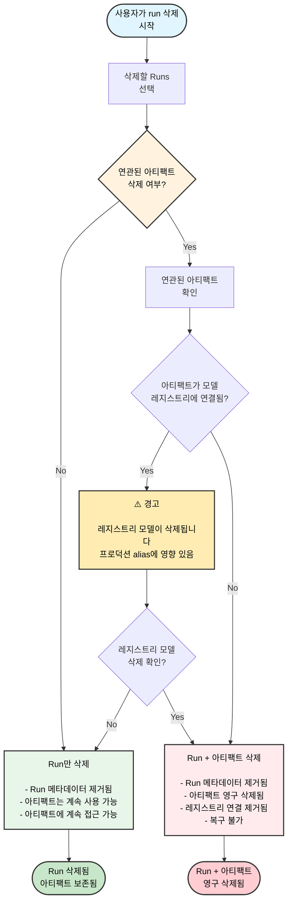

W&amp;B App을 사용해 프로젝트에서 하나 이상의 run을 삭제할 수 있습니다.

1. 삭제하려는 run이 포함된 프로젝트로 이동합니다.
2. **Runs** 탭을 선택합니다.
3. 삭제하려는 run 옆의 체크박스를 선택합니다.
4. 테이블 위에 있는 **Delete** 버튼(휴지통 아이콘)을 선택합니다.
5. 표시되는 드로어에서 **Delete**를 선택합니다.

<Note>
  run이 삭제된 후에도 run ID는 재사용할 수 없습니다. 동일한 run ID를 다시 사용하면 해당 run은 오류와 함께 실패합니다.
</Note>

<Note>
  run 수가 많은 프로젝트에서는 검색창을 사용해 Regex로 삭제할 run을 필터링하거나, 필터 버튼을 사용해 status, tags 또는 기타 속성을 기준으로 run을 필터링할 수 있습니다.
</Note>

  ### Run 삭제 흐름도

다음 다이어그램은 연결된 아티팩트와 레지스트리 링크 처리까지 포함한 전체 Run 삭제 과정을 보여줍니다.

```mermaid
graph TB
    Start([사용자가 run 삭제<br/>시작]) --> RunSelect[삭제할 Runs<br/>선택]
    
    RunSelect --> DeletePrompt{연관된 아티팩트<br/>삭제 여부?}
    
    DeletePrompt -->|No| DeleteRunOnly[Run만 삭제<br/><br/>- Run 메타데이터 제거됨<br/>- 아티팩트는 계속 사용 가능<br/>- 아티팩트에 계속 접근 가능]
    
    DeletePrompt -->|Yes| CheckArtifacts[연관된 아티팩트<br/>확인]
    
    CheckArtifacts --> HasRegistry{아티팩트가 모델<br/>레지스트리에 연결됨?}
    
    HasRegistry -->|Yes| RegistryWarning[⚠️ 경고<br/><br/>레지스트리 모델이 삭제됩니다<br/>프로덕션 alias에 영향 있음]
    HasRegistry -->|No| DirectDelete
    
    RegistryWarning --> ConfirmRegistry{레지스트리 모델<br/>삭제 확인?}
    
    ConfirmRegistry -->|No| DeleteRunOnly
    ConfirmRegistry -->|Yes| DirectDelete[Run + 아티팩트 삭제<br/><br/>- Run 메타데이터 제거됨<br/>- 아티팩트 영구 삭제됨<br/>- 레지스트리 연결 제거됨<br/>- 복구 불가]
    
    DeleteRunOnly --> PartialEnd([Run 삭제됨<br/>아티팩트 보존됨])
    DirectDelete --> FullEnd([Run + 아티팩트<br/>영구 삭제됨])
    
    style Start fill:#e1f5fe,stroke:#333,stroke-width:2px,color:#000
    style DeletePrompt fill:#fff3e0,stroke:#333,stroke-width:2px,color:#000
    style RegistryWarning fill:#ffecb3,stroke:#333,stroke-width:2px,color:#000
    style DirectDelete fill:#ffebee,stroke:#333,stroke-width:2px,color:#000
    style DeleteRunOnly fill:#e8f5e9,stroke:#333,stroke-width:2px,color:#000
    style PartialEnd fill:#c8e6c9,stroke:#333,stroke-width:2px,color:#000
    style FullEnd fill:#ffcdd2,stroke:#333,stroke-width:2px,color:#000
```

<Warning>
  run을 삭제할 때 연결된 아티팩트도 함께 삭제하도록 선택하면, 해당 아티팩트는 영구적으로 삭제되며 나중에 run을 복원하더라도 복구할 수 없습니다. 여기에는 레지스트리에 연결된 아티팩트도 포함됩니다.
</Warning>