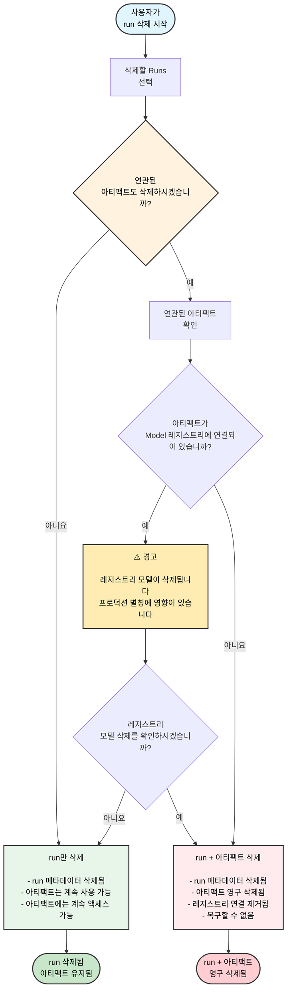

<div id="delete-runs">
  ## Runs 삭제
</div>

W&amp;B App 또는 Python API를 사용해 프로젝트에서 Runs를 삭제할 수 있습니다.

<Tabs>
  <Tab title="W&B App" value="ui">
    1. 삭제하려는 Runs이 포함된 프로젝트로 이동합니다.
    2. **Runs** 탭을 선택합니다.
    3. 삭제하려는 Runs 옆의 체크박스를 선택합니다.
    4. 테이블 위에 있는 **Delete** 버튼(휴지통 아이콘)을 선택합니다.
    5. 표시되는 drawer에서 **Delete**를 선택합니다.

    run 수가 많은 프로젝트에서는 검색창에서 Regex를 사용해 삭제할 Runs을 필터링하거나, 필터 버튼을 사용해 상태, tags 또는 기타 속성을 기준으로 Runs을 필터링할 수 있습니다.
  </Tab>

  <Tab title="Python" value="python">
    [`Run.delete()`](/ko/models/ref/python/public-api/run#method-run-delete)를 사용하면 프로그래밍 방식으로 Runs를 삭제할 수 있습니다. run에 연결된 아티팩트도 함께 제거하려면 `delete_artifacts=True`로 설정하세요.

    ```python
    import wandb

    api = wandb.Api()
    runs = api.runs("<entity>/<project>")
    for run in runs:
        if run.state == "finished":  # 사용자 조건으로 바꾸세요
            run.delete(delete_artifacts=False)
    ```

    전체 메서드 시그니처와 동작은 [`Run.delete` 레퍼런스](/ko/models/ref/python/public-api/run#method-run-delete)를 참조하세요.

    로깅된 미디어처럼 run에 첨부된 개별 파일을 제거하려면 다음과 같이 하세요.

    1. [`Run.files()`](/ko/models/ref/python/public-api/run#method-run-files)로 관련 파일 핸들을 가져옵니다.
    2. [`File.delete()`](/ko/models/ref/python/public-api/file#method-file-delete)를 사용해 개별 파일을 삭제합니다.
  </Tab>
</Tabs>

run ID는 run이 삭제된 후에도 재사용할 수 없습니다. 재사용하려고 하면 해당 run은 오류와 함께 실패합니다.

<Warning>
  run을 삭제하면서 연결된 아티팩트도 삭제하도록 선택하면, 해당 아티팩트는 영구적으로 제거되며 나중에 run을 복원하더라도 복구할 수 없습니다. 여기에는 레지스트리에 연결된 아티팩트도 포함됩니다.
</Warning>

<div id="run-deletion-flowchart">
  ## Run 삭제 흐름도
</div>

다음 다이어그램은 관련 아티팩트와 레지스트리 링크 처리까지 포함한 전체 run 삭제 과정을 보여 줍니다.


```mermaid
graph TB
    Start([사용자가<br/>run 삭제 시작]) --> RunSelect[삭제할 Runs<br/>선택]
    RunSelect --> DeletePrompt{연관된<br/>아티팩트도 삭제하시겠습니까?}
    DeletePrompt -->|아니요| DeleteRunOnly[run만 삭제<br/><br/>- run 메타데이터 삭제됨<br/>- 아티팩트는 계속 사용 가능<br/>- 아티팩트에는 계속 액세스 가능]
    DeletePrompt -->|예| CheckArtifacts[연관된 아티팩트<br/>확인]
    CheckArtifacts --> HasRegistry{아티팩트가<br/>Model 레지스트리에 연결되어 있습니까?}
    HasRegistry -->|예| RegistryWarning[⚠️ 경고<br/><br/>레지스트리 모델이 삭제됩니다<br/>프로덕션 별칭에 영향이 있습니다]
    HasRegistry -->|아니요| DirectDelete
    RegistryWarning --> ConfirmRegistry{레지스트리<br/>모델 삭제를 확인하시겠습니까?}
    ConfirmRegistry -->|아니요| DeleteRunOnly
    ConfirmRegistry -->|예| DirectDelete[run + 아티팩트 삭제<br/><br/>- run 메타데이터 삭제됨<br/>- 아티팩트 영구 삭제됨<br/>- 레지스트리 연결 제거됨<br/>- 복구할 수 없음]
    DeleteRunOnly --> PartialEnd([run 삭제됨<br/>아티팩트 유지됨])
    DirectDelete --> FullEnd([run + 아티팩트<br/>영구 삭제됨])
    style Start fill:#e1f5fe,stroke:#333,stroke-width:2px,color:#000
    style DeletePrompt fill:#fff3e0,stroke:#333,stroke-width:2px,color:#000
    style RegistryWarning fill:#ffecb3,stroke:#333,stroke-width:2px,color:#000
    style DirectDelete fill:#ffebee,stroke:#333,stroke-width:2px,color:#000
    style DeleteRunOnly fill:#e8f5e9,stroke:#333,stroke-width:2px,color:#000
    style PartialEnd fill:#c8e6c9,stroke:#333,stroke-width:2px,color:#000
    style FullEnd fill:#ffcdd2,stroke:#333,stroke-width:2px,color:#000
```

<div id="when-deleted-run-data-is-removed-from-storage">
  ## 삭제된 run 데이터가 저장소에서 제거되는 시점
</div>

[W&amp;B Dedicated Cloud](/ko/platform/hosting/hosting-options/dedicated-cloud) 및 [W&amp;B Self-Managed](/ko/platform/hosting/hosting-options/self-managed)에서는 `GORILLA_DATA_RETENTION_PERIOD` 환경 변수가 **삭제된 run 데이터**가 객체 저장소에서 영구적으로 제거되기 전까지 보존되는 기간을 제어합니다. **Artifacts는 이 설정으로 제거되지 않으며**, [아티팩트 삭제](/ko/models/artifacts/delete-artifacts)에 설명된 아티팩트 삭제 및 가비지 컬렉션 흐름을 따릅니다.

`GORILLA_DATA_RETENTION_PERIOD`를 설정하거나 변경하면 보존 기간이 지난 데이터에 대해서는 되돌릴 수 없습니다. 보존 기간을 적용하거나 단축하기 전에 데이터베이스와 버킷을 백업하세요. 레퍼런스 표와 경고는 [환경 변수 구성](/ko/platform/hosting/env-vars)을 참조하세요.

run 또는 파일 삭제와 보존 처리가 끝난 후에도 백그라운드 작업이 완료될 때까지 **버킷 사용량 반영이 지연될 수 있습니다**. W&amp;B는 객체 저장소 공간이 즉시 회수된다고 보장하지 않습니다. Artifacts와 run 데이터의 차이, 예상 시점, 선택적 운영 작업에 대한 전체 개요는 [버킷 저장소 및 비용 관리](/ko/platform/hosting/managing-bucket-storage)를 참조하세요.

<Note>
  Public API를 사용할 때 W&amp;B App에서 삭제가 예상대로 표시되지 않으면 W&amp;B Python SDK를 최신 릴리스로 업그레이드한 후 다시 시도하세요.
</Note>