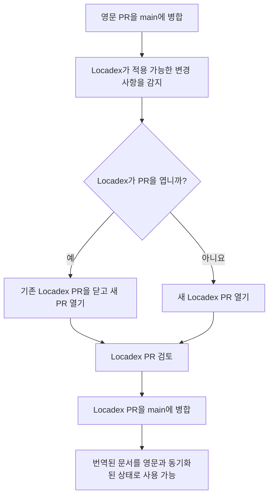

  # 기술 문서 작성자를 위한 Locadex 자동 번역

이 운영 가이드는 `wandb/docs` 저장소에서 작업하는 W&amp;B 영문 기술 문서 작성자를 위한 것입니다. `main`에서 Locadex 인테그레이션이 활성화되어 있으며, 프로덕션 번역에 사용된다고 가정합니다.

이 문서를 통해 전체 흐름을 이해하고, Locadex가 저장소에서 무엇을 변경하는지, Locadex 콘솔과 GitHub 중 어디에서 작업해야 하는지, 그리고 현지화된 콘텐츠를 수정하거나 개선하는 방법을 파악하세요.

  ## 개요 및 범위

  ### Locadex가 현지화하는 항목

General Translation [Locadex for Mintlify](https://generaltranslation.com/en-US/docs/locadex/mintlify)는 저장소 루트의 `gt.config.json`을 기반으로 원본 콘텐츠의 현지화된 사본을 생성하고 업데이트합니다. 현재 설정에는 다음 항목이 포함됩니다.

* **MDX 및 Markdown 페이지**: 저장소의 영어 파일은 `gt.config.json`의 경로 변환을 사용해 로캘 디렉터리(예: `ko/`, `ja/`, `fr/`)로 동일한 구조로 복제됩니다. Locadex는 이미 번역한 파일을 추적하고, 새로 병합된 영어 변경 사항만 번역합니다.
* **스니펫**: 공유 스니펫 경로도 같은 방식으로 현지화됩니다(예: 설정에 따라 `snippets/foo.mdx`가 `snippets/ko/foo.mdx`로 변환됨).
* **목차 및 내비게이션**: 현지화된 내비게이션과 페이지 경로가 Mintlify와 일치하도록 `docs.json`도 포함됩니다.
* **OpenAPI 사양**: 설정된 OpenAPI JSON 파일(예: `training/api-reference/` 및 `weave/reference/service-api/` 아래)은 `gt.config.json`에 따라 현지화됩니다.

Locadex는 Mintlify 동작에 영향을 주는 옵션도 적용합니다(예: 정적 임포트와 상대 asset 처리, 리디렉션, 헤더 앵커 동작). 어떤 JSON 및 MDX 경로가 대상에 포함되는지는 `gt.config.json`을 단일 기준으로 보세요.

  ### Locadex가 현지화하지 않는 항목

* **래스터 및 벡터 그래픽**: 이미지 파일은 로캘별 아트워크로 교체되지 않습니다. 현지화된 에셋을 추가하고 경로를 직접 업데이트하지 않는 한, 다이어그램과 스크린샷은 참조된 상태로 유지됩니다.
* **제외된 본문 파일**: `gt.config.json`의 `files.mdx.exclude`에 나열된 경로는 자동 번역되지 않습니다. 여기에는 `README.md`, `CONTRIBUTING.md`, `AGENTS.md` 같은 표준 리포지토리 파일과 팀이 여기에 추가한 유사한 패턴이 포함됩니다.
* **영어를 기준 원본으로 사용**: 작성자는 계속 영어로 문서를 작성하고 변경 사항을 병합합니다. 현지화된 파일은 자동화 결과물에 필요에 따라 직접 수행한 수동 편집이 더해진 산출물입니다.

  ## `main`에서의 번역 워크플로

Locadex가 저장소에 연결되면([Locadex for Mintlify](https://generaltranslation.com/docs/locadex/mintlify)의 GitHub 앱, 프로젝트, 브랜치 설정 기준):

1. **영어 전용** 문서 PR을 `main`에 병합합니다.
2. Locadex가 대상 변경 사항을 감지하고(인테그레이션 규칙에 따라) **번역 라운드**를 시작하거나 업데이트합니다.
3. `main` 대상으로 열려 있는 Locadex pull request가 이미 있으면, Locadex는 **해당 PR을 닫고** 기존 PR의 모든 변경 사항과 새로 병합된 영어 변경 사항을 모두 포함한 새 PR을 만듭니다. 열려 있는 Locadex PR이 없으면, Locadex는 현지화 업데이트가 포함된 **새 PR을 엽니다**. Locadex PR의 예시는 [#2430](https://github.com/wandb/docs/pull/2430)을 참고하세요.
4. 문서 팀이 Locadex PR을 **검토합니다**(상황에 따라 스폿 체크, LLM 지원 검토, 또는 원어민 검토를 사용).

   Locadex PR에서 오류를 발견하면 PR 브랜치에 수정 사항을 커밋하세요. 이렇게 하면 이후 번역 라운드에서 Locadex의 번역 방향을 조정할 수 있습니다.
5. Locadex PR이 **`main`에 병합되면**, Mintlify가 업데이트된 현지화 사이트를 영어와 함께 서빙합니다. 해당 PR을 병합하면 업데이트된 번역 문서가 게시됩니다.

  ### 영어 PR 병합 후 작성자 체크리스트

* [ ] 열려 있는 PR 목록에서 Locadex PR을 찾으세요. 이 PR은 영어 PR이 병합되기 전에 이미 생성되어 있을 수도 있고, 병합 과정에서 생성될 수도 있습니다. `locadex`를 검색하세요.
* [ ] 변경 사항을 현지화된 사이트에 긴급히 반영해야 한다면, Locadex PR을 검토받아 병합하고 업데이트를 즉시 게시하세요. 그렇지 않으면 Locadex PR이 병합될 때 번역이 제공됩니다.
* [ ] **향후** 실행에 용어 변경을 적용해야 하는 경우, Locadex 콘솔에서 **AI Context**를 업데이트하고(아래 참고) 기존 페이지를 다시 생성해야 한다면 **Retranslate**를 계획하세요.

  ## Locadex 콘솔과 wandb/docs 리포지토리 비교

변경 유형별로 알맞은 위치를 사용하세요.

| Task                                                         | Where to do it                              | Notes                                                                                                                                                                   |
| ------------------------------------------------------------ | ------------------------------------------- | ----------------------------------------------------------------------------------------------------------------------------------------------------------------------- |
| **대상 로캘** 또는 번역할 **파일** 추가/변경                                | GitHub의 `gt.config.json`                    | `main`에 대한 일반 PR이 필요합니다. include 또는 exclude 패턴을 변경하기 전에 엔지니어링 팀이나 docs platform 담당자와 먼저 조율하세요.                                                                          |
| **Glossary** (용어, 정의, 로캘별 번역, 번역 제외 항목)                      | Locadex 콘솔, **Context**, **Glossary**       | CSV를 통해 일괄 **임포트** 및 **내보내기**를 할 수 있습니다. [GT Glossary](https://generaltranslation.com/docs/platform/ai-context/glossary)를 참조하세요.                                        |
| **Locale Context** (공백, 로캘별 톤, 서식 규칙 관련 힌트가 포함된 로캘별 프롬프트)    | Locadex 콘솔, **Context**, **Locale Context** | [Locale Context](https://generaltranslation.com/docs/platform/ai-context/locale-context)를 참조하세요.                                                                        |
| **Style Controls** (대상 독자, 프로젝트 설명, 전반적인 톤에 대한 프로젝트 전체 프롬프트) | Locadex 콘솔, **Context**, **Style Controls** | [Style Controls](https://generaltranslation.com/docs/platform/ai-context/style-controls)를 참조하세요.                                                                        |
| 컨텍스트 변경 후 개별 파일을 수동으로 다시 번역하는 **Retranslate**                | Locadex 콘솔                                  | [Retranslate](https://generaltranslation.com/docs/platform/translations/retranslate)를 참조하세요. AI Context를 변경해도 Retranslate를 실행하기 전에는 기존의 현지화된 파일이 자동으로 모두 다시 번역되지는 않습니다. |
| 기계 번역 결과 **Review**                                          | GitHub의 Locadex PR                          | 권한이 있다면 댓글을 남기고, 변경을 요청하고, 수정 사항을 푸시하거나, PR을 병합하지 않은 채 닫아 번역 라운드를 중단할 수 있습니다.                                                                                           |
| 현지화된 페이지의 **일회성 텍스트 수정**                                     | GitHub에서 직접 편집                              | 로캘 디렉터리 아래의 파일(예: `ko/...`)을 편집하세요. `main`에 대한 일반 PR을 여세요. 필요하다면 앞으로 수동 수정이 발생하지 않도록 Locadex Dashboard에서도 조정하세요.                                                        |

**중요:** docs용 Glossary와 프롬프트는 `gt.config.json`이 아니라 **Locadex 콘솔**에 있습니다.

  ### Glossary 및 AI Context 가져오기와 내보내기

1. [General Translation Dashboard](https://dash.generaltranslation.com/) (Locadex 콘솔)에 로그인하세요.
2. `wandb/docs`에 연결된 프로젝트를 여세요.
3. 필요에 따라 **Context**로 이동해 **Glossary**, **Locale Context**, 또는 **Style Controls**를 선택하세요.

**Glossary CSV**

* **Upload Context CSV**를 사용해 여러 용어를 한 번에 임포트하세요. 열 이름은 콘솔에서 요구하는 형식(예: **Term**, **Definition**, 그리고 **ko** 같은 로캘 열)과 일치해야 합니다. 업로드에 실패하면 헤더를 제품 내 도움말 또는 [GT Glossary](https://generaltranslation.com/docs/platform/ai-context/glossary)와 비교하세요.
* 백업, 검토, 또는 평가를 위해 벤더나 LLM과 공유해야 할 때는 용어를 내보내거나 복사하세요.

**Locale Context 및 Style Controls**

* 콘솔에서 편집한 후 저장하세요. 다음 번역 라운드에서 검토자가 무엇을 예상해야 하는지 알 수 있도록 중요한 규칙 변경 사항은 팀 채널이나 내부 노트에 기록해 두세요.

**AI Context를 변경한 후**

* 기존 현지화 페이지에 새 규칙을 반영해야 한다면 영향을 받는 파일이나 로캘에 대해 **Retranslate**를 실행하세요. 이후 새 Locadex PR이 생성되거나 기존 PR이 업데이트될 수 있습니다.

  ## LLM을 사용해 번역 라운드 평가하기

LLM은 대규모 Locadex PR을 검토하고 우선순위를 가리는 데 도움이 될 수 있습니다. 하지만 정확도, 제품 용어, 미묘한 뉘앙스에 대한 사람의 판단을 대체할 수는 없습니다. 아래 섹션에서는 가능한 접근 방식 중 하나를 설명합니다.

  ### 1. 입력 수집

* **Diff**: 에이전트가 GitHub의 Locadex PR diff를 보도록 지정하세요.
* **Rules**: 다음 내용을 붙여 넣거나 요약하세요.
  * Locadex 콘솔의 **Glossary** 항목과 **Locale Context** 항목. 모든 언어에서 이 항목들은 통합 CSV 내보내기에 포함됩니다. (대상 로캘에 해당하는 용어를 내보내거나 복사하세요.)
  * 선택 사항: 팀에서 평가 기준을 그곳에 관리하는 경우, 저장소 루트의 `locadex_prompts.md` 파일에 있는 내부 프롬프트 메모(문장형 대소문자, W&amp;B 제품 명명 등)
* **English baseline**: 샘플 파일의 경우, 모델이 구조(제목, 목록, 코드 블록, 링크)를 비교할 수 있도록 영어 source 경로와 현지화된 경로를 포함하세요.

  ### 2. 프롬프트 형태 (예시)

모델에 다음을 요청하세요.

* **번역 금지** 위반 사항(제품명, UI 레이블, `wandb`, 코드 식별자)을 표시합니다.
* 붙여 넣은 목록을 기준으로 **Glossary 일관성**을 확인합니다.
* **깨진 Markdown 또는 MDX**(깨진 링크, 형식이 잘못된 표, 코드 펜스 언어 태그)를 지적합니다.
* **과도한 번역**(URL, 코드 또는 영어로만 표기해야 하는 고유명사를 잘못 번역한 경우)을 지적합니다.
* 파일 경로와 수정 제안을 포함한 **짧고 실행 가능한 결과**를 우선합니다.

  ### 3. 출력 결과 활용 방법

* 검토 결과를 Locadex PR의 GitHub 리뷰 댓글로 남기거나, 병합 후 후속 편집으로 반영하세요.
* 동일한 오류가 여러 파일에서 반복되면 파일 수십 개를 일일이 수정하지 말고 **AI Context**(Glossary 또는 Locale Context)를 수정한 뒤 **Retranslate**를 사용하세요.

  ## 자동 현지화된 콘텐츠의 수동 수정 및 업데이트

  ### 병합 후 일회성 수정

단일 페이지나 스니펫만 잘못되었고 용어집과 로캘 규칙에는 문제가 없는 경우:

1. `main`에서 브랜치를 체크아웃하세요.
2. 현지화된 파일을 수정하세요(예: `ja/models/foo.mdx` 또는 `snippets/ko/bar.mdx`).
3. `main`을 대상으로 PR을 열고 명확한 요약을 작성하세요(무엇이 잘못되었는지, 수동 수정이 왜 안전한지).
4. 영문 source가 변경된 경우에만 다음 Locadex 실행에서 동일한 파일이 다시 수정될 것으로 예상하세요. Locadex가 수동 수정을 덮어쓰면 플랫폼 소유자에게 에스컬레이션하고, 프로젝트에 문서화된 잠금 또는 제외 패턴 적용을 검토하세요.

  ### 전반적인 용어 또는 스타일 수정

같은 실수가 여러 파일에서 반복된다면:

1. Locadex 콘솔에서 **Glossary**, **Locale Context** 또는 **Style Controls**를 업데이트하세요.
2. **Retranslate**를 사용해 Locadex가 영향을 받은 현지화 콘텐츠를 다시 생성하게 하세요. 생성된 Locadex PR은 꼼꼼히 검토하세요.

  ### English가 다시 변경되는 경우

English 병합이 다음 Locadex 업데이트를 좌우합니다. 수동으로 수정한 현지화 내용은 새 기계 번역 결과와 다시 조정해야 할 수 있습니다. 자동화가 안정적으로 유지되도록 하려면 English source 또는 console context를 수정하는 방법을 우선하세요.

  ## 검증 및 테스트

* Locadex PR가 병합된 후에는 Mintlify 미리보기 또는 프로덕션에서 로캘별 트래픽이 많은 페이지를 샘플 점검하세요.
* 워크플로에 따라 필요한 경우 로컬에서 `mint dev`, `mint validate`, `mint broken-links`를 실행하세요(저장소의 `AGENTS.md` 참조).
* 로캘 경로 아래의 OpenAPI 및 내비게이션 JSON이 핵심 API의 실제 제품 동작과 계속 일치하는지 확인하세요.

  ## 관련 링크

* [Mintlify용 Locadex](https://generaltranslation.com/docs/locadex/mintlify)
* [GT 용어집](https://generaltranslation.com/docs/platform/ai-context/glossary)
* [Locale Context](https://generaltranslation.com/docs/platform/ai-context/locale-context)
* [Style Controls](https://generaltranslation.com/docs/platform/ai-context/style-controls)
* [Retranslate](https://generaltranslation.com/docs/platform/translations/retranslate)

  ## 체크리스트 (빠른 레퍼런스)

* [ ] 영문 PR이 `main`에 병합되었습니다.
* [ ] Locadex PR을 열거나 업데이트했습니다. diff를 검토하세요.
* [ ] 선택: Glossary 및 로캘 규칙을 사용해 LLM 지원 검토를 수행하세요.
* [ ] 현지화 업데이트를 게시하려면 Locadex PR을 병합하세요.
* [ ] 반복되는 오류가 있으면 Console AI Context를 업데이트하고 Retranslate를 실행하세요.
* [ ] 단일 파일 오류의 경우 GitHub에서 로캘 경로를 수정하고 `main`으로 PR을 보내세요.