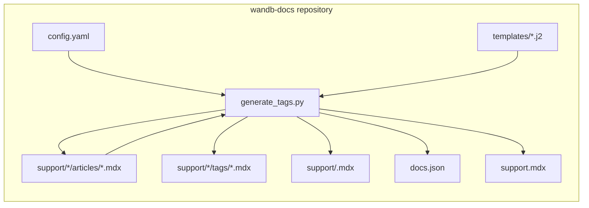
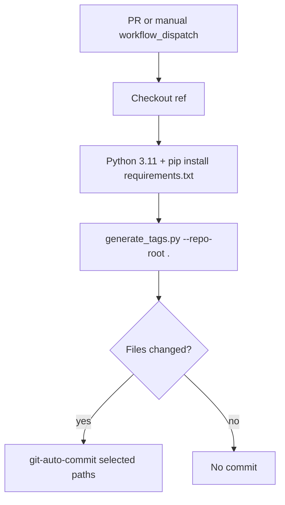
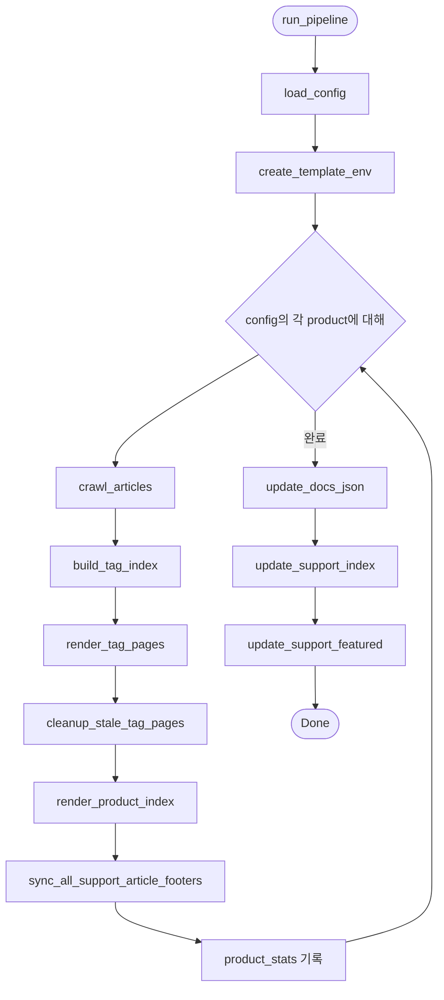
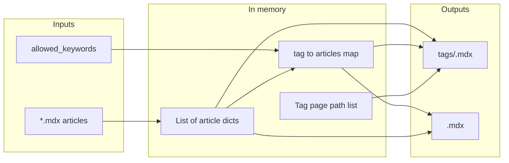

  # Knowledgebase nav generator 아키텍처

이 문서는 `wandb-docs` 저장소의 **Knowledgebase Nav** 시스템을 설명합니다. 즉, 무엇을 생성하는지, 어떤 파일과 함수가 이를 작동시키는지, 그리고 자동화가 이를 어떻게 연결하는지를 다룹니다. 작성자용 step 및 로컬 설정은 [README.md](./README.md)를 참조하세요.

  ## 목적

이 생성기는 지원팀(knowledgebase) 내비게이션이 아티클 콘텐츠와 일관되게 유지되도록 합니다. 설정된 제품(예: Models, Weave, Inference)을 대상으로 실행되어 `support/<product>/articles/` 아래의 MDX 아티클을 조회하고, 생성된 MDX 페이지, 루트 `support.mdx`의 개수, 그리고 `docs.json`의 영어 지원팀 탭을 업데이트합니다.

  ## 상위 수준 컨텍스트

이 시스템은 전적으로 `wandb-docs` 내부에서 동작합니다. 외부 API를 호출하지 않습니다. 저장소의 작업 트리에서 파일을 읽고 씁니다.

**articles**로 돌아가는 화살표는 4단계에서 MDX 주석 마커로 감싼 `/support/<product>/tags/` 아래 태그 페이지를 가리키는 `<Badge>` 링크만 업데이트한다는 의미입니다. 다른 콘텐츠(`---`, 다른 `<Badge>`, 마커 바깥의 텍스트 포함)는 수정되지 않습니다.

  ## 자동화 워크플로

`support/**` 또는 `scripts/knowledgebase-nav/**` 아래의 파일이 변경되면(열려 있는 PR에 새 푸시가 추가되는 경우 포함) pull request가 **Knowledgebase Nav** 워크플로를 트리거합니다. 이 워크플로는 Python 의존성을 설치하고 생성기를 실행한 다음, 변경 사항이 있으면 일치하는 경로를 커밋합니다. **포크**에서 온 pull request는 포크의 헤드 커밋을 체크아웃하고 생성기도 계속 실행하지만, 기본 token으로는 포크에 푸시할 수 없으므로 자동 커밋 단계는 건너뜁니다.

커밋 대상 경로 패턴에는 `support.mdx`, `support/*/articles/*.mdx`, `support/*/tags/*.mdx`, `support/*.mdx`(제품 인덱스), 그리고 `docs.json`이 포함됩니다.

  ## 파이프라인 오케스트레이션

`run_pipeline(repo_root, config_path)`는 CLI와 테스트에서 사용하는 단일 진입점입니다. `config.yaml`을 로드하고, 모든 제품에 공통으로 사용할 Jinja2 환경을 하나 구축한 다음 각 제품을 순회합니다. 루프가 끝나면 `docs.json`과 `support.mdx`를 각각 한 번씩 업데이트합니다.

  ## 제품별 데이터 흐름

하나의 제품 안에서는 데이터가 원본 파일에서 메모리 내 구조로 이동한 다음, 이후 step에서 사용할 수 있도록 다시 MDX와 집계 구조로 변환됩니다.

`render_tag_pages`는 정렬된 페이지 ID string(예: `support/models/tags/security`)을 반환하며, `update_docs_json`은 이를 해당 제품의 영어 내비게이션 탭에 병합합니다.

  ## 컴포넌트와 파일

| 컴포넌트          | 경로                                        | 역할                                             |
| ------------- | ----------------------------------------- | ---------------------------------------------- |
| CLI 및 로직      | `generate_tags.py`                        | 모든 단계, 파싱, 슬러그 규칙, 미리보기, JSON 및 MDX 재작성        |
| 제품 및 태그 레지스트리 | `config.yaml`                             | 제품별 `slug`, `display_name`, `allowed_keywords` |
| 태그 목록 템플릿     | `templates/support_tag.mdx.j2`            | 태그 페이지에서 아티클마다 Card 1개                         |
| 제품 허브 템플릿     | `templates/support_product_index.mdx.j2`  | 추천 섹션 및 범주별 탐색 Card                            |
| 의존성           | `requirements.txt`                        | PyYAML, Jinja2                                 |
| 단위 테스트        | `tests/test_generate_tags.py`             | 모킹된 파일 시스템 및 `docs.json`                       |
| 인테그레이션 테스트    | `tests/test_golden_output.py`             | 실제 리포지토리의 임시 복사본에서 전체 파이프라인 실행                 |
| Pytest 마커     | `tests/conftest.py`                       | 골든 스위트용 `integration` 마커 등록                    |
| CI            | `.github/workflows/knowledgebase-nav.yml` | 트리거, 실행 스크립트, 자동 커밋                            |
| 작성자용 문서       | `README.md`                               | 작성자와 개발자를 위한 워크플로                              |
| 아키텍처 노트       | `Architecture.md`                         | 개발자를 위한 다이어그램 및 모듈 맵                           |

  ## `generate_tags.py` 내부의 기능 영역

함수는 소스 파일에 나타나는 순서대로 아래에 묶어 두었습니다. 이름은 Python API 기준입니다.

  ### 설정

* **`load_config`**는 `config.yaml`을 조회하고 각 제품에 필요한 키가 있는지 검증합니다.

  ### 문서 구조 및 푸터

* **`parse_frontmatter`**, **`_extract_body`**는 YAML 프론트매터와 본문을 분리합니다. `_extract_body`는 `_BADGE_START`를 경계로 사용하고, 표시 목적상 마지막의 `---` 줄을 정리합니다.
* **`_split_frontmatter_raw`**는 푸터를 다시 쓰기 위해 원본 MDX를 프론트매터 블록과 나머지 부분으로 분리합니다.
* **`_normalize_keywords`**는 프론트매터의 `keywords`를 string 목록으로 정규화합니다(YAML 목록; 단일 string은 경고와 함께 하나의 태그가 되며, 다른 유형은 경고 후 빈 목록이 됩니다).
* **`_keywords_list_for_footer`**는 푸터 생성을 위해 정규화된 `keywords`를 반환합니다(**`_normalize_keywords`**에 위임).
* **`_tab_badge_pattern`**, **`build_tab_badges_mdx`**, **`build_keyword_footer_mdx`**, **`_replace_tab_badges_in_body`**는 탭 Badge를 정밀하게 동기화하는 로직을 구현합니다. 관리되는 Badge는 `_BADGE_START` / `_BADGE_END` 마커 주석으로 둘러싸이며, 이 함수는 마커가 있으면 이를 기준으로 일치 여부를 판단하고, 마커가 없는 기존 문서에는 regex로 대체 처리합니다. 새 푸터는 빈 줄, 마커, Badge를 차례로 추가합니다.
* **`sync_support_article_footer`**, **`sync_all_support_article_footers`**는 탭 Badge가 `keywords`와 동기화되지 않은 경우 문서 파일을 씁니다.

  ### 본문 미리보기(Card 스니펫)

* **`plain_text`**는 Markdown(가로 구분선 포함), 링크, URL, HTML 또는 MDX 태그 등을 제거하여 미리보기가 일반 텍스트로 유지되게 합니다(`entity` 디코딩 후 U+00A0은 공백으로 바꾸고, 타이포그래피 따옴표는 ASCII로 매핑하며, 허용 목록에서는 식별자를 위해 `_`와 `=`를 유지).
* **`extract_body_preview`**는 `plain_text`를 적용한 뒤 `BODY_PREVIEW_MAX_LENGTH`로 잘라내고, 필요하면 `BODY_PREVIEW_SUFFIX`를 추가합니다.

  ### 슬러그 및 크롤링

* **`tag_slug`**는 표시용 키워드를 파일명 또는 URL 세그먼트(소문자, 하이픈 사용)로 매핑합니다.
* **`crawl_articles`**는 `support/<slug>/articles/*.mdx`를 순회하면서 article dict(`title`, `keywords`, `featured`, `body_preview`, `page_path`, `tag_links` 등)를 구축합니다.

  ### 태그 집계 및 추천 콘텐츠

* **`get_featured_articles`**는 제품 색인에 표시할 추천 아티클을 필터링하고 정렬합니다.
* **`build_tag_index`**는 아티클을 키워드별로 그룹화하고, 각 태그 내에서 제목순으로 정렬하며, `allowed_keywords`에 없는 키워드가 있으면 경고합니다.

  ### 렌더링

* **`tojson_unicode`**, **`create_template_env`**는 MDX용으로 Jinja2를 설정합니다(템플릿은 YAML フロントマター 값에 `tojson_unicode` 필터를 사용합니다).
* **`render_tag_pages`**는 `support/<product>/tags/<tag-slug>.mdx`를 생성합니다.
* **`cleanup_stale_tag_pages`**는 방금 생성되지 않은 tags 디렉터리의 `.mdx` 파일을 삭제하여 디렉터리와 `docs.json`에 오래된 항목이 남지 않도록 합니다.
* **`render_product_index`**는 `support/<product>.mdx`를 생성합니다.

  ### 사이트 전체 업데이트

* **`update_docs_json`**는 `language`가 `en`인 `navigation.languages` 아래의 숨김 `Support: <display_name>` 탭을 업데이트하거나 생성하고, `pages`를 제품 인덱스와 정렬된 태그 경로로 설정합니다.
* **`update_support_index`**는 루트 `support.mdx`의 제품 Card에 있는 개수 표시 줄을 업데이트합니다. `{/* AUTO-GENERATED counts */}` 마커를 우선 사용하고, 마이그레이션을 위해 필요하면 regex를 대안으로 사용합니다.
* **`update_support_featured`**는 루트 `support.mdx`에서 `_FEATURED_START` / `_FEATURED_END` 마커 사이의 추천 아티클 섹션을 다시 생성합니다.

  ### CLI

* **`main`**은 `--repo-root`와 선택적 `--config`를 파싱한 다음 **`run_pipeline`**을 호출합니다.

  ## 상수

* **`BODY_PREVIEW_MAX_LENGTH`** 및 **`BODY_PREVIEW_SUFFIX`**는 Card 미리보기의 길이와 말줄임표를 제어합니다.
* **`DOCS_JSON_NAV_LANGUAGE`**는 `"en"`이며 내비게이션 수정 범위를 영어 트리로만 제한합니다.
* **`_BADGE_START`** / **`_BADGE_END`**는 각 아티클 페이지에서 관리형 탭 Badge를 감싸는 MDX 주석 마커입니다.
* **`_FEATURED_START`** / **`_FEATURED_END`**는 루트 `support.mdx`의 추천 아티클 섹션을 감싸는 MDX 주석 마커입니다.

  ## 설계 선택

* **모놀리식 스크립트**: 하나의 파일에 모든 로직을 담아, 워크플로와 기여자가 동작 방식을 한곳에서 확인하고 변경할 수 있도록 합니다.
* **허용된 키워드**: `config.yaml`에는 제품별로 유효한 태그가 나열됩니다. 알 수 없는 태그도 페이지는 계속 생성하지만 경고를 남기므로 콘텐츠가 모르게 누락되지는 않습니다.
* **Tab Badge의 소유 범위**: `/support/<product>/tags/...`로 연결되는 `<Badge>` 요소만 `keywords`에서 파생됩니다. 이 요소들은 마커 주석으로 감싸져 있으므로 마이그레이션 후에는 생성기가 정규식 매칭을 사용할 필요가 없습니다. 본문과 Badge 사이의 `---` 줄은 시각적인 구분용일 뿐이며, `_extract_body`는 `_BADGE_START`를 경계로 사용하고 끝의 `---`는 정리 목적으로만 제거합니다.
* **오래된 태그 정리**: 더 이상 어떤 아티클 키워드와도 대응하지 않는 태그 페이지는 생성 후 `docs.json`을 업데이트하기 전에 삭제됩니다. 이렇게 하면 tags 디렉터리와 내비게이션에 고아 항목이 남지 않습니다.
* **마커 기반 편집**: 모든 AUTO-GENERATED 섹션(아티클 탭 Badge, `support.mdx`의 개수 줄, 추천 아티클)에는 MDX 주석 마커를 사용합니다. 이렇게 하면 작성자가 관리되는 영역을 확인할 수 있고, 생성기는 깨지기 쉬운 정규식 앵커 없이도 콘텐츠를 정확하게 교체할 수 있습니다. 각 마커 쌍에는 첫 실행 시 감싸지지 않은 콘텐츠를 감싸는 마이그레이션 경로가 있습니다.
* **Golden 테스트**: 생성된 태그 페이지, 제품 인덱스 페이지, 아티클 파일(푸터 마커 포함), `docs.json`의 지원팀 탭, 루트 `support.mdx`를 커밋된 트리와 비교해 출력 차이가 unified diff로 드러나도록 합니다.

  ## 관련 문서

* 사용, 로컬 venv 설정 및 문제 해결은 [README.md](./README.md)를 참조하세요.
* Mintlify 콘텐츠를 편집할 때의 문서 스타일은 저장소 루트의 [AGENTS.md](../../AGENTS.md)를 참조하세요.