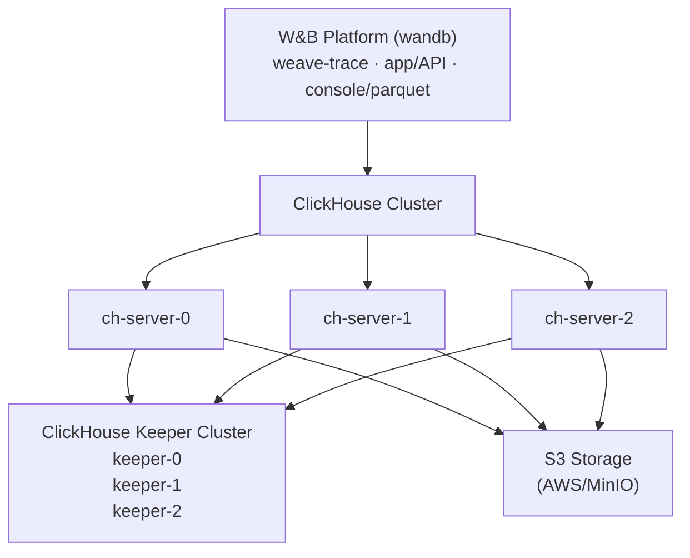

W&B Weave를 자체 호스팅하면 환경과 구성을 더 세밀하게 제어할 수 있습니다. 이를 통해 보다 격리된 환경을 구축하고 추가적인 보안 컴플라이언스 요구 사항을 충족할 수 있습니다. 이 문서는 Altinity ClickHouse Operator를 사용하여 셀프 관리형 환경에서 W&B Weave 실행에 필요한 모든 컴포넌트를 배포하는 방법을 안내합니다.

셀프 관리형 Weave 배포는 백엔드를 관리하기 위해 [ClickHouseDB](https://clickhouse.com/)에 의존합니다. 이 배포에는 다음이 포함됩니다:

- **Altinity ClickHouse Operator**: Kubernetes용 엔터프라이즈급 ClickHouse 관리 도구
- **ClickHouse Keeper**: 분산 코디네이션 서비스(ZooKeeper 대체)
- **ClickHouse Cluster**: 트레이스 저장을 위한 고가용성 데이터베이스 클러스터
- **S3-Compatible Storage**: ClickHouse 데이터의 지속성을 보장하기 위한 오브젝트 스토리지

<Tip>
자세한 참조 아키텍처는 [W&B Self-Managed Reference Architecture](https://docs.wandb.ai/guides/hosting/self-managed/ref-arch/#models-and-weave)를 참조하십시오.
</Tip>

<div id="important-setup-notes">
  ## 중요 설정 안내
</div>

이 가이드의 구성 예시는 참고용일 뿐입니다. 각 조직의 Kubernetes 환경은 모두 다르므로, 자체 호스팅 인스턴스에서는 다음과 같은 항목을 조정해야 할 가능성이 높습니다:

- **보안 및 컴플라이언스**: 조직의 보안 정책과 Kubernetes/OpenShift 요구 사항에 따라 security context, `runAsUser`/`fsGroup` 값 및 기타 보안 설정을 조정해야 합니다.
- **리소스 사이징**: 표시된 리소스 할당은 시작점에 불과합니다. 예상 trace 볼륨과 성능 요구 사항에 따른 적절한 사이징을 위해 **W&amp;B Solutions Architect 팀과 상의**하세요.
- **인프라 세부 설정**: 스토리지 클래스, 노드 셀렉터 및 기타 인프라 고유 설정을 실제 환경에 맞게 업데이트해야 합니다.

이 가이드의 구성 예시는 정해진 솔루션이 아닌 템플릿으로 간주해야 합니다.

<div id="architecture">
  ## 아키텍처
</div>




<div id="prerequisites">
  ## 사전 준비 사항
</div>

Self-managed Weave 인스턴스를 운영하려면 다음 리소스가 필요합니다:

- **Kubernetes 클러스터**: 버전 1.29+
- **Kubernetes 노드**: 멀티 노드 클러스터(고가용성을 위해 최소 3개 노드 권장)
- **Storage Class**: Persistent Volume을 위한 정상 동작하는 StorageClass (예: `gp3`, `standard`, `nfs-csi`)
- **S3 버킷**: 적절한 액세스 권한이 미리 구성된 S3 또는 S3 호환 버킷
- **W&B 플랫폼**: 이미 설치되어 실행 중이어야 함 ([W&B Self-Managed Deployment Guide](https://docs.wandb.ai/guides/hosting/hosting-options/self-managed/) 참고)
- **W&B 라이선스**: W&B Support에서 발급한 Weave 활성화 라이선스

<Warning>
이 사전 준비 사항 목록만을 기준으로 리소스 규모를 결정하지 마세요. 필요한 리소스는 트레이스 양과 사용 패턴에 따라 크게 달라집니다. 클러스터 규모 산정을 위한 구체적인 지침은 아래 [리소스 요구 사항](#resource-requirements) 섹션을 참고하세요.
</Warning>

<div id="required-tools">
  ### 필수 도구
</div>

인스턴스를 설정하려면 다음 도구가 필요합니다:

- 클러스터에 액세스할 수 있도록 구성된 `kubectl`
- `helm` v3.0+
- AWS 자격 증명(S3를 사용하는 경우) 또는 S3 호환 스토리지에 대한 액세스 권한

<div id="network-requirements">
  ### 네트워크 요구 사항
</div>

Kubernetes 클러스터에는 다음과 같은 네트워크 구성이 필요합니다.

- `clickhouse` 네임스페이스의 파드(Pod)는 `wandb` 네임스페이스의 파드(Pod)와 통신할 수 있어야 합니다.
- ClickHouse 노드는 포트 8123, 9000, 9009, 2181에서 서로 통신할 수 있어야 합니다.

<div id="deploy-your-self-managed-weave-instance">
  ## 자가 관리형 Weave 인스턴스 배포하기
</div>

<div id="step-1-deploy-altinity-clickhouse-operator">
  ### 1단계: Altinity ClickHouse Operator 배포
</div>

Altinity ClickHouse Operator는 Kubernetes 클러스터에서 ClickHouse 설치를 관리합니다.

<div id="11-add-the-altinity-helm-repository">
  #### 1.1 Altinity Helm 저장소 추가
</div>

```bash
helm repo add altinity https://helm.altinity.com
helm repo update
```


<div id="12-create-the-operator-configuration">
  #### 1.2 오퍼레이터 구성 생성
</div>

이름이 `ch-operator.yaml`인 파일을 생성합니다:

```yaml
operator:
  image:
    repository: altinity/clickhouse-operator
    tag: "0.25.4"

  # Security context - 클러스터 요구 사항에 맞게 조정하세요
  containerSecurityContext:
    runAsGroup: 0
    runAsNonRoot: true
    runAsUser: 10001 # OpenShift/Kubernetes 보안 정책에 따라 업데이트하세요
    allowPrivilegeEscalation: false
    capabilities:
      drop:
        - ALL
    privileged: false
    readOnlyRootFilesystem: false

metrics:
  enabled: false

# Name override - 필요에 따라 사용자 지정하세요
nameOverride: "wandb"
```

여기에 표시된 `containerSecurityContext` 값은 대부분의 Kubernetes 배포판에서 잘 작동합니다. **OpenShift**의 경우, 프로젝트에 할당된 UID 범위와 일치하도록 `runAsUser`와 `fsGroup` 값을 조정해야 할 수 있습니다.


<div id="13-install-the-operator">
  #### 1.3 오퍼레이터(Operator) 설치
</div>

```bash
helm upgrade --install ch-operator altinity/altinity-clickhouse-operator \
  --version 0.25.4 \
  --namespace clickhouse \
  --create-namespace \
  -f ch-operator.yaml
```


<div id="14-verify-the-operator-installation">
  #### 1.4 Operator 설치를 확인하기
</div>

```bash
# operator pod가 실행 중인지 확인
kubectl get pods -n clickhouse

# 예상 출력:
# NAME                                 READY   STATUS    RESTARTS   AGE
# ch-operator-wandb-xxxxx              1/1     Running   0          30s

# operator 이미지 버전 확인
kubectl get pods -n clickhouse -o jsonpath="{.items[*].spec.containers[*].image}" | \
  tr ' ' '\n' | grep -v 'metrics-exporter' | sort -u

# 예상 출력:
# altinity/clickhouse-operator:0.25.4
```


<div id="step-2-prepare-s3-storage">
  ### 2단계: S3 스토리지 준비
</div>

ClickHouse는 데이터를 영구적으로 저장하기 위해 S3 또는 S3와 호환되는 스토리지가 필요합니다.

<div id="21-create-an-s3-bucket">
  #### 2.1 S3 버킷 생성
</div>

AWS 계정 또는 S3 호환 스토리지 제공자에서 S3 버킷을 생성합니다:

```bash
# AWS 예시
aws s3 mb s3://my-wandb-clickhouse-bucket --region eu-central-1
```


<div id="22-configure-s3-credentials">
  #### 2.2 S3 자격 증명 구성
</div>

S3 액세스 자격 증명을 설정하는 방법은 두 가지가 있습니다:

<div id="option-a-using-aws-iam-roles-irsa-recommended-for-aws">
  ##### 옵션 A: AWS IAM 역할 사용 (IRSA - AWS에서 권장)
</div>

Kubernetes 노드에 S3 액세스 권한이 있는 IAM 역할이 부여되어 있다면, ClickHouse는 EC2 인스턴스 메타데이터를 사용할 수 있습니다:

```yaml
# ch-server.yaml에서 다음을 설정합니다:
<use_environment_credentials>true</use_environment_credentials>
```

**필수 IAM 정책** (노드 IAM 역할에 연결할 것):

```json
{
  "Version": "2012-10-17",
  "Statement": [
    {
      "Effect": "Allow",
      "Action": [
        "s3:GetObject",
        "s3:PutObject",
        "s3:DeleteObject",
        "s3:ListBucket"
      ],
      "Resource": [
        "arn:aws:s3:::my-wandb-clickhouse-bucket",
        "arn:aws:s3:::my-wandb-clickhouse-bucket/*"
      ]
    }
  ]
}
```


<div id="option-b-using-access-keys">
  ##### 옵션 B: 액세스 키 사용
</div>

정적 자격 증명을 사용하려면 Kubernetes 시크릿(Secret)을 생성하세요:

```bash
kubectl create secret generic aws-creds \
  --namespace clickhouse \
  --from-literal aws_access_key=YOUR_ACCESS_KEY \
  --from-literal aws_secret_key=YOUR_SECRET_KEY
```

그런 다음 ClickHouse에서 시크릿을 사용하도록 설정합니다(아래 ch-server.yaml 설정을 참조하세요).


<div id="step-3-deploy-clickhouse-keeper">
  ### 3단계: ClickHouse Keeper 배포
</div>

[ClickHouse Keeper](https://clickhouse.com/docs/guides/sre/keeper/clickhouse-keeper)는 데이터 복제와 분산 DDL 쿼리 실행을 조정하는 시스템입니다.

<div id="31-create-the-keeper-configuration">
  #### 3.1 Keeper 구성 생성
</div>

`ch-keeper.yaml`이라는 이름의 파일을 만듭니다.

```yaml
apiVersion: "clickhouse-keeper.altinity.com/v1"
kind: "ClickHouseKeeperInstallation"
metadata:
  name: wandb
  namespace: clickhouse
  annotations: {}
spec:
  defaults:
    templates:
      podTemplate: default
      dataVolumeClaimTemplate: default

  templates:
    podTemplates:
      - name: keeper
        metadata:
          labels:
            app: clickhouse-keeper
        spec:
          # Pod 보안 컨텍스트 - 환경에 맞게 조정하세요
          securityContext:
            fsGroup: 10001 # 클러스터의 보안 요구 사항에 따라 업데이트하세요
            fsGroupChangePolicy: Always
            runAsGroup: 0
            runAsNonRoot: true
            runAsUser: 10001 # OpenShift의 경우, 프로젝트에 할당된 UID 범위를 사용하세요
            seccompProfile:
              type: RuntimeDefault

          # 노드 전반에 keeper를 분산하기 위한 안티-어피니티 (HA에 권장)
          # 클러스터 크기 및 가용성 요구 사항에 따라 사용자 지정하거나 제거하세요
          affinity:
            podAntiAffinity:
              requiredDuringSchedulingIgnoredDuringExecution:
                - labelSelector:
                    matchExpressions:
                      - key: "app"
                        operator: In
                        values:
                          - clickhouse-keeper
                  topologyKey: "kubernetes.io/hostname"

          containers:
            - name: clickhouse-keeper
              imagePullPolicy: IfNotPresent
              image: "clickhouse/clickhouse-keeper:25.3.5.42"
              # 리소스 요청 - 예시 값이며, 워크로드에 따라 조정하세요
              resources:
                requests:
                  memory: "256Mi"
                  cpu: "0.5"
                limits:
                  memory: "2Gi"
                  cpu: "1"

              securityContext:
                allowPrivilegeEscalation: false
                capabilities:
                  drop:
                    - ALL
                privileged: false
                readOnlyRootFilesystem: false

    volumeClaimTemplates:
      - name: data
        metadata:
          labels:
            app: clickhouse-keeper
        spec:
          storageClassName: gp3 # 사용 중인 StorageClass로 변경하세요
          accessModes:
            - ReadWriteOnce
          resources:
            requests:
              storage: 10Gi

  configuration:
    clusters:
      - name: keeper # Keeper 클러스터 이름 - 서비스 DNS 명명에 사용됨
        layout:
          replicasCount: 3
        templates:
          podTemplate: keeper
          dataVolumeClaimTemplate: data

    settings:
      logger/level: "information"
      logger/console: "true"
      listen_host: "0.0.0.0"
      keeper_server/four_letter_word_white_list: "*"
      keeper_server/coordination_settings/raft_logs_level: "information"
      keeper_server/enable_ipv6: "false"
      keeper_server/coordination_settings/async_replication: "true"
```

**중요 구성 업데이트**:

* **StorageClass**: 클러스터에서 사용 가능한 StorageClass에 맞게 `storageClassName: gp3` 값을 업데이트하세요.
* **Security Context**: 조직의 보안 정책을 준수하도록 `runAsUser`, `fsGroup` 값을 조정하세요.
* **Anti-Affinity**: 클러스터 토폴로지와 고가용성(HA) 요구 사항에 따라 `affinity` 섹션을 수정하거나 제거하세요.
* **Resources**: CPU/메모리 값은 예시입니다. 적절한 사이징을 위해 W&amp;B 솔루션 아키텍트와 상의하세요.
* **Naming**: `metadata.name` 또는 `configuration.clusters[0].name`을 변경하는 경우, ch-server.yaml(4단계)에서 Keeper 호스트명을 동일하게 **반드시 업데이트해야 합니다**.


<div id="32-deploy-clickhouse-keeper">
  #### 3.2 ClickHouse Keeper 배포하기
</div>

```bash
kubectl apply -f ch-keeper.yaml
```

이름                                      준비    상태      재시작 횟수   경과 시간
clickhouse-operator-857c69ffc6-2v4jh     2/2     Running   0            1m

````

### Step 2: Configure S3 Storage

#### 3.3 Verify Keeper deployment

```bash
# Keeper 파드 확인
kubectl get pods -n clickhouse -l app=clickhouse-keeper

# 예상 출력:
# NAME                     READY   STATUS    RESTARTS   AGE
# chk-wandb-keeper-0-0-0   1/1     Running   0          2m
# chk-wandb-keeper-0-1-0   1/1     Running   0          2m
# chk-wandb-keeper-0-2-0   1/1     Running   0          2m

# Keeper 서비스 확인
kubectl get svc -n clickhouse | grep keeper

# 포트 2181에서 keeper 서비스가 표시되어야 함
````


<div id="step-4-deploy-clickhouse-cluster">
  ### 4단계: ClickHouse 클러스터 배포
</div>

이제 Weave 트레이스 데이터를 저장할 ClickHouse 서버 클러스터를 배포합니다.

<div id="41-create-the-clickhouse-server-configuration">
  #### 4.1 ClickHouse 서버 구성 생성
</div>

`ch-server.yaml`라는 이름의 파일을 만듭니다:

```yaml
apiVersion: "clickhouse.altinity.com/v1"
kind: "ClickHouseInstallation"
metadata:
  name: wandb
  namespace: clickhouse
  annotations: {}
spec:
  defaults:
    templates:
      podTemplate: default
      dataVolumeClaimTemplate: default

  templates:
    podTemplates:
      - name: clickhouse
        metadata:
          labels:
            app: clickhouse-server
        spec:
          # Pod 보안 컨텍스트 - 환경에 맞게 커스터마이즈
          securityContext:
            fsGroup: 10001 # 보안 정책에 맞게 조정
            fsGroupChangePolicy: Always
            runAsGroup: 0
            runAsNonRoot: true
            runAsUser: 10001 # OpenShift의 경우 할당된 UID 범위 사용
            seccompProfile:
              type: RuntimeDefault

          # 안티-어피니티 규칙 - 서버가 서로 다른 노드에서 실행되도록 보장 (선택 사항이지만 권장)
          # 클러스터 크기 및 요구 사항에 따라 조정하거나 제거
          affinity:
            podAntiAffinity:
              requiredDuringSchedulingIgnoredDuringExecution:
                - labelSelector:
                    matchExpressions:
                      - key: "app"
                        operator: In
                        values:
                          - clickhouse-server
                  topologyKey: "kubernetes.io/hostname"

          containers:
            - name: clickhouse
              image: clickhouse/clickhouse-server:25.3.5.42
              # 리소스 할당 예시 - 워크로드에 따라 조정
              resources:
                requests:
                  memory: 1Gi
                  cpu: 1
                limits:
                  memory: 16Gi
                  cpu: 4

              # AWS 자격 증명 (IRSA 사용 시 이 섹션 제거)
              env:
                - name: AWS_ACCESS_KEY_ID
                  valueFrom:
                    secretKeyRef:
                      name: aws-creds
                      key: aws_access_key
                - name: AWS_SECRET_ACCESS_KEY
                  valueFrom:
                    secretKeyRef:
                      name: aws-creds
                      key: aws_secret_key

              securityContext:
                allowPrivilegeEscalation: false
                capabilities:
                  drop:
                    - ALL
                privileged: false
                readOnlyRootFilesystem: false

    volumeClaimTemplates:
      - name: data
        metadata:
          labels:
            app: clickhouse-server
        spec:
          accessModes:
            - ReadWriteOnce
          resources:
            requests:
              storage: 50Gi
          storageClassName: gp3 # 사용 중인 StorageClass로 변경

  configuration:
    # Keeper (ZooKeeper) 구성
    # 중요: 이 호스트명은 3단계의 Keeper 배포와 반드시 일치해야 합니다
    zookeeper:
      nodes:
        - host: chk-wandb-keeper-0-0.clickhouse.svc.cluster.local
          port: 2181
        - host: chk-wandb-keeper-0-1.clickhouse.svc.cluster.local
          port: 2181
        - host: chk-wandb-keeper-0-2.clickhouse.svc.cluster.local
          port: 2181
      # 선택 사항: 필요한 경우 주석을 해제하여 타임아웃 조정
      # session_timeout_ms: 30000
      # operation_timeout_ms: 10000

    # 사용자 구성: https://clickhouse.com/docs/operations/configuration-files#user-settings
    # 비밀번호 팁:
    # sha256sum <<< weave123 OR echo -n weave123 | sha256sum OR printf "weave123" | sha256sum
    # 사용자 구성에서 <password_sha256_hex>...</password_sha256_hex> 형식으로 반환됩니다
    users:
      weave/password: weave123
      weave/access_management: 1
      weave/profile: default
      weave/networks/ip:
        - "0.0.0.0/0"
        - "::"

    # 서버 설정
    settings:
      disable_internal_dns_cache: 1

    # 클러스터 구성
    clusters:
      - name: weavecluster # 클러스터 이름 - 변경 가능하지만 wandb-cr.yaml과 일치해야 함
        layout:
          shardsCount: 1
          replicasCount: 3 # 복제본 수 - HA 요구 사항에 따라 조정
        templates:
          podTemplate: clickhouse
          dataVolumeClaimTemplate: data

    # 구성 파일
    files:
      config.d/network_configuration.xml: |
        <clickhouse>
            <listen_host>0.0.0.0</listen_host>
            <listen_host>::</listen_host>
        </clickhouse>

      config.d/logger.xml: |
        <clickhouse>
            <logger>
                <level>information</level>
            </logger>
        </clickhouse>

      config.d/storage_configuration.xml: |
        <clickhouse>
            <storage_configuration>
                <disks>
                    <s3_disk>
                        <type>s3</type>
                        <!-- S3 버킷 엔드포인트 및 리전으로 업데이트 -->
                        <endpoint>https://YOUR-BUCKET-NAME.s3.YOUR-REGION.amazonaws.com/s3_disk/{replica}</endpoint>
                        <metadata_path>/var/lib/clickhouse/disks/s3_disk/</metadata_path>
                        <use_environment_credentials>true</use_environment_credentials>
                        <region>YOUR-REGION</region>
                    </s3_disk>
                    <s3_disk_cache>
                        <type>cache</type>
                        <disk>s3_disk</disk>
                        <path>/var/lib/clickhouse/s3_disk_cache/cache/</path>
                        <!-- 캐시 크기는 퍼시스턴트 볼륨보다 반드시 작아야 합니다 -->
                        <max_size>40Gi</max_size>
                        <cache_on_write_operations>true</cache_on_write_operations>
                    </s3_disk_cache>
                </disks>
                <policies>
                    <s3_main>
                        <volumes>
                            <main>
                                <disk>s3_disk_cache</disk>
                            </main>
                        </volumes>
                    </s3_main>
                </policies>
            </storage_configuration>
            <merge_tree>
                <storage_policy>s3_main</storage_policy>
            </merge_tree>
        </clickhouse>
```

**필수 구성 업데이트 사항**:

1. **StorageClass**: `storageClassName: gp3`를 클러스터에서 사용하는 StorageClass와 동일하게 업데이트합니다.
2. **S3 Endpoint**: `YOUR-BUCKET-NAME`과 `YOUR-REGION`을 실제 값으로 바꿉니다.
3. **Cache Size**: `<max_size>40Gi</max_size>` 값은 퍼시스턴트 볼륨 크기(50Gi)보다 항상 **작아야 합니다**.
4. **Security Context**: `runAsUser`, `fsGroup` 및 기타 보안 설정을 조직의 정책에 맞게 조정합니다.
5. **Resource Allocation**: CPU 및 메모리 값은 예시일 뿐이므로, 예상 trace 볼륨에 기반한 적절한 사이징을 위해 **반드시 W&B Solutions Architect와 상의하십시오**.
6. **Anti-Affinity Rules**: 클러스터 토폴로지와 고가용성 요구사항에 따라 수정하거나 제거합니다.
7. **Keeper Hostnames**: Keeper 노드 호스트 이름은 3단계에서 사용한 Keeper 배포 이름 규칙과 **반드시 일치해야 합니다** (아래 "Keeper Naming 이해하기" 참조).
8. **Cluster Naming**: 클러스터 이름 `weavecluster`는 변경할 수 있지만, 5단계의 `WF_CLICKHOUSE_REPLICATED_CLUSTER` 값과 반드시 일치해야 합니다.
9. **Credentials**:
   - IRSA의 경우: `<use_environment_credentials>true</use_environment_credentials>`를 유지하거나 환경 변수에 매핑된 시크릿 키에 접근합니다.

<div id="42-update-s3-configuration">
  #### 4.2 S3 구성 업데이트
</div>

`ch-server.yaml`에서 `storage_configuration.xml` 섹션을 편집합니다:

**AWS S3용 예시**:

```xml
<endpoint>https://my-wandb-clickhouse.s3.eu-central-1.amazonaws.com/s3_disk/{replica}</endpoint>
<region>eu-central-1</region>
```

**MinIO용 예시**:

```xml
<endpoint>https://minio.example.com:9000/my-bucket/s3_disk/{replica}</endpoint>
<region>us-east-1</region>
```

<Warning>
  **`{replica}`를 제거하지 마십시오.** 이렇게 해야 각 ClickHouse 레플리카가 버킷 내 자신만의 폴더에 기록하도록 보장됩니다.
</Warning>


<div id="43-configure-credentials-option-b-only">
  #### 4.3 자격 증명 구성 (옵션 B 전용)
</div>

2단계에서 **옵션 B (Access Keys)** 를 사용했다면, `ch-server.yaml`의 `env` 섹션이 해당 시크릿을 참조하도록 설정되어 있는지 확인하세요:

```yaml
env:
  - name: AWS_ACCESS_KEY_ID
    valueFrom:
      secretKeyRef:
        name: aws-creds
        key: aws_access_key
  - name: AWS_SECRET_ACCESS_KEY
    valueFrom:
      secretKeyRef:
        name: aws-creds
        key: aws_secret_key
```

**Option A (IRSA)**를 사용하는 경우, `env` 전체 섹션을 삭제하세요.


<div id="44-understanding-keeper-naming">
  #### 4.4 Keeper 네이밍 이해하기
</div>

`zookeeper.nodes` 섹션의 Keeper 노드 호스트 이름은 3단계에서 구성한 Keeper 배포를 기반으로 하는 특정 패턴을 따릅니다:

**호스트 이름 패턴**: `chk-{installation-name}-{cluster-name}-{cluster-index}-{replica-index}.{namespace}.svc.cluster.local`

각 항목은 다음을 의미합니다:

* `chk` = ClickHouseKeeperInstallation의 접두사(고정)
* `{installation-name}` = ch-keeper.yaml의 `metadata.name` (예: `wandb`)
* `{cluster-name}` = ch-keeper.yaml의 `configuration.clusters[0].name` (예: `keeper`)
* `{cluster-index}` = 클러스터 인덱스, 단일 클러스터의 경우 일반적으로 `0`
* `{replica-index}` = 레플리카 번호: 3개 레플리카의 경우 `0`, `1`, `2`
* `{namespace}` = Kubernetes 네임스페이스 (예: `clickhouse`)

**기본 이름을 사용할 때의 예시**:

```
chk-wandb-keeper-0-0.clickhouse.svc.cluster.local
chk-wandb-keeper-0-1.clickhouse.svc.cluster.local
chk-wandb-keeper-0-2.clickhouse.svc.cluster.local
```

**Keeper 설치 이름을 사용자 지정한 경우** (예: `metadata.name: myweave`):

```
chk-myweave-keeper-0-0.clickhouse.svc.cluster.local
chk-myweave-keeper-0-1.clickhouse.svc.cluster.local
chk-myweave-keeper-0-2.clickhouse.svc.cluster.local
```

**Keeper 클러스터 이름을 사용자 지정한 경우** (예: `clusters[0].name: coordination`):

```
chk-wandb-coordination-0-0.clickhouse.svc.cluster.local
chk-wandb-coordination-0-1.clickhouse.svc.cluster.local
chk-wandb-coordination-0-2.clickhouse.svc.cluster.local
```

**실제 사용 중인 Keeper 호스트 이름을 확인하려면**:

```bash
# 실제 이름을 확인하기 위해 Keeper 서비스 목록 조회
kubectl get svc -n clickhouse | grep keeper

# 명명 패턴을 확인하기 위해 Keeper 파드 목록 조회
kubectl get pods -n clickhouse -l app=clickhouse-keeper
```

<Note>
  `ch-server.yaml`의 Keeper 호스트 이름은 Keeper 배포로 생성된 실제 서비스 이름과 **정확히 일치해야 합니다**. 그렇지 않으면 ClickHouse 서버가 코디네이션 서비스에 연결하지 못합니다.
</Note>


<div id="45-deploy-clickhouse-cluster">
  #### 4.5 ClickHouse 클러스터 배포
</div>

```bash
kubectl apply -f ch-server.yaml
```


<div id="46-verify-clickhouse-deployment">
  #### 4.6 ClickHouse 배포 검증
</div>

```bash
# ClickHouse 파드 확인
kubectl get pods -n clickhouse -l app=clickhouse-server

# 예상 출력:
# NAME                           READY   STATUS    RESTARTS   AGE
# chi-wandb-weavecluster-0-0-0   1/1     Running   0          3m
# chi-wandb-weavecluster-0-1-0   1/1     Running   0          3m
# chi-wandb-weavecluster-0-2-0   1/1     Running   0          3m

# ClickHouse 연결 테스트
kubectl exec -n clickhouse chi-wandb-weavecluster-0-0-0 -- \
  clickhouse-client --user weave --password weave123 --query "SELECT version()"

# 클러스터 상태 확인
kubectl exec -n clickhouse chi-wandb-weavecluster-0-0-0 -- \
  clickhouse-client --user weave --password weave123 --query \
  "SELECT cluster, host_name, port FROM system.clusters WHERE cluster='weavecluster'"
```


<div id="step-5-enable-weave-in-wb-platform">
  ### 5단계: W&B Platform에서 Weave 활성화
</div>

이제 W&B Platform에서 Weave trace에 ClickHouse 클러스터를 사용하도록 구성합니다.

<div id="51-gather-clickhouse-connection-information">
  #### 5.1 ClickHouse 연결 정보 수집
</div>

다음 정보를 준비하세요:

- **Host**: `clickhouse-wandb.clickhouse.svc.cluster.local`
- **Port**: `8123`
- **User**: `weave` (ch-server.yaml에서 설정)
- **Password**: `weave123` (ch-server.yaml에서 설정)
- **Database**: `weave` (자동으로 생성됨)
- **Cluster Name**: `weavecluster` (ch-server.yaml에서 설정)

호스트 이름은 다음 패턴을 따릅니다: `clickhouse-{installation-name}.{namespace}.svc.cluster.local`

<div id="52-update-wb-custom-resource">
  #### 5.2 W&amp;B 커스텀 리소스 업데이트
</div>

Weave 구성을 추가하도록 W&amp;B Platform 커스텀 리소스(CR)를 편집합니다.

```yaml
apiVersion: apps.wandb.com/v1
kind: WeightsAndBiases
metadata:
  name: wandb
  namespace: wandb
spec:
  values:
    global:
      # ... 기존 구성 ...

      # ClickHouse 구성 추가
      clickhouse:
        install: false # 별도로 배포됨
        host: clickhouse-wandb.clickhouse.svc.cluster.local
        port: 8123
        user: weave
        password: weave123
        database: weave
        replicated: true # 다중 복제본 설정 시 필수

      # Weave Trace 활성화
      weave-trace:
        enabled: true

    # Weave Trace 구성
    weave-trace:
      install: true
      extraEnv:
        WF_CLICKHOUSE_REPLICATED: "true"
        WF_CLICKHOUSE_REPLICATED_CLUSTER: "weavecluster"
      image:
        repository: wandb/weave-trace
        tag: 0.74.1
      replicaCount: 1
      size: "default"
      sizing:
        default:
          autoscaling:
            horizontal:
              enabled: false
          # 리소스 할당 예시 - 워크로드에 따라 조정
          resources:
            limits:
              cpu: 4
              memory: "8Gi"
            requests:
              cpu: 1
              memory: "4Gi"
      # Pod 보안 컨텍스트 - 환경에 맞게 사용자 정의
      podSecurityContext:
        fsGroup: 10001 # 보안 요구 사항에 따라 조정
        fsGroupChangePolicy: Always
        runAsGroup: 0
        runAsNonRoot: true
        runAsUser: 10001 # OpenShift의 경우 할당된 UID 범위 사용
        seccompProfile:
          type: RuntimeDefault
      # 컨테이너 보안 컨텍스트
      securityContext:
        allowPrivilegeEscalation: false
        capabilities:
          drop:
            - ALL
        privileged: false
        readOnlyRootFilesystem: false
```

**중요 설정**:

* `clickhouse.replicated: true` - 레플리카 3개를 사용하는 경우 **필수**
* `WF_CLICKHOUSE_REPLICATED: "true"` - replicated 구성을 위해 **필수**
* `WF_CLICKHOUSE_REPLICATED_CLUSTER: "weavecluster"` - ch-server.yaml의 클러스터 이름과 **일치해야 함**

<Note>
  위에 표시된 security context, 리소스 할당, 기타 Kubernetes 관련 설정은 참고용 예시일 뿐입니다. 조직의 요구사항에 맞게 조정하고, 적절한 리소스 규모 산정을 위해 W&amp;B Solutions Architect 팀과 상의하세요.
</Note>


<div id="53-apply-the-updated-configuration">
  #### 5.3 업데이트된 구성 적용
</div>

```bash
kubectl apply -f wandb-cr.yaml
```


<div id="54-verify-weave-trace-deployment">
  #### 5.4 Weave Trace 배포를 검증하기
</div>

```bash
# weave-trace 파드 상태 확인
kubectl get pods -n wandb | grep weave-trace

# 예상 출력:
# wandb-weave-trace-bc-xxxxx   1/1     Running   0          2m

# ClickHouse 연결 관련 weave-trace 로그 확인
kubectl logs -n wandb <weave-trace-pod-name> --tail=50

# ClickHouse 연결 성공 메시지 확인
```


<div id="step-6-initialize-weave-database">
  ### 6단계: Weave 데이터베이스 초기화
</div>

weave-trace 서비스는 최초 시작 시 필요한 데이터베이스 스키마를 자동으로 생성합니다.

<div id="61-monitor-database-migration">
  #### 6.1 데이터베이스 마이그레이션 상태 모니터링
</div>

```bash
# 시작 중 weave-trace 로그 확인
kubectl logs -n wandb <weave-trace-pod-name> -f

# 데이터베이스 초기화 성공을 나타내는 마이그레이션 메시지 확인
```


<div id="62-verify-database-creation">
  #### 6.2 데이터베이스 생성 여부 확인
</div>

```bash
# ClickHouse에 연결하여 데이터베이스 확인
kubectl exec -n clickhouse chi-wandb-weavecluster-0-0-0 -- \
  clickhouse-client --user weave --password weave123 --query \
  "SHOW DATABASES"

# 'weave' 데이터베이스가 목록에 표시되어야 함

# weave 데이터베이스의 테이블 확인
kubectl exec -n clickhouse chi-wandb-weavecluster-0-0-0 -- \
  clickhouse-client --user weave --password weave123 --query \
  "SHOW TABLES FROM weave"
```


<div id="step-7-verify-weave-is-enabled">
  ### 7단계: Weave가 활성화되었는지 확인하기
</div>

<div id="71-access-wb-console">
  #### 7.1 W&B 콘솔에 접속
</div>

웹 브라우저에서 W&B 인스턴스의 URL로 이동합니다.

<div id="72-check-weave-license-status">
  #### 7.2 Weave 라이선스 상태 확인
</div>

W&B Console에서:

1. **오른쪽 상단 메뉴**에서 **Organization Dashboard**로 이동합니다
2. **Weave access**가 활성화되어 있는지 확인합니다

<div id="73-test-weave-functionality">
  #### 7.3 Weave 기능 테스트
</div>

Weave가 올바르게 동작하는지 확인하기 위해 간단한 Python 테스트를 작성합니다:

```python
import weave

# Weave 초기화 (실제 W&B 호스트로 교체하세요)
weave.init('test-project')

# 간단한 추적 함수 생성
@weave.op()
def hello_weave(name: str) -> str:
    return f"Hello, {name}!"

# 함수 호출
result = hello_weave("World")
print(result)
```

이를 실행한 후, 조직의 traces 페이지에서 W&amp;B UI에 traces가 표시되는지 확인하세요.


<div id="troubleshooting">
  ## 문제 해결
</div>

<div id="clickhouse-keeper-issues">
  ### ClickHouse Keeper 문제
</div>

**문제**: Keeper 파드가 `Pending` 상태에서 멈춰 있음

**해결 방법**: 다음과 같은 여러 가지 가능한 원인을 확인하세요.

1. **PVC 및 StorageClass 문제**:

```bash
kubectl get pvc -n clickhouse
kubectl describe pvc -n clickhouse
```

`StorageClass`가 올바르게 구성되어 있고 충분한 여유 용량이 있는지 확인하세요.

2. **안티-어피니티 및 노드 가용성**:

```bash
# 안티-어피니티 규칙으로 인해 스케줄링이 차단되는지 확인
kubectl describe pod -n clickhouse <pod-name> | grep -A 10 "Events:"

# 사용 가능한 노드와 리소스 확인
kubectl get nodes
kubectl describe nodes | grep -A 5 "Allocated resources"
```

일반적인 문제:

* 안티-어피니티에는 3개의 서로 다른 노드가 필요하지만 클러스터에 노드가 3개 미만인 경우
* 노드에 파드 요청을 충족할 만큼 충분한 CPU/메모리가 없음
* 노드의 테인트 때문에 파드를 스케줄링할 수 없음

**해결 방법**:

* 노드가 3개 미만인 경우 안티-어피니티 규칙을 제거하거나 조정합니다
* 덜 엄격한 안티-어피니티를 위해 `requiredDuringSchedulingIgnoredDuringExecution` 대신 `preferredDuringSchedulingIgnoredDuringExecution` 를 사용합니다
* 노드 리소스가 제한적인 경우 리소스 요청을 줄입니다
* 클러스터에 노드를 더 추가합니다

***

**문제**: `CrashLoopBackOff` 상태인 Keeper 파드

**해결 방법**: 로그를 확인하고 구성을 점검합니다:

```bash
kubectl logs -n clickhouse <keeper-pod-name>
```

Common issues:

* 잘못된 security context 설정(runAsUser, fsGroup 확인)
* 볼륨 권한 문제
* 포트 충돌
* ch-keeper.yaml 구성 오류


<div id="clickhouse-server-issues">
  ### ClickHouse 서버 문제
</div>

**문제**: ClickHouse가 S3에 연결할 수 없습니다

**해결 방법**: S3 자격 증명 및 권한이 올바른지 확인하세요:

```bash
# 시크릿이 존재하는지 확인 (액세스 키 사용 시)
kubectl get secret aws-creds -n clickhouse

# S3 오류에 대한 ClickHouse 로그 확인
kubectl logs -n clickhouse <clickhouse-pod-name> | grep -i s3

# 스토리지 구성에서 S3 엔드포인트 확인
kubectl get chi wandb -n clickhouse -o yaml | grep -A 10 storage_configuration
```

***

**문제**: ClickHouse가 Keeper에 연결할 수 없습니다

**해결 방법**: Keeper 엔드포인트와 이름을 확인하세요:

```bash
# Keeper 서비스 및 실제 이름 확인
kubectl get svc -n clickhouse | grep keeper

# Keeper 파드를 확인하여 명명 패턴 확인
kubectl get pods -n clickhouse -l app=clickhouse-keeper

# ch-server.yaml의 zookeeper.nodes 구성과 비교
# 호스트 이름은 실제 서비스 이름과 반드시 일치해야 함

# 연결 오류에 대한 ClickHouse 로그 확인
kubectl logs -n clickhouse chi-wandb-weavecluster-0-0-0 | grep -i keeper
```

연결이 실패하는 경우 ch-server.yaml의 Keeper 호스트네임이 실제 Keeper 배포와 일치하지 않을 가능성이 높습니다. 이름 지정 패턴은 4단계의 &quot;Keeper 이름 규칙 이해하기&quot;를 참고하세요.


<div id="weave-trace-issues">
  ### Weave Trace 문제
</div>

**문제**: `weave-trace` pod가 시작되지 않음

**해결 방법**: ClickHouse 연결 상태를 확인하세요:

```bash
# weave-trace 파드 이름 가져오기
kubectl get pods -n wandb | grep weave-trace

# weave-trace 로그 확인
kubectl logs -n wandb <weave-trace-pod-name>

# 일반적인 오류: "connection refused" 또는 "authentication failed"
# wandb-cr.yaml의 ClickHouse 자격 증명이 ch-server.yaml과 일치하는지 확인
```

***

**문제**: 콘솔에 Weave가 활성화된 상태로 표시되지 않음

**해결 방법**: 설정을 확인합니다:

1. 라이선스에 Weave가 포함되어 있는지 확인합니다:

   ```bash
   kubectl get secret license-key -n wandb -o jsonpath='{.data.value}' | base64 -d | jq
   ```

2. wandb-cr.yaml에서 `weave-trace.enabled: true` 및 `clickhouse.replicated: true`가 설정되어 있는지 확인합니다

3. W&amp;B operator 로그를 확인합니다:
   ```bash
   kubectl logs -n wandb deployment/wandb-controller-manager
   ```

***

**문제**: 데이터베이스 마이그레이션 실패

**해결 방법**: 클러스터 이름이 일치하는지 확인합니다:

`WF_CLICKHOUSE_REPLICATED_CLUSTER` 환경 변수는 ch-server.yaml의 클러스터 이름과 **반드시 일치해야 합니다**.

```yaml
# ch-server.yaml에서:
clusters:
  - name: weavecluster # <-- 이 이름

# wandb-cr.yaml에서 일치해야 함:
weave-trace:
  extraEnv:
    WF_CLICKHOUSE_REPLICATED_CLUSTER: "weavecluster" # <-- 이 값
```


<div id="resource-requirements">
  ## 리소스 요구 사항
</div>

<Warning>
아래 리소스 할당치는 **예시로 제시하는 초기 기준값일 뿐입니다**. 실제 요구 사항은 다음에 따라 크게 달라집니다:

- 트레이스 수집량(초당 트레이스 수)
- 쿼리 패턴과 동시 실행 수준
- 데이터 보존 기간
- 동시 사용자 수

**항상 W&B Solutions Architect 팀과 상의하여** 구체적인 사용 사례에 적합한 적정 규모를 산정하십시오. 리소스를 과소 할당하면 성능 문제가 발생할 수 있고, 과도하게 할당하면 인프라 비용이 낭비됩니다.
</Warning>

<div id="minimum-production-setup">
  ### 최소 운영 환경 구성
</div>

| Component         | Replicas   | CPU Request / Limit | Memory Request / Limit | Storage   |
| ----------------- | ---------- | ------------------- | ---------------------- | --------- |
| ClickHouse Keeper | 3          | 0.5 / 1             | 256Mi / 2Gi            | 10Gi each |
| ClickHouse Server | 3          | 1 / 4               | 1Gi / 16Gi             | 50Gi each |
| Weave Trace       | 1          | 1 / 4               | 4Gi / 8Gi              | -         |
| **Total**         | **파드 7개** | **~4.5 / 15 CPU**   | **~7.8Gi / 58Gi**      | **180Gi** |

_적용 대상: 개발, 테스트 또는 저용량 운영 환경_

<div id="recommended-production-setup">
  ### 권장 프로덕션 구성
</div>

트레이스 양이 많은 프로덕션 워크로드의 경우:

| Component         | Replicas     | CPU Request / Limit  | Memory Request / Limit   | Storage    |
| ----------------- | ------------ | -------------------- | ------------------------ | ---------- |
| ClickHouse Keeper | 3            | 1 / 2                | 1Gi / 4Gi                | 20Gi each  |
| ClickHouse Server | 3            | 1 / 16               | 8Gi / 64Gi               | 200Gi each |
| Weave Trace       | 2-3          | 1 / 4                | 4Gi / 8Gi                | -          |
| **Total**         | **8-9 pods** | **~6-9 / 52-64 CPU** | **~27-33Gi / 204-216Gi** | **660Gi**  |

_적용 대상: 대량 트레이스 프로덕션 환경_

초고량 트레이스 배포의 경우, 구체적인 트레이스 양과 성능 요구 사항에 따른 맞춤 용량 계획을 위해 W&B 솔루션 아키텍트 팀에 문의하세요.

<div id="advanced-configuration">
  ## 고급 구성
</div>

이 섹션에서는 자체 관리형 Weave 배포 환경에 대한 사용자 지정 옵션을 다룹니다. 여기에는 수직 확장 또는 수평 확장을 통한 ClickHouse 용량 확장, keeper 및 server 구성에서 이미지 태그를 수정하여 ClickHouse 버전을 업데이트하는 방법, 그리고 ClickHouse 상태(Health)를 모니터링하는 방법이 포함됩니다.

인스턴스에 고급 수준의 변경을 적용할 때는 이러한 변경이 성능 및 안정성 요구 사항에 부합하는지 확인하기 위해 W&B 솔루션 아키텍트 팀과 반드시 상의할 것을 권장합니다.

<div id="scaling-clickhouse">
  ### ClickHouse 확장
</div>

ClickHouse 용량을 늘리려면 다음을 수행할 수 있습니다:

1. **수직 확장(Vertical Scaling)**: 파드당 리소스를 늘립니다 (더 단순한 방식)

   ```yaml
   resources:
     requests:
       memory: 8Gi
       cpu: 1
     limits:
       memory: 64Gi
       cpu: 16
   ```

   **권장 사항**: 실제 리소스 사용량을 모니터링하고 필요에 따라 확장하세요. 초고량 트래픽 환경의 배포인 경우 W&B Solutions Architect 팀에 문의하세요.

2. **수평 확장(Horizontal Scaling)**: 더 많은 레플리카를 추가합니다 (신중한 계획이 필요함)
   - 레플리카를 늘리면 데이터 리밸런싱이 필요합니다.
   - 샤드 관리를 위해 ClickHouse 문서를 참조하세요.
   - 운영 환경에서 수평 확장을 구현하기 전에 **W&amp;B Solutions Architect에게 문의**하세요.

<div id="using-different-clickhouse-versions">
  ### 다른 ClickHouse 버전 사용
</div>

다른 ClickHouse 버전을 사용하려면 ch-keeper.yaml과 ch-server.yaml 두 파일 모두에서 image 태그를 업데이트하세요:

```yaml
image: clickhouse/clickhouse-keeper:25.3.5.42   # Keeper 버전
image: clickhouse/clickhouse-server:25.3.5.42   # Server 버전
```

호환성을 위해 Keeper와 서버 버전이 같거나 Keeper 버전이 서버 버전 이상이어야 합니다.


<div id="monitoring-clickhouse">
  ### ClickHouse 모니터링
</div>

모니터링을 위해 ClickHouse 시스템 테이블에 접근합니다:

```bash
# 디스크 사용량 확인
kubectl exec -n clickhouse chi-wandb-weavecluster-0-0-0 -- \
  clickhouse-client --user weave --password weave123 --query \
  "SELECT name, path, formatReadableSize(free_space) as free, formatReadableSize(total_space) as total FROM system.disks"

# 복제 상태 확인
kubectl exec -n clickhouse chi-wandb-weavecluster-0-0-0 -- \
  clickhouse-client --user weave --password weave123 --query \
  "SELECT database, table, is_leader, total_replicas, active_replicas FROM system.replicas WHERE database='weave'"

# ClickHouse 서버 상태 확인
kubectl get pods -n clickhouse -l app=clickhouse-server
```


<div id="backup-and-recovery">
  ### 백업 및 복구
</div>

ClickHouse 데이터는 S3에 저장되며, S3 버전 관리 및 버킷 복제 기능을 통해 내장된 백업 기능을 제공합니다. 배포 환경에 맞는 백업 전략은 W&B 솔루션 아키텍트 팀에 문의하고, [ClickHouse 백업 문서](https://clickhouse.com/docs/en/operations/backup)를 참조하세요.

<div id="security-considerations">
  ## 보안 고려사항
</div>

1. **자격 증명**: ClickHouse 비밀번호는 평문이 아닌 Kubernetes Secret에 저장하세요
2. **네트워크 정책**: ClickHouse 접근을 제한하기 위해 NetworkPolicy 적용을 고려하세요
3. **RBAC**: 서비스 계정에 필요한 최소 권한만 부여되어 있는지 확인하세요
4. **S3 버킷**: 저장 데이터 암호화를 활성화하고 필요한 IAM 역할에만 버킷 접근을 허용하세요
5. **TLS ** (선택 사항): 프로덕션 환경에서는 ClickHouse 클라이언트 연결에 TLS를 활성화하세요

<div id="upgrading">
  ## 업그레이드
</div>

<div id="upgrading-clickhouse-operator">
  ### ClickHouse 오퍼레이터 업그레이드
</div>

```bash
helm upgrade ch-operator altinity/altinity-clickhouse-operator \
  --version 0.25.4 \
  --namespace clickhouse \
  -f ch-operator.yaml
```


<div id="upgrading-clickhouse-server">
  ### ClickHouse 서버 업그레이드
</div>

`ch-server.yaml`에서 이미지 버전을 업데이트한 다음 적용하세요:

```bash
# ch-server.yaml 편집, 이미지 태그 변경
kubectl apply -f ch-server.yaml

# 파드 모니터링
kubectl get pods -n clickhouse
```


<div id="upgrading-weave-trace">
  ### Weave Trace 업그레이드
</div>

`wandb-cr.yaml`에서 이미지 태그를 업데이트한 뒤 적용하세요:

```bash
kubectl apply -f wandb-cr.yaml

# weave-trace 파드 재시작 모니터링
kubectl get pods -n wandb | grep weave-trace
```


<div id="additional-resources">
  ## 추가 자료
</div>

- [Altinity ClickHouse Operator 문서](https://docs.altinity.com/altinitykubernetesoperator/)
- [ClickHouse 문서](https://clickhouse.com/docs)
- [W&B Weave 문서](https://docs.wandb.ai/weave)
- [ClickHouse S3 스토리지 구성](https://clickhouse.com/docs/en/engines/table-engines/mergetree-family/mergetree#s3-virtual-hosted-style)

<div id="support">
  ## 지원
</div>

프로덕션 배포 환경이나 문제 발생 시:

- **W&B 지원**: `support@wandb.com`
- **솔루션 아키텍트**: 초고용량 배포, 맞춤 용량 산정, 배포 계획 수립이 필요한 경우
- **지원 요청 시 포함할 정보**:
  - weave-trace, ClickHouse 파드, operator의 로그
  - W&B 버전, ClickHouse 버전, Kubernetes 버전
  - 클러스터 정보 및 트레이스 양

<div id="faq">
  ## FAQ
</div>

**Q: ClickHouse 레플리카를 3개 대신 1개만 사용할 수 있나요?**

A: 가능합니다. 하지만 운영(프로덕션) 환경에서는 권장하지 않습니다. ch-server.yaml에서 `replicasCount: 1`로 수정하고 wandb-cr.yaml에서 `clickhouse.replicated: false`로 설정하세요.

**Q: ClickHouse 대신 다른 데이터베이스를 사용할 수 있나요?**

A: 안 됩니다. Weave Trace는 고성능 열 지향 스토리지 기능을 위해 ClickHouse를 필요로 합니다.

**Q: 얼마나 많은 S3 스토리지가 필요할까요?**

A: S3 스토리지 요구 사항은 트레이스 규모, 보존 기간, 데이터 압축 수준에 따라 달라집니다. 배포 후 실제 사용량을 모니터링하고 그에 따라 조정하세요. ClickHouse의 열 지향 포맷은 트레이스 데이터에 대해 매우 우수한 압축률을 제공합니다.

**Q: ClickHouse에서 `database` 이름을 설정해야 하나요?**

A: 아닙니다. 최초 시작 시 weave-trace 서비스에 의해 `weave` 데이터베이스가 자동으로 생성됩니다.

**Q: 클러스터 이름이 `weavecluster`가 아니라면 어떻게 하나요?**

A: 반드시 `WF_CLICKHOUSE_REPLICATED_CLUSTER` 환경 변수를 실제 클러스터 이름과 동일하게 설정해야 합니다. 그렇지 않으면 데이터베이스 마이그레이션이 실패합니다.

**Q: 예제에 표시된 security context를 그대로 사용해야 하나요?**

A: 아닙니다. 이 가이드에 제공된 security context(runAsUser, fsGroup 등)는 참고용 예시입니다. 특히 특정 UID/GID 범위 요구 사항이 있는 OpenShift 클러스터의 경우, 조직의 보안 정책을 준수하도록 반드시 값을 조정해야 합니다.

**Q: 내 ClickHouse 클러스터의 규모 산정이 적절한지 어떻게 알 수 있나요?**

A: 예상 트레이스 규모와 사용 패턴을 포함해 W&B Solutions Architect 팀에 문의하세요. 팀에서 구체적인 규모 산정 권장 사항을 제공합니다. 배포 환경의 리소스 사용량을 모니터링하고 필요에 따라 조정하세요.

**Q: 예제에서 사용된 네이밍 규칙을 커스터마이즈할 수 있나요?**

A: 가능합니다. 다만 모든 컴포넌트에서 일관성을 유지해야 합니다:

1. **ClickHouse Keeper 이름** → ch-server.yaml의 `zookeeper.nodes` 섹션에 있는 Keeper 노드 호스트 이름과 일치해야 합니다.
2. **ClickHouse 클러스터 이름** (`weavecluster`) → wandb-cr.yaml의 `WF_CLICKHOUSE_REPLICATED_CLUSTER`와 일치해야 합니다.
3. **ClickHouse 설치 이름** → weave-trace에서 사용하는 서비스 호스트 이름에 영향을 줍니다.

네이밍 패턴과 실제 이름을 검증하는 방법에 대해서는 Step 4의 "Understanding Keeper Naming" 섹션을 참조하세요.

**Q: 클러스터의 anti-affinity 요구 사항이 예제와 다르면 어떻게 하나요?**

A: 문서에 제시된 anti-affinity 규칙은 고가용성을 위한 권장 설정입니다. 클러스터 크기, 토폴로지, 가용성 요구 사항에 따라 조정하거나 제거하세요. 작은 클러스터나 개발 환경에서는 anti-affinity 규칙이 필요하지 않을 수도 있습니다.