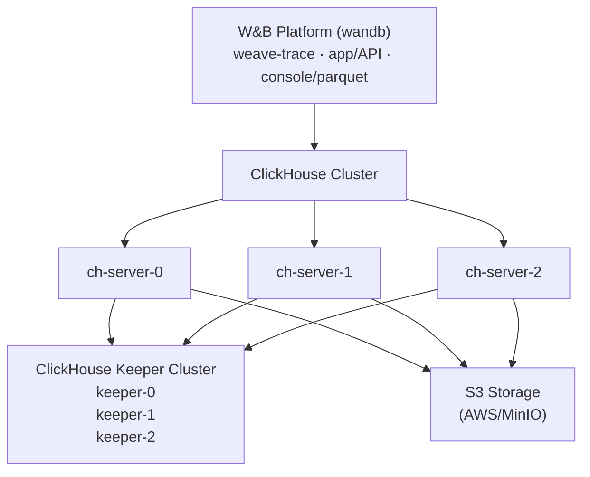

W&B Weave 를 직접 호스팅(Self-hosting)하면 환경과 설정에 대해 더 많은 제어권을 가질 수 있습니다. 이는 더욱 격리된 환경을 구축하고 추가적인 보안 컴플라이언스를 준수하는 데 도움이 됩니다. 이 문서는 Altinity ClickHouse Operator 를 사용하여 셀프 매니지드 환경에서 W&B Weave 를 실행하는 데 필요한 모든 구성 요소를 배포하는 방법을 안내합니다.

셀프 매니지드 Weave 배포는 백엔드 관리를 위해 [ClickHouseDB](https://clickhouse.com/) 에 의존합니다. 이 배포에서는 다음을 사용합니다:

- **Altinity ClickHouse Operator**: Kubernetes 를 위한 엔터프라이즈급 ClickHouse 관리 툴
- **ClickHouse Keeper**: 분산 코디네이션 서비스 (ZooKeeper 를 대체함)
- **ClickHouse Cluster**: trace 저장소를 위한 고가용성 데이터베이스 클러스터
- **S3 호환 스토리지**: ClickHouse 데이터 보존을 위한 오브젝트 스토리지

<Tip>
상세 참조 아키텍처는 [W&B Self-Managed Reference Architecture](https://docs.wandb.ai/guides/hosting/self-managed/ref-arch/#models-and-weave) 를 참조하세요.
</Tip>

## 중요 설정 참고 사항

이 가이드의 설정 예시는 참조용일 뿐입니다. 각 조직의 Kubernetes 환경은 고유하므로, 셀프 호스팅 인스턴스에서는 다음 사항들을 조정해야 할 수 있습니다:

- **보안 및 컴플라이언스**: 조직의 보안 정책 및 Kubernetes/OpenShift 요구 사항에 따라 보안 컨텍스트, `runAsUser`/`fsGroup` 값 및 기타 보안 설정을 조정하세요.
- **리소스 사이징**: 표시된 리소스 할당량은 시작점일 뿐입니다. 예상되는 trace 볼륨과 성능 요구 사항에 기반한 적절한 사이징에 대해서는 **W&B Solutions Architect 팀과 상담하세요**.
- **인프라 사양**: 환경에 맞게 스토리지 클래스, 노드 셀렉터 및 기타 인프라 관련 설정을 업데이트하세요.

이 가이드의 설정은 지침이 아닌 템플릿으로 취급되어야 합니다.

## 아키텍처



## 사전 요구 사항

셀프 매니지드 Weave 인스턴스에는 다음 리소스가 필요합니다:

- **Kubernetes 클러스터**: 버전 1.29 이상
- **Kubernetes 노드**: 멀티 노드 클러스터 (고가용성을 위해 최소 3개 노드 권장)
- **스토리지 클래스**: 퍼시스턴트 볼륨을 위한 작동 중인 StorageClass (예: `gp3`, `standard`, `nfs-csi`)
- **S3 버킷**: 적절한 엑세스 권한이 사전 설정된 S3 또는 S3 호환 버킷
- **W&B 플랫폼**: 이미 설치되어 실행 중이어야 함 ([W&B Self-Managed Deployment Guide](https://docs.wandb.ai/guides/hosting/hosting-options/self-managed/) 참조)
- **W&B 라이선스**: W&B Support 로부터 받은 Weave 가 활성화된 라이선스

<Warning>
이 사전 요구 사항 목록만으로 사이징 결정을 내리지 마세요. 리소스 요구 사항은 trace 볼륨과 사용 패턴에 따라 크게 달라집니다. 명시적인 클러스터 사이징 가이드는 상세 [리소스 요구 사항](#resource-requirements) 섹션을 참조하세요.
</Warning>

### 필수 툴

인스턴스를 설정하려면 다음 툴이 필요합니다:

- 클러스터 엑세스가 설정된 `kubectl`
- `helm` v3.0 이상
- AWS 자격 증명(S3 사용 시) 또는 S3 호환 스토리지에 대한 엑세스 권한

### 네트워크 요구 사항

Kubernetes 클러스터에는 다음과 같은 네트워크 설정이 필요합니다:

- `clickhouse` 네임스페이스의 Pod 는 `wandb` 네임스페이스의 Pod 와 통신할 수 있어야 합니다.
- ClickHouse 노드는 8123, 9000, 9009, 2181 포트를 통해 서로 통신할 수 있어야 합니다.

## 셀프 매니지드 Weave 인스턴스 배포하기

### 1단계: Altinity ClickHouse Operator 배포

Altinity ClickHouse Operator 는 Kubernetes 에서 ClickHouse 설치를 관리합니다.

#### 1.1 Altinity Helm 레포지토리 추가

```bash
helm repo add altinity https://helm.altinity.com
helm repo update
```

#### 1.2 오퍼레이터 설정 생성

`ch-operator.yaml` 이라는 파일을 생성합니다:

```yaml
operator:
  image:
    repository: altinity/clickhouse-operator
    tag: "0.25.4"

  # 보안 컨텍스트 - 클러스터 요구 사항에 따라 조정하세요
  containerSecurityContext:
    runAsGroup: 0
    runAsNonRoot: true
    runAsUser: 10001 # OpenShift/Kubernetes 보안 정책에 따라 업데이트하세요
    allowPrivilegeEscalation: false
    capabilities:
      drop:
        - ALL
    privileged: false
    readOnlyRootFilesystem: false

metrics:
  enabled: false

# 이름 오버라이드 - 필요한 경우 사용자 정의하세요
nameOverride: "wandb"
```

여기에 표시된 `containerSecurityContext` 값은 대부분의 Kubernetes 배포판에서 작동합니다. **OpenShift** 의 경우, 프로젝트에 할당된 UID 범위와 일치하도록 `runAsUser` 및 `fsGroup` 을 조정해야 할 수 있습니다.

#### 1.3 오퍼레이터 설치

```bash
helm upgrade --install ch-operator altinity/altinity-clickhouse-operator \
  --version 0.25.4 \
  --namespace clickhouse \
  --create-namespace \
  -f ch-operator.yaml
```

#### 1.4 오퍼레이터 설치 확인

```bash
# 오퍼레이터 pod 가 실행 중인지 확인
kubectl get pods -n clickhouse

# 예상 결과:
# NAME                                 READY   STATUS    RESTARTS   AGE
# ch-operator-wandb-xxxxx              1/1     Running   0          30s

# 오퍼레이터 이미지 버전 확인
kubectl get pods -n clickhouse -o jsonpath="{.items[*].spec.containers[*].image}" | \
  tr ' ' '\n' | grep -v 'metrics-exporter' | sort -u

# 예상 결과:
# altinity/clickhouse-operator:0.25.4
```

### 2단계: S3 스토리지 준비

ClickHouse 는 데이터 보존을 위해 S3 또는 S3 호환 스토리지가 필요합니다.

#### 2.1 S3 버킷 생성

AWS 계정 또는 S3 호환 스토리지 제공업체에서 S3 버킷을 생성합니다:

```bash
# AWS 예시
aws s3 mb s3://my-wandb-clickhouse-bucket --region eu-central-1
```

#### 2.2 S3 자격 증명 설정

S3 엑세스 자격 증명을 제공하는 데 두 가지 옵션이 있습니다:

##### 옵션 A: AWS IAM Roles 사용 (IRSA - AWS 권장 사항)

Kubernetes 노드에 S3 엑세스 권한이 있는 IAM 역할이 있는 경우, ClickHouse 는 EC2 인스턴스 메타데이터를 사용할 수 있습니다:

```yaml
# ch-server.yaml 에서 다음과 같이 설정:
<use_environment_credentials>true</use_environment_credentials>
```

**필수 IAM 정책** (노드 IAM 역할에 연결):

```json
{
  "Version": "2012-10-17",
  "Statement": [
    {
      "Effect": "Allow",
      "Action": [
        "s3:GetObject",
        "s3:PutObject",
        "s3:DeleteObject",
        "s3:ListBucket"
      ],
      "Resource": [
        "arn:aws:s3:::my-wandb-clickhouse-bucket",
        "arn:aws:s3:::my-wandb-clickhouse-bucket/*"
      ]
    }
  ]
}
```

##### 옵션 B: Access Key 사용

정적 자격 증명을 선호하는 경우, Kubernetes secret 을 생성하세요:

```bash
kubectl create secret generic aws-creds \
  --namespace clickhouse \
  --from-literal aws_access_key=YOUR_ACCESS_KEY \
  --from-literal aws_secret_key=YOUR_SECRET_KEY
```

그런 다음 ClickHouse 가 이 secret 을 사용하도록 설정하세요 (아래 ch-server.yaml 설정 참조).

### 3단계: ClickHouse Keeper 배포

[ClickHouse Keeper](https://clickhouse.com/docs/guides/sre/keeper/clickhouse-keeper) 는 데이터 복제 및 분산 DDL 쿼리 실행을 위한 코디네이션 시스템을 제공합니다.

#### 3.1 Keeper 설정 생성

`ch-keeper.yaml` 이라는 파일을 생성합니다:

```yaml
apiVersion: "clickhouse-keeper.altinity.com/v1"
kind: "ClickHouseKeeperInstallation"
metadata:
  name: wandb
  namespace: clickhouse
  annotations: {}
spec:
  defaults:
    templates:
      podTemplate: default
      dataVolumeClaimTemplate: default

  templates:
    podTemplates:
      - name: keeper
        metadata:
          labels:
            app: clickhouse-keeper
        spec:
          # Pod 보안 컨텍스트 - 환경에 따라 조정하세요
          securityContext:
            fsGroup: 10001 # 클러스터 보안 요구 사항에 따라 업데이트하세요
            fsGroupChangePolicy: Always
            runAsGroup: 0
            runAsNonRoot: true
            runAsUser: 10001 # OpenShift 의 경우 프로젝트에 할당된 UID 범위를 사용하세요
            seccompProfile:
              type: RuntimeDefault

          # 노드 전체에 keeper 를 분산시키기 위한 Anti-affinity (고가용성을 위해 권장)
          # 클러스터 크기 및 가용성 요구 사항에 따라 사용자 정의하거나 제거하세요
          affinity:
            podAntiAffinity:
              requiredDuringSchedulingIgnoredDuringExecution:
                - labelSelector:
                    matchExpressions:
                      - key: "app"
                        operator: In
                        values:
                          - clickhouse-keeper
                  topologyKey: "kubernetes.io/hostname"

          containers:
            - name: clickhouse-keeper
              imagePullPolicy: IfNotPresent
              image: "clickhouse/clickhouse-keeper:25.3.5.42"
              # 리소스 요청 - 예시 값이며 워크로드에 따라 조정하세요
              resources:
                requests:
                  memory: "256Mi"
                  cpu: "0.5"
                limits:
                  memory: "2Gi"
                  cpu: "1"

              securityContext:
                allowPrivilegeEscalation: false
                capabilities:
                  drop:
                    - ALL
                privileged: false
                readOnlyRootFilesystem: false

    volumeClaimTemplates:
      - name: data
        metadata:
          labels:
            app: clickhouse-keeper
        spec:
          storageClassName: gp3 # 본인의 StorageClass 로 변경하세요
          accessModes:
            - ReadWriteOnce
          resources:
            requests:
              storage: 10Gi

  configuration:
    clusters:
      - name: keeper # Keeper 클러스터 이름 - 서비스 DNS 네이밍에 사용됨
        layout:
          replicasCount: 3
        templates:
          podTemplate: keeper
          dataVolumeClaimTemplate: data

    settings:
      logger/level: "information"
      logger/console: "true"
      listen_host: "0.0.0.0"
      keeper_server/four_letter_word_white_list: "*"
      keeper_server/coordination_settings/raft_logs_level: "information"
      keeper_server/enable_ipv6: "false"
      keeper_server/coordination_settings/async_replication: "true"
```

**중요 설정 업데이트**:

- **StorageClass**: 클러스터에서 사용 가능한 StorageClass 와 일치하도록 `storageClassName: gp3` 를 업데이트하세요.
- **보안 컨텍스트**: 조직의 보안 정책을 준수하도록 `runAsUser`, `fsGroup` 값을 조정하세요.
- **Anti-Affinity**: 클러스터 토폴로지 및 고가용성(HA) 요구 사항에 따라 `affinity` 섹션을 사용자 정의하거나 제거하세요.
- **리소스**: CPU/메모리 값은 예시입니다. 적절한 사이징에 대해서는 W&B Solutions Architect 와 상담하세요.
- **이름**: `metadata.name` 또는 `configuration.clusters[0].name` 을 변경하는 경우, 일치하도록 ch-server.yaml(4단계)의 Keeper 호스트 이름을 **반드시 업데이트**해야 합니다.

#### 3.2 ClickHouse Keeper 배포

```bash
kubectl apply -f ch-keeper.yaml
```

#### 3.3 Keeper 배포 확인

```bash
# Keeper pods 확인
kubectl get pods -n clickhouse -l app=clickhouse-keeper

# 예상 결과:
# NAME                     READY   STATUS    RESTARTS   AGE
# chk-wandb-keeper-0-0-0   1/1     Running   0          2m
# chk-wandb-keeper-0-1-0   1/1     Running   0          2m
# chk-wandb-keeper-0-2-0   1/1     Running   0          2m

# Keeper 서비스 확인
kubectl get svc -n clickhouse | grep keeper

# 2181 포트에서 keeper 서비스가 표시되어야 합니다.
```

### 4단계: ClickHouse Cluster 배포

이제 Weave trace 데이터를 저장할 ClickHouse 서버 클러스터를 배포합니다.

#### 4.1 ClickHouse 서버 설정 생성

`ch-server.yaml` 이라는 파일을 생성합니다:

```yaml
apiVersion: "clickhouse.altinity.com/v1"
kind: "ClickHouseInstallation"
metadata:
  name: wandb
  namespace: clickhouse
  annotations: {}
spec:
  defaults:
    templates:
      podTemplate: default
      dataVolumeClaimTemplate: default

  templates:
    podTemplates:
      - name: clickhouse
        metadata:
          labels:
            app: clickhouse-server
        spec:
          # Pod 보안 컨텍스트 - 환경에 맞게 사용자 정의하세요
          securityContext:
            fsGroup: 10001 # 보안 정책에 따라 조정하세요
            fsGroupChangePolicy: Always
            runAsGroup: 0
            runAsNonRoot: true
            runAsUser: 10001 # OpenShift 의 경우 할당된 UID 범위를 사용하세요
            seccompProfile:
              type: RuntimeDefault

          # Anti-affinity 룰 - 서버가 서로 다른 노드에서 실행되도록 보장함 (선택 사항이지만 권장)
          # 클러스터 크기 및 요구 사항에 따라 조정하거나 제거하세요
          affinity:
            podAntiAffinity:
              requiredDuringSchedulingIgnoredDuringExecution:
                - labelSelector:
                    matchExpressions:
                      - key: "app"
                        operator: In
                        values:
                          - clickhouse-server
                  topologyKey: "kubernetes.io/hostname"

          containers:
            - name: clickhouse
              image: clickhouse/clickhouse-server:25.3.5.42
              # 예시 리소스 할당 - 워크로드에 따라 조정하세요
              resources:
                requests:
                  memory: 1Gi
                  cpu: 1
                limits:
                  memory: 16Gi
                  cpu: 4

              # AWS 자격 증명 (IRSA 사용 시 이 섹션 제거)
              env:
                - name: AWS_ACCESS_KEY_ID
                  valueFrom:
                    secretKeyRef:
                      name: aws-creds
                      key: aws_access_key
                - name: AWS_SECRET_ACCESS_KEY
                  valueFrom:
                    secretKeyRef:
                      name: aws-creds
                      key: aws_secret_key

              securityContext:
                allowPrivilegeEscalation: false
                capabilities:
                  drop:
                    - ALL
                privileged: false
                readOnlyRootFilesystem: false

    volumeClaimTemplates:
      - name: data
        metadata:
          labels:
            app: clickhouse-server
        spec:
          accessModes:
            - ReadWriteOnce
          resources:
            requests:
              storage: 50Gi
          storageClassName: gp3 # 본인의 StorageClass 로 변경하세요

  configuration:
    # Keeper (ZooKeeper) 설정
    # 중요: 이 호스트 이름은 3단계의 Keeper 배포와 반드시 일치해야 합니다.
    zookeeper:
      nodes:
        - host: chk-wandb-keeper-0-0.clickhouse.svc.cluster.local
          port: 2181
        - host: chk-wandb-keeper-0-1.clickhouse.svc.cluster.local
          port: 2181
        - host: chk-wandb-keeper-0-2.clickhouse.svc.cluster.local
          port: 2181
      # 선택 사항: 필요한 경우 타임아웃 조정을 위해 주석 해제
      # session_timeout_ms: 30000
      # operation_timeout_ms: 10000

    # 사용자 설정: https://clickhouse.com/docs/operations/configuration-files#user-settings
    # 비밀번호 팁:
    # sha256sum <<< weave123 OR echo -n weave123 | sha256sum OR printf "weave123" | sha256sum
    # 사용자 설정에서 <password_sha256_hex>...</password_sha256_hex>로 반환됩니다.
    users:
      weave/password: weave123
      weave/access_management: 1
      weave/profile: default
      weave/networks/ip:
        - "0.0.0.0/0"
        - "::"

    # 서버 설정
    settings:
      disable_internal_dns_cache: 1

    # 클러스터 설정
    clusters:
      - name: weavecluster # 클러스터 이름 - 사용자 정의 가능하나 wandb-cr.yaml과 일치해야 함
        layout:
          shardsCount: 1
          replicasCount: 3 # 복제본 수 - HA 요구 사항에 따라 조정하세요
        templates:
          podTemplate: clickhouse
          dataVolumeClaimTemplate: data

    # 설정 파일
    files:
      config.d/network_configuration.xml: |
        <clickhouse>
            <listen_host>0.0.0.0</listen_host>
            <listen_host>::</listen_host>
        </clickhouse>

      config.d/logger.xml: |
        <clickhouse>
            <logger>
                <level>information</level>
            </logger>
        </clickhouse>

      config.d/storage_configuration.xml: |
        <clickhouse>
            <storage_configuration>
                <disks>
                    <s3_disk>
                        <type>s3</type>
                        <endpoint>https://YOUR-BUCKET-NAME.s3.YOUR-REGION.amazonaws.com/s3_disk/{replica}</endpoint>
                        <metadata_path>/var/lib/clickhouse/disks/s3_disk/</metadata_path>
                        <use_environment_credentials>true</use_environment_credentials>
                        <region>YOUR-REGION</region>
                    </s3_disk>
                    <s3_disk_cache>
                        <type>cache</type>
                        <disk>s3_disk</disk>
                        <path>/var/lib/clickhouse/s3_disk_cache/cache/</path>
                        <max_size>40Gi</max_size>
                        <cache_on_write_operations>true</cache_on_write_operations>
                    </s3_disk_cache>
                </disks>
                <policies>
                    <s3_main>
                        <volumes>
                            <main>
                                <disk>s3_disk_cache</disk>
                            </main>
                        </volumes>
                    </s3_main>
                </policies>
            </storage_configuration>
            <merge_tree>
                <storage_policy>s3_main</storage_policy>
            </merge_tree>
        </clickhouse>
```

**필수 중요 설정 업데이트**:

1. **StorageClass**: 클러스터의 StorageClass 에 맞춰 `storageClassName: gp3` 를 업데이트하세요.
2. **S3 Endpoint**: `YOUR-BUCKET-NAME` 과 `YOUR-REGION` 을 실제 값으로 교체하세요.
3. **Cache Size**: `<max_size>40Gi</max_size>` 는 퍼시스턴트 볼륨 크기(50Gi)보다 **작아야** 합니다.
4. **보안 컨텍스트**: 조직의 정책에 맞춰 `runAsUser`, `fsGroup` 및 기타 보안 설정을 조정하세요.
5. **리소스 할당**: CPU/메모리 값은 예시일 뿐입니다. 예상되는 trace 볼륨에 기반한 적절한 사이징은 **W&B Solutions Architect 와 상담**하세요.
6. **Anti-Affinity 룰**: 클러스터 토폴로지 및 고가용성 요구 사항에 따라 조정하거나 제거하세요.
7. **Keeper Hostnames**: Keeper 노드 호스트 이름은 3단계의 Keeper 배포 이름과 **반드시 일치**해야 합니다 (아래 "Keeper 네이밍의 이해" 참조).
8. **Cluster Naming**: 클러스터 이름 `weavecluster` 는 변경 가능하지만, 5단계의 `WF_CLICKHOUSE_REPLICATED_CLUSTER` 값과 일치해야 합니다.
9. **자격 증명**:
   - IRSA 사용 시: `<use_environment_credentials>true</use_environment_credentials>` 를 유지하거나 환경 변수에 매핑된 secret 키에 엑세스하세요.

#### 4.2 S3 설정 업데이트

`ch-server.yaml` 의 `storage_configuration.xml` 섹션을 편집합니다:

**AWS S3 예시**:

```xml
<endpoint>https://my-wandb-clickhouse.s3.eu-central-1.amazonaws.com/s3_disk/{replica}</endpoint>
<region>eu-central-1</region>
```

**MinIO 예시**:

```xml
<endpoint>https://minio.example.com:9000/my-bucket/s3_disk/{replica}</endpoint>
<region>us-east-1</region>
```

<Warning>
**`{replica}` 를 제거하지 마세요.** 이는 각 ClickHouse 복제본이 버킷 내 자신의 폴더에 쓰도록 보장합니다.
</Warning>

#### 4.3 자격 증명 설정 (옵션 B인 경우에만)

2단계의 **옵션 B(Access Key)** 를 사용하는 경우, `ch-server.yaml` 의 `env` 섹션이 secret 을 참조하는지 확인하세요:

```yaml
env:
  - name: AWS_ACCESS_KEY_ID
    valueFrom:
      secretKeyRef:
        name: aws-creds
        key: aws_access_key
  - name: AWS_SECRET_ACCESS_KEY
    valueFrom:
      secretKeyRef:
        name: aws-creds
        key: aws_secret_key
```

**옵션 A(IRSA)** 를 사용하는 경우 `env` 섹션 전체를 제거하세요.

#### 4.4 Keeper 네이밍의 이해

`zookeeper.nodes` 섹션의 Keeper 노드 호스트 이름은 3단계의 Keeper 배포를 기반으로 특정 패턴을 따릅니다:

**호스트 이름 패턴**: `chk-{설치-이름}-{클러스터-이름}-{클러스터-인덱스}-{복제본-인덱스}.{네임스페이스}.svc.cluster.local`

여기서:

- `chk` = ClickHouseKeeperInstallation 접두사 (고정)
- `{설치-이름}` = ch-keeper.yaml 의 `metadata.name` (예: `wandb`)
- `{클러스터-이름}` = ch-keeper.yaml 의 `configuration.clusters[0].name` (예: `keeper`)
- `{클러스터-인덱스}` = 클러스터 인덱스, 일반적으로 단일 클러스터의 경우 `0`
- `{복제본-인덱스}` = 복제본 번호: 3개 복제본의 경우 `0`, `1`, `2`
- `{네임스페이스}` = Kubernetes 네임스페이스 (예: `clickhouse`)

**기본 이름을 사용한 예시**:

```
chk-wandb-keeper-0-0.clickhouse.svc.cluster.local
chk-wandb-keeper-0-1.clickhouse.svc.cluster.local
chk-wandb-keeper-0-2.clickhouse.svc.cluster.local
```

**Keeper 설치 이름을 사용자 정의한 경우** (예: `metadata.name: myweave`):

```
chk-myweave-keeper-0-0.clickhouse.svc.cluster.local
chk-myweave-keeper-0-1.clickhouse.svc.cluster.local
chk-myweave-keeper-0-2.clickhouse.svc.cluster.local
```

**Keeper 클러스터 이름을 사용자 정의한 경우** (예: `clusters[0].name: coordination`):

```
chk-wandb-coordination-0-0.clickhouse.svc.cluster.local
chk-wandb-coordination-0-1.clickhouse.svc.cluster.local
chk-wandb-coordination-0-2.clickhouse.svc.cluster.local
```

**실제 Keeper 호스트 이름을 확인하려면**:

```bash
# 실제 이름을 확인하기 위해 Keeper 서비스 목록 조회
kubectl get svc -n clickhouse | grep keeper

# 네이밍 패턴 확인을 위해 Keeper pod 목록 조회
kubectl get pods -n clickhouse -l app=clickhouse-keeper
```

<Note>
`ch-server.yaml` 의 Keeper 호스트 이름은 Keeper 배포에 의해 생성된 실제 서비스 이름과 **정확히 일치**해야 합니다. 그렇지 않으면 ClickHouse 서버가 코디네이션 서비스에 연결하지 못합니다.
</Note>

#### 4.5 ClickHouse 클러스터 배포

```bash
kubectl apply -f ch-server.yaml
```

#### 4.6 ClickHouse 배포 확인

```bash
# ClickHouse pods 확인
kubectl get pods -n clickhouse -l app=clickhouse-server

# 예상 결과:
# NAME                           READY   STATUS    RESTARTS   AGE
# chi-wandb-weavecluster-0-0-0   1/1     Running   0          3m
# chi-wandb-weavecluster-0-1-0   1/1     Running   0          3m
# chi-wandb-weavecluster-0-2-0   1/1     Running   0          3m

# ClickHouse 연결 테스트
kubectl exec -n clickhouse chi-wandb-weavecluster-0-0-0 -- \
  clickhouse-client --user weave --password weave123 --query "SELECT version()"

# 클러스터 상태 확인
kubectl exec -n clickhouse chi-wandb-weavecluster-0-0-0 -- \
  clickhouse-client --user weave --password weave123 --query \
  "SELECT cluster, host_name, port FROM system.clusters WHERE cluster='weavecluster'"
```

### 5단계: W&B 플랫폼에서 Weave 활성화

이제 ClickHouse 클러스터를 Weave trace 에 사용하도록 W&B 플랫폼을 설정합니다.

#### 5.1 ClickHouse 연결 정보 수집

다음 정보가 필요합니다:

- **Host**: `clickhouse-wandb.clickhouse.svc.cluster.local`
- **Port**: `8123`
- **User**: `weave` (ch-server.yaml 에 설정된 값)
- **Password**: `weave123` (ch-server.yaml 에 설정된 값)
- **Database**: `weave` (자동으로 생성됨)
- **Cluster Name**: `weavecluster` (ch-server.yaml 에 설정된 값)

호스트 이름은 다음 패턴을 따릅니다: `clickhouse-{설치-이름}.{네임스페이스}.svc.cluster.local`

#### 5.2 W&B Custom Resource 업데이트

W&B 플랫폼 Custom Resource (CR) 를 편집하여 Weave 설정을 추가합니다:

```yaml
apiVersion: apps.wandb.com/v1
kind: WeightsAndBiases
metadata:
  name: wandb
  namespace: wandb
spec:
  values:
    global:
      # ... 기존 설정 ...

      # ClickHouse 설정 추가
      clickhouse:
        install: false # 별도로 배포함
        host: clickhouse-wandb.clickhouse.svc.cluster.local
        port: 8123
        user: weave
        password: weave123
        database: weave
        replicated: true # 멀티 복제본 설정 시 필수

      # Weave Trace 활성화
      weave-trace:
        enabled: true

    # Weave Trace 설정
    weave-trace:
      install: true
      extraEnv:
        WF_CLICKHOUSE_REPLICATED: "true"
        WF_CLICKHOUSE_REPLICATED_CLUSTER: "weavecluster"
      image:
        repository: wandb/weave-trace
        tag: 0.74.1
      replicaCount: 1
      size: "default"
      sizing:
        default:
          autoscaling:
            horizontal:
              enabled: false
          # 예시 리소스 할당 - 워크로드에 따라 조정하세요
          resources:
            limits:
              cpu: 4
              memory: "8Gi"
            requests:
              cpu: 1
              memory: "4Gi"
      # Pod 보안 컨텍스트 - 환경에 맞게 사용자 정의하세요
      podSecurityContext:
        fsGroup: 10001 # 보안 요구 사항에 따라 조정하세요
        fsGroupChangePolicy: Always
        runAsGroup: 0
        runAsNonRoot: true
        runAsUser: 10001 # OpenShift 의 경우 할당된 UID 범위를 사용하세요
        seccompProfile:
          type: RuntimeDefault
      # 컨테이너 보안 컨텍스트
      securityContext:
        allowPrivilegeEscalation: false
        capabilities:
          drop:
            - ALL
        privileged: false
        readOnlyRootFilesystem: false
```

**중요 설정**:

- `clickhouse.replicated: true` - 3개의 복제본 사용 시 **필수**
- `WF_CLICKHOUSE_REPLICATED: "true"` - 복제 설정 시 **필수**
- `WF_CLICKHOUSE_REPLICATED_CLUSTER: "weavecluster"` - ch-server.yaml 의 클러스터 이름과 **반드시 일치**해야 함

<Note>
위에 표시된 보안 컨텍스트, 리소스 할당 및 기타 Kubernetes 관련 설정은 참조용 예시입니다. 조직의 요구 사항에 따라 사용자 정의하고 적절한 리소스 사이징을 위해 W&B Solutions Architect 팀과 상담하세요.
</Note>

#### 5.3 업데이트된 설정 적용

```bash
kubectl apply -f wandb-cr.yaml
```

#### 5.4 Weave Trace 배포 확인

```bash
# weave-trace pod 상태 확인
kubectl get pods -n wandb | grep weave-trace

# 예상 결과:
# wandb-weave-trace-bc-xxxxx   1/1     Running   0          2m

# ClickHouse 연결 확인을 위한 weave-trace 로그 확인
kubectl logs -n wandb <weave-trace-pod-name> --tail=50

# ClickHouse 연결 성공 메시지를 확인하세요.
```

### 6단계: Weave 데이터베이스 초기화

weave-trace 서비스는 첫 시작 시 필요한 데이터베이스 스키마를 자동으로 생성합니다.

#### 6.1 데이터베이스 마이그레이션 모니터링

```bash
# 시작 중 weave-trace 로그 모니터링
kubectl logs -n wandb <weave-trace-pod-name> -f

# 데이터베이스 초기화 성공을 나타내는 마이그레이션 메시지를 확인하세요.
```

#### 6.2 데이터베이스 생성 확인

```bash
# ClickHouse 에 연결하여 데이터베이스 확인
kubectl exec -n clickhouse chi-wandb-weavecluster-0-0-0 -- \
  clickhouse-client --user weave --password weave123 --query \
  "SHOW DATABASES"

# 'weave' 데이터베이스가 목록에 표시되어야 합니다.

# weave 데이터베이스 내 테이블 확인
kubectl exec -n clickhouse chi-wandb-weavecluster-0-0-0 -- \
  clickhouse-client --user weave --password weave123 --query \
  "SHOW TABLES FROM weave"
```

### 7단계: Weave 활성화 확인

#### 7.1 W&B Console 접속

웹 브라우저에서 W&B 인스턴스 URL 로 이동합니다.

#### 7.2 Weave 라이선스 상태 확인

W&B Console 에서:

1. **우측 상단 메뉴** → **Organization Dashboard** 로 이동합니다.
2. **Weave access** 가 활성화되어 있는지 확인합니다.

#### 7.3 Weave 기능 테스트

Weave 가 작동하는지 확인하기 위해 간단한 Python 테스트를 생성합니다:

```python
import weave

# Weave 초기화 (실제 W&B 호스트로 교체하세요)
weave.init('test-project')

# 간단한 traced 함수 생성
@weave.op()
def hello_weave(name: str) -> str:
    return f"Hello, {name}!"

# 함수 호출
result = hello_weave("World")
print(result)
```

이 코드를 실행한 후, W&B UI 의 조직 내 traces 페이지에서 trace 를 확인하세요.

## 문제 해결

### ClickHouse Keeper 문제

**문제**: Keeper pod 가 `Pending` 상태에서 멈춤

**해결 방법**: 여러 가지 가능성을 확인하세요:

1. **PVC 및 StorageClass 문제**:

```bash
kubectl get pvc -n clickhouse
kubectl describe pvc -n clickhouse
```

StorageClass 가 올바르게 설정되었고 사용 가능한 용량이 있는지 확인하세요.

2. **Anti-affinity 및 노드 가용성**:

```bash
# Anti-affinity 룰이 스케줄링을 방해하는지 확인
kubectl describe pod -n clickhouse <pod-name> | grep -A 10 "Events:"

# 가용 노드 및 리소스 확인
kubectl get nodes
kubectl describe nodes | grep -A 5 "Allocated resources"
```

일반적인 문제:

- Anti-affinity 는 3개의 분리된 노드를 요구하지만, 클러스터의 노드 수가 그보다 적음
- 노드가 pod 의 리소스 요청을 충족할 만큼 충분한 CPU/메모리를 가지고 있지 않음
- 노드 테인트(taint)가 pod 스케줄링을 방지함

**해결책**:

- 노드가 3개 미만인 경우 Anti-affinity 룰을 제거하거나 조정하세요.
- 더 유연한 Anti-affinity 를 위해 `requiredDuringSchedulingIgnoredDuringExecution` 대신 `preferredDuringSchedulingIgnoredDuringExecution` 을 사용하세요.
- 노드 리소스가 부족한 경우 리소스 요청량을 줄이세요.
- 클러스터에 노드를 추가하세요.

---

**문제**: Keeper pod 가 `CrashLoopBackOff` 상태임

**해결 방법**: 로그를 확인하고 설정을 검증하세요:

```bash
kubectl logs -n clickhouse <keeper-pod-name>
```

일반적인 문제:

- 잘못된 보안 컨텍스트 (runAsUser, fsGroup 확인)
- 볼륨 권한 문제
- 포트 충돌
- ch-keeper.yaml 의 설정 오류

### ClickHouse Server 문제

**문제**: ClickHouse 가 S3 에 연결할 수 없음

**해결 방법**: S3 자격 증명 및 권한을 확인하세요:

```bash
# secret 이 존재하는지 확인 (Access Key 사용 시)
kubectl get secret aws-creds -n clickhouse

# ClickHouse 로그에서 S3 오류 확인
kubectl logs -n clickhouse <clickhouse-pod-name> | grep -i s3

# 스토리지 설정에서 S3 엔드포인트 확인
kubectl get chi wandb -n clickhouse -o yaml | grep -A 10 storage_configuration
```

---

**문제**: ClickHouse 가 Keeper 에 연결할 수 없음

**해결 방법**: Keeper 엔드포인트 및 네이밍을 확인하세요:

```bash
# Keeper 서비스와 실제 이름 확인
kubectl get svc -n clickhouse | grep keeper

# 네이밍 패턴 확인을 위해 Keeper pod 목록 조회
kubectl get pods -n clickhouse -l app=clickhouse-keeper

# ch-server.yaml 의 zookeeper.nodes 설정과 비교
# 호스트 이름은 실제 서비스 이름과 반드시 일치해야 합니다.

# ClickHouse 로그에서 연결 오류 확인
kubectl logs -n clickhouse chi-wandb-weavecluster-0-0-0 | grep -i keeper
```

연결이 실패하면 `ch-server.yaml` 의 Keeper 호스트 이름이 실제 Keeper 배포와 일치하지 않을 가능성이 높습니다. 네이밍 패턴에 대해서는 4단계의 "Keeper 네이밍의 이해" 섹션을 참조하세요.

### Weave Trace 문제

**문제**: `weave-trace` pod 가 시작되지 않음

**해결 방법**: ClickHouse 연결성을 확인하세요:

```bash
# weave-trace pod 이름 가져오기
kubectl get pods -n wandb | grep weave-trace

# weave-trace 로그 확인
kubectl logs -n wandb <weave-trace-pod-name>

# 일반적인 오류: "connection refused" 또는 "authentication failed"
# wandb-cr.yaml 의 ClickHouse 자격 증명이 ch-server.yaml 과 일치하는지 확인하세요.
```

---

**문제**: Console 에서 Weave 가 활성화된 것으로 표시되지 않음

**해결 방법**: 설정을 검증하세요:

1. 라이선스에 Weave 가 포함되어 있는지 확인:

   ```bash
   kubectl get secret license-key -n wandb -o jsonpath='{.data.value}' | base64 -d | jq
   ```

2. `wandb-cr.yaml` 에 `weave-trace.enabled: true` 및 `clickhouse.replicated: true` 가 설정되어 있는지 확인

3. W&B 오퍼레이터 로그 확인:
   ```bash
   kubectl logs -n wandb deployment/wandb-controller-manager
   ```

---

**문제**: 데이터베이스 마이그레이션 실패

**해결 방법**: 클러스터 이름 일치 여부 확인:

`WF_CLICKHOUSE_REPLICATED_CLUSTER` 환경 변수는 `ch-server.yaml` 의 클러스터 이름과 **반드시 일치**해야 합니다:

```yaml
# ch-server.yaml 에서:
clusters:
  - name: weavecluster # <-- 이 이름

# wandb-cr.yaml 에서 동일해야 함:
weave-trace:
  extraEnv:
    WF_CLICKHOUSE_REPLICATED_CLUSTER: "weavecluster" # <-- 이 값
```

## 리소스 요구 사항

<Warning>
아래의 리소스 할당량은 **참조용 시작점일 뿐**입니다. 실제 요구 사항은 다음에 따라 크게 달라집니다:

- Trace 수집 볼륨 (초당 trace 수)
- 쿼리 패턴 및 동시성
- 데이터 보존 기간
- 동시 사용자 수

특정 유스 케이스에 적합한 사이징을 결정하려면 **항상 W&B Solutions Architect 팀과 상담**하세요. 리소스가 부족하면 성능 문제가 발생할 수 있으며, 과도한 할당은 인프라 비용 낭비로 이어집니다.
</Warning>

### 최소 프로덕션 설정

| 구성 요소 | 복제본 수 | CPU Request / Limit | Memory Request / Limit | 스토리지 |
| :--- | :--- | :--- | :--- | :--- |
| ClickHouse Keeper | 3 | 0.5 / 1 | 256Mi / 2Gi | 각 10Gi |
| ClickHouse Server | 3 | 1 / 4 | 1Gi / 16Gi | 각 50Gi |
| Weave Trace | 1 | 1 / 4 | 4Gi / 8Gi | - |
| **합계** | **7 pods** | **~4.5 / 15 CPU** | **~7.8Gi / 58Gi** | **180Gi** |

_적합한 용도: 개발, 테스트 또는 소규모 프로덕션 환경_

### 권장 프로덕션 설정

높은 trace 볼륨이 발생하는 프로덕션 워크로드의 경우:

| 구성 요소 | 복제본 수 | CPU Request / Limit | Memory Request / Limit | 스토리지 |
| :--- | :--- | :--- | :--- | :--- |
| ClickHouse Keeper | 3 | 1 / 2 | 1Gi / 4Gi | 각 20Gi |
| ClickHouse Server | 3 | 1 / 16 | 8Gi / 64Gi | 각 200Gi |
| Weave Trace | 2-3 | 1 / 4 | 4Gi / 8Gi | - |
| **합계** | **8-9 pods** | **~6-9 / 52-64 CPU** | **~27-33Gi / 204-216Gi** | **660Gi** |

_적합한 용도: 대규모 프로덕션 환경_

매우 큰 볼륨의 배포인 경우, 특정 trace 볼륨 및 성능 요구 사항에 따른 맞춤형 사이징 권장 사항을 W&B Solutions Architect 팀에 문의하세요.

## 고급 설정

이 섹션에서는 수직적 또는 수평적 확장을 통한 ClickHouse 용량 확장, keeper 및 서버 설정의 이미지 태그 수정을 통한 ClickHouse 버전 업데이트, ClickHouse 헬스 모니터링 등 셀프 매니지드 Weave 배포를 위한 사용자 정의 옵션을 다룹니다.

인스턴스에 고급 변경 사항을 적용할 때는 성능 및 신뢰성 요구 사항에 부합하는지 확인하기 위해 W&B Solutions Architect 팀과 상담하는 것이 좋습니다.

### ClickHouse 확장

ClickHouse 용량을 늘리기 위해 다음을 수행할 수 있습니다:

1. **수직적 확장(Vertical Scaling)**: pod 당 리소스를 늘립니다 (비교적 간단한 방법).

   ```yaml
   resources:
     requests:
       memory: 8Gi
       cpu: 1
     limits:
       memory: 64Gi
       cpu: 16
   ```

   **권장 사항**: 실제 리소스 사용량을 모니터링하고 그에 따라 확장하세요. 대규모 배포의 경우 W&B Solutions Architect 팀에 문의하세요.

2. **수평적 확장(Horizontal Scaling)**: 복제본을 더 추가합니다 (신중한 계획이 필요함).
   - 복제본을 늘리려면 데이터 재균형(rebalancing)이 필요합니다.
   - 샤드 관리에 대해서는 ClickHouse 문서를 참조하세요.
   - 프로덕션에서 수평적 확장을 구현하기 전에 **W&B Solutions Architect 에게 문의**하세요.

### 다른 ClickHouse 버전 사용하기

다른 ClickHouse 버전을 사용하려면 `ch-keeper.yaml` 및 `ch-server.yaml` 모두에서 이미지 태그를 업데이트하세요:

```yaml
image: clickhouse/clickhouse-keeper:25.3.5.42   # Keeper 버전
image: clickhouse/clickhouse-server:25.3.5.42   # 서버 버전
```

호환성을 위해 Keeper 와 서버 버전은 일치해야 하며, 최소한 Keeper 버전이 서버 버전보다 크거나 같아야(>=) 합니다.

### ClickHouse 모니터링

모니터링을 위해 ClickHouse 시스템 테이블에 엑세스하세요:

```bash
# 디스크 사용량 확인
kubectl exec -n clickhouse chi-wandb-weavecluster-0-0-0 -- \
  clickhouse-client --user weave --password weave123 --query \
  "SELECT name, path, formatReadableSize(free_space) as free, formatReadableSize(total_space) as total FROM system.disks"

# 복제 상태 확인
kubectl exec -n clickhouse chi-wandb-weavecluster-0-0-0 -- \
  clickhouse-client --user weave --password weave123 --query \
  "SELECT database, table, is_leader, total_replicas, active_replicas FROM system.replicas WHERE database='weave'"

# ClickHouse 서버 상태 확인
kubectl get pods -n clickhouse -l app=clickhouse-server
```

### 백업 및 복구

ClickHouse 데이터는 S3 에 저장되므로, S3 버전 관리 및 버킷 복제 기능을 통해 고유한 백업 기능을 제공합니다. 특정 배포에 맞는 백업 전략은 W&B Solutions Architect 팀과 상담하고 [ClickHouse backup documentation](https://clickhouse.com/docs/en/operations/backup) 을 참조하세요.

## 보안 고려 사항

1. **자격 증명**: ClickHouse 비밀번호를 평문이 아닌 Kubernetes secret 에 저장하세요.
2. **네트워크 정책**: ClickHouse 엑세스를 제한하기 위해 NetworkPolicies 구현을 고려하세요.
3. **RBAC**: 서비스 계정이 필요한 최소한의 권한만 갖도록 보장하세요.
4. **S3 버킷**: 저장 시 암호화(encryption at rest)를 활성화하고 버킷 엑세스를 필요한 IAM 역할로 제한하세요.
5. **TLS** (선택 사항): 프로덕션 환경의 경우 ClickHouse 클라이언트 연결에 TLS 를 활성화하세요.

## 업그레이드

### ClickHouse Operator 업그레이드

```bash
helm upgrade ch-operator altinity/altinity-clickhouse-operator \
  --version 0.25.4 \
  --namespace clickhouse \
  -f ch-operator.yaml
```

### ClickHouse Server 업그레이드

`ch-server.yaml` 의 이미지 버전을 업데이트하고 적용하세요:

```bash
# ch-server.yaml 편집, 이미지 태그 변경
kubectl apply -f ch-server.yaml

# pod 모니터링
kubectl get pods -n clickhouse
```

### Weave Trace 업그레이드

`wandb-cr.yaml` 의 이미지 태그를 업데이트하고 적용하세요:

```bash
kubectl apply -f wandb-cr.yaml

# weave-trace pod 재시작 모니터링
kubectl get pods -n wandb | grep weave-trace
```

## 추가 리소스

- [Altinity ClickHouse Operator Documentation](https://docs.altinity.com/altinitykubernetesoperator/)
- [ClickHouse Documentation](https://clickhouse.com/docs)
- [W&B Weave Documentation](https://docs.wandb.ai/weave)
- [ClickHouse S3 Storage Configuration](https://clickhouse.com/docs/en/engines/table-engines/mergetree-family/mergetree#s3-virtual-hosted-style)

## 고객 지원

프로덕션 배포 또는 문제 발생 시:

- **W&B Support**: `support@wandb.com`
- **Solutions Architects**: 대규모 배포, 맞춤형 사이징 및 배포 계획 지원
- **지원 요청 시 포함할 내용**:
  - weave-trace, ClickHouse pods 및 오퍼레이터의 로그
  - W&B 버전, ClickHouse 버전, Kubernetes 버전
  - 클러스터 정보 및 trace 볼륨

## FAQ

**질문: 3개 대신 1개의 ClickHouse 복제본만 사용할 수 있나요?**

답변: 가능하지만 프로덕션 환경에는 권장하지 않습니다. `ch-server.yaml` 에서 `replicasCount: 1` 로 업데이트하고 `wandb-cr.yaml` 에서 `clickhouse.replicated: false` 로 설정하세요.

**질문: ClickHouse 대신 다른 데이터베이스를 사용할 수 있나요?**

답변: 아니요, Weave Trace 는 고성능 컬럼 지향 스토리지 기능을 위해 ClickHouse 가 필수적입니다.

**질문: S3 스토리지는 얼마나 필요할까요?**

답변: S3 스토리지 요구 사항은 trace 볼륨, 보존 기간 및 데이터 압축률에 따라 다릅니다. 배포 후 실제 사용량을 모니터링하여 조정하세요. ClickHouse 의 컬럼 형식은 trace 데이터에 대해 우수한 압축률을 제공합니다.

**질문: ClickHouse 에서 `database` 이름을 수동으로 설정해야 하나요?**

답변: 아니요, `weave` 데이터베이스는 초기 시작 시 weave-trace 서비스에 의해 자동으로 생성됩니다.

**질문: 클러스터 이름이 `weavecluster` 가 아니면 어떻게 하나요?**

답변: `WF_CLICKHOUSE_REPLICATED_CLUSTER` 환경 변수를 클러스터 이름과 일치하도록 설정해야 합니다. 그렇지 않으면 데이터베이스 마이그레이션이 실패합니다.

**질문: 예시에 표시된 보안 컨텍스트를 그대로 사용해야 하나요?**

답변: 아니요. 이 가이드에서 제공하는 보안 컨텍스트(`runAsUser`, `fsGroup` 등)는 참조용 예시입니다. 특히 특정 UID/GID 범위 요구 사항이 있는 OpenShift 클러스터의 경우 조직의 보안 정책을 준수하도록 조정해야 합니다.

**질문: ClickHouse 클러스터 사이징이 올바른지 어떻게 알 수 있나요?**

답변: 예상되는 trace 볼륨과 사용 패턴을 포함하여 W&B Solutions Architect 팀에 문의하세요. 특정 사이징 권장 사항을 제공해 드릴 것입니다. 배포 후 리소스 사용량을 모니터링하고 필요에 따라 조정하세요.

**질문: 예시에 사용된 네이밍 규칙을 사용자 정의할 수 있나요?**

답변: 예, 하지만 모든 구성 요소에서 일관성을 유지해야 합니다:

1. **ClickHouse Keeper 이름** → `ch-server.yaml` 의 `zookeeper.nodes` 섹션에 있는 Keeper 노드 호스트 이름과 일치해야 함
2. **ClickHouse 클러스터 이름** (`weavecluster`) → `wandb-cr.yaml` 의 `WF_CLICKHOUSE_REPLICATED_CLUSTER` 와 일치해야 함
3. **ClickHouse 설치 이름** → weave-trace 가 사용하는 서비스 호스트 이름에 영향을 줌

네이밍 패턴 및 실제 이름 확인 방법에 대한 자세한 내용은 4단계의 "Keeper 네이밍의 이해" 섹션을 참조하세요.

**질문: 클러스터에 다른 Anti-affinity 요구 사항이 있는 경우는 어떻게 하나요?**

답변: 표시된 Anti-affinity 룰은 고가용성을 위한 권장 사항입니다. 클러스터 크기, 토폴로지 및 가용성 요구 사항에 따라 조정하거나 제거하세요. 소규모 클러스터나 개발 환경에서는 Anti-affinity 룰이 필요하지 않을 수 있습니다.