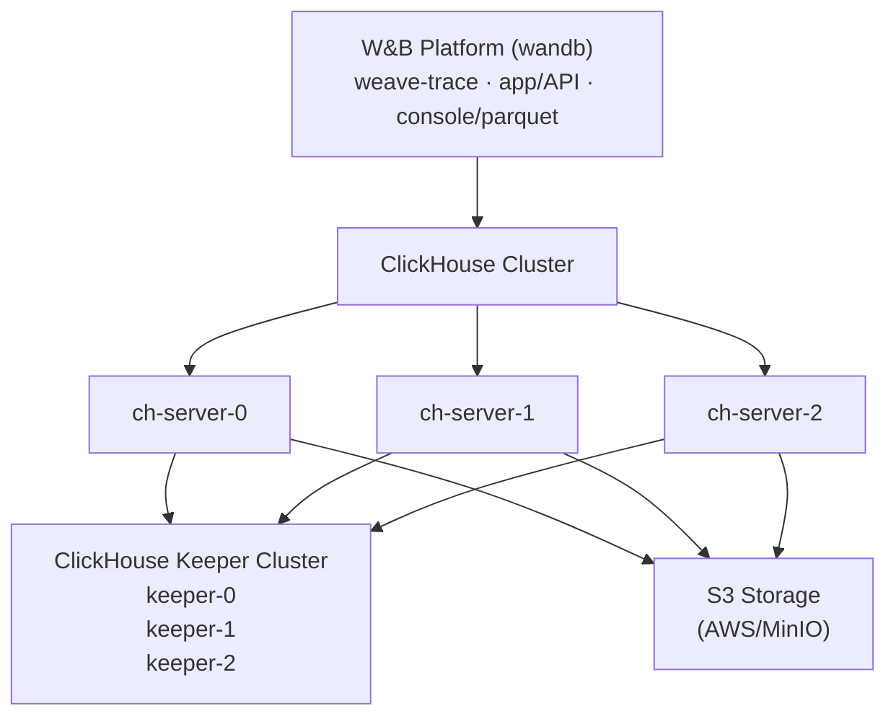

W&amp;B Weave를 자체 호스팅하면 환경과 설정을 더 세밀하게 제어할 수 있습니다. 이를 통해 보다 격리된 환경을 구성하고 추가적인 보안 규정 준수 요구 사항을 충족할 수 있습니다. 이 문서는 Altinity ClickHouse Operator를 사용해 자가 관리형 환경에서 W&amp;B Weave를 실행하는 데 필요한 모든 컴포넌트를 배포하는 방법을 안내합니다.

자가 관리형 Weave 배포는 백엔드를 관리하기 위해 [ClickHouseDB](https://clickhouse.com/)에 의존합니다. 이 배포는 다음을 사용합니다:

* **Altinity ClickHouse Operator**: Kubernetes용 엔터프라이즈급 ClickHouse 관리 도구
* **ClickHouse Keeper**: 분산 조정 서비스(ZooKeeper를 대체)
* **ClickHouse Cluster**: 트레이스 저장소를 위한 고가용성 데이터베이스 클러스터
* **S3-Compatible Storage**: ClickHouse 데이터 지속성을 위한 객체 저장소

<Tip>
  자세한 레퍼런스 아키텍처는 [W&amp;B Self-Managed Reference Architecture](https://docs.wandb.ai/guides/hosting/self-managed/ref-arch/#models-and-weave)를 참조하세요.
</Tip>

<div id="important-setup-notes">
  ## 중요한 설정 안내
</div>

이 가이드의 설정 예시는 참고용일 뿐입니다. 각 조직의 Kubernetes 환경은 저마다 다르므로 self-hosted 인스턴스에서는 다음 항목을 조정해야 할 가능성이 높습니다:

* **보안 및 규정 준수**: 조직의 보안 정책과 Kubernetes/OpenShift 요구 사항에 맞게 보안 컨텍스트, `runAsUser`/`fsGroup` 값 및 기타 보안 설정을 조정하십시오.
* **리소스 사이징**: 여기에 표시된 리소스 할당은 시작점일 뿐입니다. 예상 트레이스 볼륨과 성능 요구 사항을 기준으로 적절한 사이징을 하려면 **W&amp;B Solutions Architect 팀과 상의**하십시오.
* **인프라 세부 사항**: 저장소 클래스, 노드 셀렉터 및 기타 인프라별 설정을 환경에 맞게 업데이트하십시오.

이 가이드의 이러한 설정은 정해진 해결책이 아니라 템플릿으로 취급해야 합니다.

<div id="architecture">
  ## 아키텍처
</div>


```mermaid
graph TD
    A["W&B Platform (wandb)<br/>weave-trace · app/API · console/parquet"] --> B["ClickHouse Cluster"]
    B --> C["ch-server-0"]
    B --> D["ch-server-1"]
    B --> E["ch-server-2"]
    C --> F["ClickHouse Keeper Cluster<br/>keeper-0 <br/>keeper-1 <br/>keeper-2"]
    D --> F
    E --> F
    C --> G["S3 Storage<br/>(AWS/MinIO)"]
    D --> G
    E --> G
```


<div id="prerequisites">
  ## 사전 요구 사항
</div>

자가 관리형 Weave 인스턴스에는 다음 리소스가 필요합니다:

* **Kubernetes Cluster**: 버전 1.29+
* **Kubernetes Nodes**: 멀티노드 클러스터(고가용성을 위해 최소 3개 노드 권장)
* **Storage Class**: 퍼시스턴트 볼륨용으로 동작하는 StorageClass(예: `gp3`, `standard`, `nfs-csi`)
* **S3 Bucket**: 적절한 액세스 권한이 미리 설정된 S3 또는 S3 호환 버킷
* **W&amp;B Platform**: 이미 설치되어 실행 중이어야 합니다([W&amp;B 자가 관리형 배포 가이드](https://docs.wandb.ai/guides/hosting/hosting-options/self-managed/) 참조하다)
* **W&amp;B License**: W&amp;B 지원팀에서 제공하는 Weave 지원 라이선스

<Warning>
  이 사전 요구 사항 목록만을 기준으로 크기 산정을 결정하지 마세요. 필요한 리소스는 트레이스 볼륨과 사용 패턴에 따라 크게 달라집니다. 명시적인 클러스터 크기 조정 지침은 자세한 [리소스 요구 사항](#resource-requirements) section을 참조하다.
</Warning>

<div id="required-tools">
  ### 필수 도구
</div>

인스턴스를 설정하려면 다음 도구가 필요합니다:

* 클러스터 액세스가 설정된 `kubectl`
* `helm` v3.0+
* AWS 자격 증명(S3 사용 시) 또는 S3 호환 저장소 액세스

<div id="network-requirements">
  ### 네트워크 요구 사항
</div>

Kubernetes 클러스터에는 다음과 같은 네트워크 설정이 필요합니다:

* `clickhouse` 네임스페이스의 파드는 `wandb` 네임스페이스의 파드와 통신할 수 있어야 합니다
* ClickHouse 노드는 포트 8123, 9000, 9009, 2181을 통해 서로 통신할 수 있어야 합니다

<div id="deploy-your-self-managed-weave-instance">
  ## 자가 관리형 Weave 인스턴스 배포
</div>

<div id="step-1-deploy-altinity-clickhouse-operator">
  ### step 1: Altinity ClickHouse Operator 배포
</div>

Altinity ClickHouse Operator는 Kubernetes 환경에서 ClickHouse 설치를 관리합니다.

<div id="11-add-the-altinity-helm-repository">
  #### 1.1 Altinity Helm 저장소 추가
</div>

```bash
helm repo add altinity https://helm.altinity.com
helm repo update
```


<div id="12-create-the-operator-configuration">
  #### 1.2 Operator 설정 생성
</div>

`ch-operator.yaml` 파일을 생성합니다:

```yaml
operator:
  image:
    repository: altinity/clickhouse-operator

  # 보안 컨텍스트 - 클러스터 요구 사항에 맞게 조정하세요
  containerSecurityContext:
    runAsGroup: 0
    runAsNonRoot: true
    runAsUser: 10001 # OpenShift/Kubernetes 보안 정책에 따라 업데이트하세요
    allowPrivilegeEscalation: false
    capabilities:
      drop:
        - ALL
    privileged: false
    readOnlyRootFilesystem: false

metrics:
  enabled: false

# 이름 재정의 - 필요한 경우 사용자 지정하세요
nameOverride: "wandb"
```

여기에 표시된 `containerSecurityContext` 값은 대부분의 Kubernetes 배포판에서 작동합니다. **OpenShift**의 경우, 프로젝트에 부여된 UID 범위에 맞게 `runAsUser` 및 `fsGroup` 값을 조정해야 할 수 있습니다.


<div id="13-install-the-operator">
  #### 1.3 Operator 설치
</div>

```bash
helm upgrade --install ch-operator altinity/altinity-clickhouse-operator \
  --namespace clickhouse \
  --create-namespace \
  -f ch-operator.yaml
```


<div id="14-verify-the-operator-installation">
  #### 1.4 Operator 설치 확인
</div>

```bash
# operator pod가 실행 중인지 확인
kubectl get pods -n clickhouse

# 예상 출력:
# NAME                                 READY   STATUS    RESTARTS   AGE
# ch-operator-wandb-xxxxx              1/1     Running   0          30s

# operator 이미지 버전 확인
kubectl get pods -n clickhouse -o jsonpath="{.items[*].spec.containers[*].image}" | \
  tr ' ' '\n' | grep -v 'metrics-exporter' | sort -u

# 예상 출력:
# altinity/clickhouse-operator:0.25.4
```


<div id="step-2-prepare-s3-storage">
  ### step 2: S3 저장소 준비
</div>

ClickHouse는 데이터를 영구적으로 저장하기 위해 S3 또는 S3 호환 저장소가 필요합니다.

<div id="21-create-an-s3-bucket">
  #### 2.1 S3 버킷 생성
</div>

AWS 계정 또는 S3 호환 저장소 제공자에서 S3 버킷을 생성합니다.

```bash
# AWS 예시
aws s3 mb s3://my-wandb-clickhouse-bucket --region eu-central-1
```


<div id="22-configure-s3-credentials">
  #### 2.2 S3 자격 증명 설정
</div>

S3 액세스 자격 증명을 설정하는 방법에는 두 가지가 있습니다.

<div id="option-a-using-aws-iam-roles-irsa-recommended-for-aws">
  ##### 옵션 A: AWS IAM 역할 사용 (IRSA - AWS에서 권장)
</div>

Kubernetes 노드에 S3 액세스 권한이 있는 IAM 역할이 할당되어 있으면 ClickHouse는 EC2 인스턴스 메타데이터를 사용할 수 있습니다.

```yaml
# ch-server.yaml에서 설정:
<use_environment_credentials>true</use_environment_credentials>
```

**필수 IAM 정책** (노드 IAM 역할에 연결됨):

```json
{
  "Version": "2012-10-17",
  "Statement": [
    {
      "Effect": "Allow",
      "Action": [
        "s3:GetObject",
        "s3:PutObject",
        "s3:DeleteObject",
        "s3:ListBucket"
      ],
      "Resource": [
        "arn:aws:s3:::my-wandb-clickhouse-bucket",
        "arn:aws:s3:::my-wandb-clickhouse-bucket/*"
      ]
    }
  ]
}
```


<div id="option-b-using-access-keys">
  ##### 옵션 B: 액세스 키 사용
</div>

정적 자격 증명을 사용하려면 Kubernetes secret을 생성하세요:

```bash
kubectl create secret generic aws-creds \
  --namespace clickhouse \
  --from-literal aws_access_key=YOUR_ACCESS_KEY \
  --from-literal aws_secret_key=YOUR_SECRET_KEY
```

그런 다음 ClickHouse가 해당 secret을 사용하도록 설정합니다(아래 ch-server.yaml 설정을 참고하세요).


<div id="step-3-deploy-clickhouse-keeper">
  ### step 3: ClickHouse Keeper 배포
</div>

[ClickHouse Keeper](https://clickhouse.com/docs/guides/sre/keeper/clickhouse-keeper)는 데이터 복제와 분산 DDL 쿼리 실행을 위한 코디네이션 시스템을 제공합니다.

<div id="31-create-the-keeper-configuration">
  #### 3.1 Keeper 설정 생성
</div>

`ch-keeper.yaml`라는 파일을 생성하세요:

```yaml
apiVersion: "clickhouse-keeper.altinity.com/v1"
kind: "ClickHouseKeeperInstallation"
metadata:
  name: wandb
  namespace: clickhouse
  annotations: {}
spec:
  defaults:
    templates:
      podTemplate: default
      dataVolumeClaimTemplate: default

  templates:
    podTemplates:
      - name: keeper
        metadata:
          labels:
            app: clickhouse-keeper
        spec:
          # Pod 보안 컨텍스트 - 환경에 맞게 조정하세요
          securityContext:
            fsGroup: 10001 # 클러스터의 보안 요구 사항을 기준으로 업데이트하세요
            fsGroupChangePolicy: Always
            runAsGroup: 0
            runAsNonRoot: true
            runAsUser: 10001 # OpenShift의 경우 프로젝트에 할당된 UID 범위를 사용하세요
            seccompProfile:
              type: RuntimeDefault

          # 노드 전반에 keeper를 분산하기 위한 안티-어피니티 (HA에 권장)
          # 클러스터 크기 및 가용성 요구 사항을 기준으로 사용자 지정하거나 제거하세요
          affinity:
            podAntiAffinity:
              requiredDuringSchedulingIgnoredDuringExecution:
                - labelSelector:
                    matchExpressions:
                      - key: "app"
                        operator: In
                        values:
                          - clickhouse-keeper
                  topologyKey: "kubernetes.io/hostname"

          containers:
            - name: clickhouse-keeper
              imagePullPolicy: IfNotPresent
              image: "clickhouse/clickhouse-keeper:25.10"
              # 리소스 요청 - 예시 값이며, 워크로드에 맞게 조정하세요
              resources:
                requests:
                  memory: "256Mi"
                  cpu: "0.5"
                limits:
                  memory: "2Gi"
                  cpu: "1"

              securityContext:
                allowPrivilegeEscalation: false
                capabilities:
                  drop:
                    - ALL
                privileged: false
                readOnlyRootFilesystem: false

    volumeClaimTemplates:
      - name: data
        metadata:
          labels:
            app: clickhouse-keeper
        spec:
          storageClassName: gp3 # 사용 중인 StorageClass로 변경하세요
          accessModes:
            - ReadWriteOnce
          resources:
            requests:
              storage: 10Gi

  configuration:
    clusters:
      - name: keeper # Keeper 클러스터 이름 - 서비스 DNS 명명에 사용됨
        layout:
          replicasCount: 3
        templates:
          podTemplate: keeper
          dataVolumeClaimTemplate: data

    settings:
      logger/level: "information"
      logger/console: "true"
      listen_host: "0.0.0.0"
      keeper_server/four_letter_word_white_list: "*"
      keeper_server/coordination_settings/raft_logs_level: "information"
      keeper_server/enable_ipv6: "false"
      keeper_server/coordination_settings/async_replication: "true"
```

**중요한 설정 업데이트**:

* **StorageClass**: 클러스터에서 사용 가능한 StorageClass에 맞게 `storageClassName: gp3`를 업데이트하세요
* **Security Context**: 조직의 보안 정책을 준수하도록 `runAsUser`, `fsGroup` 값을 조정하세요
* **Anti-Affinity**: 클러스터 토폴로지와 HA 요구 사항을 기준으로 `affinity` section을 사용자 지정하거나 제거하세요
* **Resources**: CPU/메모리 값은 예시입니다 - 적절한 크기 산정을 위해 W&amp;B Solutions Architects와 상의하세요
* **Naming**: `metadata.name` 또는 `configuration.clusters[0].name`을 변경하는 경우, 이에 맞게 ch-server.yaml(Step 4)의 Keeper 호스트 이름을 **반드시 업데이트해야 합니다**


<div id="32-deploy-clickhouse-keeper">
  #### 3.2 ClickHouse Keeper 배포하기
</div>

```bash
kubectl apply -f ch-keeper.yaml
```


<div id="33-verify-keeper-deployment">
  #### 3.3 Keeper 배포 확인
</div>

```bash
# Keeper 파드 확인
kubectl get pods -n clickhouse -l app=clickhouse-keeper

# 예상 출력:
# NAME                     READY   STATUS    RESTARTS   AGE
# chk-wandb-keeper-0-0-0   1/1     Running   0          2m
# chk-wandb-keeper-0-1-0   1/1     Running   0          2m
# chk-wandb-keeper-0-2-0   1/1     Running   0          2m

# Keeper 서비스 확인
kubectl get svc -n clickhouse | grep keeper

# 포트 2181에서 keeper 서비스가 표시되어야 함
```


<div id="step-4-deploy-clickhouse-cluster">
  ### step 4: ClickHouse 클러스터 배포
</div>

이제 Weave 트레이스 데이터를 저장할 ClickHouse 서버 클러스터를 배포합니다.

<div id="41-create-the-clickhouse-server-configuration">
  #### 4.1 ClickHouse 서버 설정 생성
</div>

`ch-server.yaml`라는 이름의 파일을 생성합니다.

```yaml
apiVersion: "clickhouse.altinity.com/v1"
kind: "ClickHouseInstallation"
metadata:
  name: wandb
  namespace: clickhouse
  annotations: {}
spec:
  defaults:
    templates:
      podTemplate: default
      dataVolumeClaimTemplate: default

  templates:
    podTemplates:
      - name: clickhouse
        metadata:
          labels:
            app: clickhouse-server
        spec:
          # Pod 보안 컨텍스트 - 사용자 환경에 맞게 사용자 지정하세요
          securityContext:
            fsGroup: 10001 # 보안 정책에 따라 조정하세요
            fsGroupChangePolicy: Always
            runAsGroup: 0
            runAsNonRoot: true
            runAsUser: 10001 # OpenShift의 경우 할당된 UID 범위를 사용하세요
            seccompProfile:
              type: RuntimeDefault

          # 안티-어피니티 규칙 - 서버가 서로 다른 노드에서 실행되도록 보장합니다 (선택 사항이지만 권장)
          # 클러스터 크기 및 요구 사항에 따라 조정하거나 제거하세요
          affinity:
            podAntiAffinity:
              requiredDuringSchedulingIgnoredDuringExecution:
                - labelSelector:
                    matchExpressions:
                      - key: "app"
                        operator: In
                        values:
                          - clickhouse-server
                  topologyKey: "kubernetes.io/hostname"

          containers:
            - name: clickhouse
              image: clickhouse/clickhouse-server:25.10
              # 리소스 할당 예시 - 워크로드에 따라 조정하세요
              resources:
                requests:
                  memory: 1Gi
                  cpu: 1
                limits:
                  memory: 16Gi
                  cpu: 4

              # AWS 자격 증명 (IRSA를 사용하는 경우 이 섹션을 제거하세요)
              env:
                - name: AWS_ACCESS_KEY_ID
                  valueFrom:
                    secretKeyRef:
                      name: aws-creds
                      key: aws_access_key
                - name: AWS_SECRET_ACCESS_KEY
                  valueFrom:
                    secretKeyRef:
                      name: aws-creds
                      key: aws_secret_key

              securityContext:
                allowPrivilegeEscalation: false
                capabilities:
                  drop:
                    - ALL
                privileged: false
                readOnlyRootFilesystem: false

    volumeClaimTemplates:
      - name: data
        metadata:
          labels:
            app: clickhouse-server
        spec:
          accessModes:
            - ReadWriteOnce
          resources:
            requests:
              storage: 50Gi
          storageClassName: gp3 # 사용 중인 StorageClass로 변경하세요

  configuration:
    # Keeper (ZooKeeper) 설정
    # 중요: 이 호스트명은 Step 3의 Keeper 배포와 반드시 일치해야 합니다
    zookeeper:
      nodes:
        - host: chk-wandb-keeper-0-0.clickhouse.svc.cluster.local
          port: 2181
        - host: chk-wandb-keeper-0-1.clickhouse.svc.cluster.local
          port: 2181
        - host: chk-wandb-keeper-0-2.clickhouse.svc.cluster.local
          port: 2181
      # 선택 사항: 필요한 경우 주석을 해제하여 타임아웃을 조정하세요
      # session_timeout_ms: 30000
      # operation_timeout_ms: 10000

    # Users 설정: https://clickhouse.com/docs/operations/configuration-files#user-settings
    # 프로덕션 환경에서는 평문 대신 SHA-256 해시 비밀번호를 사용하세요:
    # printf "your-password" | sha256sum
    # 그런 다음 weave/password 대신 weave/password_sha256_hex: <hash>를 사용하세요
    users:
      weave/password: weave123  # 배포 전에 강력한 비밀번호로 교체하세요
      weave/access_management: 1
      weave/profile: default
      weave/networks/ip:
        - "0.0.0.0/0"
        - "::"

    # 서버 설정
    settings:
      disable_internal_dns_cache: 1

    # 클러스터 설정
    clusters:
      - name: weavecluster # 클러스터 이름 - 사용자 지정 가능하지만 wandb-cr.yaml과 일치해야 합니다
        layout:
          shardsCount: 1
          replicasCount: 3 # 복제본 수 - HA 요구 사항에 따라 조정하세요
        templates:
          podTemplate: clickhouse
          dataVolumeClaimTemplate: data

    # 설정 파일
    files:
      config.d/network_configuration.xml: |
        <clickhouse>
            <listen_host>0.0.0.0</listen_host>
            <listen_host>::</listen_host>
        </clickhouse>

      config.d/logger.xml: |
        <clickhouse>
            <logger>
                <level>information</level>
            </logger>
        </clickhouse>

      config.d/storage_configuration.xml: |
        <clickhouse>
            <storage_configuration>
                <disks>
                    <s3_disk>
                        <type>s3</type>
                        <!-- S3 버킷 엔드포인트와 리전으로 업데이트하세요 -->
                        <endpoint>https://YOUR-BUCKET-NAME.s3.YOUR-REGION.amazonaws.com/s3_disk/{replica}</endpoint>
                        <metadata_path>/var/lib/clickhouse/disks/s3_disk/</metadata_path>
                        <use_environment_credentials>true</use_environment_credentials>
                        <region>YOUR-REGION</region>
                    </s3_disk>
                    <s3_disk_cache>
                        <type>cache</type>
                        <disk>s3_disk</disk>
                        <path>/var/lib/clickhouse/s3_disk_cache/cache/</path>
                        <!-- 캐시 크기는 퍼시스턴트 볼륨보다 반드시 작아야 합니다 -->
                        <max_size>40Gi</max_size>
                        <cache_on_write_operations>true</cache_on_write_operations>
                    </s3_disk_cache>
                </disks>
                <policies>
                    <s3_main>
                        <volumes>
                            <main>
                                <disk>s3_disk_cache</disk>
                            </main>
                        </volumes>
                    </s3_main>
                </policies>
            </storage_configuration>
            <merge_tree>
                <storage_policy>s3_main</storage_policy>
            </merge_tree>
        </clickhouse>
```

**중요 설정 업데이트 필요**:

1. **StorageClass**: `storageClassName: gp3`를 클러스터의 StorageClass에 맞게 업데이트하세요
2. **S3 Endpoint**: `YOUR-BUCKET-NAME`과 `YOUR-REGION`을 실제 값으로 교체하세요
3. **Cache Size**: `<max_size>40Gi</max_size>` 값은 퍼시스턴트 볼륨 크기(50Gi)보다 **작아야** 합니다
4. **보안 컨텍스트**: `runAsUser`, `fsGroup` 및 기타 보안 설정을 조직의 정책에 맞게 조정하세요
5. **Resource Allocation**: CPU/메모리 값은 예시일 뿐이므로, 예상 트레이스 볼륨을 기준으로 적절한 사이징을 위해 **W&amp;B Solutions Architect와 상의하세요**
6. **안티-어피니티 규칙**: 클러스터 토폴로지와 고가용성 요구 사항에 따라 사용자 지정하거나 제거하세요
7. **Keeper 호스트 이름**: Keeper 노드 호스트 이름은 Step 3의 Keeper 배포 이름과 **반드시 일치해야 합니다**(아래의 &quot;Understanding Keeper Naming&quot; 참조)
8. **Cluster Naming**: 클러스터 이름 `weavecluster`는 변경할 수 있지만, Step 5의 `WF_CLICKHOUSE_REPLICATED_CLUSTER` 값과 일치해야 합니다
9. **Credentials**:
   * IRSA의 경우: `<use_environment_credentials>true</use_environment_credentials>`를 유지하거나, 환경 변수에 매핑된 secret 키에 액세스하세요.

<div id="42-update-s3-configuration">
  #### 4.2 S3 설정 업데이트
</div>

`ch-server.yaml`에서 `storage_configuration.xml` 섹션을 편집합니다:

**AWS S3 예시**:

```xml
<endpoint>https://my-wandb-clickhouse.s3.eu-central-1.amazonaws.com/s3_disk/{replica}</endpoint>
<region>eu-central-1</region>
```

**MinIO 예시**:

```xml
<endpoint>https://minio.example.com:9000/my-bucket/s3_disk/{replica}</endpoint>
<region>us-east-1</region>
```

<Warning>
  **`{replica}`를 제거하지 마십시오.** 그래야 각 ClickHouse 레플리카가 버킷 내의 고유한 폴더에 데이터를 기록할 수 있습니다.
</Warning>


<div id="43-configure-credentials-option-b-only">
  #### 4.3 자격 증명 설정 (옵션 B 전용)
</div>

2단계에서 **옵션 B (액세스 키)**를 사용하는 경우, `ch-server.yaml`의 `env` 섹션이 해당 secret을 참조하는지 확인하세요:

```yaml
env:
  - name: AWS_ACCESS_KEY_ID
    valueFrom:
      secretKeyRef:
        name: aws-creds
        key: aws_access_key
  - name: AWS_SECRET_ACCESS_KEY
    valueFrom:
      secretKeyRef:
        name: aws-creds
        key: aws_secret_key
```

**Option A (IRSA)**를 사용하는 경우 `env` 섹션 전체를 제거하세요.


<div id="44-understanding-keeper-naming">
  #### 4.4 Keeper 이름 규칙 이해하기
</div>

`zookeeper.nodes` 섹션의 Keeper 노드 호스트 이름은 3단계에서 수행한 Keeper 배포에 따라 특정 패턴을 따릅니다:

**호스트 이름 패턴**: `chk-{installation-name}-{cluster-name}-{cluster-index}-{replica-index}.{namespace}.svc.cluster.local`

여기서:

* `chk` = ClickHouseKeeperInstallation 접두사(고정)
* `{installation-name}` = ch-keeper.yaml의 `metadata.name` (예: `wandb`)
* `{cluster-name}` = ch-keeper.yaml의 `configuration.clusters[0].name` (예: `keeper`)
* `{cluster-index}` = 클러스터 인덱스이며, 단일 클러스터인 경우 일반적으로 `0`
* `{replica-index}` = 레플리카 번호: 레플리카가 3개이면 `0`, `1`, `2`
* `{namespace}` = Kubernetes 네임스페이스 (예: `clickhouse`)

**기본 이름을 사용하는 예시**:

```
chk-wandb-keeper-0-0.clickhouse.svc.cluster.local
chk-wandb-keeper-0-1.clickhouse.svc.cluster.local
chk-wandb-keeper-0-2.clickhouse.svc.cluster.local
```

**Keeper의 설치 이름을 사용자 지정한 경우** (예: `metadata.name: myweave`):

```
chk-myweave-keeper-0-0.clickhouse.svc.cluster.local
chk-myweave-keeper-0-1.clickhouse.svc.cluster.local
chk-myweave-keeper-0-2.clickhouse.svc.cluster.local
```

**Keeper 클러스터 이름을 사용자 지정한 경우** (예: `clusters[0].name: coordination`):

```
chk-wandb-coordination-0-0.clickhouse.svc.cluster.local
chk-wandb-coordination-0-1.clickhouse.svc.cluster.local
chk-wandb-coordination-0-2.clickhouse.svc.cluster.local
```

**실제 Keeper 호스트 이름을 확인하려면**:

```bash
# 실제 이름을 확인하기 위해 Keeper 서비스 목록 조회
kubectl get svc -n clickhouse | grep keeper

# 네이밍 패턴을 확인하기 위해 Keeper 파드 목록 조회
kubectl get pods -n clickhouse -l app=clickhouse-keeper
```

<Note>
  `ch-server.yaml`의 Keeper 호스트명은 Keeper 배포에서 생성된 실제 서비스 이름과 **정확히 일치해야 합니다**. 그렇지 않으면 ClickHouse 서버가 코디네이션 서비스에 연결하지 못합니다.
</Note>


<div id="45-deploy-clickhouse-cluster">
  #### 4.5 ClickHouse 클러스터 배포
</div>

```bash
kubectl apply -f ch-server.yaml
```


<div id="46-verify-clickhouse-deployment">
  #### 4.6 ClickHouse 배포 확인
</div>

```bash
# ClickHouse 파드 확인
kubectl get pods -n clickhouse -l app=clickhouse-server

# 예상 출력:
# NAME                           READY   STATUS    RESTARTS   AGE
# chi-wandb-weavecluster-0-0-0   1/1     Running   0          3m
# chi-wandb-weavecluster-0-1-0   1/1     Running   0          3m
# chi-wandb-weavecluster-0-2-0   1/1     Running   0          3m

# ClickHouse 연결 테스트
kubectl exec -n clickhouse chi-wandb-weavecluster-0-0-0 -- \
  clickhouse-client --user weave --password weave123 --query "SELECT version()"

# 클러스터 상태 확인
kubectl exec -n clickhouse chi-wandb-weavecluster-0-0-0 -- \
  clickhouse-client --user weave --password weave123 --query \
  "SELECT cluster, host_name, port FROM system.clusters WHERE cluster='weavecluster'"
```


<div id="step-5-enable-weave-in-wb-platform">
  ### step 5: W&amp;B Platform에서 Weave 활성화
</div>

이제 Weave 트레이스에 ClickHouse 클러스터를 사용하도록 W&amp;B Platform을 설정하세요.

<div id="51-gather-clickhouse-connection-information">
  #### 5.1 ClickHouse 연결 정보 확인
</div>

다음 정보가 필요합니다:

* **Host**: `clickhouse-wandb.clickhouse.svc.cluster.local`
* **Port**: `8123`
* **User**: `weave` (ch-server.yaml에서 설정한 값)
* **Password**: `weave123` (ch-server.yaml에서 설정한 값)
* **Database**: `weave` (자동으로 생성됨)
* **Cluster Name**: `weavecluster` (ch-server.yaml에서 설정한 값)

호스트 이름은 다음 패턴을 따릅니다: `clickhouse-{installation-name}.{namespace}.svc.cluster.local`

<div id="52-update-wb-custom-resource">
  #### 5.2 W&amp;B Custom Resource 업데이트
</div>

Weave 설정을 추가하려면 W&amp;B Platform Custom Resource(CR)를 편집하세요:

```yaml
apiVersion: apps.wandb.com/v1
kind: WeightsAndBiases
metadata:
  name: wandb
  namespace: wandb
spec:
  values:
    global:
      # ... 기존 설정 ...

      # ClickHouse 설정 추가
      clickhouse:
        install: false # 별도로 배포했습니다
        host: clickhouse-wandb.clickhouse.svc.cluster.local
        port: 8123
        user: weave
        password: weave123
        database: weave
        replicated: true # 다중 복제본 설정에 필수

      # Weave Trace 활성화
      weave-trace:
        enabled: true

    # Weave Trace 설정
    weave-trace:
      install: true
      extraEnv:
        WF_CLICKHOUSE_REPLICATED: "true"
        WF_CLICKHOUSE_REPLICATED_CLUSTER: "weavecluster"
      image:
        repository: wandb/weave-trace
        tag: 0.74.1
      replicaCount: 1
      size: "default"
      sizing:
        default:
          autoscaling:
            horizontal:
              enabled: false
          # 예시 리소스 할당 - 워크로드에 따라 조정하세요
          resources:
            limits:
              cpu: 4
              memory: "8Gi"
            requests:
              cpu: 1
              memory: "4Gi"
      # Pod 보안 컨텍스트 - 환경에 맞게 사용자 지정하세요
      podSecurityContext:
        fsGroup: 10001 # 보안 요구 사항에 따라 조정하세요
        fsGroupChangePolicy: Always
        runAsGroup: 0
        runAsNonRoot: true
        runAsUser: 10001 # OpenShift의 경우 할당된 UID 범위를 사용하세요
        seccompProfile:
          type: RuntimeDefault
      # 컨테이너 보안 컨텍스트
      securityContext:
        allowPrivilegeEscalation: false
        capabilities:
          drop:
            - ALL
        privileged: false
        readOnlyRootFilesystem: false
```

**중요 설정**:

* `clickhouse.replicated: true` - 복제본 3개를 사용할 때 **필수**
* `WF_CLICKHOUSE_REPLICATED: "true"` - 복제 설정의 경우 **필수**
* `WF_CLICKHOUSE_REPLICATED_CLUSTER: "weavecluster"` - `ch-server.yaml`의 클러스터 이름과 **반드시 일치해야 합니다**

<Note>
  위에 표시된 보안 컨텍스트, 리소스 할당 및 기타 Kubernetes 관련 설정은 레퍼런스 예시입니다. 조직의 요구 사항에 맞게 사용자 지정하고, 적절한 리소스 크기 산정을 위해 W&amp;B Solutions Architect 팀과 상의하세요.
</Note>


<div id="53-apply-the-updated-configuration">
  #### 5.3 업데이트된 설정을 적용합니다
</div>

```bash
kubectl apply -f wandb-cr.yaml
```


<div id="54-verify-weave-trace-deployment">
  #### 5.4 Weave Trace 배포 확인
</div>

```bash
# weave-trace 파드 상태 확인
kubectl get pods -n wandb | grep weave-trace

# 예상 출력:
# wandb-weave-trace-bc-xxxxx   1/1     Running   0          2m

# ClickHouse 연결 관련 weave-trace 로그 확인
kubectl logs -n wandb <weave-trace-pod-name> --tail=50

# ClickHouse 연결 성공 메시지 확인
```


<div id="step-6-initialize-weave-database">
  ### step 6: Weave Database 초기화
</div>

`weave-trace` 서비스는 처음 시작될 때 필요한 데이터베이스 스키마를 자동으로 생성합니다.

<div id="61-monitor-database-migration">
  #### 6.1 데이터베이스 마이그레이션 모니터링
</div>

```bash
# 시작 중 weave-trace 로그 확인
kubectl logs -n wandb <weave-trace-pod-name> -f

# 데이터베이스 초기화 성공을 나타내는 마이그레이션 메시지 확인
```


<div id="62-verify-database-creation">
  #### 6.2 데이터베이스 생성 확인
</div>

```bash
# ClickHouse에 연결하고 데이터베이스 확인
kubectl exec -n clickhouse chi-wandb-weavecluster-0-0-0 -- \
  clickhouse-client --user weave --password weave123 --query \
  "SHOW DATABASES"

# 'weave' 데이터베이스가 목록에 표시될 것으로 예상

# weave 데이터베이스의 테이블 확인
kubectl exec -n clickhouse chi-wandb-weavecluster-0-0-0 -- \
  clickhouse-client --user weave --password weave123 --query \
  "SHOW TABLES FROM weave"
```


<div id="step-7-verify-weave-is-enabled">
  ### step 7: Weave 활성화 여부 확인
</div>

<div id="71-access-wb-console">
  #### 7.1 W&amp;B 콘솔 액세스
</div>

웹 브라우저에서 W&amp;B 인스턴스의 URL로 이동합니다.

<div id="72-check-weave-license-status">
  #### 7.2 Weave 라이선스 상태 확인
</div>

W&amp;B 콘솔에서:

1. **오른쪽 상단 메뉴** → **Organization Dashboard**로 이동합니다.
2. **Weave 액세스**가 활성화되어 있는지 확인합니다.

<div id="73-test-weave-functionality">
  #### 7.3 Weave 기능 테스트
</div>

Weave가 정상적으로 작동하는지 확인하려면 단순한 Python 테스트를 작성하세요:

```python
import os
import weave

# 자가 관리형 W&B 인스턴스를 Weave에 지정
os.environ["WANDB_BASE_URL"] = "https://your-wandb-host"  # W&B URL로 교체하세요

weave.init('test-project')

# 단순 트레이스 함수 생성
@weave.op()
def hello_weave(name: str) -> str:
    return f"Hello, {name}!"

# 함수 호출
result = hello_weave("World")
print(result)
```

이 작업을 실행한 후, 조직의 W&amp;B UI에 있는 traces 페이지에서 트레이스를 확인하세요.


<div id="troubleshooting">
  ## 문제 해결
</div>

<div id="clickhouse-keeper-issues">
  ### ClickHouse Keeper 문제
</div>

**문제**: Keeper 파드가 `Pending` 상태에 머물러 있음

**해결 방법**: 다음과 같은 여러 가능한 원인을 확인하세요:

1. **PVC 및 StorageClass 관련 문제**:

```bash
kubectl get pvc -n clickhouse
kubectl describe pvc -n clickhouse
```

StorageClass가 올바르게 설정되어 있고 사용 가능한 용량이 있는지 확인하십시오.

2. **Anti-affinity 및 노드 가용성**:

```bash
# 안티-어피니티 규칙이 스케줄링을 방지하는지 확인
kubectl describe pod -n clickhouse <pod-name> | grep -A 10 "Events:"

# 사용 가능한 노드와 해당 리소스 확인
kubectl get nodes
kubectl describe nodes | grep -A 5 "Allocated resources"
```

일반적인 문제:

* 안티 어피니티에는 서로 다른 노드 3개가 필요하지만, 클러스터에 노드가 3개 미만임
* 노드의 CPU/메모리가 부족하여 파드 요청을 충족하지 못함
* 노드 테인트로 인해 파드 스케줄링이 되지 않음

**해결 방법**:

* 노드가 3개 미만인 경우 안티 어피니티 규칙을 제거하거나 조정하세요
* 더 유연한 안티 어피니티를 위해 `requiredDuringSchedulingIgnoredDuringExecution` 대신 `preferredDuringSchedulingIgnoredDuringExecution`을 사용하세요
* 노드 리소스가 제한적인 경우 리소스 요청을 줄이세요
* 클러스터에 노드를 추가하세요

***

**문제**: `CrashLoopBackOff` 상태의 Keeper 파드

**해결 방법**: 로그를 확인하고 설정을 확인하세요:

```bash
kubectl logs -n clickhouse <keeper-pod-name>
```

일반적인 문제:

* 올바르지 않은 보안 컨텍스트(runAsUser, fsGroup 확인)
* 볼륨 권한 문제
* 포트 충돌
* ch-keeper.yaml 파일의 설정 오류


<div id="clickhouse-server-issues">
  ### ClickHouse 서버 문제
</div>

**문제**: ClickHouse에서 S3에 연결할 수 없습니다

**해결 방법**: S3 자격 증명 및 권한을 확인하세요:

```bash
# 시크릿이 존재하는지 확인 (액세스 키 사용 시)
kubectl get secret aws-creds -n clickhouse

# S3 오류에 대한 ClickHouse 로그 확인
kubectl logs -n clickhouse <clickhouse-pod-name> | grep -i s3

# 스토리지 설정에서 S3 엔드포인트 확인
kubectl get chi wandb -n clickhouse -o yaml | grep -A 10 storage_configuration
```

***

**문제**: ClickHouse가 Keeper에 연결할 수 없습니다

**해결 방법**: Keeper 엔드포인트와 명명을 확인하세요:

```bash
# Keeper 서비스 및 실제 이름 확인
kubectl get svc -n clickhouse | grep keeper

# Keeper 파드를 확인하여 명명 패턴 확인
kubectl get pods -n clickhouse -l app=clickhouse-keeper

# ch-server.yaml의 zookeeper.nodes 설정과 비교
# 호스트 이름은 실제 서비스 이름과 반드시 일치해야 함

# 연결 오류에 대한 ClickHouse 로그 확인
kubectl logs -n clickhouse chi-wandb-weavecluster-0-0-0 | grep -i keeper
```

연결이 실패하는 경우, ch-server.yaml의 Keeper 호스트 이름이 실제 Keeper 배포와 일치하지 않을 가능성이 큽니다. 명명 규칙은 4 step의 &quot;Keeper Naming 이해하기&quot;를 참조하세요.


<div id="weave-trace-issues">
  ### Weave Trace 문제
</div>

**문제**: `weave-trace` 파드가 시작되지 않습니다

**해결 방법**: ClickHouse 연결 상태를 확인하세요:

```bash
# weave-trace 파드 이름을 조회하세요
kubectl get pods -n wandb | grep weave-trace

# weave-trace 로그를 확인하세요
kubectl logs -n wandb <weave-trace-pod-name>

# 일반적인 오류: "connection refused" 또는 "authentication failed"
# wandb-cr.yaml의 ClickHouse 자격 증명이 ch-server.yaml과 일치하는지 확인하세요
```

***

**문제**: 콘솔에서 Weave가 활성화된 것으로 표시되지 않음

**해결 방법**: 설정을 확인하세요:

1. License에 Weave가 포함되어 있는지 확인하세요:

   ```bash
   kubectl get secret license-key -n wandb -o jsonpath='{.data.value}' | base64 -d | jq
   ```

2. wandb-cr.yaml에서 `weave-trace.enabled: true`와 `clickhouse.replicated: true`가 설정되어 있는지 확인하세요.

3. W&amp;B operator 로그를 확인하세요:
   ```bash
   kubectl logs -n wandb deployment/wandb-controller-manager
   ```

***

**문제**: 데이터베이스 마이그레이션 실패

**해결 방법**: 클러스터 이름이 일치하는지 확인하세요:

`WF_CLICKHOUSE_REPLICATED_CLUSTER` 환경 변수는 ch-server.yaml의 클러스터 이름과 **반드시 일치해야 합니다**:

```yaml
# ch-server.yaml에서:
clusters:
  - name: weavecluster # <-- 이 이름

# wandb-cr.yaml에서도 일치해야 합니다:
weave-trace:
  extraEnv:
    WF_CLICKHOUSE_REPLICATED_CLUSTER: "weavecluster" # <-- 이 값
```


<div id="resource-requirements">
  ## 리소스 요구 사항
</div>

<Warning>
  아래 리소스 할당은 **예시일 뿐인 시작점입니다**. 실제 요구 사항은 다음에 따라 크게 달라집니다:

  * 트레이스 수집량(초당 트레이스 수)
  * 쿼리 패턴 및 동시성
  * 데이터 보존 기간
  * 동시 사용자 수

  **반드시 W&amp;B Solutions Architect 팀과 상의하여** 특정 사용 사례에 적합한 규모를 확인하십시오. 리소스를 과소 할당하면 성능 문제가 발생할 수 있고, 과도하게 할당하면 인프라 비용이 낭비됩니다.
</Warning>

<div id="minimum-production-setup">
  ### 최소 프로덕션 설정
</div>

| Component         | Replicas   | CPU Request / 한도  | 메모리 Request / 한도  | 저장소       |
| ----------------- | ---------- | ----------------- | ----------------- | --------- |
| ClickHouse Keeper | 3          | 0.5 / 1           | 256Mi / 2Gi       | 10Gi each |
| ClickHouse Server | 3          | 1 / 4             | 1Gi / 16Gi        | 50Gi each |
| Weave Trace       | 1          | 1 / 4             | 4Gi / 8Gi         | -         |
| **Total**         | **7 pods** | **~4.5 / 15 CPU** | **~7.8Gi / 58Gi** | **180Gi** |

*적합한 환경: 개발, 테스트, 또는 소규모 프로덕션 환경*

<div id="recommended-production-setup">
  ### 권장 프로덕션 설정
</div>

트레이스 볼륨이 많은 프로덕션 워크로드의 경우:

| 구성 요소             | 레플리카         | CPU Request / Limit  | 메모리 Request / Limit      | 저장소       |
| ----------------- | ------------ | -------------------- | ------------------------ | --------- |
| ClickHouse Keeper | 3            | 1 / 2                | 1Gi / 4Gi                | 각 20Gi    |
| ClickHouse Server | 3            | 1 / 16               | 8Gi / 64Gi               | 각 200Gi   |
| Weave Trace       | 2-3          | 1 / 4                | 4Gi / 8Gi                | -         |
| **합계**            | **8-9 pods** | **~6-9 / 52-64 CPU** | **~27-33Gi / 204-216Gi** | **660Gi** |

*적합한 대상: 대규모 프로덕션 환경*

초대용량 배포의 경우, 특정 트레이스 볼륨과 성능 요구 사항을 기준으로 한 맞춤형 사이징 권장 사항은 W&amp;B Solutions Architect 팀에 문의하세요.

<div id="advanced-configuration">
  ## 고급 설정
</div>

이 섹션에서는 Self-Managed Weave 배포를 위한 맞춤형 옵션을 다룹니다. 여기에는 수직 스케일링 또는 수평 스케일링을 통해 ClickHouse 용량을 확장하는 방법, keeper 및 server 설정 모두에서 이미지 태그를 수정하여 ClickHouse 버전을 업데이트하는 방법, 그리고 ClickHouse 상태를 모니터링하는 방법이 포함됩니다.

고급 수준의 변경을 인스턴스에 적용할 때는 성능 및 안정성 요구 사항에 부합하는지 확인할 수 있도록 W&amp;B Solutions Architect 팀에 문의하시기를 권장합니다.

<div id="scaling-clickhouse">
  ### ClickHouse 스케일링
</div>

ClickHouse 용량을 늘리려면 다음과 같은 방법을 사용할 수 있습니다:

1. **수직 스케일링(Vertical Scaling)**: 파드당 리소스를 늘리는 방식입니다 (더 간단한 접근법)

   ```yaml
   resources:
     requests:
       memory: 8Gi
       cpu: 1
     limits:
       memory: 64Gi
       cpu: 16
   ```

   **권장 사항**: 실제 리소스 사용량을 모니터링하고 그에 따라 스케일링하십시오. 초고용량 배포의 경우 W&amp;B Solutions Architect 팀에 문의하십시오.

2. **수평 스케일링(Horizontal Scaling)**: 더 많은 레플리카를 추가하는 방식입니다 (신중한 계획이 필요함)
   * 레플리카를 늘리면 데이터를 리밸런싱해야 합니다
   * 샤드 관리를 위해 ClickHouse 문서를 참고하십시오
   * 프로덕션 환경에서 수평 스케일링을 구현하기 전에 **W&amp;B Solutions Architect에게 문의**하십시오

<div id="using-different-clickhouse-versions">
  ### 다른 ClickHouse 버전 사용하기
</div>

다른 ClickHouse 버전을 사용하려면 ch-keeper.yaml과 ch-server.yaml 두 파일 모두에서 이미지 태그를 업데이트하세요:

```yaml
image: clickhouse/clickhouse-keeper:25.10   # Keeper 버전
image: clickhouse/clickhouse-server:25.10   # Server 버전
```

호환성을 위해 Keeper와 서버의 버전은 같거나, Keeper 버전이 서버 버전보다 크거나 같아야 합니다.


<div id="monitoring-clickhouse">
  ### ClickHouse 모니터링
</div>

모니터링을 위해 ClickHouse 시스템 테이블에 액세스하세요:

```bash
# 디스크 사용량 확인
kubectl exec -n clickhouse chi-wandb-weavecluster-0-0-0 -- \
  clickhouse-client --user weave --password weave123 --query \
  "SELECT name, path, formatReadableSize(free_space) as free, formatReadableSize(total_space) as total FROM system.disks"

# 복제 상태 확인
kubectl exec -n clickhouse chi-wandb-weavecluster-0-0-0 -- \
  clickhouse-client --user weave --password weave123 --query \
  "SELECT database, table, is_leader, total_replicas, active_replicas FROM system.replicas WHERE database='weave'"

# ClickHouse 서버 상태 확인
kubectl get pods -n clickhouse -l app=clickhouse-server
```


<div id="backup-and-recovery">
  ### 백업 및 복구
</div>

ClickHouse 데이터는 S3에 저장되며, S3 버전 관리와 버킷 복제 특성을 통해 기본 백업 기능을 제공합니다. 배포에 특화된 백업 전략의 경우 W&amp;B Solutions Architect 팀과 상의하고, [ClickHouse 백업 문서](https://clickhouse.com/docs/en/operations/backup)를 참고하세요.

<div id="security-considerations">
  ## 보안 고려 사항
</div>

1. **자격 증명**: ClickHouse 비밀번호는 평문이 아닌 Kubernetes 시크릿에 저장하세요
2. **네트워크 정책**: ClickHouse 액세스를 제한하기 위해 NetworkPolicies 구현을 고려하세요
3. **RBAC**: 서비스 계정에 필요한 최소 권한만 부여되도록 하세요
4. **S3 버킷**: 저장 시 암호화를 활성화하고 필요한 IAM 역할에만 버킷 액세스를 제한하세요
5. **TLS** (선택): 프로덕션의 경우 ClickHouse 클라이언트 연결에 TLS를 활성화하세요

<div id="upgrading">
  ## 업그레이드
</div>

<div id="upgrading-clickhouse-operator">
  ### ClickHouse Operator 업그레이드
</div>

```bash
helm upgrade ch-operator altinity/altinity-clickhouse-operator \
  --namespace clickhouse \
  -f ch-operator.yaml
```


<div id="upgrading-clickhouse-server">
  ### ClickHouse Server 업그레이드
</div>

`ch-server.yaml`에서 이미지 버전을 업데이트한 다음 적용하세요:

```bash
# ch-server.yaml 편집, 이미지 태그 변경
kubectl apply -f ch-server.yaml

# 파드 모니터링
kubectl get pods -n clickhouse
```


<div id="upgrading-weave-trace">
  ### Weave Trace 업그레이드
</div>

`wandb-cr.yaml`에서 이미지 태그를 업데이트하고 적용하세요:

```bash
kubectl apply -f wandb-cr.yaml

# weave-trace pod 재시작 모니터링
kubectl get pods -n wandb | grep weave-trace
```


<div id="additional-resources">
  ## 추가 리소스
</div>

* [Altinity ClickHouse Operator 문서](https://docs.altinity.com/altinitykubernetesoperator/)
* [ClickHouse 문서](https://clickhouse.com/docs)
* [W&amp;B Weave 문서](https://docs.wandb.ai/weave)
* [ClickHouse S3 저장소 설정](https://clickhouse.com/docs/en/engines/table-engines/mergetree-family/mergetree#s3-virtual-hosted-style)

<div id="support">
  ## 지원
</div>

프로덕션 배포 또는 문제의 경우:

* **W&amp;B 지원팀**: `support@wandb.com`
* **Solutions Architects**: 초고볼륨 배포, 맞춤형 사이징, 배포 플랜 수립의 경우
* **지원 요청에 포함하세요**:
  * weave-trace, ClickHouse 파드, Operator의 로그
  * W&amp;B 버전, ClickHouse 버전, Kubernetes 버전
  * 클러스터 정보 및 트레이스 볼륨

<div id="faq">
  ## FAQ
</div>

**Q: 3개 대신 단일 ClickHouse replica를 사용할 수 있나요?**

A: 예, 하지만 프로덕션에는 권장되지 않습니다. ch-server.yaml에서 `replicasCount: 1`로 업데이트하고 wandb-cr.yaml에서 `clickhouse.replicated: false`로 설정하세요.

**Q: ClickHouse 대신 다른 데이터베이스를 사용할 수 있나요?**

A: 아니요. Weave Trace는 고성능 columnar 저장소 기능을 위해 ClickHouse가 필요합니다.

**Q: S3 저장소는 얼마나 필요하나요?**

A: S3 저장소 요구 사항은 트레이스 볼륨, 보존 기간, 데이터 압축에 따라 달라집니다. deployment 후 실제 사용량을 모니터링하고 그에 맞게 조정하세요. ClickHouse의 columnar 형식은 Trace Data에 대해 뛰어난 압축을 제공합니다.

**Q: ClickHouse에서 `database` name을 설정해야 하나요?**

A: 아니요. `weave` 데이터베이스는 초기 시작 중에 weave-trace 서비스가 자동으로 생성합니다.

**Q: 클러스터 이름이 `weavecluster`가 아니면 어떻게 하나요?**

A: `WF_CLICKHOUSE_REPLICATED_CLUSTER` 환경 변수를 클러스터 이름과 일치하도록 설정해야 합니다. 그렇지 않으면 데이터베이스 마이그레이션이 실패합니다.

**Q: 예시에 표시된 정확한 보안 컨텍스트를 사용해야 하나요?**

A: 아니요. 이 가이드에서 제공하는 보안 컨텍스트(runAsUser, fsGroup 등)는 레퍼런스 예시입니다. 특히 OpenShift cluster에는 특정 UID/GID 범위 요구 사항이 있으므로, 조직의 보안 정책을 준수하도록 이를 조정해야 합니다.

**Q: ClickHouse cluster 크기를 올바르게 산정했는지 어떻게 알 수 있나요?**

A: 예상 트레이스 볼륨과 사용 패턴을 W&amp;B Solutions Architect 팀에 문의하세요. 팀에서 구체적인 크기 산정 권장 사항을 제공해 드립니다. deployment의 리소스 사용량을 모니터링하고 필요에 따라 조정하세요.

**Q: 예시에서 사용된 Naming 규칙을 사용자 지정할 수 있나요?**

A: 예. 하지만 모든 컴포넌트 전반에서 일관성을 유지해야 합니다.

1. **ClickHouse Keeper names** → ch-server.yaml의 `zookeeper.nodes` section에 있는 Keeper 노드 호스트 이름과 일치해야 합니다.
2. **ClickHouse 클러스터 이름** (`weavecluster`) → wandb-cr.yaml의 `WF_CLICKHOUSE_REPLICATED_CLUSTER`와 일치해야 합니다.
3. **ClickHouse installation name** → weave-trace에서 사용하는 서비스 호스트 이름에 영향을 줍니다.

이름 지정 패턴과 실제 names를 확인하는 방법에 대한 자세한 내용은 step 4의 &quot;Understanding Keeper Naming&quot; section을 참조하세요.

**Q: cluster에서 다른 anti-affinity requirements를 사용하면 어떻게 하나요?**

A: 표시된 anti-affinity 규칙은 고가용성을 위한 권장 사항입니다. cluster 크기, 토폴로지, 가용성 요구 사항에 따라 조정하거나 제거하세요. 소규모 cluster 또는 개발 환경에서는 anti-affinity 규칙이 필요하지 않을 수 있습니다.