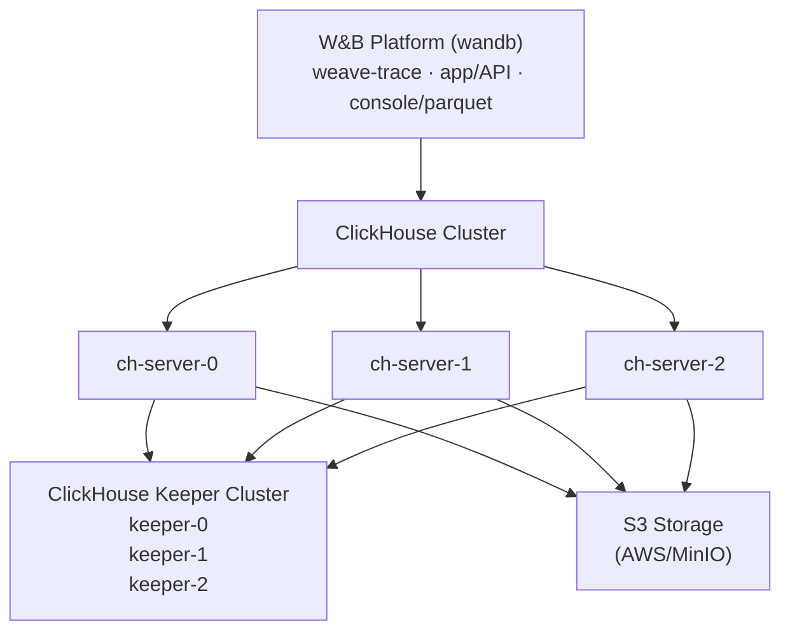

W&amp;B Weave를 자체 호스팅하면 환경과 설정을 더 세밀하게 제어할 수 있습니다. 이를 통해 더 격리된 환경을 구축하고 추가적인 보안 규정 준수 요구사항도 충족할 수 있습니다. 이 문서에서는 Altinity ClickHouse Operator를 사용해 자체 관리형 환경에서 W&amp;B Weave를 실행하는 데 필요한 모든 컴포넌트를 배포하는 방법을 안내합니다.

자체 관리형 Weave 배포는 백엔드 관리를 위해 [ClickHouseDB](https://clickhouse.com/)를 사용합니다. 이 배포에서는 다음을 사용합니다.

* **Altinity ClickHouse Operator**: Kubernetes용 엔터프라이즈급 ClickHouse 관리
* **ClickHouse Keeper**: 분산 코디네이션 서비스(ZooKeeper 대체)
* **ClickHouse Cluster**: 트레이스 저장을 위한 고가용성 데이터베이스 클러스터
* **S3-Compatible Storage**: ClickHouse 데이터 영속성을 위한 객체 저장소

<Tip>
  자세한 레퍼런스 아키텍처는 [W&amp;B Self-Managed Reference Architecture](https://docs.wandb.ai/guides/hosting/self-managed/ref-arch/#models-and-weave)를 참조하세요.
</Tip>

<div id="important-setup-notes">
  ## 중요한 설정 참고 사항
</div>

이 가이드의 설정 예시는 레퍼런스용일 뿐입니다. 각 조직의 Kubernetes 환경은 서로 다르므로 self-hosted 인스턴스에서는 다음 항목을 조정해야 할 가능성이 높습니다.

* **보안 및 규정 준수**: 조직의 보안 정책과 Kubernetes/OpenShift 요구 사항에 맞게 보안 컨텍스트, `runAsUser`/`fsGroup` 값 및 기타 보안 설정을 조정합니다.
* **리소스 크기 산정**: 여기에 표시된 리소스 할당은 시작점일 뿐입니다. 예상 트레이스 볼륨과 성능 요구 사항에 맞는 적절한 크기 산정을 위해 **W&amp;B Solutions Architect 팀에 문의하세요**.
* **인프라별 세부 사항**: 저장소 클래스, 노드 셀렉터 및 기타 인프라별 설정을 환경에 맞게 업데이트합니다.

이 가이드의 설정은 정해진 해법이 아니라 템플릿으로 취급해야 합니다.

<div id="architecture">
  ## 아키텍처
</div>


```mermaid
graph TD
    A["W&B Platform (wandb)<br/>weave-trace · app/API · console/parquet"] --> B["ClickHouse Cluster"]
    B --> C["ch-server-0"]
    B --> D["ch-server-1"]
    B --> E["ch-server-2"]
    C --> F["ClickHouse Keeper Cluster<br/>keeper-0 <br/>keeper-1 <br/>keeper-2"]
    D --> F
    E --> F
    C --> G["S3 Storage<br/>(AWS/MinIO)"]
    D --> G
    E --> G
```


<div id="prerequisites">
  ## 사전 요구 사항
</div>

자체 관리형 Weave 인스턴스에는 다음 리소스가 필요합니다:

* **Kubernetes Cluster**: 버전 1.29+
* **Kubernetes Nodes**: 멀티노드 클러스터(고가용성을 위해 최소 3개 노드 권장)
* **Storage Class**: 영구 볼륨용으로 정상 작동하는 StorageClass(예: `gp3`, `standard`, `nfs-csi`)
* **S3 Bucket**: 적절한 액세스 권한이 설정된, 미리 구성된 S3 또는 S3 호환 버킷
* **W&amp;B Platform**: 이미 설치되어 실행 중이어야 함([W&amp;B 자체 관리형 Deployment Guide](https://docs.wandb.ai/guides/hosting/hosting-options/self-managed/) 참조)
* **W&amp;B License**: W&amp;B 지원팀에서 제공하는 Weave 활성화 라이선스

<Warning>
  이 사전 요구 사항 목록만을 기준으로 크기 산정을 결정하지 마세요. 필요한 리소스는 트레이스 볼륨과 사용 패턴에 따라 크게 달라집니다. 구체적인 클러스터 크기 산정 지침은 자세한 [Resource Requirements](#resource-requirements) 섹션을 참조하세요.
</Warning>

<div id="required-tools">
  ### 필수 도구
</div>

인스턴스를 설정하려면 다음 도구가 필요합니다:

* 클러스터에 접근할 수 있도록 구성된 `kubectl`
* `helm` v3.0+
* AWS 자격 증명(S3를 사용하는 경우) 또는 S3 호환 저장소에 대한 접근 권한

<div id="network-requirements">
  ### 네트워크 요구 사항
</div>

Kubernetes 클러스터에는 다음과 같은 네트워크 설정이 필요합니다:

* `clickhouse` 네임스페이스의 파드는 `wandb` 네임스페이스의 파드와 통신할 수 있어야 합니다
* ClickHouse 노드는 포트 8123, 9000, 9009, 2181을 통해 서로 통신할 수 있어야 합니다

<div id="deploy-your-self-managed-weave-instance">
  ## 자체 관리형 Weave 인스턴스 배포하기
</div>

<div id="step-1-deploy-altinity-clickhouse-operator">
  ### Step 1: Altinity ClickHouse Operator 배포
</div>

Altinity ClickHouse Operator는 Kubernetes에서 ClickHouse 설치를 관리하는 역할을 합니다.

<div id="11-add-the-altinity-helm-repository">
  #### 1.1 Altinity Helm 저장소 추가하기
</div>

```bash
helm repo add altinity https://helm.altinity.com
helm repo update
```


<div id="12-create-the-operator-configuration">
  #### 1.2 Operator 설정 생성
</div>

`ch-operator.yaml`이라는 이름의 파일을 생성합니다:

여기에 표시된 `containerSecurityContext` 값은 대부분의 Kubernetes 배포판에서 잘 동작합니다. **OpenShift**의 경우 프로젝트에 할당된 UID 범위에 맞게 `runAsUser`와 `fsGroup`을 조정해야 할 수 있습니다.

<div id="13-install-the-operator">
  #### 1.3 Operator 설치하기
</div>

```bash
helm upgrade --install ch-operator altinity/altinity-clickhouse-operator \
  --namespace clickhouse \
  --create-namespace \
  -f ch-operator.yaml
```


<div id="14-verify-the-operator-installation">
  #### 1.4 Operator 설치 확인
</div>

<div id="step-2-prepare-s3-storage">
  ### Step 2: S3 저장소 준비
</div>

ClickHouse는 데이터를 영구 저장하려면 S3 또는 S3 호환 저장소가 필요합니다.

<div id="21-create-an-s3-bucket">
  #### 2.1 S3 버킷 생성
</div>

AWS 계정 또는 S3 호환 저장소 제공업체에 S3 버킷을 생성합니다:

<div id="22-configure-s3-credentials">
  #### 2.2 S3 자격 증명 설정
</div>

S3 액세스 자격 증명을 제공하는 방법은 두 가지가 있습니다:

<div id="option-a-using-aws-iam-roles-irsa-recommended-for-aws">
  ##### 옵션 A: AWS IAM 역할 사용(IRSA - AWS 환경에서 권장)
</div>

Kubernetes 노드에 S3에 액세스할 수 있는 IAM 역할이 있으면 ClickHouse는 EC2 인스턴스 메타데이터를 사용할 수 있습니다:

**필수 IAM 정책** (노드 IAM 역할에 연결):

```json
{
  "Version": "2012-10-17",
  "Statement": [
    {
      "Effect": "Allow",
      "Action": ["s3:GetObject", "s3:PutObject", "s3:DeleteObject", "s3:ListBucket"],
      "Resource": ["arn:aws:s3:::my-wandb-clickhouse-bucket", "arn:aws:s3:::my-wandb-clickhouse-bucket/*"]
    }
  ]
}
```

<div id="option-b-using-access-keys">
  ##### 옵션 B: 액세스 키 사용
</div>

정적 자격 증명을 사용하려면 Kubernetes 시크릿을 생성합니다:

```bash
kubectl create secret generic aws-creds \
  --namespace clickhouse \
  --from-literal aws_access_key=YOUR_ACCESS_KEY \
  --from-literal aws_secret_key=YOUR_SECRET_KEY
```

그런 다음 ClickHouse에서 해당 시크릿을 사용하도록 설정합니다(아래의 `ch-server.yaml` 설정 참조).


<div id="step-3-deploy-clickhouse-keeper">
  ### Step 3: ClickHouse Keeper 배포
</div>

[ClickHouse Keeper](https://clickhouse.com/docs/guides/sre/keeper/clickhouse-keeper)는 데이터 복제와 분산 DDL 쿼리 실행을 위한 코디네이션 시스템을 제공합니다.

<div id="31-create-the-keeper-configuration">
  #### 3.1 Keeper 설정 만들기
</div>

`ch-keeper.yaml` 파일을 만듭니다:

**중요한 설정 업데이트**:

* **StorageClass**: 클러스터에서 사용 가능한 StorageClass에 맞게 `storageClassName: gp3`를 업데이트하세요
* **Security Context**: 조직의 보안 정책을 준수하도록 `runAsUser`, `fsGroup` 값을 조정하세요
* **안티 어피니티**: 클러스터 토폴로지와 HA 요구 사항에 따라 `affinity` 섹션을 사용자 지정하거나 제거하세요
* **Resources**: CPU/메모리 값은 예시일 뿐입니다 - 적절한 크기 산정을 위해 W&amp;B Solutions Architects와 상의하세요
* **Naming**: `metadata.name` 또는 `configuration.clusters[0].name`을 변경하는 경우, 이에 맞게 ch-server.yaml의 Keeper 호스트명(Step 4)을 **반드시 업데이트해야 합니다**

<div id="32-deploy-clickhouse-keeper">
  #### 3.2 ClickHouse Keeper 배포
</div>

```bash
kubectl apply -f ch-keeper.yaml
```


<div id="33-verify-keeper-deployment">
  #### 3.3 Keeper 배포 확인
</div>

<div id="step-4-deploy-clickhouse-cluster">
  ### Step 4: ClickHouse 클러스터 배포
</div>

이제 Weave 트레이스 데이터를 저장할 ClickHouse 서버 클러스터를 배포하세요.

<div id="41-create-the-clickhouse-server-configuration">
  #### 4.1 ClickHouse 서버 설정 생성
</div>

`ch-server.yaml`이라는 이름의 파일을 만드세요:

**필수 설정 업데이트**:

1. **StorageClass**: `storageClassName: gp3`를 클러스터의 StorageClass에 맞게 업데이트하세요
2. **S3 Endpoint**: `YOUR-BUCKET-NAME` 및 `YOUR-REGION`을 실제 값으로 바꾸세요
3. **Cache Size**: `<max_size>40Gi</max_size>`는 영구 볼륨 크기(50Gi)보다 반드시 **작아야 합니다**
4. **보안 컨텍스트**: `runAsUser`, `fsGroup` 및 기타 보안 설정을 조직 정책에 맞게 조정하세요
5. **Resource Allocation**: CPU/메모리 값은 예시일 뿐이므로, 예상 트레이스 볼륨에 맞는 적절한 크기 산정을 위해 **W&amp;B Solutions Architect와 상의하세요**
6. **안티 어피니티 Rules**: 클러스터 토폴로지와 고가용성 요구 사항에 따라 사용자 지정하거나 제거하세요
7. **Keeper Hostnames**: Keeper 노드 호스트명은 Step 3의 Keeper deployment 이름과 **반드시 일치해야 합니다**(&quot;Keeper Naming 이해하기&quot; 아래 참조)
8. **Cluster Naming**: 클러스터 이름 `weavecluster`는 변경할 수 있지만, Step 5의 `WF_CLICKHOUSE_REPLICATED_CLUSTER` 값과 일치해야 합니다
9. **자격 증명**:
   * IRSA의 경우: `<use_environment_credentials>true</use_environment_credentials>`를 유지하거나 환경 변수에 매핑된 시크릿 키를 사용하세요.

<div id="42-update-s3-configuration">
  #### 4.2 S3 설정 업데이트
</div>

`ch-server.yaml`에서 `storage_configuration.xml` 섹션을 수정합니다:

**AWS S3 예시**:

```xml
<endpoint>https://my-wandb-clickhouse.s3.eu-central-1.amazonaws.com/s3_disk/{replica}</endpoint>
<region>eu-central-1</region>
```

**MinIO 예시**:

```xml
<endpoint>https://minio.example.com:9000/my-bucket/s3_disk/{replica}</endpoint>
<region>us-east-1</region>
```

<Warning>
  **`{replica}`를 제거하지 마세요.** 이렇게 해야 각 ClickHouse 복제본이 버킷의 자체 폴더에 기록합니다.
</Warning>


<div id="43-configure-credentials-option-b-only">
  #### 4.3 자격 증명 구성(옵션 B만 해당)
</div>

step 2의 **옵션 B(Access Keys)**를 사용하는 경우, `ch-server.yaml`의 `env` 섹션이 시크릿을 참조하는지 확인하세요:

```yaml
env:
  - name: AWS_ACCESS_KEY_ID
    valueFrom:
      secretKeyRef:
        name: aws-creds
        key: aws_access_key
  - name: AWS_SECRET_ACCESS_KEY
    valueFrom:
      secretKeyRef:
        name: aws-creds
        key: aws_secret_key
```

**Option A (IRSA)**를 사용하는 경우 `env` 섹션 전체를 제거하세요.


<div id="44-understanding-keeper-naming">
  #### 4.4 Keeper 이름 규칙 이해하기
</div>

`zookeeper.nodes` 섹션의 Keeper 노드 호스트 이름은 Step 3에서 배포한 Keeper를 기준으로 특정 패턴을 따릅니다.

**호스트 이름 패턴**: `chk-{installation-name}-{cluster-name}-{cluster-index}-{replica-index}.{namespace}.svc.cluster.local`

각 항목의 의미는 다음과 같습니다:

* `chk` = ClickHouseKeeperInstallation 접두사 (고정)
* `{installation-name}` = ch-keeper.yaml의 `metadata.name` (예: `wandb`)
* `{cluster-name}` = ch-keeper.yaml의 `configuration.clusters[0].name` (예: `keeper`)
* `{cluster-index}` = 클러스터 인덱스, 단일 클러스터인 경우 일반적으로 `0`
* `{replica-index}` = 복제본 번호: 복제본이 3개이면 `0`, `1`, `2`
* `{namespace}` = Kubernetes 네임스페이스 (예: `clickhouse`)

**기본 이름 예시**:

```
chk-wandb-keeper-0-0.clickhouse.svc.cluster.local
chk-wandb-keeper-0-1.clickhouse.svc.cluster.local
chk-wandb-keeper-0-2.clickhouse.svc.cluster.local
```

**Keeper 설치 이름을 사용자 지정한 경우**(예: `metadata.name: myweave`):

```
chk-myweave-keeper-0-0.clickhouse.svc.cluster.local
chk-myweave-keeper-0-1.clickhouse.svc.cluster.local
chk-myweave-keeper-0-2.clickhouse.svc.cluster.local
```

**Keeper 클러스터 이름을 사용자 지정했다면**(예: `clusters[0].name: coordination`):

```
chk-wandb-coordination-0-0.clickhouse.svc.cluster.local
chk-wandb-coordination-0-1.clickhouse.svc.cluster.local
chk-wandb-coordination-0-2.clickhouse.svc.cluster.local
```

**실제 Keeper 호스트명을 확인하려면**:

<Note>
  `ch-server.yaml`의 Keeper 호스트 이름은 Keeper 배포에서 실제로 생성된 서비스 이름과 **정확히 일치해야** 하며, 그렇지 않으면 ClickHouse 서버가 조정 서비스에 연결하지 못합니다.
</Note>

<div id="45-deploy-clickhouse-cluster">
  #### 4.5 ClickHouse 클러스터 배포
</div>

```bash
kubectl apply -f ch-server.yaml
```


<div id="46-verify-clickhouse-deployment">
  #### 4.6 ClickHouse 배포 확인
</div>

<div id="step-5-enable-weave-in-wb-platform">
  ### Step 5: W&amp;B Platform에서 Weave 활성화
</div>

이제 Weave 트레이스에 ClickHouse 클러스터를 사용하도록 W&amp;B Platform을 설정합니다.

<div id="51-gather-clickhouse-connection-information">
  #### 5.1 ClickHouse 연결 정보 확인
</div>

다음 정보가 필요합니다:

* **호스트**: `clickhouse-wandb.clickhouse.svc.cluster.local`
* **포트**: `8123`
* **사용자**: `weave` (ch-server.yaml에 설정된 값)
* **비밀번호**: `weave123` (ch-server.yaml에 설정된 값)
* **데이터베이스**: `weave` (자동으로 생성됨)
* **클러스터 이름**: `weavecluster` (ch-server.yaml에 설정된 값)

호스트 이름은 다음 패턴을 따릅니다: `clickhouse-{installation-name}.{namespace}.svc.cluster.local`

<div id="52-update-wb-custom-resource">
  #### 5.2 W&amp;B Custom Resource 업데이트
</div>

Weave 설정을 추가하려면 W&amp;B Platform Custom Resource(CR)을 편집합니다:

**중요 설정**:

* `clickhouse.replicated: true` - 레플리카 3개를 사용할 때 **필수**
* `WF_CLICKHOUSE_REPLICATED: "true"` - 복제 구성을 사용할 때 **필수**
* `WF_CLICKHOUSE_REPLICATED_CLUSTER: "weavecluster"` - ch-server.yaml의 클러스터 이름과 **반드시 일치해야 함**

<Note>
  위에 표시된 보안 컨텍스트, 리소스 할당 및 기타 Kubernetes 관련 설정은 참고용 예시입니다. 조직의 요구 사항에 맞게 사용자 지정하고, 적절한 리소스 규모 산정을 위해 W&amp;B Solutions Architect 팀과 상의하세요.
</Note>

<div id="53-apply-the-updated-configuration">
  #### 5.3 업데이트된 설정 적용하기
</div>

```bash
kubectl apply -f wandb-cr.yaml
```


<div id="54-verify-weave-trace-deployment">
  #### 5.4 Weave Trace 배포 확인
</div>

<div id="step-6-initialize-weave-database">
  ### Step 6: Weave 데이터베이스 초기화
</div>

weave-trace 서비스는 처음 시작될 때 필요한 데이터베이스 스키마를 자동으로 생성합니다.

<div id="61-monitor-database-migration">
  #### 6.1 데이터베이스 마이그레이션 모니터링
</div>

<div id="62-verify-database-creation">
  #### 6.2 데이터베이스가 생성되었는지 확인
</div>

<div id="step-7-verify-weave-is-enabled">
  ### Step 7: Weave 활성화 여부 확인
</div>

<div id="71-access-wb-console">
  #### 7.1 W&amp;B Console에 접속
</div>

웹 브라우저에서 W&amp;B 인스턴스 URL로 이동합니다.

<div id="72-check-weave-license-status">
  #### 7.2 Weave 라이선스 상태 확인
</div>

W&amp;B Console에서 다음을 수행합니다:

1. **Top Right Menu** → **Organization Dashboard**로 이동합니다.
2. **Weave access**가 활성화되었는지 확인합니다.

<div id="73-test-weave-functionality">
  #### 7.3 Weave 기능 테스트
</div>

Weave가 제대로 작동하는지 확인하려면 단순한 Python 테스트를 만드세요:

이 작업을 실행한 후, 조직의 트레이스 페이지에서 W&amp;B UI의 트레이스를 확인하세요.

<div id="troubleshooting">
  ## 문제 해결
</div>

<div id="clickhouse-keeper-issues">
  ### ClickHouse Keeper 문제
</div>

**문제**: Keeper 파드가 `Pending` 상태에서 멈춰 있음

**해결 방법**: 가능한 여러 원인을 확인하세요:

1. **PVC 및 StorageClass 문제**:

```bash
kubectl get pvc -n clickhouse
kubectl describe pvc -n clickhouse
```

StorageClass가 올바르게 설정되어 있고 사용 가능한 용량이 충분한지 확인하세요.

2. **안티 어피니티 및 노드 가용성**:

일반적인 문제:

* 안티 어피니티를 사용하려면 서로 다른 3개의 노드가 필요하지만, 클러스터의 노드 수가 그보다 적습니다
* 노드에 파드의 요청을 충족할 만큼 충분한 CPU/메모리가 없습니다
* 노드 테인트 때문에 파드 스케줄링이 되지 않습니다

**해결 방법**:

* 노드가 3개 미만이면 안티 어피니티 규칙을 제거하거나 조정합니다
* 안티 어피니티를 더 완화하려면 `requiredDuringSchedulingIgnoredDuringExecution` 대신 `preferredDuringSchedulingIgnoredDuringExecution`를 사용합니다
* 노드 리소스가 부족하면 리소스 요청을 줄입니다
* 클러스터에 노드를 더 추가합니다

***

**문제**: Keeper 파드가 `CrashLoopBackOff` 상태입니다

**해결 방법**: 로그를 확인하고 설정을 확인합니다:

```bash
kubectl logs -n clickhouse <keeper-pod-name>
```

일반적인 문제:

* 잘못된 보안 컨텍스트(`runAsUser`, `fsGroup` 확인)
* 볼륨 권한 문제
* 포트 충돌
* `ch-keeper.yaml`의 설정 오류

<div id="clickhouse-server-issues">
  ### ClickHouse Server 문제
</div>

**문제**: ClickHouse가 S3에 연결할 수 없습니다

**해결 방법**: S3 자격 증명과 권한을 확인하세요:

***

**문제**: ClickHouse가 Keeper에 연결할 수 없습니다

**해결 방법**: Keeper 엔드포인트와 이름 설정을 확인합니다:

연결에 실패하면 ch-server.yaml의 Keeper 호스트명이 실제 Keeper 배포 환경과 일치하지 않을 가능성이 높습니다. 이름 지정 패턴은 Step 4의 &quot;Keeper 이름 지정 이해하기&quot;를 참조하세요.

<div id="weave-trace-issues">
  ### Weave Trace 문제
</div>

**문제**: `weave-trace` 파드가 시작되지 않음

**해결 방법**: ClickHouse 연결 상태를 확인하세요:

***

**문제**: Console에서 Weave가 활성화된 것으로 표시되지 않음

**해결 방법**: 설정을 확인합니다.

1. 라이선스에 Weave가 포함되어 있는지 확인합니다.

   ```bash
   kubectl get secret license-key -n wandb -o jsonpath='{.data.value}' | base64 -d | jq
   ```

2. wandb-cr.yaml에서 `weave-trace.enabled: true` 및 `clickhouse.replicated: true`가 설정되어 있는지 확인합니다.

3. W&amp;B Operator 로그를 확인합니다.
   ```bash
   kubectl logs -n wandb deployment/wandb-controller-manager
   ```

***

**문제**: 데이터베이스 마이그레이션 실패

**해결 방법**: 클러스터 이름이 일치하는지 확인합니다.

`WF_CLICKHOUSE_REPLICATED_CLUSTER` 환경 변수는 ch-server.yaml의 클러스터 이름과 **반드시 일치해야 합니다**:

<div id="resource-requirements">
  ## 리소스 요구 사항
</div>

<Warning>
  아래 리소스 할당은 **예시용 시작점일 뿐입니다**. 실제 요구 사항은 다음 요소에 따라 크게 달라집니다.

  * 트레이스 수집량(초당 트레이스 수)
  * 쿼리 패턴 및 동시성
  * 데이터 보존 기간
  * 동시 사용자 수

  특정 사용 사례에 맞는 적절한 규모를 확인하려면 **반드시 W&amp;B Solutions Architect 팀과 상의하세요**. 리소스를 부족하게 프로비저닝하면 성능 문제가 발생할 수 있고, 과도하게 프로비저닝하면 인프라 비용만 낭비됩니다.
</Warning>

<div id="minimum-production-setup">
  ### 최소 프로덕션 설정
</div>

| 구성 요소             | 레플리카 수   | CPU 요청 / 제한       | 메모리 요청 / 제한       | 저장소       |
| ----------------- | -------- | ----------------- | ----------------- | --------- |
| ClickHouse Keeper | 3        | 0.5 / 1           | 256Mi / 2Gi       | 각 10Gi    |
| ClickHouse Server | 3        | 1 / 4             | 1Gi / 16Gi        | 각 50Gi    |
| Weave Trace        | 1        | 1 / 4             | 4Gi / 8Gi         | -         |
| **총계**            | **7 파드** | **~4.5 / 15 CPU** | **~7.8Gi / 58Gi** | **180Gi** |

*적합한 환경: 개발, 테스트 또는 트래픽이 적은 프로덕션 환경*

<div id="recommended-production-setup">
  ### 권장 프로덕션 설정
</div>

트레이스 양이 많은 프로덕션 워크로드의 경우:

| Component         | Replicas   | CPU Request / Limit  | Memory Request / Limit   | Storage   |
| ----------------- | ---------- | -------------------- | ------------------------ | --------- |
| ClickHouse Keeper | 3          | 1 / 2                | 1Gi / 4Gi                | 각 20Gi    |
| ClickHouse Server | 3          | 1 / 16               | 8Gi / 64Gi               | 각 200Gi   |
| Weave Trace       | 2-3        | 1 / 4                | 4Gi / 8Gi                | -         |
| **합계**            | **8-9 파드** | **~6-9 / 52-64 CPU** | **~27-33Gi / 204-216Gi** | **660Gi** |

*적합한 환경: 대규모 프로덕션 환경*

초대규모 배포의 경우, 특정 트레이스 양과 성능 요구 사항을 기반으로 한 맞춤형 크기 권장 사항을 받으려면 W&amp;B Solutions Architect 팀에 문의하세요.

<div id="advanced-configuration">
  ## 고급 설정
</div>

이 섹션에서는 Self-Managed Weave 배포를 위한 맞춤 설정 옵션을 다룹니다. 여기에는 수직 확장 또는 수평 확장을 통해 ClickHouse 용량을 확장하는 방법, keeper와 server 설정 모두에서 이미지 태그를 수정해 ClickHouse 버전을 업데이트하는 방법, 그리고 ClickHouse 상태를 모니터링하는 방법이 포함됩니다.

인스턴스에 고급 변경을 적용할 때는 성능 및 안정성 요구 사항에 맞도록 W&amp;B Solutions Architect 팀과 상담할 것을 권장합니다.

<div id="scaling-clickhouse">
  ### ClickHouse 스케일링
</div>

ClickHouse 용량을 늘리려면 다음과 같은 방법을 사용할 수 있습니다.

1. **수직 스케일링**: 파드당 리소스를 늘립니다(더 간단한 방법)

   ```yaml
   resources:
     requests:
       memory: 8Gi
       cpu: 1
     limits:
       memory: 64Gi
       cpu: 16
   ```

   **권장 사항**: 실제 리소스 사용량을 모니터링하고 그에 맞춰 스케일링하세요. 매우 높은 볼륨의 배포에서는 W&amp;B Solutions Architect 팀에 문의하세요.

2. **수평 스케일링**: 레플리카를 추가합니다(신중한 계획이 필요함)
   * 레플리카를 늘리려면 데이터를 재분산해야 합니다
   * 샤드 관리에 대해서는 ClickHouse 문서를 참조하세요
   * 프로덕션에서 수평 스케일링을 구현하기 전에 **W&amp;B Solutions Architect에 문의하세요**

<div id="using-different-clickhouse-versions">
  ### 다른 ClickHouse 버전 사용하기
</div>

다른 ClickHouse 버전을 사용하려면 ch-keeper.yaml과 ch-server.yaml의 이미지 태그를 모두 업데이트하세요:

호환성을 위해 Keeper와 서버 버전은 동일해야 하거나, Keeper 버전이 서버 버전보다 크거나 같아야 합니다.

<div id="monitoring-clickhouse">
  ### ClickHouse 모니터링
</div>

모니터링을 위해 ClickHouse 시스템 테이블에 액세스하세요:

<div id="backup-and-recovery">
  ### 백업 및 복구
</div>

ClickHouse 데이터는 S3에 저장되며, S3 버전 관리와 버킷 복제 특성 덕분에 기본적인 백업 기능이 제공됩니다. 배포 환경에 맞는 백업 전략은 W&amp;B Solutions Architect 팀에 문의하고 [ClickHouse backup documentation](https://clickhouse.com/docs/en/operations/backup)을 참고하세요.

<div id="security-considerations">
  ## 보안 고려사항
</div>

1. **자격 증명**: ClickHouse 비밀번호는 일반 텍스트가 아닌 Kubernetes 시크릿에 저장하세요
2. **네트워크 정책**: ClickHouse에 대한 접근을 제한할 수 있도록 NetworkPolicies 구현을 고려하세요
3. **RBAC**: 서비스 계정에는 필요한 최소 권한만 부여되었는지 확인하세요
4. **S3 버킷**: 저장 데이터 암호화를 활성화하고 버킷 접근은 필요한 IAM 역할로만 제한하세요
5. **TLS** (선택): 프로덕션 환경에서는 ClickHouse 클라이언트 연결에 TLS를 활성화하세요

<div id="upgrading">
  ## 업그레이드하기
</div>

<div id="upgrading-clickhouse-operator">
  ### ClickHouse Operator 업그레이드
</div>

```bash
helm upgrade ch-operator altinity/altinity-clickhouse-operator \
  --namespace clickhouse \
  -f ch-operator.yaml
```


<div id="upgrading-clickhouse-server">
  ### ClickHouse Server 업그레이드
</div>

`ch-server.yaml`에서 이미지 버전을 업데이트한 다음 적용하세요:

<div id="upgrading-weave-trace">
  ### Weave Trace 업그레이드
</div>

`wandb-cr.yaml`의 이미지 태그를 업데이트한 후 적용하세요:

<div id="additional-resources">
  ## 추가 자료
</div>

* [Altinity ClickHouse Operator 문서](https://docs.altinity.com/altinitykubernetesoperator/)
* [ClickHouse 문서](https://clickhouse.com/docs)
* [W&amp;B Weave 문서](https://docs.wandb.ai/weave)
* [ClickHouse S3 저장소 설정](https://clickhouse.com/docs/en/engines/table-engines/mergetree-family/mergetree#s3-virtual-hosted-style)

<div id="support">
  ## 지원팀
</div>

프로덕션 배포 또는 문제 발생 시:

* **W&amp;B 지원팀**: `support@wandb.com`
* **Solutions Architects**: 초대규모 배포, 맞춤형 sizing, 배포 계획이 필요한 경우
* **지원 요청 시 포함할 내용**:
  * weave-trace, ClickHouse 파드, Operator의 로그
  * W&amp;B 버전, ClickHouse 버전, Kubernetes 버전
  * 클러스터 정보 및 트레이스 볼륨

<div id="faq">
  ## FAQ
</div>

**Q: ClickHouse 레플리카를 3개 대신 1개만 사용해도 되나요?**

A: 예. 하지만 프로덕션 환경에는 권장되지 않습니다. ch-server.yaml에서 `replicasCount: 1`로 업데이트하고, wandb-cr.yaml에서 `clickhouse.replicated: false`로 설정하세요.

**Q: ClickHouse 대신 다른 데이터베이스를 사용할 수 있나요?**

A: 아니요. Weave Trace는 고성능 컬럼형 저장 기능을 위해 ClickHouse가 필요합니다.

**Q: S3 저장소는 얼마나 필요하나요?**

A: 필요한 S3 저장소 용량은 트레이스 볼륨, 보존 기간, 데이터 압축에 따라 달라집니다. deployment 후 실제 사용량을 모니터링하고 그에 맞게 조정하세요. ClickHouse의 컬럼형 포맷은 트레이스 데이터에 매우 뛰어난 압축 효율을 제공합니다.

**Q: ClickHouse에서 `database` 이름을 설정해야 하나요?**

A: 아니요. `weave` 데이터베이스는 초기 시작 시 weave-trace 서비스가 자동으로 생성합니다.

**Q: 클러스터 이름이 `weavecluster`가 아니면 어떻게 하나요?**

A: `WF_CLICKHOUSE_REPLICATED_CLUSTER` 환경 변수를 클러스터 이름과 일치하도록 설정해야 합니다. 그렇지 않으면 데이터베이스 마이그레이션이 실패합니다.

**Q: 예시에 나온 보안 컨텍스트를 그대로 사용해야 하나요?**

A: 아니요. 이 가이드에 나온 보안 컨텍스트(runAsUser, fsGroup 등)는 레퍼런스 예시입니다. 조직의 보안 정책을 준수하도록 반드시 조정해야 하며, 특히 OpenShift 클러스터는 특정 UID/GID 범위 requirements가 있으므로 주의해야 합니다.

**Q: ClickHouse 클러스터 크기를 올바르게 산정했는지 어떻게 알 수 있나요?**

A: 예상 트레이스 볼륨과 사용 패턴을 W&amp;B Solutions Architect 팀에 문의하세요. 그러면 구체적인 사이징 권장 사항을 제공합니다. deployment의 리소스 사용량을 모니터링하고 필요에 따라 조정하세요.

**Q: 예제에서 사용된 naming convention을 사용자 지정할 수 있나요?**

A: 예. 하지만 모든 컴포넌트에서 일관성을 유지해야 합니다.

1. **ClickHouse Keeper 이름** → ch-server.yaml의 `zookeeper.nodes` section에 있는 Keeper 노드 호스트 이름과 일치해야 합니다.
2. **ClickHouse 클러스터 이름** (`weavecluster`) → wandb-cr.yaml의 `WF_CLICKHOUSE_REPLICATED_CLUSTER`와 일치해야 합니다.
3. **ClickHouse 설치 이름** → weave-trace에서 사용하는 서비스 호스트 이름에 영향을 줍니다.

이름 지정 패턴과 실제 이름을 확인하는 방법에 대한 자세한 내용은 Step 4의 &quot;Understanding Keeper Naming&quot; section을 참조하세요.

**Q: 클러스터에서 다른 안티 어피니티 requirements를 사용하는 경우에는 어떻게 하나요?**

A: 여기에 나온 안티 어피니티 규칙은 고가용성을 위한 권장 사항입니다. 클러스터 크기, 토폴로지, 가용성 requirements에 따라 조정하거나 제거하세요. 작은 클러스터나 개발 환경에서는 안티 어피니티 규칙이 필요하지 않을 수 있습니다.