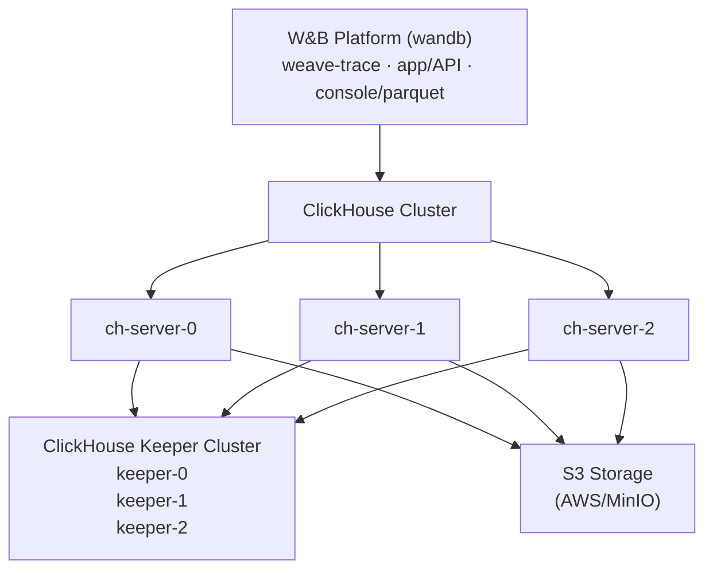

W&amp;B Weave를 자체 호스팅하면 환경과 설정을 더욱 세밀하게 제어할 수 있습니다. 이를 통해 더 격리된 환경을 구축하고 추가적인 보안 규정 준수 요구 사항을 충족하는 데 도움이 됩니다. 이 문서에서는 Altinity ClickHouse Operator를 사용해 [W&amp;B Self-Managed](/ko/platform/hosting/hosting-options/self-managed) 배포에서 W&amp;B Weave를 실행하는 데 필요한 컴포넌트를 배포하는 방법을 안내합니다. 이 가이드를 마치면 복제된 ClickHouse 데이터베이스와 S3 호환 객체 저장소를 기반으로, 자체 Kubernetes 클러스터에서 실행되는 프로덕션급 Weave 인스턴스를 구축하게 됩니다. 이 가이드는 조직에서 W&amp;B를 배포하고 운영할 책임이 있는 Kubernetes 관리자와 플랫폼 엔지니어를 위한 문서입니다.

자체 관리형 Weave 배포는 백엔드 관리를 위해 [ClickHouseDB](https://clickhouse.com/)를 사용합니다. 이 배포에서는 다음을 사용합니다.

* **Altinity ClickHouse Operator**: Kubernetes용 엔터프라이즈급 ClickHouse 관리 도구
* **ClickHouse Keeper**: 분산 조정 서비스(ZooKeeper 대체)
* **ClickHouse 클러스터**: 트레이스 저장소를 위한 고가용성 데이터베이스 클러스터
* **S3 호환 저장소**: ClickHouse 데이터 영속성을 위한 객체 저장소

<Tip>
  자세한 레퍼런스 아키텍처는 [W&amp;B Self-Managed Reference Architecture](https://docs.wandb.ai/guides/hosting/self-managed/ref-arch/#models-and-weave)를 참조하세요.
</Tip>

<div id="important-setup-notes">
  ## 중요한 설정 참고 사항
</div>

이 가이드의 설정 예시는 레퍼런스용일 뿐입니다. 각 조직의 Kubernetes 환경은 서로 다르므로 self-hosted 인스턴스에서는 다음 항목을 조정해야 할 가능성이 높습니다.

* **보안 및 규정 준수**: 조직의 보안 정책과 Kubernetes 또는 OpenShift 요구 사항에 맞게 보안 컨텍스트, `runAsUser` 또는 `fsGroup` 값 및 기타 보안 설정을 조정합니다.
* **리소스 사이징 산정**: 여기에 표시된 리소스 할당은 시작점일 뿐입니다. 예상 트레이스 볼륨과 성능 요구 사항에 맞는 적절한 크기 산정을 위해 **W&amp;B Solutions Architect 팀에 문의하세요**.
* **인프라별 세부 사항**: 저장소 클래스, 노드 셀렉터 및 기타 인프라별 설정을 환경에 맞게 업데이트합니다.

이러한 설정은 정해진 해법이 아니라 템플릿으로 취급해야 합니다.

<div id="architecture">
  ## 아키텍처
</div>

다음 다이어그램은 자체 관리형 Weave 배포 환경에서 W&amp;B Platform, ClickHouse 클러스터, ClickHouse Keeper coordination service, S3 저장소가 어떻게 함께 구성되는지 보여줍니다.


```mermaid
graph TD
    A["W&B Platform (wandb)<br/>weave-trace · app/API · console/parquet"] --> B["ClickHouse Cluster"]
    B --> C["ch-server-0"]
    B --> D["ch-server-1"]
    B --> E["ch-server-2"]
    C --> F["ClickHouse Keeper Cluster<br/>keeper-0 <br/>keeper-1 <br/>keeper-2"]
    D --> F
    E --> F
    C --> G["S3 Storage<br/>(AWS/MinIO)"]
    D --> G
    E --> G
```

<div id="prerequisites">
  ## 사전 요구 사항
</div>

시작하기 전에 환경이 다음 요구 사항을 충족하는지 확인하세요. 자체 관리형 Weave 인스턴스에는 다음 리소스가 필요합니다.

* **Kubernetes cluster**: 버전 1.29 이상
* **Kubernetes nodes**: 다중 노드 클러스터(고가용성을 위해 최소 3개 노드 권장)
* **Storage class**: 영구 볼륨용으로 정상 작동하는 StorageClass(예: `gp3`, `standard`, `nfs-csi`)
* **S3 bucket**: 적절한 액세스 권한이 설정된 사전 구성된 S3 또는 S3 호환 버킷
* **W&amp;B Platform**: 이미 설치되어 실행 중이어야 합니다. [W&amp;B Self-Managed Deployment Guide](https://docs.wandb.ai/guides/hosting/hosting-options/self-managed/)를 참조하세요.
* **W&amp;B license**: W&amp;B Support에서 제공하는 Weave 사용 가능 라이선스

<Warning>
  이 사전 요구 사항 목록만 기준으로 사이징을 결정하지 마세요. 필요한 리소스는 트레이스 볼륨과 사용 패턴에 따라 달라집니다. 자세한 내용은 [리소스 요구 사항](#resource-requirements)을 참조하세요.
</Warning>

<div id="required-tools">
  ### 필수 도구
</div>

인스턴스를 설정하려면 다음 도구가 필요합니다:

* 클러스터에 접근할 수 있도록 구성된 `kubectl`.
* `helm` 버전 3.0 이상.
* AWS 자격 증명(S3를 사용하는 경우) 또는 S3 호환 저장소에 대한 접근 권한.

<div id="network-requirements">
  ### 네트워크 요구 사항
</div>

Kubernetes 클러스터에는 다음과 같은 네트워크 설정이 필요합니다:

* `clickhouse` 네임스페이스의 파드는 `wandb` 네임스페이스의 파드와 통신할 수 있어야 합니다.
* ClickHouse 노드는 포트 `8123`, `9000`, `9009`, `2181`을 통해 서로 통신할 수 있어야 합니다.

<div id="deploy-your-self-managed-weave-instance">
  ## 자체 관리형 Weave 인스턴스 배포
</div>

다음 단계에서는 operator 배포, 저장소 준비, ClickHouse Keeper 및 ClickHouse 클러스터 배포, 그리고 W&amp;B Platform에서 Weave를 활성화하는 방법을 안내합니다. 각 단계는 이전 단계에서 생성한 리소스를 기반으로 하므로 순서대로 완료하세요.

<div id="deploy-the-altinity-clickhouse-operator">
  ### Altinity ClickHouse Operator 배포
</div>

Altinity ClickHouse Operator는 Kubernetes에서 ClickHouse 설치를 관리하는 역할을 합니다. operator를 먼저 설치하면 이후 step에서 operator가 대신 reconcile하는 ClickHouse Keeper 및 ClickHouse 클러스터 리소스를 선언할 수 있습니다.

<div id="add-the-altinity-helm-repository">
  #### Altinity Helm 저장소 추가하기
</div>

```bash
helm repo add altinity https://helm.altinity.com
helm repo update
```

<div id="create-the-operator-configuration">
  #### 오퍼레이터 설정 생성
</div>

`ch-operator.yaml`이라는 이름의 파일을 생성합니다. 이 파일은 오퍼레이터 배포를 위한 보안 컨텍스트와 메타데이터를 정의합니다:

```yaml
operator:
  image:
    repository: altinity/clickhouse-operator

  # Security context - 클러스터 요구 사항에 맞게 조정하세요
  containerSecurityContext:
    runAsGroup: 0
    runAsNonRoot: true
    runAsUser: 10001 # OpenShift/Kubernetes 보안 정책에 맞게 업데이트하세요
    allowPrivilegeEscalation: false
    capabilities:
      drop:
        - ALL
    privileged: false
    readOnlyRootFilesystem: false

metrics:
  enabled: false

# Name override - 필요한 경우 사용자 지정하세요
nameOverride: "wandb"
```

여기에 표시된 `containerSecurityContext` 값은 대부분의 Kubernetes 배포판에서 잘 동작합니다. OpenShift의 경우 프로젝트에 할당된 UID 범위에 맞게 `runAsUser`와 `fsGroup`을 조정해야 할 수 있습니다.

<div id="install-the-operator">
  #### Operator 설치하기
</div>

```bash
helm upgrade --install ch-operator altinity/altinity-clickhouse-operator \
  --namespace clickhouse \
  --create-namespace \
  -f ch-operator.yaml
```

<div id="verify-the-operator-installation">
  #### 오퍼레이터 설치 확인하기
</div>

```bash
# operator 파드가 실행 중인지 확인
kubectl get pods -n clickhouse

# 예상 출력:
# NAME                                 READY   STATUS    RESTARTS   AGE
# ch-operator-wandb-xxxxx              1/1     Running   0          30s

# operator 이미지 버전 확인
kubectl get pods -n clickhouse -o jsonpath="{.items[*].spec.containers[*].image}" | \
  tr ' ' '\n' | grep -v 'metrics-exporter' | sort -u

# 예상 출력:
# altinity/clickhouse-operator:0.25.4
```

오퍼레이터가 실행 중이므로 이제 ClickHouse 클러스터가 의존하는 영구 저장소와 코디네이션 서비스를 프로비저닝할 수 있습니다.

<div id="prepare-s3-storage">
  ### S3 저장소 준비
</div>

ClickHouse는 데이터를 영구 저장하려면 S3 또는 S3 호환 저장소가 필요합니다. 이 단계에서는 버킷을 생성하고 ClickHouse의 인증 방식을 설정합니다.

<div id="create-an-s3-bucket">
  #### S3 버킷 생성
</div>

AWS 계정 또는 S3 호환 저장소 제공업체에 S3 버킷을 생성합니다. `[BUCKET-NAME]`은 버킷 이름으로, `[REGION]`은 AWS 리전으로 바꾸세요:

```bash
# AWS 예시
aws s3 mb s3://[BUCKET-NAME] --region [REGION]
```

<div id="configure-s3-credentials">
  #### S3 자격 증명 설정
</div>

ClickHouse가 버킷에서 읽고 쓰려면 자격 증명이 필요합니다. S3 액세스 자격 증명을 제공하는 방법은 두 가지가 있습니다. W&amp;B는 클러스터에 장기 시크릿을 저장하지 않아도 되므로 AWS에서는 옵션 A(IRSA)를 권장합니다.

<div id="option-a-use-aws-iam-roles-irsa-recommended-for-aws">
  ##### 옵션 A: AWS IAM 역할 사용(IRSA, AWS 환경에서 권장)
</div>

Kubernetes 노드에 S3에 액세스할 수 있는 IAM 역할이 있으면 ClickHouse는 EC2 인스턴스 메타데이터를 사용할 수 있습니다:

```yaml
# ch-server.yaml에서 다음을 설정하세요:
<use_environment_credentials>true</use_environment_credentials>
```

필수 IAM 정책 (노드 IAM 역할에 연결):

```json
{
  "Version": "2012-10-17",
  "Statement": [
    {
      "Effect": "Allow",
      "Action": [
        "s3:GetObject",
        "s3:PutObject",
        "s3:DeleteObject",
        "s3:ListBucket"
      ],
      "Resource": [
        "arn:aws:s3:::[BUCKET-NAME]",
        "arn:aws:s3:::[BUCKET-NAME]/*"
      ]
    }
  ]
}
```

<div id="option-b-use-access-keys">
  ##### 옵션 B: 액세스 키 사용
</div>

정적 자격 증명을 사용하려면 Kubernetes 시크릿을 생성합니다:

`[ACCESS-KEY]`는 AWS 액세스 키로, `[SECRET-KEY]`는 AWS 시크릿 키로 바꾸세요:

```bash
kubectl create secret generic aws-creds \
  --namespace clickhouse \
  --from-literal aws_access_key=[ACCESS-KEY] \
  --from-literal aws_secret_key=[SECRET-KEY]
```

그런 다음 ClickHouse에서 해당 시크릿을 사용하도록 설정합니다(4단계의 ch-server.yaml 설정 참조).

<div id="deploy-clickhouse-keeper">
  ### ClickHouse Keeper 배포
</div>

[ClickHouse Keeper](https://clickhouse.com/docs/guides/sre/keeper/clickhouse-keeper)는 데이터 복제와 분산 DDL 쿼리 실행을 위한 코디네이션 시스템을 제공합니다. Step 4의 ClickHouse 서버가 시작 시 Keeper에 연결하므로, ClickHouse 클러스터보다 먼저 Keeper를 배포해야 합니다.

<div id="create-the-keeper-configuration">
  #### Keeper 설정 만들기
</div>

`ch-keeper.yaml` 파일을 만드세요. 이 매니페스트는 안티 어피니티, 영구 저장소, 그리고 Altinity operator가 Keeper 파드를 프로비저닝할 때 사용하는 설정이 포함된 레플리카 3개의 Keeper 클러스터를 정의합니다:

```yaml
apiVersion: "clickhouse-keeper.altinity.com/v1"
kind: "ClickHouseKeeperInstallation"
metadata:
  name: wandb
  namespace: clickhouse
  annotations: {}
spec:
  defaults:
    templates:
      podTemplate: default
      dataVolumeClaimTemplate: default

  templates:
    podTemplates:
      - name: keeper
        metadata:
          labels:
            app: clickhouse-keeper
        spec:
          # Pod 보안 컨텍스트 - 환경에 맞게 조정하세요
          securityContext:
            fsGroup: 10001 # 클러스터의 보안 요구 사항에 따라 업데이트하세요
            fsGroupChangePolicy: Always
            runAsGroup: 0
            runAsNonRoot: true
            runAsUser: 10001 # OpenShift의 경우, 프로젝트에 할당된 UID 범위를 사용하세요
            seccompProfile:
              type: RuntimeDefault

          # 노드 전반에 keeper를 분산하기 위한 안티 어피니티 (HA에 권장)
          # 클러스터 크기 및 가용성 요구 사항에 따라 사용자 지정하거나 제거하세요
          affinity:
            podAntiAffinity:
              requiredDuringSchedulingIgnoredDuringExecution:
                - labelSelector:
                    matchExpressions:
                      - key: "app"
                        operator: In
                        values:
                          - clickhouse-keeper
                  topologyKey: "kubernetes.io/hostname"

          containers:
            - name: clickhouse-keeper
              imagePullPolicy: IfNotPresent
              image: "clickhouse/clickhouse-keeper:25.10"
              # 리소스 요청 - 예시 값이며, 워크로드에 따라 조정하세요
              resources:
                requests:
                  memory: "256Mi"
                  cpu: "0.5"
                limits:
                  memory: "2Gi"
                  cpu: "1"

              securityContext:
                allowPrivilegeEscalation: false
                capabilities:
                  drop:
                    - ALL
                privileged: false
                readOnlyRootFilesystem: false

    volumeClaimTemplates:
      - name: data
        metadata:
          labels:
            app: clickhouse-keeper
        spec:
          storageClassName: gp3 # 사용 중인 StorageClass로 변경하세요
          accessModes:
            - ReadWriteOnce
          resources:
            requests:
              storage: 10Gi

  configuration:
    clusters:
      - name: keeper # Keeper 클러스터 이름 - 서비스 DNS 명명에 사용됩니다
        layout:
          replicasCount: 3
        templates:
          podTemplate: keeper
          dataVolumeClaimTemplate: data

    settings:
      logger/level: "information"
      logger/console: "true"
      listen_host: "0.0.0.0"
      keeper_server/four_letter_word_white_list: "*"
      keeper_server/coordination_settings/raft_logs_level: "information"
      keeper_server/enable_ipv6: "false"
      keeper_server/coordination_settings/async_replication: "true"
```

중요한 설정 업데이트:

* **StorageClass**: 클러스터에서 사용 가능한 StorageClass에 맞게 `storageClassName: gp3`를 업데이트하세요.
* **보안 컨텍스트**: 조직의 보안 정책을 준수하도록 `runAsUser` 및 `fsGroup` 값을 조정하세요.
* **안티 어피니티**: 클러스터 토폴로지와 HA 요구 사항에 따라 `affinity` 섹션을 사용자 지정하거나 제거하세요.
* **Resources**: CPU 및 메모리 값은 예시입니다. 적절한 사이징을 위해 W&amp;B Solutions Architects와 상의하세요.
* **Naming**: `metadata.name` 또는 `configuration.clusters[0].name`을 변경하는 경우, 이에 맞게 `ch-server.yaml`의 Keeper 호스트명(Step 4)을 업데이트해야 합니다.

<div id="deploy-clickhouse-keeper-resources">
  #### ClickHouse Keeper 리소스 배포
</div>

```bash
kubectl apply -f ch-keeper.yaml
```

<div id="verify-the-keeper-deployment">
  #### Keeper 배포 확인
</div>

```bash
# Keeper 파드 확인
kubectl get pods -n clickhouse -l app=clickhouse-keeper

# 예상 출력:
# NAME                     READY   STATUS    RESTARTS   AGE
# chk-wandb-keeper-0-0-0   1/1     Running   0          2m
# chk-wandb-keeper-0-1-0   1/1     Running   0          2m
# chk-wandb-keeper-0-2-0   1/1     Running   0          2m

# Keeper 서비스 확인
kubectl get svc -n clickhouse | grep keeper

# 포트 2181에서 keeper 서비스가 표시되어야 합니다
```

Keeper가 실행 중이면 이제 이를 조정용으로 사용하는 ClickHouse 클러스터를 배포할 수 있습니다.

<div id="deploy-the-clickhouse-cluster">
  ### ClickHouse 클러스터 배포
</div>

이제 Weave 트레이스 데이터를 저장하는 ClickHouse 서버 클러스터를 배포하세요. 클러스터가 3단계의 Keeper 서비스와 2단계의 S3 버킷에 모두 연결되므로, 이 단계가 이 가이드에서 가장 큰 단계입니다.

<div id="create-the-clickhouse-server-configuration">
  #### ClickHouse 서버 설정 생성
</div>

`ch-server.yaml`이라는 이름의 파일을 만드세요. 이 매니페스트는 ClickHouse 클러스터, Keeper 연결, Weave 사용자 계정, 그리고 트레이스 데이터에 사용되는 S3 저장소 정책을 선언합니다:

```yaml
apiVersion: "clickhouse.altinity.com/v1"
kind: "ClickHouseInstallation"
metadata:
  name: wandb
  namespace: clickhouse
  annotations: {}
spec:
  defaults:
    templates:
      podTemplate: default
      dataVolumeClaimTemplate: default

  templates:
    podTemplates:
      - name: clickhouse
        metadata:
          labels:
            app: clickhouse-server
        spec:
          # Pod security context - customize for your environment
          securityContext:
            fsGroup: 10001 # Adjust based on your security policies
            fsGroupChangePolicy: Always
            runAsGroup: 0
            runAsNonRoot: true
            runAsUser: 10001 # For OpenShift, use assigned UID range
            seccompProfile:
              type: RuntimeDefault

          # Anti-affinity rule - ensures servers run on different nodes (optional but recommended)
          # Adjust or remove based on your cluster size and requirements
          affinity:
            podAntiAffinity:
              requiredDuringSchedulingIgnoredDuringExecution:
                - labelSelector:
                    matchExpressions:
                      - key: "app"
                        operator: In
                        values:
                          - clickhouse-server
                  topologyKey: "kubernetes.io/hostname"

          containers:
            - name: clickhouse
              image: clickhouse/clickhouse-server:25.10
              # Example resource allocation - adjust based on workload
              resources:
                requests:
                  memory: 1Gi
                  cpu: 1
                limits:
                  memory: 16Gi
                  cpu: 4

              # AWS credentials (remove this section if using IRSA)
              env:
                - name: AWS_ACCESS_KEY_ID
                  valueFrom:
                    secretKeyRef:
                      name: aws-creds
                      key: aws_access_key
                - name: AWS_SECRET_ACCESS_KEY
                  valueFrom:
                    secretKeyRef:
                      name: aws-creds
                      key: aws_secret_key

              securityContext:
                allowPrivilegeEscalation: false
                capabilities:
                  drop:
                    - ALL
                privileged: false
                readOnlyRootFilesystem: false

    volumeClaimTemplates:
      - name: data
        metadata:
          labels:
            app: clickhouse-server
        spec:
          accessModes:
            - ReadWriteOnce
          resources:
            requests:
              storage: 50Gi
          storageClassName: gp3 # Change to your StorageClass

  configuration:
    # Keeper (ZooKeeper) configuration
    # IMPORTANT: These hostnames MUST match your Keeper deployment from Step 3
    zookeeper:
      nodes:
        - host: chk-wandb-keeper-0-0.clickhouse.svc.cluster.local
          port: 2181
        - host: chk-wandb-keeper-0-1.clickhouse.svc.cluster.local
          port: 2181
        - host: chk-wandb-keeper-0-2.clickhouse.svc.cluster.local
          port: 2181
      # Optional: Uncomment to adjust timeouts if needed
      # session_timeout_ms: 30000
      # operation_timeout_ms: 10000

    # Users configuration: https://clickhouse.com/docs/operations/configuration-files#user-settings
    # For production, use a SHA-256 hashed password instead of plain text:
    # printf "your-password" | sha256sum
    # Then use: weave/password_sha256_hex: <hash> instead of weave/password
    users:
      weave/password: [WEAVE-PASSWORD]  # 배포 전에 강력한 비밀번호로 교체하세요
      weave/access_management: 1
      weave/profile: default
      weave/networks/ip:
        - "0.0.0.0/0"
        - "::"

    # Server settings
    settings:
      disable_internal_dns_cache: 1

    # Cluster configuration
    clusters:
      - name: weavecluster # Cluster name - can be customized but must match wandb-cr.yaml
        layout:
          shardsCount: 1
          replicasCount: 3 # Number of replicas - adjust based on HA requirements
        templates:
          podTemplate: clickhouse
          dataVolumeClaimTemplate: data

    # Configuration files
    files:
      config.d/network_configuration.xml: |
        <clickhouse>
            <listen_host>0.0.0.0</listen_host>
            <listen_host>::</listen_host>
        </clickhouse>

      config.d/logger.xml: |
        <clickhouse>
            <logger>
                <level>information</level>
            </logger>
        </clickhouse>

      config.d/storage_configuration.xml: |
        <clickhouse>
            <storage_configuration>
                <disks>
                    <s3_disk>
                        <type>s3</type>
                        <!-- S3 버킷 엔드포인트 및 리전으로 업데이트하세요 -->
                        <endpoint>https://[BUCKET-NAME].s3.[REGION].amazonaws.com/s3_disk/{replica}</endpoint>
                        <metadata_path>/var/lib/clickhouse/disks/s3_disk/</metadata_path>
                        <use_environment_credentials>true</use_environment_credentials>
                        <region>[REGION]</region>
                    </s3_disk>
                    <s3_disk_cache>
                        <type>cache</type>
                        <disk>s3_disk</disk>
                        <path>/var/lib/clickhouse/s3_disk_cache/cache/</path>
                        <!-- Cache size MUST be smaller than persistent volume -->
                        <max_size>40Gi</max_size>
                        <cache_on_write_operations>true</cache_on_write_operations>
                    </s3_disk_cache>
                </disks>
                <policies>
                    <s3_main>
                        <volumes>
                            <main>
                                <disk>s3_disk_cache</disk>
                            </main>
                        </volumes>
                    </s3_main>
                </policies>
            </storage_configuration>
            <merge_tree>
                <storage_policy>s3_main</storage_policy>
            </merge_tree>
        </clickhouse>
```

중요한 설정 업데이트가 필요합니다:

1. **StorageClass**: `storageClassName: gp3`를 클러스터의 StorageClass에 맞게 업데이트하세요.
2. **S3 endpoint**: `[BUCKET-NAME]` 및 `[REGION]`을 실제 값으로 바꾸세요.
3. **Cache size**: `<max_size>40Gi</max_size>`는 영구 볼륨 크기(50Gi)보다 작아야 합니다.
4. **Security context**: `runAsUser`, `fsGroup` 및 기타 보안 설정을 조직의 정책에 맞게 조정하세요.
5. **Resource allocation**: CPU 및 메모리 값은 예시입니다. 예상 트레이스 볼륨에 맞는 적절한 사이징은 W&amp;B Solutions Architect와 상의하세요.
6. **안티 어피니티 rules**: 클러스터 토폴로지와 고가용성 요구 사항에 따라 사용자 지정하거나 제거하세요.
7. **Keeper hostnames**: Keeper 노드 호스트 이름은 3단계의 Keeper 배포 명명과 일치해야 합니다(&quot;Keeper naming&quot; 참조).
8. **Cluster naming**: 클러스터 이름 `weavecluster`는 변경할 수 있지만, 5단계의 `WF_CLICKHOUSE_REPLICATED_CLUSTER` 값과 일치해야 합니다.
9. **Credentials**:
   * IRSA의 경우: `<use_environment_credentials>true</use_environment_credentials>`를 유지하거나 환경 변수에 매핑된 시크릿 키를 사용해 액세스하세요.

<div id="update-the-s3-configuration">
  #### S3 설정 업데이트
</div>

`ch-server.yaml`에서 `storage_configuration.xml` 섹션을 수정합니다.

AWS S3 예시:

```xml
<endpoint>https://my-wandb-clickhouse.s3.eu-central-1.amazonaws.com/s3_disk/{replica}</endpoint>
<region>eu-central-1</region>
```

MinIO 예시:

```xml
<endpoint>https://minio.example.com:9000/my-bucket/s3_disk/{replica}</endpoint>
<region>us-east-1</region>
```

<Warning>
  `{replica}`를 제거하지 마세요. 이렇게 해야 각 ClickHouse 복제본이 버킷의 자체 폴더에 기록합니다.
</Warning>

<div id="configure-credentials-option-b-only">
  #### 자격 증명 구성(옵션 B만 해당)
</div>

step 2의 옵션 B(액세스 키)를 사용하는 경우, `ch-server.yaml`의 `env` 섹션이 시크릿을 참조하는지 확인하세요:

```yaml
env:
  - name: AWS_ACCESS_KEY_ID
    valueFrom:
      secretKeyRef:
        name: aws-creds
        key: aws_access_key
  - name: AWS_SECRET_ACCESS_KEY
    valueFrom:
      secretKeyRef:
        name: aws-creds
        key: aws_secret_key
```

Option A (IRSA)를 사용하는 경우 `env` 섹션 전체를 제거하세요.

<div id="keeper-naming">
  #### Keeper 이름 지정
</div>

Keeper 호스트 이름을 정확하게 지정하는 것은 매우 중요합니다. 3단계에서 생성한 서비스와 일치하지 않으면 ClickHouse가 시작되지 않습니다. `zookeeper.nodes` 섹션의 Keeper 노드 호스트 이름은 3단계에서 배포한 Keeper를 기준으로 정해진 패턴을 따릅니다.

호스트 이름 패턴: `chk-[INSTALLATION-NAME]-[CLUSTER-NAME]-[CLUSTER-INDEX]-[REPLICA-INDEX].[NAMESPACE].svc.cluster.local`

여기서:

* `chk`는 ClickHouseKeeperInstallation 접두사입니다(고정값).
* `[INSTALLATION-NAME]`은 `ch-keeper.yaml`의 `metadata.name`입니다(예: `wandb`).
* `[CLUSTER-NAME]`은 `ch-keeper.yaml`의 `configuration.clusters[0].name`입니다(예: `keeper`).
* `[CLUSTER-INDEX]`는 클러스터 인덱스이며, 단일 클러스터인 경우 일반적으로 `0`입니다.
* `[REPLICA-INDEX]`는 replica 번호입니다. replica가 3개인 경우 `0`, `1`, `2`입니다.
* `[NAMESPACE]`는 Kubernetes 네임스페이스입니다(예: `clickhouse`).

기본 이름을 사용한 예시:

```text
chk-wandb-keeper-0-0.clickhouse.svc.cluster.local
chk-wandb-keeper-0-1.clickhouse.svc.cluster.local
chk-wandb-keeper-0-2.clickhouse.svc.cluster.local
```

Keeper의 설치 이름을 사용자 지정한 경우(예: `metadata.name: myweave`):

```text
chk-myweave-keeper-0-0.clickhouse.svc.cluster.local
chk-myweave-keeper-0-1.clickhouse.svc.cluster.local
chk-myweave-keeper-0-2.clickhouse.svc.cluster.local
```

Keeper 클러스터 이름을 사용자 지정한 경우(예: `clusters[0].name: coordination`):

```text
chk-wandb-coordination-0-0.clickhouse.svc.cluster.local
chk-wandb-coordination-0-1.clickhouse.svc.cluster.local
chk-wandb-coordination-0-2.clickhouse.svc.cluster.local
```

실제 Keeper 호스트 이름을 확인하려면:

```bash
# 실제 이름을 확인하기 위해 Keeper 서비스 목록 조회
kubectl get svc -n clickhouse | grep keeper

# 명명 패턴을 확인하기 위해 Keeper 파드 목록 조회
kubectl get pods -n clickhouse -l app=clickhouse-keeper
```

<Note>
  `ch-server.yaml`의 Keeper 호스트 이름은 Keeper deployment에서 생성된 실제 서비스 이름과 정확히 일치해야 합니다. 그렇지 않으면 ClickHouse 서버가 coordination service에 연결할 수 없습니다.
</Note>

<div id="deploy-the-clickhouse-cluster-resources">
  #### ClickHouse 클러스터 리소스 배포
</div>

```bash
kubectl apply -f ch-server.yaml
```

<div id="verify-the-clickhouse-deployment">
  #### ClickHouse 배포 확인
</div>

```bash
# ClickHouse 파드 확인
kubectl get pods -n clickhouse -l app=clickhouse-server

# 예상 출력:
# NAME                           READY   STATUS    RESTARTS   AGE
# chi-wandb-weavecluster-0-0-0   1/1     Running   0          3m
# chi-wandb-weavecluster-0-1-0   1/1     Running   0          3m
# chi-wandb-weavecluster-0-2-0   1/1     Running   0          3m

# ClickHouse 연결 테스트
kubectl exec -n clickhouse chi-wandb-weavecluster-0-0-0 -- \
  clickhouse-client --user weave --password [WEAVE-PASSWORD] --query "SELECT version()"

# 클러스터 상태 확인
kubectl exec -n clickhouse chi-wandb-weavecluster-0-0-0 -- \
  clickhouse-client --user weave --password [WEAVE-PASSWORD] --query \
  "SELECT cluster, host_name, port FROM system.clusters WHERE cluster='weavecluster'"
```

이 시점에서는 Keeper와 S3를 지원 저장소로 사용하는 ClickHouse 클러스터가 실행 중입니다. 남은 step에서는 W&amp;B Platform을 해당 클러스터에 연결하고 Weave 트레이스가 엔드투엔드로 흐르는지 확인합니다.

<div id="enable-weave-in-the-wb-platform">
  ### W&amp;B Platform에서 Weave 활성화
</div>

이제 Weave 트레이스에 ClickHouse 클러스터를 사용하도록 W&amp;B Platform을 설정합니다. 이 단계에서는 외부에서 관리되는 ClickHouse를 W&amp;B Operator가 찾을 위치를 지정하고 `weave-trace` 서비스를 활성화합니다.

<div id="gather-clickhouse-connection-information">
  #### ClickHouse 연결 정보 확인
</div>

다음 정보가 필요합니다:

* **호스트**: `clickhouse-wandb.clickhouse.svc.cluster.local`
* **포트**: `8123`
* **사용자**: `weave` (`ch-server.yaml`에 설정된 값)
* **비밀번호**: `ch-server.yaml`에서 설정한 비밀번호
* **데이터베이스**: `weave` (자동으로 생성됨)
* **클러스터 이름**: `weavecluster` (`ch-server.yaml`에 설정된 값)

호스트 이름은 다음 패턴을 따릅니다: `clickhouse-[INSTALLATION-NAME].[NAMESPACE].svc.cluster.local`

<div id="update-the-wb-custom-resource">
  #### W&amp;B Custom Resource 업데이트
</div>

Weave 설정을 추가하려면 W&amp;B Platform Custom Resource(CR)을 편집합니다:

```yaml
apiVersion: apps.wandb.com/v1
kind: WeightsAndBiases
metadata:
  name: wandb
  namespace: wandb
spec:
  values:
    global:
      # ... 기존 설정 ...

      # ClickHouse 설정 추가
      clickhouse:
        install: false # 별도로 배포함
        host: clickhouse-wandb.clickhouse.svc.cluster.local
        port: 8123
        user: weave
        password: [WEAVE-PASSWORD]
        database: weave
        replicated: true # 다중 레플리카 구성에 필수

      # Weave Trace 활성화
      weave-trace:
        enabled: true

    # Weave Trace 설정
    weave-trace:
      install: true
      extraEnv:
        WF_CLICKHOUSE_REPLICATED: "true"
        WF_CLICKHOUSE_REPLICATED_CLUSTER: "weavecluster"
      image:
        repository: wandb/weave-trace
        tag: 0.74.1
      replicaCount: 1
      size: "default"
      sizing:
        default:
          autoscaling:
            horizontal:
              enabled: false
          # 리소스 할당 예시 - 워크로드에 맞게 조정
          resources:
            limits:
              cpu: 4
              memory: "8Gi"
            requests:
              cpu: 1
              memory: "4Gi"
      # 파드 보안 컨텍스트 - 환경에 맞게 사용자 지정
      podSecurityContext:
        fsGroup: 10001 # 보안 요구 사항에 맞게 조정
        fsGroupChangePolicy: Always
        runAsGroup: 0
        runAsNonRoot: true
        runAsUser: 10001 # OpenShift의 경우 할당된 UID 범위 사용
        seccompProfile:
          type: RuntimeDefault
      # 컨테이너 보안 컨텍스트
      securityContext:
        allowPrivilegeEscalation: false
        capabilities:
          drop:
            - ALL
        privileged: false
        readOnlyRootFilesystem: false
```

중요 설정:

* `clickhouse.replicated: true`: 레플리카 3개를 사용할 때 필수입니다.
* `WF_CLICKHOUSE_REPLICATED: "true"`: 복제 구성을 사용할 때 필수입니다.
* `WF_CLICKHOUSE_REPLICATED_CLUSTER: "weavecluster"`: `ch-server.yaml`의 클러스터 이름과 반드시 일치해야 합니다.

<Note>
  여기에 표시된 보안 컨텍스트, 리소스 할당 및 기타 Kubernetes 관련 설정은 참고용 예시입니다. 조직의 요구 사항에 맞게 사용자 지정하고, 적절한 리소스 규모 산정을 위해 W&amp;B Solutions Architect 팀과 상의하세요.
</Note>

<div id="apply-the-updated-configuration">
  #### 업데이트된 설정 적용하기
</div>

```bash
kubectl apply -f wandb-cr.yaml
```

<div id="verify-the-weave-trace-deployment">
  #### Weave Trace 배포 확인
</div>

```bash
# weave-trace 파드 상태 확인
kubectl get pods -n wandb | grep weave-trace

# 예상 출력:
# wandb-weave-trace-bc-xxxxx   1/1     Running   0          2m

# ClickHouse 연결 관련 weave-trace 로그 확인
kubectl logs -n wandb [WEAVE-TRACE-POD-NAME] --tail=50

# ClickHouse 연결 성공 메시지 확인
```

<div id="initialize-the-weave-database">
  ### Weave 데이터베이스 초기화
</div>

weave-trace 서비스는 처음 시작될 때 필요한 데이터베이스 스키마를 자동으로 생성합니다. 이 단계에서는 Weave를 최종 사용자에게 공개하기 전에 마이그레이션이 성공적으로 완료되었는지 확인합니다.

<div id="monitor-the-database-migration">
  #### 데이터베이스 마이그레이션 모니터링
</div>

```bash
# 시작 중 weave-trace 로그 확인
kubectl logs -n wandb [WEAVE-TRACE-POD-NAME] -f

# 데이터베이스 초기화 성공을 나타내는 마이그레이션 메시지 확인
```

<div id="verify-database-creation">
  #### 데이터베이스 생성 여부 확인
</div>

```bash
# ClickHouse에 연결하고 데이터베이스 확인
kubectl exec -n clickhouse chi-wandb-weavecluster-0-0-0 -- \
  clickhouse-client --user weave --password [WEAVE-PASSWORD] --query \
  "SHOW DATABASES"

# 'weave' 데이터베이스가 목록에 표시되어야 함

# weave 데이터베이스의 테이블 확인
kubectl exec -n clickhouse chi-wandb-weavecluster-0-0-0 -- \
  clickhouse-client --user weave --password [WEAVE-PASSWORD] --query \
  "SHOW TABLES FROM weave"
```

<div id="verify-that-weave-is-enabled">
  ### Weave가 활성화되어 있는지 확인
</div>

이 마지막 단계에서는 Weave 라이선스가 적용되어 있고, W&amp;B Console에서 액세스할 수 있으며, 클라이언트 SDK에서 트레이스를 기록할 수 있는지 확인합니다.

<div id="access-the-wb-console">
  #### W&amp;B Console에 접속
</div>

웹 브라우저에서 W&amp;B 인스턴스 URL로 이동합니다.

<div id="check-the-weave-license-status">
  #### Weave 라이선스 상태 확인
</div>

W&amp;B Console에서 다음을 수행합니다:

1. **Top Right Menu** &gt; **Organization Dashboard**로 이동합니다.
2. **Weave access**가 활성화되었는지 확인합니다.

<div id="test-weave-functionality">
  #### Weave 기능 테스트
</div>

Weave가 제대로 작동하는지 확인하려면 Python 테스트를 만드세요:

```python
import os
import weave

# Point Weave at your self-managed W&B instance
os.environ["WANDB_BASE_URL"] = "https://[WANDB-HOST]"  # W&B URL로 교체하세요

weave.init('test-project')

# Create a simple traced function
@weave.op()
def hello_weave(name: str) -> str:
    return f"Hello, {name}!"

# Call the function
result = hello_weave("World")
print(result)
```

이를 실행한 후 조직의 traces 페이지에서 W&amp;B UI를 열어 트레이스를 확인하세요. 트레이스가 표시되면 Self-Managed Weave deployment가 정상적으로 작동하는 것입니다.

<div id="troubleshooting">
  ## 문제 해결
</div>

다음 섹션에서는 일반적인 배포 문제와 해결 방법을 설명하며, 증상이 처음 나타나는 구성 요소를 기준으로 정리했습니다.

<div id="clickhouse-keeper-issues">
  ### ClickHouse Keeper 문제
</div>

**문제**: Keeper 파드가 `Pending` 상태에서 멈춰 있음

**해결 방법**: 가능한 여러 원인을 확인하세요:

1. **PVC 및 StorageClass 문제**:

```bash
kubectl get pvc -n clickhouse
kubectl describe pvc -n clickhouse
```

StorageClass가 올바르게 설정되어 있고 사용 가능한 용량이 충분한지 확인하세요.

2. **안티 어피니티 및 노드 가용성**:

```bash
# 안티 어피니티 규칙이 스케줄링을 방해하는지 확인
kubectl describe pod -n clickhouse [POD-NAME] | grep -A 10 "Events:"

# 사용 가능한 노드 및 리소스 확인
kubectl get nodes
kubectl describe nodes | grep -A 5 "Allocated resources"
```

일반적인 문제:

* 안티 어피니티를 사용하려면 서로 다른 3개의 노드가 필요하지만, 클러스터의 노드 수가 그보다 적습니다
* 노드에 파드의 요청을 충족할 만큼 충분한 CPU/메모리가 없습니다
* 노드 테인트 때문에 파드 스케줄링이 되지 않습니다

**해결 방법**:

* 노드가 3개 미만이면 안티 어피니티 규칙을 제거하거나 조정합니다
* 안티 어피니티를 더 완화하려면 `requiredDuringSchedulingIgnoredDuringExecution` 대신 `preferredDuringSchedulingIgnoredDuringExecution`를 사용합니다
* 노드 리소스가 부족하면 리소스 요청을 줄입니다
* 클러스터에 노드를 더 추가합니다

***

**문제**: Keeper 파드가 `CrashLoopBackOff` 상태입니다

**해결 방법**: 로그를 확인하고 설정을 확인합니다:

```bash
kubectl logs -n clickhouse [KEEPER-POD-NAME]
```

일반적인 문제:

* 잘못된 보안 컨텍스트(`runAsUser` 및 `fsGroup` 확인).
* 볼륨 권한 문제.
* 포트 충돌.
* `ch-keeper.yaml`의 설정 오류.

<div id="clickhouse-server-issues">
  ### ClickHouse 서버 문제
</div>

**문제**: ClickHouse가 S3에 연결할 수 없습니다

**해결 방법**: S3 자격 증명과 권한을 확인하세요:

```bash
# 시크릿이 존재하는지 확인 (액세스 키 사용 시)
kubectl get secret aws-creds -n clickhouse

# S3 오류에 대한 ClickHouse 로그 확인
kubectl logs -n clickhouse [CLICKHOUSE-POD-NAME] | grep -i s3

# 저장소 설정에서 S3 엔드포인트 확인
kubectl get chi wandb -n clickhouse -o yaml | grep -A 10 storage_configuration
```

***

**문제**: ClickHouse가 Keeper에 연결할 수 없음

**해결 방법**: Keeper 엔드포인트와 이름 설정을 확인하세요:

```bash
# Keeper 서비스 및 실제 이름 확인
kubectl get svc -n clickhouse | grep keeper

# Keeper 파드에서 명명 패턴 확인
kubectl get pods -n clickhouse -l app=clickhouse-keeper

# ch-server.yaml의 zookeeper.nodes 설정과 비교
# 호스트 이름은 실제 서비스 이름과 반드시 일치해야 함

# ClickHouse 로그에서 연결 오류 확인
kubectl logs -n clickhouse chi-wandb-weavecluster-0-0-0 | grep -i keeper
```

연결에 실패하면 `ch-server.yaml`의 Keeper 호스트 이름이 실제 Keeper 배포 환경과 일치하지 않을 가능성이 높습니다. 명명 패턴은 4단계의 &quot;Keeper naming&quot;을 참조하세요.

<div id="weave-trace-issues">
  ### Weave Trace 문제
</div>

**문제**: `weave-trace` 파드가 시작되지 않음

**해결 방법**: ClickHouse 연결 상태를 확인하세요:

```bash
# weave-trace 파드 이름 조회
kubectl get pods -n wandb | grep weave-trace

# weave-trace 로그 확인
kubectl logs -n wandb [WEAVE-TRACE-POD-NAME]

# 일반적인 오류: "connection refused" 또는 "authentication failed"
# wandb-cr.yaml의 ClickHouse 자격 증명이 ch-server.yaml과 일치하는지 확인
```

***

**문제**: Console에서 Weave가 활성화된 것으로 표시되지 않음

**해결 방법**: 설정을 확인합니다.

1. 라이선스에 Weave가 포함되어 있는지 확인합니다.

   ```bash
   kubectl get secret license-key -n wandb -o jsonpath='{.data.value}' | base64 -d | jq
   ```

2. `wandb-cr.yaml`에서 `weave-trace.enabled: true` 및 `clickhouse.replicated: true`가 설정되어 있는지 확인합니다.

3. W&amp;B Operator 로그를 확인합니다.
   ```bash
   kubectl logs -n wandb deployment/wandb-controller-manager
   ```

***

**문제**: 데이터베이스 마이그레이션 실패

**해결 방법**: 클러스터 이름이 일치하는지 확인합니다.

`WF_CLICKHOUSE_REPLICATED_CLUSTER` 환경 변수는 `ch-server.yaml`의 클러스터 이름과 일치해야 합니다:

```yaml
# ch-server.yaml에서:
clusters:
  - name: weavecluster # <-- 이 이름

# wandb-cr.yaml에서 일치해야 함:
weave-trace:
  extraEnv:
    WF_CLICKHOUSE_REPLICATED_CLUSTER: "weavecluster" # <-- 이 값
```

<div id="resource-requirements">
  ## 리소스 요구 사항
</div>

이 섹션에서는 일반적으로 많이 사용하는 두 가지 deployment profile에 대한 예시 리소스 할당을 제공합니다. 클러스터를 계획할 때 시작점으로 활용하고, 관찰한 워크로드를 바탕으로 수치를 조정하세요.

<Warning>
  이 섹션의 리소스 할당은 예시용 시작점입니다. 실제 요구 사항은 다음 요소에 따라 달라집니다.

  * 트레이스 임포트량(초당 트레이스 수)
  * 쿼리 패턴 및 동시성
  * 데이터 보존 기간
  * 동시 사용자 수

  특정 사용 사례에 맞는 적절한 사이징를 확인하려면 **반드시 W&amp;B Solutions Architect 팀과 상의하세요**. 리소스를 부족하게 프로비저닝하면 성능 문제가 발생할 수 있고, 과도하게 프로비저닝하면 인프라 비용만 낭비됩니다.
</Warning>

<div id="minimum-production-setup">
  ### 최소 프로덕션 설정
</div>

| 구성 요소             | 레플리카     | CPU (요청, 제한)     | 메모리 (요청, 제한)     | 저장소       |
| ----------------- | -------- | ---------------- | ---------------- | --------- |
| ClickHouse Keeper | 3        | 0.5, 1           | 256Mi, 2Gi       | 각 10Gi    |
| ClickHouse Server | 3        | 1, 4             | 1Gi, 16Gi        | 각 50Gi    |
| Weave Trace       | 1        | 1, 4             | 4Gi, 8Gi         | -         |
| **합계**            | **7 파드** | **~4.5, 15 CPU** | **~7.8Gi, 58Gi** | **180Gi** |

개발, 테스트 또는 트래픽이 적은 프로덕션 환경에 적합합니다.

<div id="recommended-production-setup">
  ### 권장 프로덕션 설정
</div>

트레이스 양이 많은 프로덕션 워크로드의 경우:

| Component         | Replicas   | CPU (request, limit)  | Memory (request, limit)   | Storage   |
| ----------------- | ---------- | --------------------- | ------------------------- | --------- |
| ClickHouse Keeper | 3          | 1, 2                  | 1Gi, 4Gi                  | 각 20Gi    |
| ClickHouse Server | 3          | 1, 16                 | 8Gi, 64Gi                 | 각 200Gi   |
| Weave Trace       | 2~3        | 1, 4                  | 4Gi, 8Gi                  | -         |
| **합계**            | **8~9 파드** | **~~6~~9, 52~64 CPU** | **~~27~~33Gi, 204~216Gi** | **660Gi** |

대규모 프로덕션 환경에 적합합니다.

초대규모 배포의 경우, 특정 트레이스 양과 성능 요구 사항을 기반으로 한 맞춤형 크기 권장 사항을 받으려면 W&amp;B Solutions Architect 팀에 문의하세요.

<div id="advanced-configuration">
  ## 고급 설정
</div>

이 섹션에서는 Self-Managed Weave 배포를 위한 맞춤 설정 옵션을 다룹니다. 여기에는 수직 스케일링 또는 수평 스케일링을 통해 ClickHouse 용량을 확장하는 방법, keeper와 server 설정 모두에서 이미지 태그를 수정해 ClickHouse 버전을 업데이트하는 방법, 그리고 ClickHouse 상태를 모니터링하는 방법이 포함됩니다.

W&amp;B는 인스턴스에 고급 변경을 적용할 때는 성능 및 안정성 요구 사항에 맞도록 W&amp;B Solutions Architect 팀과 상담할 것을 권장합니다.

<div id="scale-clickhouse">
  ### ClickHouse 스케일링
</div>

ClickHouse 용량을 늘리려면 다음과 같은 방법을 사용할 수 있습니다.

1. **수직 스케일링**: 파드당 리소스를 늘립니다(더 간단한 방법).

   ```yaml
   resources:
     requests:
       memory: 8Gi
       cpu: 1
     limits:
       memory: 64Gi
       cpu: 16
   ```

   권장 사항: 실제 리소스 사용량을 모니터링하고 그에 맞춰 스케일링하세요. 매우 높은 볼륨의 배포에서는 W&amp;B Solutions Architect 팀에 문의하세요.

2. **수평 스케일링**: 레플리카를 추가합니다(신중한 계획이 필요함).
   * 레플리카를 늘리려면 데이터를 재분산해야 합니다.
   * 샤드 관리에 대해서는 ClickHouse 문서를 참조하세요.
   * 프로덕션에서 수평 스케일링을 구현하기 전에 W&amp;B Solutions Architect에 문의하세요.

<div id="use-a-different-clickhouse-version">
  ### 다른 ClickHouse 버전 사용하기
</div>

다른 ClickHouse 버전을 사용하려면 `ch-keeper.yaml`과 `ch-server.yaml`의 이미지 태그를 모두 업데이트하세요:

```yaml
image: clickhouse/clickhouse-keeper:25.10   # Keeper 버전
image: clickhouse/clickhouse-server:25.10   # 서버 버전
```

호환성을 위해 Keeper와 서버 버전은 동일해야 하거나, Keeper 버전이 서버 버전보다 크거나 같아야 합니다.

<Warning>
  ClickHouse Server를 업그레이드할 때는 ClickHouse Keeper도 호환되는 버전으로 업그레이드하세요. W&amp;B Self-Managed deployment에서 ClickHouse 버전을 변경하기 전에 [업그레이드를 위한 ClickHouse 호환성](/ko/platform/hosting/self-managed/operator#clickhouse-compatibility-for-upgrades) 및 [지원되는 W&amp;B Server 릴리스](/ko/release-notes/server-releases) 페이지를 검토하세요. Models OLAP 특성과 Weave는 서로 다른 ClickHouse 버전 요구 사항을 가질 수 있습니다.
</Warning>

<div id="monitor-clickhouse">
  ### ClickHouse 모니터링
</div>

모니터링하려면 ClickHouse 시스템 테이블에 액세스하세요:

```bash
# 디스크 사용량 확인
kubectl exec -n clickhouse chi-wandb-weavecluster-0-0-0 -- \
  clickhouse-client --user weave --password [WEAVE-PASSWORD] --query \
  "SELECT name, path, formatReadableSize(free_space) as free, formatReadableSize(total_space) as total FROM system.disks"

# 복제 상태 확인
kubectl exec -n clickhouse chi-wandb-weavecluster-0-0-0 -- \
  clickhouse-client --user weave --password [WEAVE-PASSWORD] --query \
  "SELECT database, table, is_leader, total_replicas, active_replicas FROM system.replicas WHERE database='weave'"

# ClickHouse 서버 상태 확인
kubectl get pods -n clickhouse -l app=clickhouse-server
```

<div id="backup-and-recovery">
  ### 백업 및 복구
</div>

ClickHouse 데이터는 S3에 저장되며, S3 버전 관리와 버킷 복제 특성 덕분에 기본적인 백업 기능이 제공됩니다. 배포 환경에 맞는 백업 전략은 W&amp;B Solutions Architect 팀에 문의하고 [ClickHouse backup documentation](https://clickhouse.com/docs/en/operations/backup)을 참고하세요.

<div id="security-considerations">
  ## 보안 고려 사항
</div>

프로덕션 배포에서는 이 가이드에 제시된 기본 설정을 더 강화해야 합니다. 아래 목록은 보안 팀과 함께 검토해야 할 가장 중요한 항목을 보여줍니다.

1. **자격 증명**: ClickHouse 비밀번호는 일반 텍스트가 아니라 Kubernetes 시크릿에 저장하세요.
2. **네트워크 정책**: ClickHouse에 대한 액세스를 제한하려면 NetworkPolicies 구현을 고려하세요.
3. **RBAC**: 서비스 계정에 필요한 최소한의 권한만 부여되어 있는지 확인하세요.
4. **S3 버킷**: 저장 데이터 암호화를 활성화하고, 버킷 액세스는 필요한 IAM 역할로만 제한하세요.
5. **TLS**: 선택 사항입니다. 프로덕션 환경에서는 ClickHouse 클라이언트 연결에 TLS를 활성화하세요.

<div id="upgrade">
  ## 업그레이드
</div>

다음 절차에서는 operator, ClickHouse 서버, Weave Trace 컴포넌트의 일반적인 업그레이드 방법을 설명합니다. 한 번에 하나의 컴포넌트씩 업그레이드하고, 다음 단계로 진행하기 전에 deployment가 정상 상태인지 확인하세요.

<Note>
  Weave와 Models OLAP 특성 모두에 ClickHouse를 사용하는 Self-Managed 배포 환경은 두 제품의 버전 요구 사항을 모두 충족해야 합니다. Models OLAP 특성과 Weave는 ClickHouse 버전 요구 사항이 서로 다를 수 있습니다.

  ClickHouse 또는 W&amp;B Server를 업그레이드하기 전에 [업그레이드를 위한 ClickHouse 호환성](/ko/platform/hosting/self-managed/operator#clickhouse-compatibility-for-upgrades) 및 [지원되는 W&amp;B Server 릴리스](/ko/release-notes/server-releases)를 참조하세요. ClickHouse Server와 ClickHouse Keeper는 함께 업그레이드하세요.
</Note>

<div id="upgrade-the-clickhouse-operator">
  ### ClickHouse Operator 업그레이드
</div>

```bash
helm upgrade ch-operator altinity/altinity-clickhouse-operator \
  --namespace clickhouse \
  -f ch-operator.yaml
```

<div id="upgrade-clickhouse-server">
  ### ClickHouse Server 업그레이드
</div>

`ch-keeper.yaml` 및 `ch-server.yaml`에서 이미지 버전을 업데이트한 다음 서버 매니페스트를 적용하세요:

```bash
# ch-keeper.yaml 및 ch-server.yaml 편집, image tag 변경
kubectl apply -f ch-keeper.yaml
kubectl apply -f ch-server.yaml

# 파드 모니터링
kubectl get pods -n clickhouse
```

<div id="upgrade-weave-trace">
  ### Weave Trace 업그레이드
</div>

`wandb-cr.yaml`의 이미지 태그를 업데이트한 후 적용하세요:

```bash
kubectl apply -f wandb-cr.yaml

# weave-trace 파드 재시작 모니터링
kubectl get pods -n wandb | grep weave-trace
```

<div id="additional-resources">
  ## 추가 자료
</div>

* [수집 샘플링 설정](/ko/weave/guides/platform/ingest-sampling): 높은 트레이스 볼륨에서 저장소 및 LLM 점수화 비용을 제어하기 위해 유입되는 트레이스의 일부만 유지합니다.
* [Altinity ClickHouse Operator 문서](https://docs.altinity.com/altinitykubernetesoperator/)
* [ClickHouse 문서](https://clickhouse.com/docs)
* [W&amp;B Weave 문서](https://docs.wandb.ai/weave)
* [ClickHouse S3 저장소 설정](https://clickhouse.com/docs/en/engines/table-engines/mergetree-family/mergetree#s3-virtual-hosted-style)

<div id="support">
  ## 지원팀
</div>

프로덕션 배포 또는 문제 발생 시:

* **W&amp;B 지원팀**: `support@wandb.com`
* **Solutions Architects**: 초대규모 배포, 맞춤형 사이징, 배포 계획이 필요한 경우.
* **지원 요청 시 포함할 내용**:
  * `weave-trace`, ClickHouse 파드, 그리고 operator의 로그.
  * W&amp;B 버전, ClickHouse 버전, Kubernetes 버전.
  * 클러스터 정보 및 트레이스 볼륨.

<div id="faq">
  ## FAQ
</div>

**Q: 3개 대신 단일 ClickHouse replica를 사용할 수 있나요?**

A: 예, 가능하지만 프로덕션 환경에는 권장되지 않습니다. `ch-server.yaml`에서 `replicasCount: 1`로 업데이트하고 `wandb-cr.yaml`에서 `clickhouse.replicated: false`로 설정하세요.

**Q: ClickHouse 대신 다른 데이터베이스를 사용할 수 있나요?**

A: 아니요. Weave Trace는 고성능 컬럼형 저장 기능을 위해 ClickHouse가 필요합니다.

**Q: S3 저장소는 얼마나 필요하나요?**

A: S3 저장소 요구 사항은 트레이스 볼륨, 보존 기간, 데이터 압축에 따라 달라집니다. deployment 후 실제 사용량을 모니터링하고 그에 맞게 조정하세요. ClickHouse의 컬럼형 포맷은 트레이스 데이터를 효율적으로 압축합니다.

**Q: ClickHouse에서 `database` 이름을 설정해야 하나요?**

A: 아니요. weave-trace 서비스가 초기 시작 시 `weave` 데이터베이스를 자동으로 생성합니다.

**Q: 클러스터 이름이 `weavecluster`가 아니면 어떻게 하나요?**

A: 클러스터 이름에 맞게 `WF_CLICKHOUSE_REPLICATED_CLUSTER` 환경 변수를 설정해야 합니다. 그렇지 않으면 데이터베이스 마이그레이션이 실패합니다.

**Q: 예시에 나온 security context를 그대로 사용해야 하나요?**

A: 아니요. 이 가이드에 나온 `runAsUser`, `fsGroup` 등의 security context는 레퍼런스 예시입니다. 특히 특정 UID 및 GID 범위 요구 사항이 있는 OpenShift cluster의 경우, 조직의 보안 정책을 준수하도록 반드시 조정해야 합니다.

**Q: ClickHouse cluster를 올바르게 사이징했는지 어떻게 알 수 있나요?**

A: 예상 트레이스 볼륨과 사용 패턴을 W&amp;B Solutions Architect 팀에 공유해 문의하세요. 해당 팀에서 사이징 권장 사항을 제공합니다. deployment의 리소스 사용량을 모니터링하고 필요에 따라 조정하세요.

**Q: 예시에서 사용된 Naming 규칙을 사용자 지정할 수 있나요?**

A: 예. 하지만 모든 컴포넌트에서 일관성을 유지해야 합니다.

1. **ClickHouse Keeper 이름**: `ch-server.yaml`의 `zookeeper.nodes` 섹션에 있는 Keeper 노드 호스트 이름과 일치해야 합니다.
2. **ClickHouse cluster name** (`weavecluster`): `wandb-cr.yaml`의 `WF_CLICKHOUSE_REPLICATED_CLUSTER`와 일치해야 합니다.
3. **ClickHouse 설치 이름**: `weave-trace`에서 사용하는 서비스 호스트 이름에 영향을 줍니다.

이름 지정 패턴과 실제 이름을 확인하는 방법에 대한 자세한 내용은 4단계의 &quot;Keeper naming&quot; 섹션을 참조하세요.

**Q: cluster에서 다른 안티 어피니티 요구 사항을 사용하면 어떻게 하나요?**

A: 여기에 나온 안티 어피니티 규칙은 고가용성을 위한 권장 사항입니다. cluster 크기, 토폴로지, 가용성 요구 사항에 따라 조정하거나 제거하세요. 소규모 cluster 또는 Dev 환경에서는 안티 어피니티 규칙이 필요하지 않을 수 있습니다.