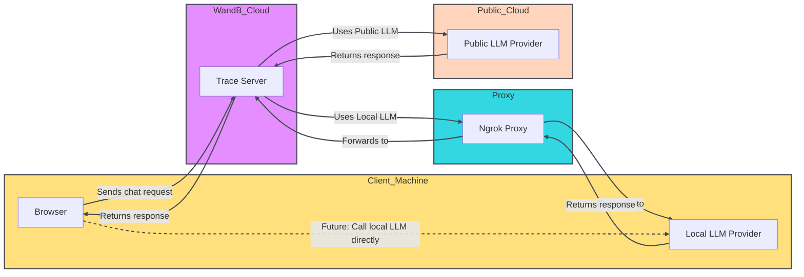

<Tip>
한시적으로 새로운 W&B Inference 서비스가 무료 티어에 포함됩니다. W&B Inference는 API와 Weave Playground를 통해 주요 오픈소스 파운데이션 모델에 대한 엑세스를 제공합니다.
- [개발자 문서](../integrations/inference)
- [제품 페이지](https://wandb.ai/site/inference)
</Tip>

LLM 프롬프트와 응답을 평가하는 것은 어렵습니다. Weave Playground는 LLM 프롬프트와 응답을 반복하는 프로세스를 단순화하도록 설계되어, 다양한 모델과 프롬프트를 실험하기 쉽게 만들어 줍니다. 프롬프트 편집, 메시지 재시도, 모델 비교와 같은 기능을 통해 Playground는 LLM 애플리케이션을 빠르게 테스트하고 개선할 수 있도록 돕습니다. Playground는 현재 OpenAI, Anthropic, Google, Groq, Amazon Bedrock, Microsoft Azure의 모델뿐만 아니라 [커스텀 프로바이더](#add-a-custom-provider)도 지원합니다.

- **빠른 엑세스:** 새로운 세션을 위해 W&B 사이드바에서 Playground를 열거나, 기존 프로젝트를 테스트하기 위해 Call 페이지에서 열 수 있습니다.
- **메시지 제어:** 채팅 내에서 직접 메시지를 편집, 재시도 또는 삭제할 수 있습니다.
- **유연한 메시징:** 새 메시지를 사용자(user) 또는 시스템(system) 입력으로 추가하고 LLM에 전송할 수 있습니다.
- **사용자 지정 설정:** 선호하는 LLM 프로바이더를 구성하고 모델 설정을 조정할 수 있습니다.
- **멀티 LLM 지원:** 팀 레벨의 API 키 관리와 함께 모델 간 전환이 가능합니다.
- **모델 비교:** 다양한 모델이 프롬프트에 어떻게 응답하는지 비교할 수 있습니다.
- **커스텀 프로바이더:** 커스텀 모델을 위한 OpenAI 호환 API 엔드포인트를 테스트할 수 있습니다.
- **저장된 모델:** 워크플로우를 위해 재사용 가능한 모델 프리셋을 생성하고 구성할 수 있습니다.

Playground를 시작하여 LLM 상호작용을 최적화하고 프롬프트 엔지니어링 프로세스와 LLM 애플리케이션 개발을 효율화하세요.

- [사전 요구 사항](#prerequisites)
  - [프로바이더 자격 증명 및 정보 추가](#add-provider-credentials-and-information)
  - [Playground 엑세스](#access-the-playground)
- [LLM 선택](#select-an-llm)
- [설정 사용자 지정](#customize-settings)
- [메시지 제어](#add-retry-edit-and-delete-messages)
- [LLM 비교](#compare-llms)
- [커스텀 프로바이더](#custom-providers)
- [저장된 모델](#saved-models)

## 사전 요구 사항

Playground를 사용하기 전에 [프로바이더 자격 증명을 추가](#add-provider-credentials-and-information)하고 [Playground UI를 열어야](#access-the-playground) 합니다.

### 프로바이더 자격 증명 및 정보 추가

Playground는 현재 OpenAI, Anthropic, Google, Groq, Amazon Bedrock, Microsoft Azure의 모델을 지원합니다. 사용 가능한 모델 중 하나를 사용하려면 W&B 설정의 팀 secrets에 적절한 정보를 추가하세요.

- OpenAI: `OPENAI_API_KEY`
- Anthropic: `ANTHROPIC_API_KEY`
- Google: `GEMINI_API_KEY`
- Groq: `GROQ_API_KEY`
- Amazon Bedrock:
  - `AWS_ACCESS_KEY_ID`
  - `AWS_SECRET_ACCESS_KEY`
  - `AWS_REGION_NAME`
- Azure:
  - `AZURE_API_KEY`
  - `AZURE_API_BASE`
  - `AZURE_API_VERSION`
- X.AI:
  - `XAI_API_KEY`
- Deepseek:
  - `DEEPSEEK_API_KEY`

### Playground 엑세스

Playground에 엑세스하는 방법은 두 가지입니다:

1. _간단한 시스템 프롬프트가 있는 새로운 Playground 페이지 열기_: 사이드바에서 **Playground**를 선택합니다. Playground가 동일한 탭에서 열립니다.
2. _특정 call에 대해 Playground 열기_:
   1. 사이드바에서 **Traces** 탭을 선택합니다. 트레이스 목록이 표시됩니다.
   2. 트레이스 목록에서 보고 싶은 call의 이름을 클릭합니다. call 상세 페이지가 열립니다.
   3. **Open chat in playground**를 클릭합니다. Playground가 새 탭에서 열립니다.

<Frame>

</Frame>

## LLM 선택

왼쪽 상단의 드롭다운 메뉴를 사용하여 LLM을 전환할 수 있습니다. 다양한 프로바이더의 사용 가능한 모델은 다음과 같습니다:

- [Amazon Bedrock](#amazon-bedrock)
- [Anthropic](#anthropic)
- [Azure](#azure)
- [Google](#google)
- [Groq](#groq)
- [OpenAI](#openai)
- [X.AI](#xai)
- [Deepseek](#deepseek)

{/* USE make update_playground_models */}
{/* LLM_LIST_START, DON'T EDIT THIS SECTION */}

### [Amazon Bedrock](../integrations/bedrock)

- ai21.j2-mid-v1
- ai21.j2-ultra-v1
- amazon.nova-micro-v1:0
- amazon.nova-lite-v1:0
- amazon.nova-pro-v1:0
- amazon.titan-text-lite-v1
- amazon.titan-text-express-v1
- mistral.mistral-7b-instruct-v0:2
- mistral.mixtral-8x7b-instruct-v0:1
- mistral.mistral-large-2402-v1:0
- mistral.mistral-large-2407-v1:0
- anthropic.claude-3-sonnet-20240229-v1:0
- anthropic.claude-3-5-sonnet-20240620-v1:0
- anthropic.claude-3-haiku-20240307-v1:0
- anthropic.claude-3-opus-20240229-v1:0
- anthropic.claude-v2
- anthropic.claude-v2:1
- anthropic.claude-instant-v1
- cohere.command-text-v14
- cohere.command-light-text-v14
- cohere.command-r-plus-v1:0
- cohere.command-r-v1:0
- meta.llama2-13b-chat-v1
- meta.llama2-70b-chat-v1
- meta.llama3-8b-instruct-v1:0
- meta.llama3-70b-instruct-v1:0
- meta.llama3-1-8b-instruct-v1:0
- meta.llama3-1-70b-instruct-v1:0
- meta.llama3-1-405b-instruct-v1:0

### [Anthropic](../integrations/anthropic)

- claude-3-7-sonnet-20250219
- claude-3-5-sonnet-20240620
- claude-3-5-sonnet-20241022
- claude-3-haiku-20240307
- claude-3-opus-20240229
- claude-3-sonnet-20240229

### [Azure](../integrations/azure)

- azure/o1-mini
- azure/o1-mini-2024-09-12
- azure/o1
- azure/o1-preview
- azure/o1-preview-2024-09-12
- azure/gpt-4o
- azure/gpt-4o-2024-08-06
- azure/gpt-4o-2024-11-20
- azure/gpt-4o-2024-05-13
- azure/gpt-4o-mini
- azure/gpt-4o-mini-2024-07-18

### [Google](../integrations/google)

- gemini/gemini-2.5-pro-preview-03-25
- gemini/gemini-2.0-pro-exp-02-05
- gemini/gemini-2.0-flash-exp
- gemini/gemini-2.0-flash-001
- gemini/gemini-2.0-flash-thinking-exp
- gemini/gemini-2.0-flash-thinking-exp-01-21
- gemini/gemini-2.0-flash
- gemini/gemini-2.0-flash-lite
- gemini/gemini-2.0-flash-lite-preview-02-05
- gemini/gemini-1.5-flash-001
- gemini/gemini-1.5-flash-002
- gemini/gemini-1.5-flash-8b-exp-0827
- gemini/gemini-1.5-flash-8b-exp-0924
- gemini/gemini-1.5-flash-latest
- gemini/gemini-1.5-flash
- gemini/gemini-1.5-pro-001
- gemini/gemini-1.5-pro-002
- gemini/gemini-1.5-pro-latest
- gemini/gemini-1.5-pro

### [Groq](../integrations/groq.mdx)

- groq/deepseek-r1-distill-llama-70b
- groq/llama-3.3-70b-versatile
- groq/llama-3.3-70b-specdec
- groq/llama-3.2-1b-preview
- groq/llama-3.2-3b-preview
- groq/llama-3.2-11b-vision-preview
- groq/llama-3.2-90b-vision-preview
- groq/llama-3.1-8b-instant
- groq/llama3-70b-8192
- groq/llama3-8b-8192
- groq/gemma2-9b-it

### [OpenAI](../integrations/openai.mdx)

- gpt-4.1-mini-2025-04-14
- gpt-4.1-mini
- gpt-4.1-2025-04-14
- gpt-4.1
- gpt-4.1-nano-2025-04-14
- gpt-4.1-nano
- o4-mini-2025-04-16
- o4-mini
- gpt-4.5-preview-2025-02-27
- gpt-4.5-preview
- o3-2025-04-16
- o3
- o3-mini-2025-01-31
- o3-mini
- gpt-4o-mini
- gpt-4o-2024-05-13
- gpt-4o-2024-08-06
- gpt-4o-mini-2024-07-18
- gpt-4o
- gpt-4o-2024-11-20
- o1-mini-2024-09-12
- o1-mini
- o1-preview-2024-09-12
- o1-preview
- o1-2024-12-17
- gpt-4-1106-preview
- gpt-4-32k-0314
- gpt-4-turbo-2024-04-09
- gpt-4-turbo-preview
- gpt-4-turbo
- gpt-4
- gpt-3.5-turbo-0125
- gpt-3.5-turbo-1106

### X.AI

- xai/grok-3-beta
- xai/grok-3-fast-beta
- xai/grok-3-fast-latest
- xai/grok-3-mini-beta
- xai/grok-3-mini-fast-beta
- xai/grok-3-mini-fast-latest
- xai/grok-beta
- xai/grok-2-1212
- xai/grok-2
- xai/grok-2-latest

### Deepseek

- deepseek/deepseek-reasoner
- deepseek/deepseek-chat

{/* LLM_LIST_END, DON'T EDIT THIS SECTION */}

## 설정 사용자 지정

### LLM 파라미터 조정

선택한 모델에 대해 다양한 파라미터 값으로 실험할 수 있습니다. 파라미터를 조정하려면 다음을 수행하세요:

1. Playground UI의 오른쪽 상단에서 **Chat settings**를 클릭하여 파라미터 설정 드롭다운을 엽니다.
2. 드롭다운에서 원하는 대로 파라미터를 조정합니다. Weave call 추적을 켜거나 끌 수 있으며, [함수를 추가](#add-a-function)할 수도 있습니다.
3. **Chat settings**를 클릭하여 드롭다운을 닫고 변경 사항을 저장합니다.

<Frame>

</Frame>

### 함수 추가

사용자로부터 받은 입력을 바탕으로 다양한 모델이 함수를 어떻게 사용하는지 테스트할 수 있습니다. Playground에서 테스트를 위해 함수를 추가하려면 다음을 수행하세요:

1. Playground UI의 오른쪽 상단에서 **Chat settings**를 클릭하여 파라미터 설정 드롭다운을 엽니다.
2. 드롭다운에서 **+ Add function**을 클릭합니다.
3. 팝업에서 함수 정보를 추가합니다.
4. 변경 사항을 저장하고 함수 팝업을 닫으려면 오른쪽 상단의 **x**를 클릭합니다.
5. **Chat settings**를 클릭하여 설정 드롭다운을 닫고 변경 사항을 저장합니다.

### 트라이얼 횟수 조정

Playground에서는 트라이얼 횟수를 설정하여 동일한 입력에 대해 여러 개의 출력을 생성할 수 있습니다. 기본 설정은 `1`입니다. 트라이얼 횟수를 조정하려면 다음을 수행하세요:

1. Playground UI에서 설정 사이드바가 열려 있지 않다면 엽니다.
2. **Number of trials**를 조정합니다.

## 메시지 제어

### 메시지 재시도, 편집 및 삭제

Playground를 사용하면 메시지를 재시도, 편집 및 삭제할 수 있습니다. 이 기능을 사용하려면 편집, 재시도 또는 삭제하려는 메시지 위로 마우스를 가져갑니다. **Delete**, **Edit**, **Retry** 세 개의 버튼이 표시됩니다.

- **Delete**: 채팅에서 메시지를 제거합니다.
- **Edit**: 메시지 내용을 수정합니다.
- **Retry**: 이후의 모든 메시지를 삭제하고 선택한 메시지부터 채팅을 다시 시도합니다.

### 새 메시지 추가

채팅에 새 메시지를 추가하려면 다음을 수행하세요:

1. 채팅 상자에서 사용 가능한 역할 중 하나를 선택합니다 (**Assistant** 또는 **User**).
2. **+ Add**를 클릭합니다.
3. LLM에 새 메시지를 보내려면 **Send** 버튼을 클릭합니다. 또는 **Command**와 **Enter** 키를 누릅니다.

<Frame>

</Frame>

## LLM 비교

Playground를 사용하면 LLM을 비교할 수 있습니다. 비교를 수행하려면 다음을 수행하세요:

1. Playground UI에서 **Compare**를 클릭합니다. 원래 채팅 옆에 두 번째 채팅이 열립니다.
2. 두 번째 채팅에서 다음을 수행할 수 있습니다:
   - [비교할 LLM 선택](#select-an-llm)
   - [파라미터 조정](#adjust-llm-parameters)
   - [함수 추가](#add-a-function)
3. 메시지 상자에 두 모델로 테스트하려는 메시지를 입력하고 **Send**를 누릅니다.

## 커스텀 프로바이더

### 커스텀 프로바이더 추가

[지원되는 프로바이더](#select-an-llm) 외에도 Playground를 사용하여 커스텀 모델을 위한 OpenAI 호환 API 엔드포인트를 테스트할 수 있습니다. 예시는 다음과 같습니다:

- 지원되는 모델 프로바이더의 이전 버전
- 로컬 모델

Playground에 커스텀 프로바이더를 추가하려면 다음을 수행하세요:

1. Playground UI의 왼쪽 상단에서 **Select a model** 드롭다운을 클릭합니다.
2. **+ Add AI provider**를 선택합니다.
3. 팝업 모달에서 프로바이더 정보를 입력합니다:

   - _Provider name_: 예를 들어, `openai` 또는 `ollama`.
   - _API key_: 예를 들어, OpenAI API 키.
   - _Base URL_: 예를 들어, `https://api.openai.com/v1/` 또는 ngrok URL `https://e452-2600-1700-45f0-3e10-2d3f-796b-d6f2-8ba7.ngrok-free.app`.
   - _Headers_ (선택 사항): 여러 헤더 키와 값을 추가할 수 있습니다.
   - _Models_: 한 프로바이더에 여러 모델을 추가할 수 있습니다. 예를 들어, `deepseek-r1` 및 `qwq`.
   - _Max tokens_ (선택 사항): 각 모델에 대해 응답에서 생성할 수 있는 최대 토큰 수를 지정할 수 있습니다.

4. 프로바이더 정보를 모두 입력했으면 **Add provider**를 클릭합니다.
5. Playground UI의 왼쪽 상단에 있는 **Select a model** 드롭다운에서 새 프로바이더와 사용 가능한 모델을 선택합니다.

<Warning>
CORS 제한으로 인해 Playground에서 localhost 또는 127.0.0.1 URL을 직접 호출할 수 없습니다. 로컬 모델 서버(예: Ollama)를 실행 중인 경우, ngrok과 같은 터널링 서비스를 사용하여 안전하게 노출하세요. 자세한 내용은 [Ollama와 함께 ngrok 사용하기](#use-ngrok-with-ollama)를 참조하세요.
</Warning>

이제 표준 Playground 기능을 사용하여 커스텀 프로바이더 모델을 테스트할 수 있습니다. 커스텀 프로바이더를 [편집](#edit-a-custom-provider)하거나 [삭제](#remove-a-custom-provider)할 수도 있습니다.

### 커스텀 프로바이더 편집

[이전에 생성된 커스텀 프로바이더](#add-a-custom-provider) 정보를 편집하려면 다음을 수행하세요:

1. Weave 사이드바에서 **Overview**로 이동합니다.
2. 상단 내비게이션 메뉴에서 **AI Providers**를 선택합니다.
3. **Custom providers** 테이블에서 업데이트하려는 커스텀 프로바이더를 찾습니다.
4. 해당 커스텀 프로바이더 항목의 **Last Updated** 컬럼에서 편집 버튼(연필 아이콘)을 클릭합니다.
5. 팝업 모달에서 프로바이더 정보를 편집합니다.
6. **Save**를 클릭합니다.

### 커스텀 프로바이더 삭제

[이전에 생성된 커스텀 프로바이더](#add-a-custom-provider)를 삭제하려면 다음을 수행하세요:

1. Weave 사이드바에서 **Overview**로 이동합니다.
2. 상단 내비게이션 메뉴에서 **AI Providers**를 선택합니다.
3. **Custom providers** 테이블에서 업데이트하려는 커스텀 프로바이더를 찾습니다.
4. 해당 커스텀 프로바이더 항목의 **Last Updated** 컬럼에서 삭제 버튼(휴지통 아이콘)을 클릭합니다.
5. 팝업 모달에서 프로바이더를 삭제할 것인지 확인합니다. 이 작업은 되돌릴 수 없습니다.
6. **Delete**를 클릭합니다.

### Ollama와 함께 ngrok 사용하기

Playground에서 로컬로 실행 중인 Ollama 모델을 테스트하려면, ngrok을 사용하여 CORS 제한을 우회하는 임시 공용 URL을 생성하세요.

설정 방법은 다음과 같습니다:

1. 운영 체제에 맞는 [ngrok을 설치](https://ngrok.com/docs/getting-started/#step-1-install)합니다.
2. Ollama 모델을 시작합니다:

   ```bash
   ollama run <model>
   ```

3. 별도의 터미널에서 필요한 CORS 헤더를 포함하여 ngrok 터널을 생성합니다:

   ```bash
   ngrok http 11434 --response-header-add "Access-Control-Allow-Origin: *" --host-header rewrite
   ```

ngrok이 시작되면 `https://xxxx-xxxx.ngrok-free.app`과 같은 공용 URL이 표시됩니다. Playground에서 Ollama를 커스텀 프로바이더로 추가할 때 이 URL을 베이스 URL로 사용하세요.

다음 다이어그램은 로컬 환경, ngrok 프록시 및 W&B 클라우드 서비스 간의 데이터 흐름을 보여줍니다:



## 저장된 모델

### 모델 저장

워크플로우를 위해 재사용 가능한 모델 프리셋을 생성하고 구성할 수 있습니다. 모델을 저장하면 선호하는 설정, 파라미터 및 함수 훅과 함께 모델을 빠르게 로드할 수 있습니다.

1. LLM 드롭다운에서 프로바이더를 선택합니다.
2. 프로바이더 목록에서 모델을 선택합니다.
3. Playground UI의 오른쪽 상단에서 **Chat settings**를 클릭하여 채팅 설정 창을 엽니다.
4. 채팅 설정 창에서:
   - **Model Name** 필드에 저장할 모델의 이름을 입력합니다.
   - 원하는 대로 파라미터를 조정합니다. Weave call 추적을 켜거나 끌 수 있으며, [함수를 추가](#add-a-function)할 수도 있습니다.
5. **Publish Model**을 클릭합니다. 모델이 저장되며 LLM 드롭다운의 **Saved Models**에서 엑세스할 수 있습니다. 이제 저장된 모델을 [사용](#use-a-saved-model)하고 [업데이트](#update-a-saved-model)할 수 있습니다.

### 저장된 모델 사용

실험이나 세션 간의 일관성을 유지하기 위해 이전에 [저장된 모델](#save-a-model)로 빠르게 전환하세요. 이를 통해 중단했던 부분부터 바로 다시 시작할 수 있습니다.

1. LLM 드롭다운에서 **Saved Models**를 선택합니다.
2. 저장된 모델 목록에서 로드하려는 모델을 클릭합니다. 모델이 로드되고 Playground에서 사용할 준비가 됩니다.

### 저장된 모델 업데이트

기존의 [저장된 모델](#save-a-model)을 편집하여 파라미터를 파인튜닝하거나 구성을 새로 고칩니다. 이를 통해 유스 케이스의 발전에 맞춰 저장된 모델을 개선할 수 있습니다.

1. LLM 드롭다운에서 **Saved Models**를 선택합니다.
2. 저장된 모델 목록에서 업데이트하려는 모델을 클릭합니다.
3. Playground UI의 오른쪽 상단에서 **Chat settings**를 클릭하여 채팅 설정 창을 엽니다.
4. 채팅 설정 창에서 원하는 대로 파라미터를 조정합니다. Weave call 추적을 켜거나 끌 수 있으며, [함수를 추가](#add-a-function)할 수도 있습니다.
5. **Update model**을 클릭합니다. 모델이 업데이트되며 LLM 드롭다운의 **Saved Models**에서 엑세스할 수 있습니다.
