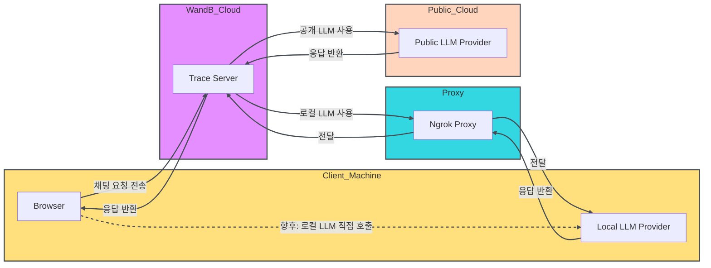

<Tip>
제한된 기간 동안 W&B Inference가 무료 티어에 포함되어 있습니다. W&B Inference는 API와 Weave Playground를 통해 선도적인 오픈 소스 기반 모델에 대한 액세스를 제공합니다. 
- [Developer documentation](../integrations/inference)
- [Product page](https://wandb.ai/site/inference) 
</Tip>

LLM 프롬프트와 응답을 평가하는 일은 까다롭습니다. Weave Playground는 LLM 프롬프트와 응답을 반복 개선하는 과정을 단순화하여, 다양한 모델과 프롬프트를 더 쉽게 실험할 수 있도록 설계되었습니다. 프롬프트 편집, 메시지 재전송, 모델 비교와 같은 기능을 통해 Playground는 LLM 애플리케이션을 빠르게 테스트하고 개선하는 데 도움을 줍니다. Playground는 현재 OpenAI, Anthropic, Google과 같은 프로바이더의 모델과 [사용자 정의 프로바이더](#add-a-custom-provider)를 지원합니다.

- **빠른 액세스:** Weave 사이드바 메뉴에서 'Playground'를 열어 새 세션을 시작하거나, Call 페이지에서 열어 기존 프로젝트를 테스트합니다.
- **메시지 제어:** 채팅 내에서 메시지를 직접 편집, 재전송 또는 삭제할 수 있습니다.
- **유연한 메시징:** 새 메시지를 "user" 또는 "system" 입력으로 추가하고 LLM에 전송합니다.
- **사용자 정의 가능한 설정:** 선호하는 LLM 프로바이더를 구성하고 모델 설정을 조정합니다.
- **다중 LLM 지원:** 팀 단위 API 키 관리를 통해 모델 간을 전환합니다.
- **모델 비교:** 서로 다른 모델이 프롬프트에 어떻게 응답하는지 비교합니다.
- **사용자 정의 프로바이더:** 사용자 정의 모델용 OpenAI 호환 API 엔드포인트를 테스트합니다.
- **저장된 모델:** 워크플로에 재사용 가능한 모델 프리셋을 생성하고 구성합니다.

Playground를 사용해 LLM과의 상호작용을 최적화하고 프롬프트 엔지니어링 프로세스와 LLM 애플리케이션 개발을 효율화하세요.

- [프로바이더 자격 증명 및 정보 추가](#add-provider-credentials-and-information)
- [Playground에 액세스](#access-the-playground)
- [LLM 선택](#select-an-llm)
- [Playground 설정 사용자 정의](#customize-playground-settings)
- [메시지 제어](#message-controls)
- [LLM 비교](#compare-llms)
- [사용자 정의 프로바이더](#custom-providers)
- [저장된 모델](#saved-models) 

<div id="add-provider-credentials-and-information">
  ## 프로바이더 자격 증명 및 정보 추가
</div>

Playground을 사용하기 전에 프로바이더 자격 증명을 추가해야 합니다. Playground에서는 현재 여러 프로바이더의 모델을 지원합니다. 사용 가능한 모델 중 하나를 사용하려면 W&B 설정에서 팀 시크릿에 해당 정보를 추가하세요.

- Amazon Bedrock:
  - `AWS_ACCESS_KEY_ID`
  - `AWS_SECRET_ACCESS_KEY`
  - `AWS_REGION_NAME`
- Anthropic: `ANTHROPIC_API_KEY`
- Azure:
  - `AZURE_API_KEY`
  - `AZURE_API_BASE`
  - `AZURE_API_VERSION`
- Deepseek: `DEEPSEEK_API_KEY`
- Google: `GEMINI_API_KEY`
- Groq: `GROQ_API_KEY`
- Mistral: `MISTRAL_API_KEY`
- OpenAI: `OPENAI_API_KEY`
- X.AI: `XAI_API_KEY`

<div id="access-the-playground">
  ## Playground에 액세스하기
</div>

Playground에 액세스하는 방법은 두 가지입니다.

1. _간단한 system prompt로 새 Playground 페이지 열기_: Weave 프로젝트의 사이드바에서 **Playground**를 선택합니다. Playground가 같은 탭에서 열립니다.
2. _특정 호출에 대한 Playground 열기_:
   1. 사이드바에서 **Traces** 탭을 선택합니다. 추적 목록이 표시됩니다.
   2. 추적 목록에서 확인하려는 호출의 이름을 클릭합니다. 호출 상세 페이지가 열립니다.
   3. **Open chat in Playground**를 클릭합니다. Playground가 새 탭에서 열립니다.

<Frame>

</Frame>

<div id="select-an-llm">
  ## LLM 선택
</div>

프롬프트 헤더(Playground 메인 패널 상단)에 있는 **Select a model** 드롭다운을 사용해 LLM을 전환할 수 있습니다. 다양한 제공자(프로바이더)가 제공하는 사용 가능한 모델은 아래와 같습니다:

- Amazon Bedrock
- Anthropic
- Azure
- Deepseek
- Google
- Groq
- Mistral
- OpenAI
- X.AI

사용 가능한 모델은 팀에 대해 설정된 제공자(프로바이더)에 따라 달라집니다.

<div id="customize-playground-settings">
  ## Playground 설정 맞춤 구성
</div>

<div id="adjust-llm-parameters">
  ### LLM 파라미터 조정
</div>

선택한 모델에 대해 다양한 파라미터 값을 실험해 볼 수 있습니다. Playground에서 파라미터를 조정하려면 다음을 수행합니다:

1. 프롬프트 헤더(메인 패널 상단)에서 **Chat settings (<Icon icon="sliders" iconType="regular" />)** 버튼을 클릭해 **Chat settings** 패널을 엽니다.
2. **Chat settings** 패널에서 원하는 대로 파라미터를 조정합니다. 또한 Weave call tracking(Weave 호출 추적)을 켜거나 끌 수 있고, [함수를 추가](#add-a-function)할 수도 있습니다.
3. 변경 사항은 자동으로 적용됩니다. 패널을 닫으려면 **Chat settings**를 다시 클릭하거나 오른쪽 상단의 **x**를 클릭합니다. **Chat settings** 버튼에 마우스를 올렸을 때 표시되는 텍스트는 변경한 설정을 반영하도록 업데이트됩니다.

이 페이지를 떠나면 설정이 사라집니다. 설정을 저장하려면 [모델을 저장](#save-a-model)하십시오.
변경한 설정을 버리고 처음부터 다시 시작하려면 페이지를 새로 고침하십시오.

<Frame>

</Frame>

Playground에서는 시도 횟수(number of trials)를 설정해 동일한 입력에 대해 여러 출력을 생성할 수 있습니다. 기본 설정은 `1`입니다. 시도 횟수를 조정하려면 **Chat settings** 패널을 열고 **Number of trials** 설정을 조정하십시오.

<div id="add-a-function">
  ### 함수 추가
</div>

사용자로부터 받은 입력을 바탕으로 서로 다른 모델이 함수를 어떻게 사용하는지 테스트할 수 있습니다. Playground에서 테스트할 함수를 추가하려면 **Chat settings** 패널에서 **+ Add function**을 클릭합니다. 화면에 표시되는 안내에 따라 함수를 정의하고 변경 사항을 저장합니다.

<div id="message-controls">
  ## 메시지 제어
</div>

<div id="prompt-definition-area">
  ### 프롬프트 정의 영역
</div>

**프롬프트 정의 영역**에서는 상호작용 전반에서 모델의 동작을 결정하는 지침을 정의할 수 있습니다.

이 영역을 사용해, 실제 메시지가 오가기 전에 항상 일관되게 적용될 컨텍스트를 제공합니다. 여기에는 역할 정의, 톤 및 스타일 가이드, 동작 제약 조건, 출력 요구 사항 등이 포함됩니다. 여기에서 변경한 내용은 다시 수정하지 않는 한 이후의 모든 상호작용에 영향을 줍니다.

이 영역에는 다음이 포함됩니다:

- **프롬프트 선택기**: 기존에 저장된 프롬프트를 선택하거나 새로 생성합니다.
- **메시지 역할 선택기**: 정의 중인 메시지의 역할(**System**, **Assistant**, 또는 **User** 역할)을 지정합니다.
- **프롬프트 텍스트**: 모델이 어떻게 응답해야 하는지를 규정하는 지침 텍스트를 입력합니다.
- **Add message** 버튼: 실행 전에 프롬프트 컨텍스트에 추가 메시지를 포함할 수 있습니다.

이 메시지들은 함께 모델로 전송되며, 다음과 같은 용도로 사용할 수 있습니다:

- 시스템 수준의 보충 지침을 추가합니다.
- 응답을 유도하기 위한 예시 Assistant 메시지를 제공합니다(예: few-shot 프롬팅).
- 특정 시나리오를 테스트하기 위해 User 메시지를 미리 정의합니다.

<div id="messages-panel">
  ### 메시지 패널
</div>

**메시지 패널**에는 실행 과정에서 생성된 대화가 표시됩니다.

다음이 포함됩니다:

- 프롬프트 설정에 포함된 미리 정의된 메시지
- 메시지 작성기에서 보낸 메시지
- 모델이 반환한 응답

또한 패널 내 메시지에 대해 **Copy**, **Delete**, **Edit**, **Retry**를 수행할 수 있습니다.

<div id="message-composer-input-field">
  ### 메시지 작성기(입력 필드)
</div>

**Message composer**는 모델에 새 메시지를 보내는 데 사용됩니다.

메시지 역할 선택과 실행할 메시지 제출을 지원합니다. 대부분의 상호작용은 **User** 메시지로 작성됩니다. 테스트할 지침이 달라질 때는 **System** 또는 **Assistant** 메시지를 추가할 수 있습니다.

<Frame>

</Frame>

<div id="view-message-history">
  ## 메시지 기록 보기
</div>

메시지 기록을 보려면 오른쪽에 있는 Playground 도구 모음에서 **History (<Icon icon="clock-rotate-left" iconType="light" />)** 버튼을 클릭하세요. 그러면 현재 프로젝트에서 전송된 모든 메시지를 보여주는 History 패널이 열립니다.  

기록에서 항목을 선택하면 비교를 위해 해당 항목이 자동으로 추가 채팅 패널에 로드됩니다. 

<div id="compare-llms">
  ## LLM 비교
</div>

Playground에서는 LLM을 비교할 수 있습니다. 비교하려면 오른쪽 Playground 도구 모음에서 **Add Chat (<Icon icon="plus" iconType="solid" />)** 버튼을 클릭합니다. 기존 채팅 옆에 두 번째 채팅이 열립니다.
두 번째 채팅에서는 모델 선택, 설정 조정, 함수 추가 등 기존 채팅과 동일한 기능을 사용할 수 있습니다.

<div id="custom-providers">
  ## 사용자 지정 프로바이더
</div>

<div id="add-a-custom-provider">
  ### 사용자 지정 프로바이더 추가
</div>

기본 제공 프로바이더 외에도 Playground에서 사용자 지정 모델에 대해 OpenAI 호환 API 엔드포인트를 테스트할 수 있습니다. 예를 들면 다음과 같습니다.

- 지원되는 모델 프로바이더의 이전 버전
- 로컬 모델

Playground에 사용자 지정 프로바이더를 추가하려면 다음을 수행하세요.

1. 프롬프트 헤더(메인 패널 상단)에서 **Select a model** 드롭다운을 클릭합니다.
2. **+ Add AI provider**를 선택합니다.
3. **Custom Provider**를 선택합니다.
4. 표시되는 모달에서 프로바이더 정보를 입력합니다.

- **Provider name**: `openai` 또는 `ollama`와 같은 프로바이더 이름.
- **API key**: OpenAI API key와 같은 프로바이더의 API 키.
- **Base URL**: `https://api.openai.com/v1/` 또는 `https://e452-2600-1700-45f0-3e10-2d3f-796b-d6f2-8ba7.ngrok-free.app` 같은 ngrok URL 등 프로바이더의 기본 엔드포인트.
- **Headers**: (선택 사항) 하나 이상의 사용자 지정 HTTP 헤더 키-값 쌍.
- **Models**: `deepseek-r1` 또는 `qwq`와 같은, 해당 프로바이더에서 사용할 하나 이상의 모델.
- **Max tokens**: (선택 사항) 각 모델이 응답에서 생성할 수 있는 최대 토큰 수.

5. 프로바이더 정보를 모두 입력했으면 **Add provider**를 클릭합니다.
6. **Select a model** 드롭다운에서 새 프로바이더와 사용 가능한 모델을 선택합니다.

<Warning>
CORS 제한으로 인해 Playground에서 localhost 또는 127.0.0.1 URL을 직접 호출할 수 없습니다. 로컬 모델 서버(Ollama 등)를 실행 중인 경우 ngrok과 같은 터널링 서비스를 사용하여 안전하게 외부에 노출하세요. 자세한 내용은 [Ollama와 함께 ngrok 사용](#use-a-local-model-as-a-custom-provider)을 참조하세요.
</Warning>

이제 표준 Playground 기능을 사용하여 사용자 지정 프로바이더의 모델을 테스트할 수 있습니다. 또한 사용자 지정 프로바이더를 [편집](#edit-a-custom-provider)하거나 [삭제](#remove-a-custom-provider)할 수도 있습니다.

<div id="edit-a-custom-provider">
  ### 커스텀 프로바이더 편집
</div>

[이미 생성한 커스텀 프로바이더](#add-a-custom-provider)의 정보를 편집하려면 다음을 수행합니다:

1. 프롬프트 헤더에서 **Select a model** 드롭다운을 클릭한 다음 **+Configure providers**를 선택합니다.

* 또는 사이드바 메뉴에서 **Project**를 선택한 후 **AI Providers** 탭을 선택할 수도 있습니다.

2. **Custom providers** 테이블에서 업데이트하려는 커스텀 프로바이더를 찾습니다.
3. 해당 커스텀 프로바이더 항목의 **Last Updated** 열에서 편집 버튼(연필 아이콘)을 클릭합니다.
4. 팝업 모달에서 프로바이더 정보를 편집합니다.
5. **Save**를 클릭합니다.

<div id="remove-a-custom-provider">
  ### 사용자 지정 프로바이더 제거
</div>

[이전에 생성한 사용자 지정 프로바이더](#add-a-custom-provider)를 제거하려면 다음 단계를 따르세요.

1. 프롬프트 헤더에서 **Select a model** 드롭다운을 클릭한 다음 **+Configure providers**를 선택하세요.

* 또는 사이드바 메뉴에서 **Project**를 선택한 후 **AI Providers** 탭을 선택해도 됩니다.

2. **Custom providers** 테이블에서 삭제하려는 사용자 지정 프로바이더를 찾으세요.
3. 해당 사용자 지정 프로바이더 항목의 **Last Updated** 열에서 삭제 버튼(휴지통 아이콘)을 클릭하세요.
4. 팝업 모달에서 프로바이더를 삭제할 것인지 확인하세요. 이 작업은 되돌릴 수 없습니다.
5. **Delete**를 클릭하세요.

<div id="use-a-local-model-as-a-custom-provider">
  ### 로컬 모델을 사용자 지정 제공자로 사용하기
</div>

Playground에서 로컬에서 실행 중인 모델을 테스트하려면 ngrok과 Ollama를 사용해 CORS 제한을 우회하는 임시 공개 URL을 만듭니다.

설정하려면 다음을 수행하세요:

1. 사용하는 운영 체제에 맞는 [ngrok을 설치](https://ngrok.com/docs/getting-started/#step-1-install)합니다.

2. Ollama 모델을 시작합니다:

   ```bash
   ollama run <model>
   ```

3. 다른 터미널에서 필요한 CORS 헤더를 포함해 ngrok 터널을 생성합니다:

   ```bash
   ngrok http 11434 --response-header-add "Access-Control-Allow-Origin: *" --host-header rewrite
   ```

4. ngrok이 시작되면 `https://xxxx-xxxx.ngrok-free.app`와 같은 공개 URL을 표시합니다. 이 URL을 Playground에서 [사용자 지정 제공자를 추가](#add-a-custom-provider)할 때 **Base URL**로 사용하세요.

다음 다이어그램은 로컬 환경, ngrok 프록시 및 W&amp;B 클라우드 서비스 간의 데이터 흐름을 보여 줍니다:




<div id="saved-models">
  ## 저장된 모델
</div>

<div id="save-a-model">
  ### 모델 저장하기
</div>

워크플로우에서 재사용할 수 있는 모델 프리셋을 생성하고 구성할 수 있습니다. 모델을 저장해 두면 선호하는 설정, 파라미터, 함수 훅이 포함된 상태로 빠르게 불러올 수 있습니다.

1. 프롬프트 헤더(메인 패널 상단)의 **Select a model** 드롭다운에서 프로바이더와 모델을 선택합니다.
2. 프롬프트 헤더에서 **Chat settings (<Icon icon="sliders" iconType="regular" />)** 버튼을 클릭하여 **Chat settings** 패널을 엽니다.
3. **Chat settings** 패널에서:
   - **Model Name** (필수): 저장할 모델의 이름을 입력합니다. 
   - 원하는 대로 파라미터를 조정합니다. Weave 호출 추적을 켜거나 끌 수 있고, [함수를 추가](#add-a-function)할 수도 있습니다.
4. **Publish model**을 클릭합니다. 모델이 저장되며, **Select a model** 드롭다운의 **Saved Models**에서 사용할 수 있습니다. 이제 저장된 모델을 [사용](#use-a-saved-model)하고 [업데이트](#update-a-saved-model)할 수 있습니다.

<div id="use-a-saved-model">
  ### 저장된 모델 사용하기
</div>

이전에 [저장한 모델](#save-a-model)로 빠르게 전환해 실험이나 세션 간 일관성을 유지할 수 있습니다. 이렇게 하면 중단했던 지점부터 바로 다시 시작할 수 있습니다.

1. 프롬프트 헤더의 **Select a model** 드롭다운에서 **Saved Models**를 선택합니다.
2. 저장된 모델 목록에서 불러올 모델을 선택합니다. 선택한 모델이 로드되어 Playground에서 바로 사용할 수 있습니다.

<div id="update-a-saved-model">
  ### 저장된 모델 업데이트
</div>

기존 [저장된 모델](#save-a-model)을 편집하여 파라미터를 미세 조정하거나 구성을 새로 고치세요. 이렇게 하면 저장된 모델이 사용 사례의 변화에 맞춰 함께 발전할 수 있습니다.

1. 프롬프트 헤더의 **Select a model** 드롭다운에서 **Saved Models**를 선택합니다.
2. 저장된 모델 목록에서 업데이트하려는 저장된 모델을 선택합니다. 
3. 프롬프트 헤더에서 **Chat settings (<Icon icon="sliders" iconType="regular" />)** 버튼을 클릭해 **Chat settings** 패널을 엽니다.
4. **Chat settings** 패널에서 원하는 대로 파라미터를 조정합니다. Weave 호출 추적을 켜거나 끌 수 있고, [함수를 추가](#add-a-function)할 수도 있습니다.
5. **Update model**을 클릭합니다. 모델이 업데이트되며, **Select a model** 드롭다운의 **Saved Models**에서 사용할 수 있습니다. 저장된 모델의 버전은 자동으로 증가합니다.