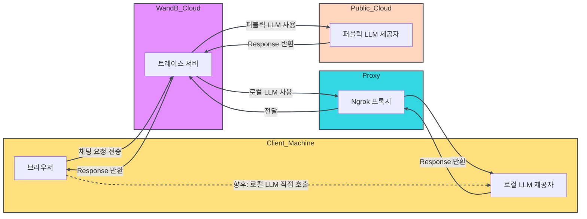

<Tip>
  For a limited time, W&amp;B Inference는 무료 티어에 포함되어 있습니다. W&amp;B Inference는 API와 Weave 플레이그라운드를 통해 주요 오픈소스 기반 모델에 액세스할 수 있습니다.

  * [Developer documentation](../integrations/inference)
  * [Product page](https://wandb.ai/site/inference)
</Tip>

LLM 프롬프트와 Response를 평가하는 일은 쉽지 않습니다. Weave 플레이그라운드는 LLM 프롬프트와 Response를 반복적으로 개선하는 과정을 단순화하도록 설계되어, 다양한 모델과 프롬프트를 더 쉽게 실험할 수 있게 해줍니다. 프롬프트 편집, 메시지 재시도, 모델 비교 같은 기능을 통해 플레이그라운드는 LLM 애플리케이션을 빠르게 테스트하고 개선할 수 있도록 도와줍니다. 플레이그라운드는 현재 OpenAI, Anthropic, Google 등의 제공자가 제공하는 모델과 [사용자 정의 프로바이더](#add-a-custom-provider)를 지원합니다.

* **빠른 액세스:** 새 세션을 시작하려면 Weave 사이드바 메뉴에서 &#39;플레이그라운드&#39;를 열고, 기존 프로젝트를 테스트하려면 Call 페이지에서 여세요.
* **메시지 제어:** 채팅 내에서 메시지를 직접 수정, 재시도 또는 삭제할 수 있습니다.
* **유연한 메시징:** 새 메시지를 사용자 또는 시스템 입력으로 추가하고 LLM에 보낼 수 있습니다.
* **사용자 지정 가능한 설정:** 선호하는 LLM 제공자를 설정하고 모델 설정을 조정합니다.
* **여러 LLM 지원:** 팀 수준 API 키 관리와 함께 모델 간에 전환할 수 있습니다.
* **모델 비교:** 서로 다른 모델이 프롬프트에 어떻게 Response하는지 비교합니다.
* **사용자 정의 프로바이더:** 사용자 정의 모델용 OpenAI 호환 API endpoint를 테스트합니다.
* **저장된 모델:** 워크플로에 재사용할 수 있는 모델 프리셋을 생성하고 설정합니다.

플레이그라운드를 사용해 LLM 상호작용을 최적화하고 프롬프트 엔지니어링 프로세스와 LLM 애플리케이션 개발을 간소화해 보세요.

* [제공자 자격 증명 및 정보 추가](#add-provider-credentials-and-information)
* [플레이그라운드 액세스](#access-the-playground)
* [LLM 선택](#select-an-llm)
* [플레이그라운드 설정 사용자 지정](#customize-playground-settings)
* [메시지 제어](#message-controls)
* [LLM 비교](#compare-llms)
* [사용자 정의 프로바이더](#custom-providers)
* [저장된 모델](#saved-models) 

<div id="add-provider-credentials-and-information">
  ## 제공자 자격 증명 및 정보 추가
</div>

플레이그라운드를 사용하려면 먼저 제공자 자격 증명을 추가해야 합니다. 플레이그라운드는 현재 여러 제공자의 모델을 지원합니다. 사용 가능한 모델 중 하나를 사용하려면 적절한 정보를 W&amp;B settings의 팀 secret에 추가하세요.

* Amazon Bedrock:
  * `AWS_ACCESS_KEY_ID`
  * `AWS_SECRET_ACCESS_KEY`
  * `AWS_REGION_NAME`
* Anthropic: `ANTHROPIC_API_KEY`
* Azure:
  * `AZURE_API_KEY`
  * `AZURE_API_BASE`
  * `AZURE_API_VERSION`
* Deepseek: `DEEPSEEK_API_KEY`
* Google: `GEMINI_API_KEY`
* Groq: `GROQ_API_KEY`
* Mistral: `MISTRAL_API_KEY`
* OpenAI: `OPENAI_API_KEY`
* X.AI: `XAI_API_KEY`

<div id="access-the-playground">
  ## 플레이그라운드에 액세스
</div>

플레이그라운드에 액세스하는 방법은 두 가지가 있습니다:

1. *단순한 system 프롬프트로 새 플레이그라운드 페이지 열기*: Weave 프로젝트의 사이드바에서 **플레이그라운드**를 선택하세요. 플레이그라운드가 같은 탭에서 열립니다.
2. *특정 call에 대해 플레이그라운드 열기*:
   1. 사이드바에서 **Traces** 탭을 선택하세요. 트레이스 목록이 표시됩니다.
   2. 트레이스 목록에서 확인하려는 call의 이름을 클릭하세요. call의 세부정보 페이지가 열립니다.
   3. **Open chat in Playground**를 클릭하세요. 플레이그라운드가 새 탭에서 열립니다.

<Frame>
  
</Frame>

<div id="select-an-llm">
  ## LLM 선택
</div>

프롬프트 헤더(메인 플레이그라운드 패널 상단)에 있는 **Select a model** 드롭다운을 사용해 LLM을 선택하거나 변경할 수 있습니다. 다양한 제공자에서 제공하는 사용 가능한 모델은 다음과 같습니다:

* Amazon Bedrock
* Anthropic
* Azure
* Deepseek
* Google
* Groq
* Mistral
* OpenAI
* X.AI

사용 가능한 모델은 팀에 대해 설정해 둔 제공자에 따라 달라집니다.

<div id="customize-playground-settings">
  ## 플레이그라운드 설정 사용자 지정
</div>

<div id="adjust-llm-parameters">
  ### LLM 파라미터 조정
</div>

선택한 모델에 대해 다양한 파라미터 값을 실험해볼 수 있습니다. 플레이그라운드에서 파라미터를 조정하려면 다음을 수행하세요.

1. 프롬프트 헤더(기본 패널 상단)에서 **Chat settings (<Icon icon="sliders" iconType="regular" />)** 버튼을 클릭하여 **Chat settings** 패널을 여세요.
2. **Chat settings** 패널에서 원하는 대로 파라미터를 조정하세요. Weave call tracking을 켜거나 끌 수도 있고, [함수를 추가](#add-a-function)할 수도 있습니다.
3. 변경 사항은 자동으로 적용됩니다. 패널을 닫으려면 **Chat settings**를 다시 클릭하거나 오른쪽 위 모서리의 **x**를 클릭하세요. **Chat settings** 버튼의 hover 텍스트는 변경한 설정을 표시하도록 업데이트됩니다.

페이지를 벗어나면 설정이 사라집니다. 설정을 저장하려면 [모델을 저장](#save-a-model)하세요.
변경한 설정을 버리고 처음부터 다시 시작하려면 페이지를 새로고침하세요.

<Frame>
  
</Frame>

플레이그라운드에서는 시행 횟수를 설정하여 동일한 입력에 대해 여러 출력을 생성할 수 있습니다. 기본 설정은 `1`입니다. 시행 횟수를 조정하려면 **Chat settings** 패널을 열고 **Number of trials** 설정을 조정하세요.

<div id="add-a-function">
  ### 함수 추가
</div>

사용자가 제공한 입력을 기준으로 여러 모델이 함수를 어떻게 사용하는지 테스트할 수 있습니다. 플레이그라운드에서 테스트할 함수를 추가하려면 **Chat settings** 패널에서 **+ Add function**을 클릭하세요. 화면의 안내에 따라 함수를 정의하고 변경 사항을 저장하세요.

<div id="message-controls">
  ## 메시지 제어
</div>

<div id="prompt-definition-area">
  ### 프롬프트 정의 영역
</div>

**프롬프트 정의 영역**은 상호작용 내내 모델의 행동을 형성하는 지침을 정의할 수 있게 합니다.

이 영역을 사용해 메시지가 교환되기 전에 일관되게 적용되는 컨텍스트를 제공하세요. 여기에는 역할 정의, 톤 및 스타일 지침, 행동 제약 조건, 출력 요구 사항 등이 포함됩니다. 여기서 변경한 내용은 수정되지 않는 한 이후 모든 상호작용에 영향을 미칩니다.

이 영역에는 다음이 포함됩니다:

* **프롬프트 선택기**: 기존에 저장된 프롬프트를 선택하거나 새 프롬프트를 만드세요.
* **메시지 역할 선택기**: 정의 중인 메시지의 역할(**System**, **Assistant**, 또는 **User** 역할)을 지정하세요.
* **프롬프트 텍스트**: 모델이 어떻게 응답해야 하는지 정하는 지침 텍스트를 입력하세요.
* **Add message** 버튼: 실행 전에 프롬프트 컨텍스트에 추가 메시지를 포함할 수 있게 합니다.

이 메시지들은 모델에 함께 전송되며 다음과 같은 용도로 사용할 수 있습니다:

* 시스템 수준의 보충 지침을 추가하세요.
* few-shot prompting(퓨샷 프롬프팅)과 같이 Response를 유도하는 예시 Assistant 메시지를 제공하세요.
* 특정 시나리오를 테스트하기 위해 사용자 메시지를 미리 정의하세요.

<div id="messages-panel">
  ### 메시지 패널
</div>

**메시지 패널**에는 실행 중에 생성된 대화가 표시됩니다.

여기에는 다음이 포함됩니다.

* 프롬프트 설정에 포함된 사전 정의 메시지
* 메시지 작성기에서 보낸 메시지
* 모델이 반환한 Response

또한 패널에서 메시지에 대해 **Copy**, **Delete**, **Edit**, **Retry** 작업을 수행할 수 있습니다.

<div id="message-composer-input-field">
  ### Message composer (입력 필드)
</div>

새 메시지를 모델에 보내려면 **Message composer**를 사용하세요.

메시지 역할을 선택하고 메시지를 제출하여 실행할 수 있습니다. 대부분의 상호작용은 **User** 메시지로 작성됩니다. 지침 변경을 테스트할 때는 **System** 또는 **Assistant** 메시지를 추가할 수 있습니다.

<Frame>
  
</Frame>

<div id="view-message-history">
  ## 메시지 이력 보기
</div>

메시지 이력을 보려면 오른쪽 플레이그라운드 툴바에서 **History (<Icon icon="clock-rotate-left" iconType="light" />)** 버튼을 클릭하세요. 그러면 현재 프로젝트에서 주고받은 모든 메시지가 표시되는 History 패널이 열립니다.

이력에서 항목을 선택하면, 비교를 위해 해당 항목이 자동으로 추가 채팅 패널에 로드됩니다. 

<div id="compare-llms">
  ## LLM 비교
</div>

플레이그라운드에서는 LLM을 비교할 수 있습니다. 비교를 수행하려면 오른쪽 플레이그라운드 툴바에서 **Add Chat (<Icon icon="plus" iconType="solid" />)** 버튼을 클릭하세요. 그러면 원래 채팅 옆에 두 번째 채팅이 열립니다.
두 번째 채팅에서는 모델 선택, 설정 조정, 함수 추가 등 원래 채팅과 동일한 기능을 사용할 수 있습니다.

<div id="custom-providers">
  ## 사용자 정의 프로바이더
</div>

<div id="add-a-custom-provider">
  ### 사용자 정의 프로바이더 추가하기
</div>

기본 제공 제공자 외에도 플레이그라운드를 사용해 커스텀 모델용 OpenAI 호환 API 엔드포인트를 테스트할 수 있습니다. 예시는 다음과 같습니다:

* 지원되는 모델 제공자의 이전 버전
* 로컬 모델

플레이그라운드에 사용자 정의 프로바이더를 추가하려면 다음을 수행하세요:

1. 프롬프트 헤더(메인 패널 상단)에서 **Select a model** 드롭다운을 클릭합니다.
2. **+ Add AI provider**를 선택합니다.
3. **Custom Provider**를 선택합니다.
4. 팝업 모달에서 제공자 정보를 입력합니다:

* **Provider name**: `openai` 또는 `ollama`와 같은 제공자 이름.
* **API key**: OpenAI API 키와 같은 제공자의 API 키.
* **Base URL**: `https://api.openai.com/v1/` 또는 `https://e452-2600-1700-45f0-3e10-2d3f-796b-d6f2-8ba7.ngrok-free.app` 같은 ngrok URL 등 제공자의 기본 엔드포인트.
* **Headers**: (선택 사항) 하나 이상의 커스텀 HTTP 헤더 키-값 쌍.
* **Models**: `deepseek-r1` 또는 `qwq`와 같은 제공자의 하나 이상의 모델.
* **Max tokens**: (선택 사항) 각 모델에 대해, 응답에서 모델이 생성할 수 있는 최대 토큰 수입니다.

5. 제공자 정보를 모두 입력했으면 **Add provider**를 클릭합니다.
6. **Select a model** 드롭다운에서 새 제공자와 사용 가능한 모델을 선택합니다.

<Warning>
  CORS 제한으로 인해 플레이그라운드에서 localhost나 127.0.0.1 URL을 직접 호출할 수 없습니다. 로컬 모델 서버(Ollama 등)를 실행 중인 경우, ngrok 같은 터널링 서비스를 사용해 안전하게 외부에 노출하세요. 자세한 내용은 [Use ngrok with Ollama](#use-a-local-model-as-a-custom-provider)를 참고하세요.
</Warning>

이제 표준 플레이그라운드 특성을 사용해 사용자 정의 프로바이더의 모델을 테스트할 수 있습니다. 또한 사용자 정의 프로바이더를 [수정](#edit-a-custom-provider)하거나 [삭제](#remove-a-custom-provider)할 수도 있습니다.

<div id="edit-a-custom-provider">
  ### 사용자 정의 프로바이더 편집
</div>

[이전에 생성한 사용자 정의 프로바이더](#add-a-custom-provider)의 정보를 편집하려면 다음을 수행하세요:

1. 프롬프트 헤더에서 **Select a model** 드롭다운을 클릭하세요. 그런 다음 **+Configure providers**를 선택하세요.

* 또는 사이드바 메뉴에서 **프로젝트**를 선택한 다음 **AI Providers** 탭을 선택할 수 있습니다.

2. **사용자 정의 프로바이더** table에서 업데이트하려는 사용자 정의 프로바이더를 찾으세요.
3. 사용자 정의 프로바이더 entry의 **Last Updated** column에서 편집 버튼(연필 아이콘)을 클릭하세요.
4. pop-up modal에서 제공자 정보를 편집하세요.
5. **Save**를 클릭하세요.

<div id="remove-a-custom-provider">
  ### 사용자 정의 프로바이더 제거하기
</div>

[이전에 생성한 사용자 정의 프로바이더](#add-a-custom-provider)를 제거하려면 다음을 수행하세요.

1. 프롬프트 헤더에서 **Select a model** 드롭다운을 클릭하세요. 그런 다음 **+Configure providers**를 선택하세요.

* 또는 사이드바 메뉴에서 **프로젝트**를 선택한 다음 **AI Providers** 탭을 선택하세요.

2. **사용자 정의 프로바이더** 테이블에서 삭제하려는 사용자 정의 프로바이더를 찾으세요.
3. 해당 사용자 정의 프로바이더 항목의 **Last Updated** 열에서 삭제 버튼(휴지통 아이콘)을 클릭하세요.
4. 팝업 모달에서 제공자를 삭제할 것인지 확인하세요. 이 작업은 되돌릴 수 없습니다.
5. **Delete**를 클릭하세요.

<div id="use-a-local-model-as-a-custom-provider">
  ### 로컬 모델을 사용자 정의 프로바이더로 사용하기
</div>

플레이그라운드에서 로컬로 실행 중인 모델을 테스트하려면, ngrok과 Ollama를 사용해 CORS 제한을 우회하는 임시 공개 URL을 만드세요.

설정하려면 다음을 수행하세요:

1. 사용 중인 운영 체제에 맞는 [ngrok 설치](https://ngrok.com/docs/getting-started/#step-1-install)를 하세요.

2. Ollama 모델을 시작하세요:

   ```bash
   ollama run <model>
   ```

3. 별도의 터미널에서 필요한 CORS 헤더를 포함해 ngrok 터널을 생성하세요:

   ```bash
   ngrok http 11434 --response-header-add "Access-Control-Allow-Origin: *" --host-header rewrite
   ```

4. ngrok이 시작되면 `https://xxxx-xxxx.ngrok-free.app`와 같은 공개 URL이 표시됩니다. 플레이그라운드에서 [사용자 정의 프로바이더를 추가](#add-a-custom-provider)할 때 이 URL을 **Base URL**로 사용하세요.

다음 다이어그램은 로컬 환경, ngrok 프록시, W&amp;B 클라우드 서비스 간의 데이터 흐름을 보여줍니다:


```mermaid
flowchart LR
    %% 스타일 정의
    classDef clientMachine fill:#FFD95CCC,stroke:#454B52,stroke-width:2px
    classDef proxy fill:#00CDDBCC,stroke:#454B52,stroke-width:2px
    classDef wandbCloud fill:#DE72FFCC,stroke:#454B52,stroke-width:2px
    classDef publicCloud fill:#FFCBADCC,stroke:#454B52,stroke-width:2px

    %% 서브그래프
    subgraph Client_Machine
        browser[브라우저]
        llm_local[로컬 LLM 제공자]
    end

    subgraph Proxy
        ngrok[Ngrok 프록시]
    end

    subgraph WandB_Cloud
        trace_server[트레이스 서버]
    end

    subgraph Public_Cloud
        llm_cloud[퍼블릭 LLM 제공자]
    end

    %% 서브그래프에 스타일 적용
    class Client_Machine clientMachine
    class Proxy proxy
    class WandB_Cloud wandbCloud
    class Public_Cloud publicCloud

    %% 현재 데이터 흐름
    browser -->|채팅 요청 전송| trace_server
    trace_server -->|퍼블릭 LLM 사용| llm_cloud
    trace_server -->|로컬 LLM 사용| ngrok
    ngrok -->|전달| llm_local
    llm_cloud -->|Response 반환| trace_server
    llm_local -->|Response 반환| ngrok
    ngrok -->|전달| trace_server
    trace_server -->|Response 반환| browser

    %% 향후 가능한 연결
    browser -.->|향후: 로컬 LLM 직접 호출| llm_local

    %% 링크 스타일
    linkStyle default stroke:#454B52,stroke-width:2px
    linkStyle 8 stroke:#454B52,stroke-width:2px,stroke-dasharray:5
```


<div id="saved-models">
  ## 저장된 모델
</div>

<div id="save-a-model">
  ### 모델 저장
</div>

워크플로에 사용할 재사용 가능한 모델 프리셋을 생성하고 설정할 수 있습니다. 모델을 저장하면 선호하는 설정, 파라미터, 함수 후크와 함께 빠르게 불러올 수 있습니다.

1. 프롬프트 헤더(메인 패널 상단)의 **Select a model** 드롭다운에서 제공자와 모델을 선택하세요.
2. 프롬프트 헤더에서 **Chat settings (<Icon icon="sliders" iconType="regular" />)** 버튼을 클릭해 **Chat settings** 패널을 여세요.
3. **Chat settings** 패널에서 다음을 수행하세요:
   * **Model Name** (필수): 저장할 모델의 이름을 입력하세요.
   * 원하는 대로 파라미터를 조정하세요. Weave call tracking을 켜거나 끌 수도 있고, [함수를 추가](#add-a-function)할 수도 있습니다.
4. **Publish model**을 클릭하세요. 모델이 저장되며 **Select a model** 드롭다운의 **Saved Models**에서 액세스할 수 있습니다. 이제 저장한 모델을 [사용](#use-a-saved-model)하고 [업데이트](#update-a-saved-model)할 수 있습니다.

<div id="use-a-saved-model">
  ### 저장된 모델 사용
</div>

이전에 [저장한 모델](#save-a-model)로 빠르게 전환하여 여러 실험이나 세션 전반에서 일관성을 유지하세요. 이렇게 하면 중단한 지점부터 바로 다시 시작할 수 있습니다.

1. 프롬프트 헤더의 **Select a model** 드롭다운에서 **Saved Models**를 선택하세요.
2. 저장된 모델 목록에서 로드하려는 저장된 모델을 선택하세요. 모델이 로드되며 플레이그라운드에서 바로 사용할 수 있습니다.

<div id="update-a-saved-model">
  ### 저장된 모델 업데이트
</div>

기존 [저장된 모델](#save-a-model)을 편집하여 파라미터를 미세 조정하거나 설정을 새로 고치세요. 이렇게 하면 저장된 모델을 사용 사례의 변화에 맞춰 계속 발전시킬 수 있습니다.

1. 프롬프트 헤더의 **Select a model** 드롭다운에서 **Saved Models**를 선택하세요.
2. 저장된 모델 목록에서 업데이트하려는 저장된 모델을 선택하세요.
3. 프롬프트 헤더에서 **Chat settings (<Icon icon="sliders" iconType="regular" />)** 버튼을 클릭해 **Chat settings** 패널을 여세요.
4. **Chat settings** 패널에서 원하는 대로 파라미터를 조정하세요. Weave call tracking을 켜거나 끌 수도 있고, [함수를 추가](#add-a-function)할 수도 있습니다.
5. **Update model**을 클릭하세요. 그러면 모델이 업데이트되고 **Select a model** 드롭다운의 **Saved Models**에서 액세스할 수 있게 됩니다. 저장된 모델의 버전은 자동으로 증가합니다.