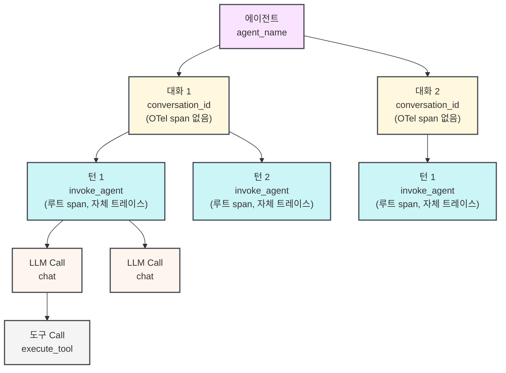

W&amp;B Weave SDK를 사용해 멀티턴 에이전트형 애플리케이션을 계측하고, 에이전트의 동작을 확인하고 디버그하며 평가하는 방법을 알아보세요. 이 가이드는 에이전트를 구축하거나 통합하면서 대화, 턴, LLM Call, 도구 실행을 구조화된 방식으로 파악하려는 개발자를 위한 것입니다.

에이전트용 Weave SDK는 멀티턴 에이전트 대화의 전체 라이프사이클을 모델링합니다. 즉, 여러 대화를 소유하는 에이전트, 턴을 함께 묶는 대화, 각각의 사용자-에이전트 상호작용(턴), 턴 내의 LLM Call, 그리고 LLM이 트리거하는 도구 실행까지 포함합니다. 트레이스는 Weave 프로젝트의 **Agents** 탭에 표시됩니다. 각 대화에는 중첩된 도구 Call, 토큰 사용량, feedback이 포함된 멀티턴 타임라인이 표시됩니다.

Weave는 분산 트레이싱을 위한 개방형 표준인 [OpenTelemetry (OTel)](https://opentelemetry.io/docs/concepts/)을 기반으로 구축되었습니다. 모든 턴, LLM Call, 도구 Call은 OTel *span*(하나의 오퍼레이션에 대한 구조화된 기록)을 내보냅니다. 각 span에는 `gen_ai.agent.name` 및 `gen_ai.conversation.id`와 같은 [GenAI semantic-convention](https://opentelemetry.io/docs/specs/semconv/gen-ai/) 속성이 태그로 지정됩니다.

개별 함수를 Ops로 `@weave.op` decorator를 사용해 트레이싱하는 경우에는 [LLM 애플리케이션 트레이스](/ko/weave/guides/tracking/tracing)를 참조하세요.

<div id="before-you-begin">
  ## 시작하기 전에
</div>

시작하려면 `weave` 패키지를 설치하고 프로젝트를 초기화하세요. 이 단계에서는 팀과 프로젝트를 Weave에 등록하여 SDK가 UI에서 spans를 올바른 위치로 라우팅하도록 합니다.

<Tabs>
  <Tab title="Python">
    ```bash lines
    pip install weave
    ```

    `[YOUR-TEAM]`은 W&amp;B 팀 이름으로, `[YOUR-PROJECT]`는 W&amp;B 프로젝트 이름으로 바꾸세요.

    ```python lines
    import weave

    weave.init("[YOUR-TEAM]/[YOUR-PROJECT]")
    ```

    `start_conversation()`, `start_turn()`, `start_llm()`, `start_tool()`, `start_subagent()`를 호출하기 전에 `weave.init()`를 먼저 호출하세요. 트레이싱이 비활성화되어 있거나 init 호출이 없으면 모든 에이전트 트레이싱 함수는 조용히 no-op로 동작하므로, 프로덕션 코드에 계측을 그대로 남겨 두고 설정을 통해 제어할 수 있습니다.
  </Tab>

  <Tab title="TypeScript">
    ```bash lines
    npm install weave
    ```

    `[YOUR-TEAM]`은 W&amp;B 팀 이름으로, `[YOUR-PROJECT]`는 W&amp;B 프로젝트 이름으로 바꾸세요.

    ```typescript lines twoslash
    // @noErrors
    import * as weave from 'weave';

    await weave.init('[YOUR-TEAM]/[YOUR-PROJECT]');
    ```

    `startConversation()`, `startTurn()`, `startLLM()`, `startTool()`, `startSubagent()`를 호출하기 전에 `weave.init()`를 먼저 호출하세요. 트레이싱이 비활성화되어 있거나 init 호출이 없으면 모든 에이전트 트레이싱 함수는 조용히 no-op로 동작하므로, 프로덕션 코드에 계측을 그대로 남겨 두고 설정을 통해 제어할 수 있습니다.
  </Tab>
</Tabs>

<div id="the-agent-data-model">
  ## 에이전트 데이터 모델
</div>

Weave는 에이전트 동작을 일대다 관계의 계층 구조로 모델링합니다. 각 에이전트는 여러 대화를 가질 수 있고, 각 대화는 여러 턴을 가질 수 있으며, 각 턴은 여러 LLM Call을 가질 수 있고, 각 LLM Call은 여러 도구 Call을 트리거할 수 있습니다.

| 개념           | Weave SDK 클래스  | OTel span 유형                                | 설명                                                    | 레퍼런스 페이지                                                                                                                           |
| ------------ | -------------- | ------------------------------------------- | ----------------------------------------------------- | ---------------------------------------------------------------------------------------------------------------------------------- |
| 에이전트         | *(클래스 없음)*     | *(span 없음, `agent_name` 속성으로 그룹화됨)*         | Agents 탭의 에이전트형 애플리케이션으로, 하나 이상의 대화를 포함합니다  |                                                                                                                                    |
| 대화 | `Conversation` | *(span 없음, 턴은 `conversation_id` 속성으로 그룹화됨)* | 하나 이상의 턴을 포함하는 대화 또는 run입니다.                          | [Python](/ko/weave/reference/python-sdk#class-conversation) <br /> [TypeScript](/ko/weave/reference/typescript-sdk/classes/conversation) |
| 턴            | `Turn`         | `invoke_agent`                              | 사용자 메시지 1개와 에이전트의 전체 응답입니다.                           | [Python](/ko/weave/reference/python-sdk#class-turn) <br /> [TypeScript](/ko/weave/reference/typescript-sdk/classes/turn)                 |
| LLM Call     | `LLM`          | `chat`                                      | 언어 모델 API에 대한 단일 LLM Call입니다.                         | [Python](/ko/weave/reference/python-sdk#class-llm) <br /> [TypeScript](/ko/weave/reference/typescript-sdk/classes/llm)                   |
| 도구 Call      | `Tool`         | `execute_tool`                              | LLM 응답으로 트리거되는 단일 도구 Call입니다.                         | [Python](/ko/weave/reference/python-sdk#class-tool) <br /> [TypeScript](/ko/weave/reference/typescript-sdk/classes/tool)                 |
| 하위 에이전트 Call | `SubAgent`     | `invoke_agent`                              | 중첩된 에이전트 호출로, 일반적으로 한 에이전트가 다른 에이전트에 작업을 위임할 때 발생합니다. | [Python](/ko/weave/reference/python-sdk#class-subagent) <br /> [TypeScript](/ko/weave/reference/typescript-sdk/classes/subagent)         |

다음 다이어그램은 하나의 에이전트에 여러 대화가 있고, 하나의 대화에 여러 턴이 있으며, 이런 식으로 이어지는 구조를 보여줍니다.



대화는 상위 span이 아니라 공통 `conversation_id` 속성을 기준으로 턴을 그룹화하므로, 각 턴이 자체 OTel 트레이스를 시작합니다. 이 설계는 분산 트레이싱과 병렬 실행을 지원합니다. 클라이언트는 서버 측 집계 없이 span을 OTel collector로 직접 전송합니다.

<Tip>
  Claude Agent SDK 또는 Codex와 같은 SDK나 하니스와 Weave를 통합하려면 [Trace agent integrations](/ko/weave/guides/tracking/trace-agent-integrations)를 참조하세요. Weave는 빠르게 통합할 수 있도록 여러 에이전트 구축 SDK와 에이전트 하니스에 자동 patch를 적용합니다.
</Tip>

<div id="agent-tracing-apis">
  ## 에이전트 트레이싱 API
</div>

다음 섹션에서는 각 최상위 트레이싱 함수와 해당 함수가 받는 인수를 설명합니다. 이를 사용해 이전 섹션에서 설명한 데이터 모델의 대화, 턴, LLM Call, 도구 Call 계층을 계측하세요.

Weave는 다음과 같은 최상위 함수를 제공합니다. 각 함수의 반환값은 컨텍스트 관리자(Python에서는 `with`, TypeScript에서는 `try/finally` 사용)로 사용할 수 있는 객체이거나, `.end()`를 호출해 수동으로 종료할 수 있는 객체입니다.

<div id="start-a-conversation">
  ### 대화 시작
</div>

`start_conversation()` (Python) 또는 `startConversation()` (TypeScript)은 모든 하위 span에 `conversation_id` 속성을 추가해 Agents 탭에서 턴이 그룹화되도록 합니다. `conversation_id` / `conversationId`를 전달하는 경우, 해당 값은 대화가 유지되는 동안 일관되게 유지되어야 합니다. 기존 대화에 새 턴을 추가하려면 동일한 ID를 재사용하세요. 이를 생략하면 SDK가 UUID를 자동으로 생성합니다.

활성 대화는 컨텍스트(Python의 `ContextVar` 또는 Node.js의 `AsyncLocalStorage`)에 저장되므로, 동일한 비동기 컨텍스트에서 실행되는 코드는 대화 객체를 명시적으로 전달하지 않아도 `weave.get_current_conversation()` / `weave.getCurrentConversation()`으로 이를 조회할 수 있습니다.

<Tabs>
  <Tab title="Python">
    ```python lines
    conversation = weave.start_conversation(
        agent_name="my-agent",    # 선택: UI에서 에이전트를 식별합니다. 생략하면 대화가 이름이 지정된 에이전트로 그룹화되지 않습니다.
        conversation_id="",       # 선택: 턴을 그룹화하기 위한 안정적인 ID이며, 비어 있으면 자동 생성됩니다.
        model="",                 # 선택: 이 대화의 턴에 사용할 기본 모델입니다.
        conversation_name="",     # 선택: UI에 표시되는 사람이 읽기 쉬운 레이블입니다.
        include_content=True,     # 선택: 메시지 본문을 span에서 제외하려면 False로 설정합니다.
        continue_parent_trace=False,  # 선택: 새 트레이스를 시작하는 대신 기존 OTel 트레이스에 연결합니다.
    )
    ```
  </Tab>

  <Tab title="TypeScript">
    ```typescript lines twoslash
    // @noErrors
    const conversation = weave.startConversation({
      agentName: 'my-agent',  // 선택: UI에서 에이전트를 식별합니다. 생략하면 대화가 이름이 지정된 에이전트로 그룹화되지 않습니다.
      conversationId: '',     // 선택: 턴을 그룹화하기 위한 안정적인 ID이며, 비어 있으면 자동 생성됩니다.
      model: '',              // 선택: 이 대화의 턴에 사용할 기본 모델입니다.
    });
    ```
  </Tab>
</Tabs>

<div id="start-a-turn">
  ### 턴 시작
</div>

`start_turn()` (Python)과 `startTurn()` (TypeScript)은 새 OTel 트레이스의 루트가 되는 새로운 `invoke_agent` span을 생성합니다. Weave는 타임라인 뷰에서 이 span을 사용해 사용자와 에이전트 간의 한 번의 전체 상호작용을 나타냅니다.

다음 두 가지 방법으로 호출할 수 있습니다:

* **최상위 함수로** (`weave.start_turn(...)` / `weave.startTurn(...)`) 호출하는 방법으로, 아래 예시에 나와 있습니다. 컨텍스트에서 활성 대화를 찾아 해당 대화 ID를 상속받습니다. 활성 대화가 없으면 Weave는 `conversation_id` 없이 턴을 생성하며 다른 턴과 함께 그룹화하지 않습니다.
* 참조를 보유한 대화의 **인스턴스 메서드로** (`conversation.start_turn(...)` / `conversation.startTurn(...)`) 호출하는 방법입니다. 컨텍스트 관리자 블록 내부처럼 범위 내에 명시적인 대화 객체가 있을 때 유용합니다. 아래의 &quot;Context manager or try-finally pattern&quot; 예시는 이 형식을 사용합니다. 두 SDK의 `Conversation`, `Turn`, `LLM`, `Tool`, `SubAgent` 레퍼런스 페이지로 직접 연결되는 링크는 위의 데이터 모델 표를 참조하세요.

<Tabs>
  <Tab title="Python">
    ```python lines
    turn = weave.start_turn(
        user_message="What is the weather in Tokyo?",  # 사용자의 입력 텍스트입니다.
        agent_name="my-agent",   # 선택 사항: 대화 수준의 에이전트 이름을 재정의합니다.
        model="gpt-4o",          # 선택 사항: 이 턴에 사용되는 모델입니다.
    )
    ```
  </Tab>

  <Tab title="TypeScript">
    ```typescript lines twoslash
    // @noErrors
    const turn = weave.startTurn({
      agentName: 'my-agent',  // 선택 사항: 대화 수준의 에이전트 이름을 재정의합니다.
      model: 'gpt-4o',        // 선택 사항: 이 턴에 사용되는 모델입니다.
    });
    ```
  </Tab>
</Tabs>

<div id="start-an-llm-call">
  ### LLM Call 시작
</div>

`start_llm()` / `startLLM()`은 현재 턴 아래에 중첩되는 `chat` span을 생성합니다. Weave는 이 span을 사용해 Agents 뷰에서 토큰 사용량, 모델 이름, 입력 및 출력 메시지, 추론을 표시합니다.

<Tabs>
  <Tab title="Python">
    ```python lines
    llm = weave.start_llm(
        model="gpt-4o",             # 모델 식별자입니다.
        provider_name="openai",     # 선택: 공급자 이름(예: "openai", "anthropic")입니다. 아래 참고를 확인하세요.
        system_instructions=["Be concise."],  # 선택: system 프롬프트 string 목록입니다.
    )
    ```
  </Tab>

  <Tab title="TypeScript">
    ```typescript lines twoslash
    // @noErrors
    const llm = weave.startLLM({
      model: 'gpt-4o',          // 모델 식별자입니다.
      providerName: 'openai',   // 선택: 공급자 이름(예: "openai", "anthropic")입니다. 아래 참고를 확인하세요.
    });
    ```
  </Tab>
</Tabs>

LLM Call이 완료되면 닫히기 전에 응답 데이터를 `llm` 객체에 할당하세요:

<Tabs>
  <Tab title="Python">
    ```python lines
    with weave.start_llm(model="gpt-4o", provider_name="openai") as llm:
        response = openai_client.chat.completions.create(...)
        llm.input_messages = [Message(role="user", content="...")]
        llm.output_messages = [Message(role="assistant", content=response.choices[0].message.content)]
        llm.usage = Usage(
            input_tokens=response.usage.prompt_tokens,
            output_tokens=response.usage.completion_tokens,
        )
    ```
  </Tab>

  <Tab title="TypeScript">
    ```typescript lines twoslash
    // @noErrors
    const llm = weave.startLLM({ model: 'gpt-4o', providerName: 'openai' });
    try {
      const response = await openaiClient.chat.completions.create({ ... });
      llm.record({
        inputMessages: [{ role: 'user', content: '...' }],
        outputMessages: [{ role: 'assistant', content: response.choices[0].message.content ?? '' }],
        usage: {
          inputTokens: response.usage?.prompt_tokens,
          outputTokens: response.usage?.completion_tokens,
        },
      });
    } finally {
      llm.end();
    }
    ```

    `llm.record()`는 한 번의 호출로 `inputMessages`, `outputMessages`, `usage`, `reasoning`을 할당하는 단축 메서드입니다. 원한다면 각 속성을 개별적으로 계속 설정할 수도 있습니다. Python SDK는 동일한 메서드를 `llm.record(...)`로 제공하며, snake&#95;case 키워드 인수를 사용합니다.
  </Tab>
</Tabs>

`provider_name` / `providerName`은 명시적으로 전달하세요. Weave는 모델 문자열에서 이를 추론하지 않습니다.

<div id="start-a-tool-call">
  ### 도구 Call 시작
</div>

`start_tool()` / `startTool()`은 `execute_tool` span을 생성합니다. 이 span은 컨텍스트에서 현재 활성화된 OTel span의 하위 span이 됩니다(일반적으로 도구 Call을 생성한 LLM 호출의 `chat` span).

<Tabs>
  <Tab title="Python">
    ```python lines
    tool = weave.start_tool(
        name="get_weather",                  # LLM에 선언된 도구 이름입니다.
        arguments='{"city": "Tokyo"}',       # 도구 인수의 JSON string입니다.
        tool_call_id="call_abc123",          # 선택 사항: LLM 응답의 도구 Call ID입니다.
    )
    ```
  </Tab>

  <Tab title="TypeScript">
    ```typescript lines twoslash
    // @noErrors
    const tool = weave.startTool({
      name: 'get_weather',            # LLM에 선언된 도구 이름입니다.
      args: '{"city": "Tokyo"}',      # 선택 사항: 도구 인수의 JSON string입니다.
      toolCallId: 'call_abc123',      # 선택 사항: LLM 응답의 도구 Call ID입니다.
    });
    ```
  </Tab>
</Tabs>

닫기 전에 도구 결과를 부여하세요:

<Tabs>
  <Tab title="Python">
    ```python lines
    with weave.start_tool(name="get_weather", arguments='{"city": "Tokyo"}') as tool:
        result = get_weather_api("Tokyo")
        tool.result = result  # dict, 목록 또는 string을 받을 수 있습니다. 자동으로 JSON 인코딩됩니다.
    ```
  </Tab>

  <Tab title="TypeScript">
    ```typescript lines twoslash
    // @noErrors
    const tool = weave.startTool({ name: 'get_weather', args: '{"city": "Tokyo"}' });
    try {
      tool.result = await getWeatherApi('Tokyo');
    } finally {
      tool.end();
    }
    ```
  </Tab>
</Tabs>

<div id="usage-patterns-for-agent-tracing">
  ## 에이전트 트레이싱 사용 패턴
</div>

다음 섹션에서는 에이전트 코드 구조에 따라 이러한 함수들을 어떻게 조합할 수 있는지 설명합니다.

아래 예시에서는 Weave SDK의 두 가지 유형을 사용합니다.

* `Message` ([Python](/ko/weave/reference/python-sdk#class-message) · [TypeScript](/ko/weave/reference/typescript-sdk/interfaces/message))는 대화의 단일 항목을 나타냅니다. 예를 들어 사용자 입력, 어시스턴트 응답, system 프롬프트, 또는 도구 결과가 이에 해당합니다. 모델이 무엇을 입력받았는지 기록하려면 메시지 목록을 `llm.input_messages` / `llm.inputMessages`에 할당하고, 어떤 출력을 생성했는지 기록하려면 `llm.output_messages` / `llm.outputMessages`에 할당하세요.
* `Usage` ([Python](/ko/weave/reference/python-sdk#class-usage) · [TypeScript](/ko/weave/reference/typescript-sdk/interfaces/usage))는 LLM 응답의 token 수를 캡처하며, `llm.usage`에 할당됩니다.

Weave는 이 두 가지를 모두 사용해 Agents 뷰에 각 LLM 호출의 입력, 출력, token 사용량을 표시합니다.

<div id="context-manager-or-try-finally-pattern">
  ### 컨텍스트 매니저 또는 try-finally 패턴
</div>

대부분의 에이전트에는 Python에서는 컨텍스트 매니저 패턴을, TypeScript에서는 try-finally 패턴을 사용하는 방식이 권장됩니다. 예외가 발생하더라도 블록이 끝날 때 span이 닫히고 전송됩니다.

Weave는 현재 활성 대화, 턴, LLM 호출을 컨텍스트에 저장하므로, 블록 내에서 호출되는 모든 함수는 상위를 명시적으로 참조하지 않아도 `start_llm()` / `startLLM()` 또는 `start_tool()` / `startTool()`을 호출할 수 있습니다. 이 방식은 코드가 동일한 async 컨텍스트에서 실행되는 한 모듈 경계를 넘어도 작동합니다. 호출 스택 어디에서든 현재 활성 객체를 조회하려면 `weave.get_current_conversation()` / `weave.getCurrentConversation()`, `weave.get_current_turn()` / `weave.getCurrentTurn()`, `weave.get_current_llm()` / `weave.getCurrentLLM()`을 사용하세요.

<Tabs>
  <Tab title="Python">
    ```python lines highlight="13,14,17,25,29"
    import weave
    from weave.conversation import Message, Usage

    # 플레이스홀더 함수입니다. 자체 구현으로 바꾸세요.
    def call_openai(*args, **kwargs):
        pass  # 자체 LLM 클라이언트 호출로 바꾸세요.

    def get_weather_api(city: str) -> str:
        return "24°C, sunny"  # 자체 날씨 API 호출로 바꾸세요.

    weave.init("[YOUR-TEAM]/[YOUR-PROJECT]")

    with weave.start_conversation(agent_name="weather-bot") as conversation:
        with conversation.start_turn(user_message="What is the weather in Tokyo?") as turn:

            # 첫 번째 LLM Call: 도구 Call을 반환합니다.
            with weave.start_llm(model="gpt-4o", provider_name="openai") as llm:
                response = call_openai(...)
                llm.input_messages = [Message(role="user", content="What is the weather?")]
                llm.think("User wants weather data, I should call get_weather.")
                llm.output("Let me check the weather for you.")
                llm.usage = Usage(input_tokens=100, output_tokens=20)

                # 도구 Call: 이를 요청한 LLM Call의 하위 요소입니다.
                with weave.start_tool(name="get_weather", arguments='{"city":"Tokyo"}') as tool:
                    tool.result = get_weather_api("Tokyo")  # "24°C, sunny"를 반환합니다.

            # 두 번째 LLM Call: 최종 답변을 생성합니다.
            with weave.start_llm(model="gpt-4o", provider_name="openai") as llm:
                llm.input_messages = [Message(role="user", content="What is the weather?")]
                llm.output("It is 24°C and sunny in Tokyo today.")
                llm.usage = Usage(input_tokens=150, output_tokens=30)
    ```
  </Tab>

  <Tab title="TypeScript">
    ```typescript lines highlight="11,13,16,24,35" twoslash
    // @noErrors
    import * as weave from 'weave';
    import type { Message, Usage } from 'weave';

    // 플레이스홀더 함수입니다. 자체 구현으로 바꾸세요.
    async function getWeatherApi(city: string): Promise<string> {
      return '24°C, sunny';  // 자체 날씨 API 호출로 바꾸세요.
    }

    await weave.init('[YOUR-TEAM]/[YOUR-PROJECT]');

    const conversation = weave.startConversation({ agentName: 'weather-bot' });
    try {
      const turn = conversation.startTurn({ agentName: 'weather-bot' });
      try {
        // 첫 번째 LLM Call: 도구 Call을 반환합니다.
        const llm = weave.startLLM({ model: 'gpt-4o', providerName: 'openai' });
        try {
          llm.inputMessages = [{ role: 'user', content: 'What is the weather?' }];
          llm.think('User wants weather data, I should call get_weather.');
          llm.output('Let me check the weather for you.');
          llm.usage = { inputTokens: 100, outputTokens: 20 };

          // 도구 Call: 이를 요청한 LLM Call의 하위 요소입니다.
          const tool = weave.startTool({ name: 'get_weather', args: '{"city":"Tokyo"}' });
          try {
            tool.result = await getWeatherApi('Tokyo');  // "24°C, sunny"를 반환합니다.
          } finally {
            tool.end();
          }
        } finally {
          llm.end();
        }

        // 두 번째 LLM Call: 최종 답변을 생성합니다.
        const llm2 = weave.startLLM({ model: 'gpt-4o', providerName: 'openai' });
        try {
          llm2.inputMessages = [{ role: 'user', content: 'What is the weather?' }];
          llm2.output('It is 24°C and sunny in Tokyo today.');
          llm2.usage = { inputTokens: 150, outputTokens: 30 };
        } finally {
          llm2.end();
        }
      } finally {
        turn.end();
      }
    } finally {
      conversation.end();
    }
    ```
  </Tab>
</Tabs>

<div id="manual-start-and-end-pattern">
  ### 수동으로 시작하고 종료하는 패턴
</div>

`with` 블록이나 `try/finally`를 사용할 수 없을 때는 `.end()`를 명시적으로 사용하세요. 예를 들어, span을 서로 다른 함수 호출에서 시작하고 종료하는 경우나 코루틴 외부에서 비동기 라이프사이클을 관리하는 경우가 이에 해당합니다. 생성한 모든 객체에 대해 `.end()`를 호출해 span이 종료되고 collector로 플러시되도록 하는 것은 사용자 책임입니다.

<Tabs>
  <Tab title="Python">
    ```python lines highlight="1,2,4,9,15"
    conversation = weave.start_conversation(agent_name="weather-bot")
    turn = conversation.start_turn(user_message="What is the weather?")

    llm = weave.start_llm(model="gpt-4o", provider_name="openai")
    llm.input_messages = [Message(role="user", content="What is the weather?")]
    llm.output("Let me check.")
    llm.usage = Usage(input_tokens=100, output_tokens=20)

    tool = weave.start_tool(name="get_weather", arguments='{"city": "Tokyo"}')
    tool.result = "24°C, sunny"
    tool.end()   # end()는 멱등적이므로 여러 번 호출해도 안전합니다.

    llm.end()

    llm2 = weave.start_llm(model="gpt-4o", provider_name="openai")
    llm2.output("It is 24°C and sunny in Tokyo.")
    llm2.usage = Usage(input_tokens=150, output_tokens=30)
    llm2.end()

    turn.end()
    conversation.end()
    ```
  </Tab>

  <Tab title="TypeScript">
    ```typescript lines highlight="1,2,4,9,15" twoslash
    // @noErrors
    const conversation = weave.startConversation({ agentName: 'weather-bot' });
    const turn = conversation.startTurn({ agentName: 'weather-bot' });

    const llm = weave.startLLM({ model: 'gpt-4o', providerName: 'openai' });
    llm.inputMessages = [{ role: 'user', content: 'What is the weather?' }];
    llm.output('Let me check.');
    llm.usage = { inputTokens: 100, outputTokens: 20 };

    const tool = weave.startTool({ name: 'get_weather', args: '{"city": "Tokyo"}' });
    tool.result = '24°C, sunny';
    tool.end();  // end()는 멱등적이므로 여러 번 호출해도 안전합니다.

    llm.end();

    const llm2 = weave.startLLM({ model: 'gpt-4o', providerName: 'openai' });
    llm2.output('It is 24°C and sunny in Tokyo.');
    llm2.usage = { inputTokens: 150, outputTokens: 30 };
    llm2.end();

    turn.end();
    conversation.end();
    ```
  </Tab>
</Tabs>

<div id="semantic-conventions">
  ## 시맨틱 규약
</div>

Weave SDK는 [GenAI 시맨틱 규약](https://opentelemetry.io/docs/specs/semconv/gen-ai/gen-ai-spans/)과 [GenAI 에이전트 span 규약](https://opentelemetry.io/docs/specs/semconv/gen-ai/gen-ai-agent-spans/)을 준수하는 OTel span을 내보냅니다. Weave는 어떤 OTel span이든 허용하고, 모든 속성을 저장하며 쿼리할 수 있도록 합니다. 표준 OTel span API와 Weave의 트레이싱 객체를 함께 사용해 span에 임의의 속성을 추가할 수 있습니다.

<div id="how-data-appears-in-the-weave-ui">
  ## Weave UI에서 데이터가 표시되는 방식
</div>

앞서 설명한 패턴으로 에이전트를 instrument하고 실행하면, 트레이스가 Weave 프로젝트의 `https://wandb.ai/[YOUR-TEAM]/[YOUR-PROJECT]/weave/agents`에 있는 **Agents** 탭에 표시됩니다.

* **Conversations tab**에는 모든 대화가 턴 활동 미니맵과 함께 표시됩니다.
* 대화를 클릭하면 **Conversation detail view**가 열리며, 모든 턴, 해당 LLM Call, tool execution, token 수, 그리고 첨부된 feedback이 표시됩니다.

Weave에서 Agents 데이터를 보는 방법에 대한 자세한 내용은 [에이전트 활동 보기](/ko/weave/guides/tracking/view-agent-activity)를 참조하세요.