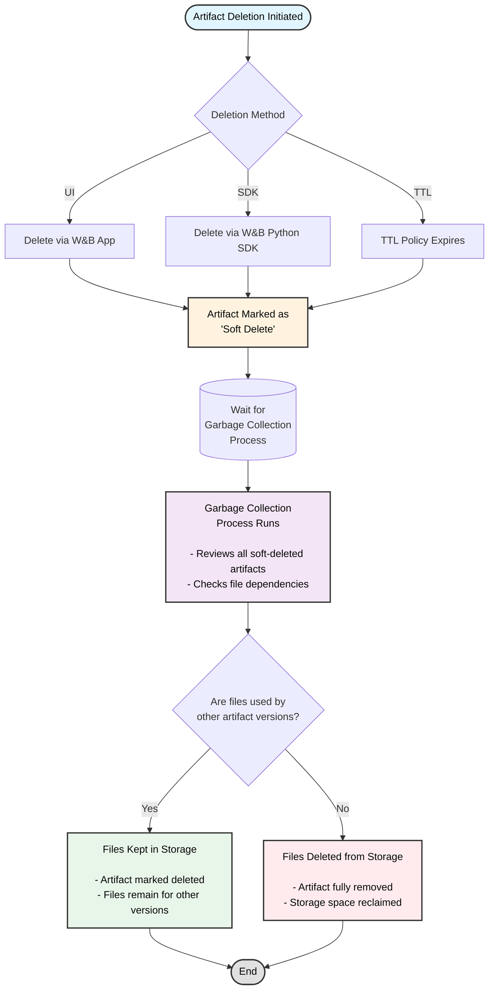

Delete artifacts interactively with the W&B App or programmatically with the W&B Python SDK. When you delete an artifact, W&B marks that artifact as a *soft-delete*. In other words, the artifact is marked for deletion but files are not immediately deleted from storage. 

The contents of the artifact remain as a soft-delete, or pending deletion state, until a regularly run garbage collection process reviews all artifacts marked for deletion. The garbage collection process deletes associated files from storage if the artifact and its associated files are not used by a previous or subsequent artifact versions.

## Artifact garbage collection workflow

The following diagram illustrates the complete artifact garbage collection process:



You can schedule when artifacts are deleted from W&B with TTL policies. For more information, see [Manage data retention with Artifact TTL policy](./ttl).

<Note>
Artifacts deleted by a TTL policy, the W&B Python SDK, or the W&B App are first soft-deleted. Soft-deleted artifacts are then garbage-collected before they are permanently deleted.
</Note>

<Note>
Deleting an entity, project, or artifact collection triggers the artifact deletion process described on this page. When you delete a run and choose to delete its associated artifacts, those artifacts follow the same soft-delete and garbage collection workflow.
</Note>

## Delete an artifact version

Delete an artifact version interactively with the W&B App or programmatically with the W&B Python SDK.

<Tabs>
<Tab title="W&B App" value="ui">
To delete an artifact version:

1. Navigate to the project that contains the artifact version you want to delete.
2. Select the **Artifacts** tab.
3. From the list of artifact types, select the type of artifact that contains the version you want to delete.
4. Click the three horizontal dots (`...`) next to the artifact version you want to delete.
5. From the dropdown, choose **Delete Version**.

</Tab>
<Tab title="W&B Python SDK" value="sdk">

Delete an artifact version programmatically with the [wandb.Artifact.delete()](/models/ref/python/experiments/artifact#delete) method. Provide the full name of the artifact. The full name consists of `<entity>/<project>/<artifact_name>:<version>`. Set the `delete_aliases` parameter to `True` to delete the artifact even if it has one or more aliases associated with it.

```python
import wandb

api = wandb.Api()

# Get the artifact by its path
artifact = api.artifact("<entity>/<project>/<artifact_name>:<version>")

# Delete the artifact version along with any aliases
artifact.delete(delete_aliases=True)
```

</Tab>
</Tabs>

## Delete multiple artifact versions

The following code example shows how to delete multiple artifact versions. Provide the entity, project name, and run ID that created the artifact as arguments to `wandb.Api.run()`. This returns a run object that you can use to access all artifact versions created by that run. Next, iterate through the artifact versions and delete the ones that match your criteria.

<Tip>
Set the `delete_aliases` parameter to `True` (`wandb.Artifact.delete(delete_aliases=True)`) to delete an artifact version and any aliases associated with it.
</Tip>

Replace the `<entity>`, `<project>`, `<run_id>`, and `<artifact_name>` placeholders with your own values:

```python
import wandb

# Initialize W&B API
api = wandb.Api()

# Get the run by its path. Consists of <entity>/<project>/<run_id>
run = api.run("<entity>/<project>/<run_id>")

# Specify the artifact name to delete versions for
artifact_name = "<artifact_name>"

# Search and delete artifact versions with the specified name
for artifact in run.logged_artifacts():
    print(f"Found artifact: {artifact.name}") # Example name run_4dfbufgq_model:v0
    # Grab only the artifact name without the version with split()
    if artifact.name.split(":")[0] == artifact_name:
        print(f"Deleting artifact version: {artifact.name}")
        artifact.delete(delete_aliases=True)
```

## Delete multiple artifact versions with a specific alias

The following code demonstrates how to delete multiple artifact versions that have a specific alias. 

Replace the `<entity>`, `<project>`, `<run_id>`, `<artifact_name>`, and `<alias>` placeholders with your own values:

```python
import wandb

# Initialize W&B API
api = wandb.Api()

# Get the run by its path. Consists of <entity>/<project>/<run_id>
run = api.run("<entity>/<project>/<run_id>")

# Specify the artifact name to delete versions for
artifact_name = "<artifact_name>"

# Specify the alias to filter artifact versions for deletion
desired_alias = "<alias>"

# Delete artifacts logged to run with alias 'v3' and 'v4
for artifact in run.logged_artifacts():
    print(f"Found artifact: {artifact.name}")
    if (artifact.name.split(":")[0] == artifact_name) and (desired_alias in artifact.aliases):
            artifact.delete(delete_aliases=True)
```

## Delete an artifact collection

<Tabs>
<Tab title="W&B App" value="ui">
To delete an artifact collection:

1. Navigate to the artifact collection you want to delete.
3. Select the three horizontal dots (`...`) next to the artifact collection name.
4. From the dropdown menu, select **Delete**.

</Tab>
<Tab title="W&B Python SDK" value="sdk">

Delete artifact collection programmatically with the [wandb.Artifact.delete()](/models/ref/python/experiments/artifact#delete) method. 

Provide the full path of the artifact collection to `wandb.Api.artifact_collection(name="")`. The full path consists of `<entity>/<project>/<artifact_collection_name>`.

```python
import wandb

# Initialize W&B API
api = wandb.Api()

# Get the artifact collection by its path. Consists of
# <entity>/<project>/<artifact_collection_name>
collection = api.artifact_collection(
    type_name = "<artifact_type>",
    name = "<entity>/<project>/<artifact_collection_name>"
)
collection.delete()
```

</Tab>
</Tabs>

## Protected aliases and deletion permissions

Artifacts with protected aliases have special deletion restrictions. [Protected aliases](/models/registry/aliases#protected-aliases) are aliases in the W&B Registry that registry admins can set to prevent unauthorized deletion.

<Note>
**Important considerations for protected aliases:**
- Artifacts with protected aliases cannot be deleted by non-registry admins.
- Within a registry, registry admins can unlink protected artifact versions and delete collections/registries that contain protected aliases.
- For source artifacts: if a source artifact is linked to a registry with a protected alias, it cannot be deleted by any user
- Registry admins can remove the protected aliases from source artifacts and then delete them.
</Note>


## Enable garbage collection based on how W&B is hosted
Garbage collection is enabled by default if you use W&B's shared cloud. Based on how you host W&B, you might need to take additional steps to enable garbage collection, this includes:


* Set the `GORILLA_ARTIFACT_GC_ENABLED` environment variable to true: `GORILLA_ARTIFACT_GC_ENABLED=true`
* Enable bucket versioning if you use [AWS](https://docs.aws.amazon.com/AmazonS3/latest/userguide/manage-versioning-examples.html), [Google Cloud](https://cloud.google.com/storage/docs/object-versioning) or any other storage provider such as [Minio](https://min.io/docs/minio/linux/administration/object-management/object-versioning.html#enable-bucket-versioning). If you use Azure, [enable soft deletion](https://learn.microsoft.com/azure/storage/blobs/soft-delete-blob-overview).
    <Note>
    Soft deletion in Azure is equivalent to bucket versioning in other storage providers.
    </Note>

The following table describes how to satisfy requirements to enable garbage collection based on your deployment type. 

The `X` indicates you must satisfy the requirement:

|                                                | Environment variable    | Enable versioning | 
| -----------------------------------------------| ------------------------| ----------------- | 
| Shared cloud                                   |                         |                   | 
| Shared cloud with [secure storage connector](/platform/hosting/data-security/secure-storage-connector)|                         | X                 | 
| Dedicated Cloud                                |                         |                   | 
| Dedicated Cloud with [secure storage connector](/platform/hosting/data-security/secure-storage-connector)|                         | X                 | 
| Self-Managed cloud                             | X                       | X                 | 
| Self-Managed on-prem                           | X                       | X                 |
 


<Note>
note
Secure storage connector is currently only available for Google Cloud Platform and Amazon Web Services.
</Note>