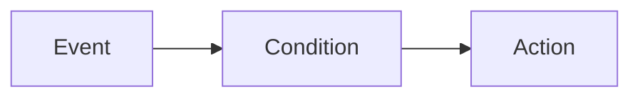

import AutomationsMentalModel from "/snippets/en/_includes/automations/mental-model.mdx";
import AutomationsActionsList from "/snippets/en/_includes/automations/actions-list.mdx";
import AutomationsBestPractices from "/snippets/en/_includes/automations/best-practices.mdx";
import AutomationsWhereToFind from "/snippets/en/_includes/automations/where-to-find-automations.mdx";

Automations exist for both **projects** and **registries**. Where you create an automation, which events you can use, and how scope works all differ. For event types by scope, see [Automation events and scopes](/models/automations/automation-events).

<AutomationsMentalModel/>

**Example:** Run fails (event) and optional run name filter (condition) then Slack notification (action). Or: alias `production` added (event) then webhook (action).

## Where to create automations

<AutomationsWhereToFind/>

## Use cases

- **Run monitoring and alerting**: Notify the team when a run fails or when a metric crosses a threshold (for example, loss goes to NaN or accuracy drops).
- **Registry CI/CD**: When a new model version is linked or an alias (such as `staging` or `production`) is added, trigger a webhook to run tests or deploy.
- **Project artifact workflows**: When a new artifact version is created or an alias is added in a project, run a downstream job or post to Slack.

For full event and scope details, see [Automation events and scopes](/models/automations/automation-events).

## Automation actions

When an event triggers an automation, it can perform one of these actions:

<AutomationsActionsList/>

For implementation details, see [Create a Slack automation](/models/automations/create-automations/slack) and [Create a webhook automation](/models/automations/create-automations/webhook).

## How automations work

To [create an automation](/models/automations/create-automations), you:

1. If required, configure [secrets](/platform/secrets) for sensitive strings the automation requires, such as access tokens, passwords, or sensitive configuration details. Secrets are defined in your **Team Settings**. Secrets are most commonly used in webhook automations to securely pass credentials or tokens to the webhook's external service without exposing it in plain text or hard-coding it in the webhook's payload.
1. Configure team-level webhook or Slack integrations to authorize W&B to post to Slack or run the webhook on your behalf. A single automation action (webhook or Slack notification) can be used by multiple automations. These actions are defined in your **Team Settings**.
1. In the project or registry, create the automation:
    1. Define the [event](/models/automations/automation-events) to watch for, such as when a new artifact version is added.
    1. Define the action to take when the event occurs (posting to a Slack channel or running a webhook). For a webhook, specify a secret to use for the access token and/or a secret to send with the payload, if required.

## Recommendations

<AutomationsBestPractices/>

## Limitations
[Run metric automations](/models/automations/automation-events/#run-metrics-events) and [run metrics z-score change automations](/models/automations/automation-events/#run-metrics-z-score-change-automations) are currently supported only in [W&B Multi-tenant Cloud](/platform/hosting/#wb-multi-tenant-cloud).

## Next steps
- [Automations tutorial](/models/automations/tutorial): Guides you to create a project automation to alert on run failures and a Registry automation to run a webhoook when an alias is added. The tutorial provides both UI and API instructions. 
- [Create an automation](/models/automations/create-automations).
- [Manage automations with the API](/models/automations/api).
- [Automation events and scopes](/models/automations/automation-events).
- [Create a secret](/platform/secrets).

<Info>
Looking for companion tutorials for automations?
- [Learn to automatically trigger a Github Action for model evaluation and deployment](https://wandb.ai/wandb/wandb-model-cicd/reports/Model-CI-CD-with-W-B--Vmlldzo0OTcwNDQw).
- [Watch a video demonstrating automatically deploying a model to a Sagemaker endpoint](https://www.youtube.com/watch?v=s5CMj_w3DaQ).
- [Watch a video series introducing automations](https://youtube.com/playlist?list=PLD80i8An1OEGECFPgY-HPCNjXgGu-qGO6&feature=shared).
</Info>
