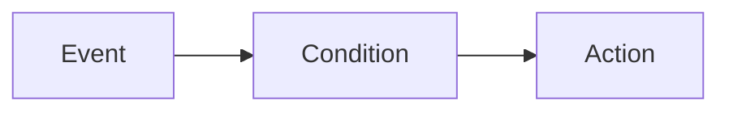

import AutomationsMentalModel from "/snippets/_includes/automations/mental-model.mdx";
import AutomationsActionsList from "/snippets/_includes/automations/actions-list.mdx";
import AutomationsBestPractices from "/snippets/_includes/automations/best-practices.mdx";
import AutomationsWhereToFind from "/snippets/_includes/automations/where-to-find-automations.mdx";

You can scope an automation to an **Organization**, a **Team**, a **Registry**, a **Registry collection**, or a **project**. An automation observes the event across everything in its scope, including projects, registries, and collections created later. Where you create an automation, which events you can use, and how scope works all differ. For event types by scope, see [Automation events and scopes](/models/automations/automation-events).

<Note>
Team-scoped and Organization-scoped automations and the [Automations hub](#automations-hub) are available on W&B Multi-tenant Cloud and on W&B Dedicated Cloud (Server v0.83.0 and later).
</Note>

<AutomationsMentalModel/>

**Example:** Run fails (event) and optional run name filter (condition) then Slack notification (action). Or: alias `production` added (event) then webhook (action).

## Where to create automations

<AutomationsWhereToFind/>

## Automations hub

The **Automations** hub is a global surface in the left navigation that aggregates every automation you can access, across all scopes and projects, in a single list. Use it to discover, inspect, and manage automations without navigating to each project or registry.

From the **Automations** hub, you can:

- View all automations you can access in one list, then filter and sort them (for example, by scope, trigger, or action).
- Use the quick filter to switch between automations you created and all automations in your organization.
- Click an automation's name to view its full configuration in a details drawer.
- View an automation's [execution history](/models/automations/view-automation-history) to check whether it succeeded or failed.
- Create an automation and choose its scope, without needing to know the scoped entry point first.
- Select multiple automations and delete them at once.

The **Automations** hub complements the **Automations** tab in each project and registry; those scoped tabs remain available for quick access.

## Use cases

- **Run monitoring and alerting**: Notify the team when a run fails or when a metric crosses a threshold (for example, loss goes to NaN or accuracy drops).
- **Registry CI/CD**: When a new model version is linked or an alias (such as `staging` or `production`) is added, trigger a webhook to run tests or deploy.
- **Project artifact workflows**: When a new artifact version is created or an alias is added in a project, run a downstream job or post to Slack.

For full event and scope details, see [Automation events and scopes](/models/automations/automation-events).

## Automation actions

When an event triggers an automation, it can perform one of these actions:

<AutomationsActionsList/>

For implementation details, see [Create a Slack automation](/models/automations/create-automations/slack) and [Create a webhook automation](/models/automations/create-automations/webhook).

## How automations work

To [create an automation](/models/automations/create-automations), you:

1. If required, configure [secrets](/platform/secrets) for sensitive strings the automation requires, such as access tokens, passwords, or sensitive configuration details. Secrets are defined in your **Team Settings**. Secrets are most commonly used in webhook automations to securely pass credentials or tokens to the webhook's external service without exposing it in plain text or hard-coding it in the webhook's payload.
1. Configure team-level webhook or Slack integrations to authorize W&B to post to Slack or run the webhook on your behalf. A single automation action (webhook or Slack notification) can be used by multiple automations. These actions are defined in your **Team Settings**.
1. In the project or registry, create the automation:
    1. Define the [event](/models/automations/automation-events) to watch for, such as when a new artifact version is added.
    1. Define the action to take when the event occurs (posting to a Slack channel or running a webhook). For a webhook, specify a secret to use for the access token and/or a secret to send with the payload, if required.

## Recommendations

<AutomationsBestPractices/>

## Limitations
- [Run metric automations](/models/automations/automation-events/#run-metrics-change) and [run metrics z-score change automations](/models/automations/automation-events/#run-metrics-z-score-change) are supported only in [W&B Multi-tenant Cloud](/platform/hosting/#wb-multi-tenant-cloud).
- At the **Team** and **Organization** scopes, the W&B App supports only artifact and collection events. Run-based events aren't available in the App at these scopes. See [Automation events and scopes](/models/automations/automation-events).

## Next steps
- [Automations tutorial](/models/automations/tutorial): Guides you to create a project automation to alert on run failures and a Registry automation to run a webhook when an alias is added. The tutorial uses the W&B App.
- [Create an automation](/models/automations/create-automations).
- [Automation events and scopes](/models/automations/automation-events).
- [Create a secret](/platform/secrets).

{/* Restore after the Create bullet above when Python SDK `create_automation` regression is fixed (internal WB-34263):
- [Manage automations with the API](/models/automations/api).
*/}

<Info>
Looking for companion tutorials for automations?
- [Learn to automatically trigger a Github Action for model evaluation and deployment](https://wandb.ai/wandb/wandb-model-cicd/reports/Model-CI-CD-with-W-B--Vmlldzo0OTcwNDQw).
- [Watch a video demonstrating automatically deploying a model to a Sagemaker endpoint](https://www.youtube.com/watch?v=s5CMj_w3DaQ).
- [Watch a video series introducing automations](https://youtube.com/playlist?list=PLD80i8An1OEGECFPgY-HPCNjXgGu-qGO6&feature=shared).
</Info>
