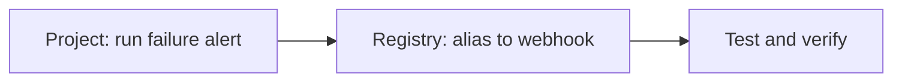

import EnterpriseCloudOnly from "/snippets/en/_includes/enterprise-cloud-only.mdx";
import AutomationsMentalModel from "/snippets/en/_includes/automations/mental-model.mdx";

<Info>
<EnterpriseCloudOnly/>
</Info>

This tutorial walks you through building an automation. Choose **Project** or **Registry** in the dropdown above to see the steps for that scope. A **project** automation alerts when a run fails (Slack). A **registry** automation triggers a webhook when an alias (for example, `production`) is added to an artifact.

<AutomationsMentalModel/>



<View title="Project">
## Prerequisites

- A W&B project.
- A [Slack integration](/models/automations/create-automations/slack#add-a-slack-integration) configured in **Team Settings**.

## Project automation: run failure alert

This automation is scoped to a **project**. When a run in that project transitions to **Failed**, W&B sends a Slack notification.

<Tabs>
<Tab title="Create in the UI">
1. Open the project and click the **Automations** tab in the sidebar, then click **Create automation**.
1. Choose the event **Run state change**. Set the state to **Failed**. Optionally add a run name or user filter to limit which runs trigger the automation.
1. Click **Next step**. Set **Action type** to **Slack notification** and select the Slack channel.
1. Click **Next step**. Give the automation a name (for example, "Run failure alert") and an optional description, then click **Create automation**.

For more detail, see [Create a Slack automation](/models/automations/create-automations/slack#create-an-automation) (Project tab).
</Tab>
<Tab title="Create with the API">
Use the public API to create the same automation with a project scope and run-state filter:

```python
import wandb
from wandb.automations import OnRunState, RunEvent, SendNotification

api = wandb.Api()

project = api.project("my-project", entity="my-team")
slack_integration = next(api.slack_integrations(entity="my-team"))

event = OnRunState(
    scope=project,
    filter=RunEvent.state.in_(["failed"]),
)
action = SendNotification.from_integration(slack_integration)

automation = api.create_automation(
    event >> action,
    name="run-failure-alert",
    description="Notify the team when a run fails.",
)
```
</Tab>
</Tabs>

## Test the automation

Start a run in the project and mark it failed (for example, `run.finish(exit_code=1)`). Within a short time you should see a Slack message with the run link and status.
</View>

<View title="Registry">
## Prerequisites

- A [webhook](/models/automations/create-automations/webhook#create-a-webhook) configured in **Team Settings**.
- A [registry](/models/registry/create_registry) with at least one collection, or reuse an existing registry.

## Registry automation: alias added to webhook

This automation is scoped to a **registry**. When an artifact in any collection in that registry gets a specific alias (for example, `production`), W&B sends a POST request to your webhook.

<Tabs>
<Tab title="Create in the UI">
1. Open the registry and click the **Automations** tab, then click **Create automation**.
1. Choose the event **An artifact alias is added**. Enter an **Alias regex** that matches the alias you care about (for example, `production` or `staging`).
1. Click **Next step**. Set **Action type** to **Webhooks** and select your webhook. If the webhook expects a payload, paste a JSON body and use [payload variables](/models/automations/create-automations/webhook#payload-variables) such as `${artifact_collection_name}` and `${artifact_version_string}`.
1. Click **Next step**. Give the automation a name and optional description, then click **Create automation**.

For more detail, see [Create a webhook automation](/models/automations/create-automations/webhook#create-an-automation) (Registry tab).
</Tab>
<Tab title="Create with the API">
Use the public API to create a registry-scoped automation that fires when an alias matching a pattern is added. You need the registry (or a collection in it) for scope and a webhook integration.

```python
import wandb
from wandb.automations import OnAddArtifactAlias, ArtifactEvent, SendWebhook

api = wandb.Api()

# Scope to a collection in the registry (or use registry scope if supported by the API)
collection = api.artifact_collection(name="my-model", type_name="model")
webhook_integration = next(api.webhook_integrations(entity="my-team"))

event = OnAddArtifactAlias(
    scope=collection,
    filter=ArtifactEvent.alias.eq("production"),
)
action = SendWebhook.from_integration(webhook_integration, payload={"event": "${event_type}", "model": "${artifact_collection_name}", "version": "${artifact_version_string}"})

automation = api.create_automation(
    event >> action,
    name="production-alias-webhook",
    description="Trigger webhook when production alias is added.",
)
```
</Tab>
</Tabs>

## Test the automation

Add the alias (for example, `production`) to an artifact version in the registry (UI or API). Your webhook endpoint should receive a POST with the payload you configured.

<Note>
You can scope the event to a collection (as above) or to a registry when the API supports it. Check the [Automations API reference](/models/ref/python/public-api/automations) and [OnAddArtifactAlias](/models/ref/python/automations/onaddartifactalias) for the current signatures.
</Note>
</View>

## Run the full tutorial in a notebook

You can run the API steps for both automations, plus list/get/update/delete examples, in a single notebook:

{/* TODO: Fix when https://github.com/wandb/examples/pull/618 merges */}
- [Automations tutorial notebook (GitHub)](https://raw.githubusercontent.com/mdlinville/examples/a43b31213c8e0642a30a202f82e174772eb687f6/colabs/automations/automations-tutorial.ipynb)

Download or clone the repo and open the notebook in Jupyter or your preferred environment. You can also open it in Google Colab from the GitHub link.

## Go further

- [Automation events and scopes](/models/automations/automation-events) for all project and registry event types.
- [Create a Slack automation](/models/automations/create-automations/slack) and [Create a webhook automation](/models/automations/create-automations/webhook) for full UI and payload details.
- [Manage automations with the API](/models/automations/api) for list, get, update, and delete examples.
- [Automations API reference](/models/ref/python/public-api/automations) for all event and action classes.
