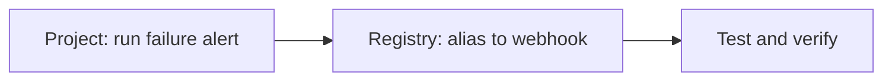

import EnterpriseCloudOnly from "/snippets/en/_includes/enterprise-cloud-only.mdx";
import AutomationsMentalModel from "/snippets/en/_includes/automations/mental-model.mdx";

<Info>
<EnterpriseCloudOnly/>
</Info>

These tutorials walk you through building an automation using the UI or the API. Choose one:

- **[Project automation tutorial](/models/automations/project-automation-tutorial)**: Alert when a run fails (Slack notification).
- **[Registry automation tutorial](/models/automations/registry-automation-tutorial)**: Trigger a webhook when an alias (for example, `production`) is added to an artifact.

<AutomationsMentalModel/>

