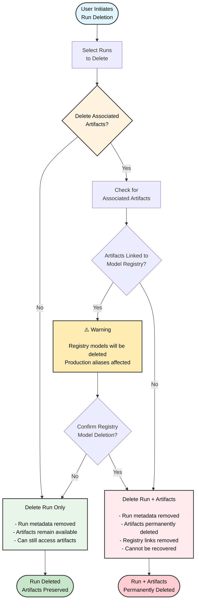

Delete one or more runs from a project with the W&B App.

1. Navigate to the project that contains the runs you want to delete.
2. Select the **Runs** tab.
3. Select the checkbox next to the runs you want to delete.
4. Choose the **Delete** button (trash can icon) above the table.
5. From the drawer that appears, choose **Delete**.

<Note>
A run ID cannot be reused, even after the run is deleted. Instead, the run will fail with an error.
</Note>

<Note>
For projects that contain a large number of runs, you can use either the search bar to filter runs you want to delete using Regex or the filter button to filter runs based on their status, tags, or other properties.
</Note>

### Run deletion flowchart

The following diagram illustrates the complete run deletion process, including the handling of associated artifacts and Registry links:

<Warning >
When you delete a run and choose to delete associated artifacts, the artifacts are permanently removed and can't be recovered, even if the run is restored later. This includes artifacts linked to the Registry.
</Warning>