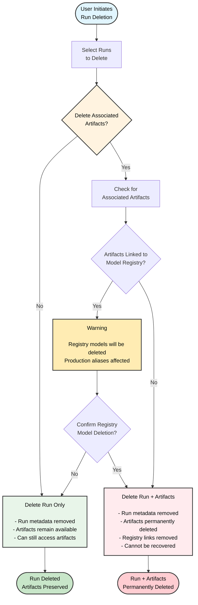

Delete runs from a W&B project interactively in the W&B App or programmatically with the W&B Public API. This page also explains when W&B removes deleted run data from object storage on self-managed deployments.

<Tabs>
<Tab title="W&B App" value="ui">
1. Navigate to the project that contains the runs you want to delete.
2. Select the **Runs** tab.
3. Select the checkbox next to the runs you want to delete.
4. Select the **Delete** button (trash can icon) above the table.
5. From the drawer that appears, select **Delete**.

W&B removes the selected runs from the project.

For projects that contain many runs, use the search bar to filter runs with Regex, or use the filter button to filter runs by status, tags, or other properties.
</Tab>

<Tab title="Python" value="python">
You can delete runs programmatically with [`Run.delete()`](/models/ref/python/public-api/run#method-run-delete). To also remove artifacts associated with the run, set `delete_artifacts=True`.

Replace `[ENTITY]` with your W&B entity name and `[PROJECT]` with your project name.

```python
import wandb

api = wandb.Api()
runs = api.runs("[ENTITY]/[PROJECT]")
for run in runs:
    if run.state == "finished":  # Replace with your own condition
        run.delete(delete_artifacts=False)
```

To remove individual files attached to a run, like logged media:
1. Obtain the relevant file handles with [`Run.files()`](/models/ref/python/public-api/run#method-run-files).
2. Use [`File.delete()`](/models/ref/python/public-api/file#method-file-delete) to delete individual files.

</Tab>
</Tabs>

You can't reuse a run ID, even after you delete the run. If you try to start a new run with that ID, it fails with an error.

<Warning>
When you delete a run and choose to delete associated artifacts, the artifacts are permanently removed and can't be recovered, even if the run is restored later. This includes artifacts linked to the Registry.
</Warning>

## Run deletion flowchart

The following diagram illustrates the run deletion process, including how W&B handles associated artifacts and Registry links:


```mermaid
graph TB
    Start([User Initiates<br/>Run Deletion]) --> RunSelect[Select Runs<br/>to Delete]
    RunSelect --> DeletePrompt{Delete Associated<br/>Artifacts?}
    DeletePrompt -->|No| DeleteRunOnly[Delete Run Only<br/><br/>- Run metadata removed<br/>- Artifacts remain available<br/>- Can still access artifacts]
    DeletePrompt -->|Yes| CheckArtifacts[Check for<br/>Associated Artifacts]
    CheckArtifacts --> HasRegistry{Artifacts Linked to<br/>Model Registry?}
    HasRegistry -->|Yes| RegistryWarning[Warning<br/><br/>Registry models will be deleted<br/>Production aliases affected]
    HasRegistry -->|No| DirectDelete
    RegistryWarning --> ConfirmRegistry{Confirm Registry<br/>Model Deletion?}
    ConfirmRegistry -->|No| DeleteRunOnly
    ConfirmRegistry -->|Yes| DirectDelete[Delete Run + Artifacts<br/><br/>- Run metadata removed<br/>- Artifacts permanently deleted<br/>- Registry links removed<br/>- Cannot be recovered]
    DeleteRunOnly --> PartialEnd([Run Deleted<br/>Artifacts Preserved])
    DirectDelete --> FullEnd([Run + Artifacts<br/>Permanently Deleted])
    style Start fill:#e1f5fe,stroke:#333,stroke-width:2px,color:#000
    style DeletePrompt fill:#fff3e0,stroke:#333,stroke-width:2px,color:#000
    style RegistryWarning fill:#ffecb3,stroke:#333,stroke-width:2px,color:#000
    style DirectDelete fill:#ffebee,stroke:#333,stroke-width:2px,color:#000
    style DeleteRunOnly fill:#e8f5e9,stroke:#333,stroke-width:2px,color:#000
    style PartialEnd fill:#c8e6c9,stroke:#333,stroke-width:2px,color:#000
    style FullEnd fill:#ffcdd2,stroke:#333,stroke-width:2px,color:#000
```

## When deleted run data is removed from storage

When you delete a run, W&B removes it from the W&B App, but the underlying data can persist in object storage for a configurable retention period on self-managed deployments. This section describes how that retention works and what to expect for bucket usage after deletion.

On [W&B Dedicated Cloud](/platform/hosting/hosting-options/dedicated-cloud) and [W&B Self-Managed](/platform/hosting/hosting-options/self-managed), the `GORILLA_DATA_RETENTION_PERIOD` environment variable controls how long W&B retains deleted run data before permanently removing it from object storage. This setting doesn't remove artifacts; artifacts follow the deletion and garbage collection flow described in [Delete an artifact](/models/artifacts/delete-artifacts).

When you set or change `GORILLA_DATA_RETENTION_PERIOD`, the effect is irreversible for data past the retention window. Back up your database and bucket before you enable or tighten retention. For the reference table and warnings, see [Configure environment variables](/platform/hosting/env-vars).

Even after run or file deletion and retention processing, bucket usage can lag while background jobs catch up. W&B doesn't guarantee immediate reclamation of object storage. For an overview of artifacts versus run data, timing expectations, and optional operator actions, see [Manage bucket storage and costs](/platform/hosting/managing-bucket-storage).

<Note>
If deletions don't appear as expected in the W&B App when you use the Public API, upgrade the W&B Python SDK to a current release and retry.
</Note>
