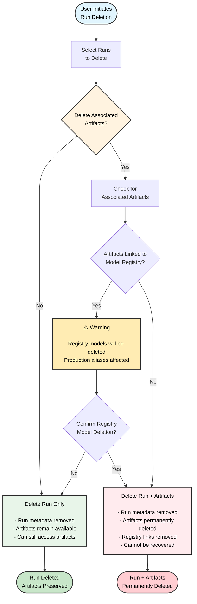

## Delete runs
Delete runs from a project with the W&B App or the Python API.

<Tabs>
<Tab title="W&B App" value="ui">
1. Navigate to the project that contains the runs you want to delete.
2. Select the **Runs** tab.
3. Select the checkbox next to the runs you want to delete.
4. Choose the **Delete** button (trash can icon) above the table.
5. From the drawer that appears, choose **Delete**.

For projects that contain a large number of runs, you can use either the search bar to filter runs you want to delete using Regex or the filter button to filter runs based on their status, tags, or other properties.
</Tab>

<Tab title="Python" value="python">


Use the W&B Public API to delete runs programmatically. Delete operations can be performed on single runs or multiple runs at once.

Use [`wandb.Api.Run.delete()`](/models/ref/python/public-api/run#method-run-delete) to delete a single run. Specify the run path using the format `entity/project/runID`.

```python
import wandb

api = wandb.Api()

run_path = "entity/project/runID"
run = api.run(path=run_path)
run.delete()
```

Use `wandb.Api.runs()` to retrieve multiple runs from a project, then delete each run. The following example deletes all runs in a project:

```python
import wandb

api = wandb.Api()

entity = "entity"
project = "project"

runs = api.runs(
    path=f"{entity}/{project}")

for run in runs:
    run.delete()
```

You can use filters to delete only runs that match specific criteria, such as their creation date, tags, or other metadata. The following example previews and deletes runs created before a specified UTC timestamp:

```python
import wandb

api = wandb.Api()

entity = "entity"
project = "project"
cutoff = "2024-01-01T00:00:00Z"  # delete runs created before this UTC timestamp

runs = api.runs(
    path=f"{entity}/{project}",
    filters={"createdAt": {"$lt": cutoff}},
    order="+created_at",
)

# Dry run first
runs_to_delete = list(runs)
print(f"Found {len(runs_to_delete)} runs to delete:")
for run in runs_to_delete:
    print(run.id, run.name, run.created_at)

confirm = input("Type DELETE to permanently delete these runs: ")
if confirm == "DELETE":
    for run in runs_to_delete:
        print(f"Deleting {run.path}")
        run.delete()  # or run.delete(delete_artifacts=True)
```

To remove individual files attached to a run, like logged media:
1. Obtain the relevant file handles with [`wandb.Api.Run.files()`](/models/ref/python/public-api/run#method-run-files).
1. Use [`File.delete()`](/models/ref/python/public-api/file#method-file-delete) to delete individual files.

</Tab>
</Tabs>

A run ID cannot be reused, even after the run is deleted. Instead, the run will fail with an error.

<Warning>
When you delete a run and choose to delete associated artifacts, the artifacts are permanently removed and can't be recovered, even if the run is restored later. This includes artifacts linked to the Registry.
</Warning>

## Run deletion flowchart

The following diagram illustrates the complete run deletion process, including the handling of associated artifacts and Registry links:


```mermaid
graph TB
    Start([User Initiates<br/>Run Deletion]) --> RunSelect[Select Runs<br/>to Delete]
    RunSelect --> DeletePrompt{Delete Associated<br/>Artifacts?}
    DeletePrompt -->|No| DeleteRunOnly[Delete Run Only<br/><br/>- Run metadata removed<br/>- Artifacts remain available<br/>- Can still access artifacts]
    DeletePrompt -->|Yes| CheckArtifacts[Check for<br/>Associated Artifacts]
    CheckArtifacts --> HasRegistry{Artifacts Linked to<br/>Model Registry?}
    HasRegistry -->|Yes| RegistryWarning[⚠️ Warning<br/><br/>Registry models will be deleted<br/>Production aliases affected]
    HasRegistry -->|No| DirectDelete
    RegistryWarning --> ConfirmRegistry{Confirm Registry<br/>Model Deletion?}
    ConfirmRegistry -->|No| DeleteRunOnly
    ConfirmRegistry -->|Yes| DirectDelete[Delete Run + Artifacts<br/><br/>- Run metadata removed<br/>- Artifacts permanently deleted<br/>- Registry links removed<br/>- Cannot be recovered]
    DeleteRunOnly --> PartialEnd([Run Deleted<br/>Artifacts Preserved])
    DirectDelete --> FullEnd([Run + Artifacts<br/>Permanently Deleted])
    style Start fill:#e1f5fe,stroke:#333,stroke-width:2px,color:#000
    style DeletePrompt fill:#fff3e0,stroke:#333,stroke-width:2px,color:#000
    style RegistryWarning fill:#ffecb3,stroke:#333,stroke-width:2px,color:#000
    style DirectDelete fill:#ffebee,stroke:#333,stroke-width:2px,color:#000
    style DeleteRunOnly fill:#e8f5e9,stroke:#333,stroke-width:2px,color:#000
    style PartialEnd fill:#c8e6c9,stroke:#333,stroke-width:2px,color:#000
    style FullEnd fill:#ffcdd2,stroke:#333,stroke-width:2px,color:#000
```

## When deleted run data is removed from storage

On [W&B Dedicated Cloud](/platform/hosting/hosting-options/dedicated-cloud) and [W&B Self-Managed](/platform/hosting/hosting-options/self-managed), the `GORILLA_DATA_RETENTION_PERIOD` environment variable controls how long **deleted run data** is retained before it can be permanently removed from object storage. **Artifacts are not removed by this setting**; they follow the artifact deletion and garbage collection flow described in [Delete an artifact](/models/artifacts/delete-artifacts).

Setting or changing `GORILLA_DATA_RETENTION_PERIOD` is irreversible for data past the retention window. Back up your database and bucket before enabling or tightening retention. See [Configure environment variables](/platform/hosting/env-vars) for the reference table and warnings.

Even after run or file deletion and retention processing, **bucket usage can lag** while background jobs catch up. W&B does not guarantee immediate reclamation of object storage. For a full overview of artifacts versus run data, timing expectations, and optional operator actions, see [Manage bucket storage and costs](/platform/hosting/managing-bucket-storage).

<Note>
If deletions do not appear as expected in the W&B App when using the Public API, upgrade the W&B Python SDK to a current release and retry.
</Note>
