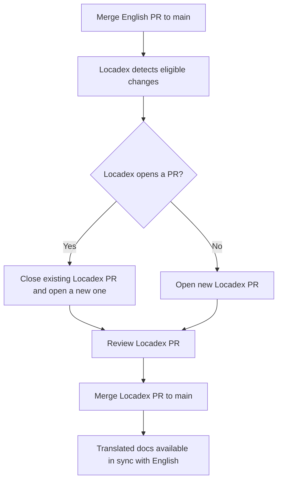

# Locadex auto-translation for tech writers

This runbook is for W&B English-language tech writers who work in the `wandb/docs` repository. It assumes the Locadex integration is enabled on `main` and is used for translations in production.

Use it to understand the end-to-end flow, what Locadex changes in the repo, where to work in the Locadex console versus GitHub, and how to fix or improve localized content.

## Overview and scope

### What Locadex localizes

General Translation [Locadex for Mintlify](https://generaltranslation.com/en-US/docs/locadex/mintlify) generates and updates localized copies of source content based on `gt.config.json` at the repository root. In the current configuration, that includes:

- **MDX and Markdown pages**: English files under the repo are mirrored into locale directories (for example `ko/`, `ja/`, `fr/`) using the path transform in `gt.config.json`. Locadex keeps track of files it has already translated, and only translates newly-merged English-language changes.
- **Snippets**: Shared snippet paths are localized the same way (for example `snippets/foo.mdx` to `snippets/ko/foo.mdx` per config).
- **Table of contents and navigation**: `docs.json` is included so localized navigation and page paths stay aligned with Mintlify.
- **OpenAPI specs**: Configured OpenAPI JSON files (for example under `training/api-reference/` and `weave/reference/service-api/`) are localized per `gt.config.json`.

Locadex also applies options that affect Mintlify behavior (for example static import and relative asset handling, redirects, and header anchor behavior). Consider `gt.config.json` the source of truth for which JSON and MDX paths participate.

### What Locadex does not localize

- **Raster and vector graphics**: Image files are not swapped for locale-specific artwork. Diagrams and screenshots stay as referenced unless you add localized assets and update paths yourself.
- **Excluded prose files**: Paths listed under `files.mdx.exclude` in `gt.config.json` are not auto-translated. That includes standard repo files such as `README.md`, `CONTRIBUTING.md`, `AGENTS.md`, and similar, plus any pattern the team adds there.
- **English source of truth**: Writers continue to author and merge changes in English. Localized files are outputs of automation plus any manual edits you choose to make.

## Translation workflow on main

After Locadex is connected to the repository (GitHub app, project, and branch settings per [Locadex for Mintlify](https://generaltranslation.com/docs/locadex/mintlify)):

1. You merge an **English-only** documentation pull request into `main`.
2. Locadex detects eligible changes (per its integration rules) and starts or updates a **translation round**.
3. If a Locadex pull request is already open against `main`, Locadex **closes that PR** and makes a new one with all of the changes from the closed PR plus the newly-merged English-language changes. If no Locadex PR is open, Locadex **opens a new PR** with localized updates. Refer to [#2430](https://github.com/wandb/docs/pull/2430) for an example of a Locadex PR.
4. The docs team **reviews** the Locadex PR (depending on the situation, using spot checks, LLM-assisted review, or native speaker review).

    If you find mistakes in the Locadex PR, commit corrections into the PR branch. This will steer Locadex for future translation rounds.
5. When the Locadex PR is **merged to `main`**, Mintlify serves the updated localized sites together with English. Merging that PR publishes the updated translated docs.

### Writer checklist after your English PR merges

- [ ] In the list of open PRs, find the Locadex PR, which may predate your English PR merging, or may be created by the merge. Search for `locadex`.
- [ ] If your change is urgent for localized sites, get review and merge the Locadex PR to publish the update immediately. Otherwise, translations will be available when the Locadex PR merges.
- [ ] If terminology should change for **future** runs, update **AI Context** in the Locadex console (see below) and plan a **Retranslate** if you need existing pages regenerated.

## Locadex console versus wandb/docs repo

Use the right place for each kind of change.

| Task | Where to do it | Notes |
|------|----------------|--------|
| Add or change **target locales** or **which files** are translated | `gt.config.json` in GitHub | Requires a normal PR to `main`. Align with engineering or docs platform owners before changing include or exclude patterns. |
| **Glossary** (terms, definitions, per-locale translations, do-not-translate) | Locadex console, **Context**, **Glossary** | Bulk **import** and **export** via CSV. See [GT Glossary](https://generaltranslation.com/docs/platform/ai-context/glossary). |
| **Locale Context** (locale-specific prompts with hints about spacing, tone per locale, formatting rules) | Locadex console, **Context**, **Locale Context** | See [Locale Context](https://generaltranslation.com/docs/platform/ai-context/locale-context). |
| **Style Controls** (project-wide prompts about audience, project description, global tone) | Locadex console, **Context**, **Style Controls** | See [Style Controls](https://generaltranslation.com/docs/platform/ai-context/style-controls). |
| **Retranslate** manual retranslation of individual files after context changes | Locadex console | See [Retranslate](https://generaltranslation.com/docs/platform/translations/retranslate). Changing AI Context does not automatically rewrite all existing localized files until you retranslate. |
| **Review** machine output | Locadex PR on GitHub | Comment, request changes, push fixes, or abandon the translation round by closing the PR unmerged if your permissions allow. |
| **One-off text fix** in a localized page | Direct edit in GitHub | Edit the file under the locale directory (for example `ko/...`). Open a normal PR to `main`. If needed, make adjustments in Locadex Dashboard to avoid manual corrections going forward. |

**Important:** Glossary and prompts for docs live in the **Locadex console**, not in `gt.config.json`.

### Importing and exporting glossary and AI context

1. Sign in to the [General Translation Dashboard](https://dash.generaltranslation.com/) (Locadex console).
2. Open the project linked to `wandb/docs`.
3. Go to **Context** and choose **Glossary**, **Locale Context**, or **Style Controls** as needed.

**Glossary CSV**

- Use **Upload Context CSV** to import many terms at once. Column names must match what the console expects (for example **Term**, **Definition**, and locale columns such as **ko**). If upload fails, compare headers to the in-product help or [GT Glossary](https://generaltranslation.com/docs/platform/ai-context/glossary).
- Export or copy terms when you need a backup, review, or to share with a vendor or LLM for evaluation.

**Locale Context and Style Controls**

- Edit in the console and save. Document substantive rule changes in your team channel or internal notes so reviewers know what to expect on the next translation round.

**After changing AI Context**

- Run **Retranslate** for affected files or locales if you need existing localized pages to pick up new rules. Expect a new or updated Locadex PR afterward.

## Using an LLM to evaluate a translation round

LLMs can help you triage a large Locadex PR. They do not replace human judgment for accuracy, product terminology, or nuance. These sections describe one potential approach.

### 1. Gather inputs

- **Diff**: Point the agent at the Locadex PR diff on GitHub.
- **Rules**: Paste or summarize:
  - **Glossary** entries and **Locale Context** entries from the Locadex console. For all languages, these are included in a combined CSV export. (export or copy the relevant terms for the target locale).
  - Optional: internal prompt notes from the repository root file `locadex_prompts.md` if your team keeps evaluation rubrics there (sentence case, W&B product naming, and so on).
- **English baseline**: For sampled files, include the English source path and the localized path so the model can compare structure (headings, lists, code blocks, links).

### 2. Prompt shape (example)

Ask the model to:

- Flag **do-not-translate** violations (product names, UI labels, `wandb`, code identifiers).
- Check **glossary consistency** against the list you pasted.
- Note **broken Markdown or MDX** (broken links, malformed tables, code fence language tags).
- Call out **over-translation** (URLs, code, or English-only proper nouns translated incorrectly).
- Prefer **short, actionable findings** with file path and a suggested fix.

### 3. How to use the output

- Turn findings into GitHub review comments on the Locadex PR, or into follow-up edits after merge.
- If the same error appears in many files, fix **AI Context** (Glossary or Locale Context) and use **Retranslate** rather than hand-editing dozens of files.

## Manual corrections and updates to auto-localized content

### One-off correction after merge

If a single page or snippet is wrong but the glossary and locale rules are fine:

1. Check out a branch from `main`.
2. Edit the localized file (for example `ja/models/foo.mdx` or `snippets/ko/bar.mdx`).
3. Open a PR to `main` with a clear summary (what was wrong, why the manual fix is safe).
4. Expect the next Locadex run to touch the same file only if English source changes. If Locadex overwrites your manual fix, escalate with platform owners and consider locking or excluding patterns documented for your project.

### Systemic terminology or style fix

If the same mistake repeats across many files:

1. Update **Glossary**, **Locale Context**, or **Style Controls** in the Locadex console.
2. Use **Retranslate** so Locadex regenerates affected localized content. Review the resulting Locadex PR carefully.

### When English changes again

English merges drive the next Locadex update. Your manual localized edits may need reconciliation with new machine output. Prefer fixing English source or console context so the automation stays stable.

## Verification and testing

- After a Locadex PR merges, spot-check high-traffic pages per locale in Mintlify preview or production.
- Run `mint dev`, `mint validate`, `mint broken-links` locally when your workflow requires it (see repository `AGENTS.md`).
- Confirm OpenAPI and navigation JSON under locale paths still match product behavior for critical APIs.

## Related links

- [Locadex for Mintlify](https://generaltranslation.com/docs/locadex/mintlify)
- [GT Glossary](https://generaltranslation.com/docs/platform/ai-context/glossary)
- [Locale Context](https://generaltranslation.com/docs/platform/ai-context/locale-context)
- [Style Controls](https://generaltranslation.com/docs/platform/ai-context/style-controls)
- [Retranslate](https://generaltranslation.com/docs/platform/translations/retranslate)

## Checklist (quick reference)

- [ ] English PR merged to `main`.
- [ ] Locadex PR opened or updated. Review diff.
- [ ] Optional: LLM-assisted pass using glossary and locale rules.
- [ ] Merge Locadex PR to publish localized updates.
- [ ] For repeated errors, update console AI Context and Retranslate.
- [ ] For single-file errors, edit locale path in GitHub and PR to `main`.
