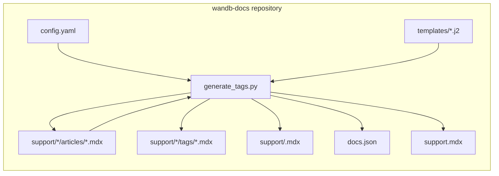
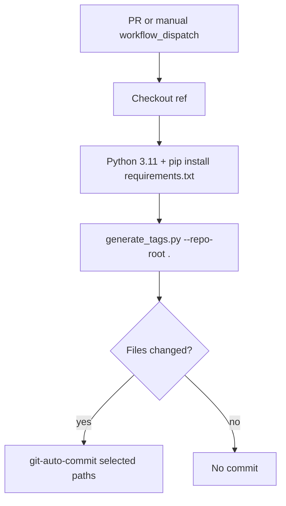
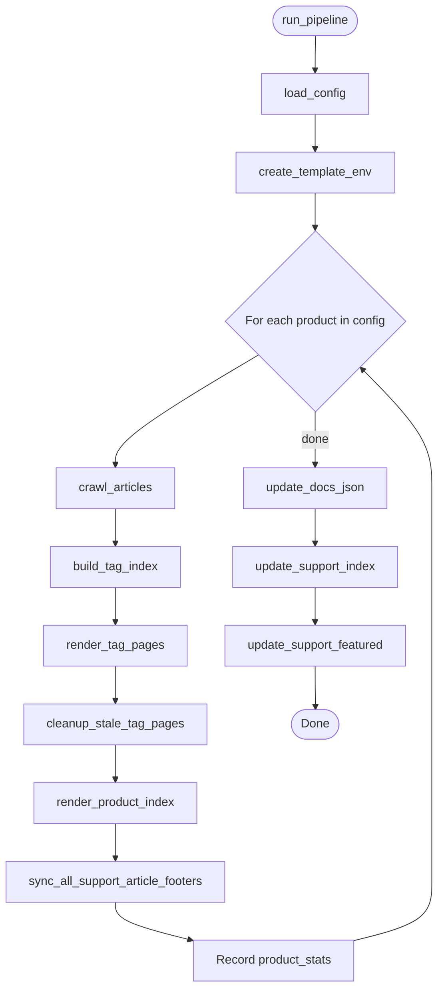
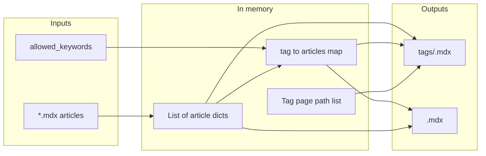

# Knowledgebase nav generator architecture

This document describes the **Knowledgebase Nav** system in the `wandb-docs` repository: what it generates, which files and functions make it work, and how automation ties it together. For author-facing steps and local setup, see [README.md](./README.md).

## Purpose

The generator keeps support (knowledgebase) navigation consistent with article content. It runs over configured products (for example models, weave, inference), reads MDX articles under `support/<product>/articles/`, and updates generated MDX pages, root `support.mdx` counts, and English support tabs in `docs.json`.

## High-level context

The system lives entirely inside `wandb-docs`. It does not call external APIs. It reads and writes files in the repo working tree.

The arrow back to **articles** means phase 4 updates only `<Badge>` links that point at tag pages under `/support/<product>/tags/`, wrapped in MDX comment markers. Other content (including `---`, other Badges, and text outside the markers) is not rewritten.

## Automation workflow

Pull requests trigger the **Knowledgebase Nav** workflow when files under `support/**` or `scripts/knowledgebase-nav/**` change (including new pushes to an open PR). It installs Python dependencies, runs the generator, and commits matching paths when there are diffs. Pull requests from **forks** check out the fork head commit and still run the generator, but the auto-commit step is skipped because the default token cannot push to forks.

Committed path patterns include `support.mdx`, `support/*/articles/*.mdx`, `support/*/tags/*.mdx`, `support/*.mdx` (product indexes), and `docs.json`.

## Pipeline orchestration

`run_pipeline(repo_root, config_path)` is the single entry point used by the CLI and tests. It loads `config.yaml`, builds one Jinja2 environment for all products, then loops each product. After the loop it updates `docs.json` once and `support.mdx` once.

## Per-product data flow

Within one product, data moves from raw files to in-memory structures, then back to MDX and aggregated structures for later steps.

`render_tag_pages` returns sorted page id strings (for example `support/models/tags/security`) that `update_docs_json` merges into the English navigation tab for that product.

## Components and files

| Component | Path | Role |
|-----------|------|------|
| CLI and logic | `generate_tags.py` | All phases, parsing, slug rules, previews, JSON and MDX rewrites |
| Product and tag registry | `config.yaml` | `slug`, `display_name`, `allowed_keywords` per product |
| Tag listing template | `templates/support_tag.mdx.j2` | One Card per article on a tag page |
| Product hub template | `templates/support_product_index.mdx.j2` | Featured section and browse-by-category Cards |
| Dependencies | `requirements.txt` | PyYAML, Jinja2 |
| Unit tests | `tests/test_generate_tags.py` | Mocked filesystem and `docs.json` |
| Integration tests | `tests/test_golden_output.py` | Full pipeline on a temp copy of the real repo |
| Pytest markers | `tests/conftest.py` | Registers the `integration` marker for the golden suite |
| CI | `.github/workflows/knowledgebase-nav.yml` | Triggers, run script, auto-commit |
| Author docs | `README.md` | Workflows for writers and developers |
| Architecture notes | `Architecture.md` | Diagrams and module map for developers |

## Functional areas inside `generate_tags.py`

Functions are grouped below the way they appear in the source file. Names refer to the Python API.

### Configuration

- **`load_config`** reads and validates `config.yaml` (required keys on each product).

### Article structure and footers

- **`parse_frontmatter`**, **`_extract_body`** split YAML front matter and main body. `_extract_body` uses `_BADGE_START_RE` to locate the boundary and trims a trailing `---` line cosmetically.
- **`_split_frontmatter_raw`** splits the raw MDX into the front matter block and the remainder for footer rewriting.
- **`_normalize_keywords`** coerces `keywords` front matter to a list of strings (YAML list; a single string becomes one tag with a warning; other types warn and become an empty list).
- **`_keywords_list_for_footer`** returns normalized `keywords` for footer generation (delegates to **`_normalize_keywords`**).
- **`_tab_badge_pattern`**, **`build_tab_badges_mdx`**, **`build_keyword_footer_mdx`**, **`_replace_tab_badges_in_body`** implement surgical tab-Badge sync. Managed Badges are located via `_BADGE_START_RE` / `_BADGE_END_RE`; the function falls back to regex for pre-marker articles. New footers append a blank line, canonical markers, and Badges.
- **`sync_support_article_footer`**, **`sync_all_support_article_footers`** write article files when tab Badges are out of date with `keywords`.

### Body previews (Card snippets)

- **`plain_text`** strips Markdown (including horizontal rules), links, URLs, HTML or MDX tags, and similar so previews stay plain text (U+00A0 to space after entity decode, typographic quotes mapped to ASCII, allowlist keeps `_` and `=` for identifiers).
- **`extract_body_preview`** applies `plain_text`, truncates to `BODY_PREVIEW_MAX_LENGTH`, and adds `BODY_PREVIEW_SUFFIX` when needed.
- **`_card_text_from_frontmatter_field`** extracts a usable string from a single front matter key (`docengineDescription` or `description`): returns `None` when the field is missing, not a string, or empty after processing. Processing strips one outer pair of wrapping quotes and collapses internal newlines to a single space.
- **`resolve_body_preview`** resolves the Card preview text using a three-level hierarchy: `docengineDescription` first, then `description`, then `extract_body_preview(body)`. Frontmatter overrides are not passed through `plain_text` or truncation.

### Slugs and crawling

- **`tag_slug`** maps a display keyword to a filename or URL segment (lowercase, hyphenated).
- **`crawl_articles`** walks `support/<slug>/articles/*.mdx` and builds article dicts (`title`, `keywords`, `featured`, `body_preview`, `page_path`, `tag_links`, and others). The `body_preview` field is resolved by `resolve_body_preview` from `docengineDescription`, `description`, or the article body.

### Tag aggregation and featured content

- **`get_featured_articles`** filters and sorts featured articles for the product index.
- **`build_tag_index`** groups articles by keyword, sorts by title within each tag, warns on unknown keywords relative to `allowed_keywords`.

### Rendering

- **`tojson_unicode`**, **`create_template_env`** configure Jinja2 for MDX (templates use the `tojson_unicode` filter for YAML front matter values).
- **`render_tag_pages`** writes `support/<product>/tags/<tag-slug>.mdx`.
- **`cleanup_stale_tag_pages`** deletes `.mdx` files in the tags directory that were not just generated, keeping the directory and `docs.json` free of stale entries.
- **`render_product_index`** writes `support/<product>.mdx`.

### Site-wide updates

- **`update_docs_json`** updates or creates hidden `Support: <display_name>` tabs under `navigation.languages` where `language` is `en`, setting `pages` to the product index plus sorted tag paths.
- **`update_support_index`** updates count lines on product Cards in root `support.mdx`. Locates markers via `_COUNTS_START_RE` / `_COUNTS_END_RE`; falls back to a bare count-line pattern for migration.
- **`update_support_featured`** regenerates the featured-articles section in root `support.mdx`, locating the block via `_FEATURED_START_RE` / `_FEATURED_END_RE`.

### CLI

- **`main`** parses `--repo-root` and optional `--config`, then calls **`run_pipeline`**.

## Constants

- **`BODY_PREVIEW_MAX_LENGTH`** and **`BODY_PREVIEW_SUFFIX`** control Card preview length and ellipsis.
- **`DOCS_JSON_NAV_LANGUAGE`** is `"en"` and scopes navigation edits to the English tree only.
- **`_make_markers(keyword)`** generates the four constants below for each managed section: canonical start/end strings for writing and compiled `re.Pattern` objects for reading.
- **`_BADGE_START`** / **`_BADGE_END`** — canonical `{/* AUTO-GENERATED: tab badges */}` strings written to article files. **`_BADGE_START_RE`** / **`_BADGE_END_RE`** — patterns used to locate the block (case-insensitive, colon optional, keyword anywhere in the comment).
- **`_COUNTS_START`** / **`_COUNTS_END`** — canonical `{/* AUTO-GENERATED: counts */}` strings written to `support.mdx`. **`_COUNTS_START_RE`** / **`_COUNTS_END_RE`** — patterns used inside the Card-anchored structural pattern that locates and replaces count lines.
- **`_FEATURED_START`** / **`_FEATURED_END`** — canonical `{/* AUTO-GENERATED: featured articles */}` strings written to `support.mdx`. **`_FEATURED_START_RE`** / **`_FEATURED_END_RE`** — patterns used to locate the featured-articles block.

## Design choices

- **Monolithic script**: one file holds all logic so the workflow and contributors have a single place to read and change behavior.
- **Allowed keywords**: `config.yaml` lists valid tags per product; unknown tags still generate pages but emit warnings so content is never dropped silently.
- **Tab Badge ownership**: only `<Badge>` elements linking to `/support/<product>/tags/...` are derived from `keywords`. These are wrapped in marker comments located by `_BADGE_START_RE` / `_BADGE_END_RE`. The `---` line between body and badges is cosmetic; `_extract_body` uses `_BADGE_START_RE` as the boundary and trims a trailing `---` only as cleanup.
- **Stale tag cleanup**: tag pages that no longer correspond to any article keyword are deleted after generation, before `docs.json` is updated. This keeps the tags directory and navigation free of orphaned entries.
- **Marker-based editing**: all auto-generated sections (article tab Badges, `support.mdx` count lines, and featured articles) use MDX comment markers generated by `_make_markers`. Matching is case-insensitive with an optional colon, and the keyword can appear anywhere inside the comment, so authors can freely annotate markers without breaking the generator. Each marker pair has a migration path that wraps bare content on first run.
- **Golden tests**: compare generated tag pages, product index pages, article files (including footer markers), support tabs in `docs.json`, and root `support.mdx` to the committed tree so output drift is visible as a unified diff.

## Related reading

- [README.md](./README.md) for usage, local venv setup, and troubleshooting.
- [AGENTS.md](../../AGENTS.md) at the repo root for documentation style when editing Mintlify content.
