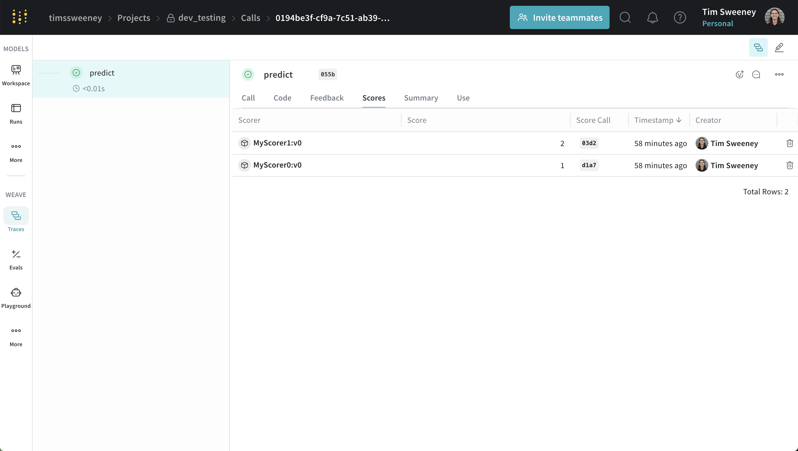
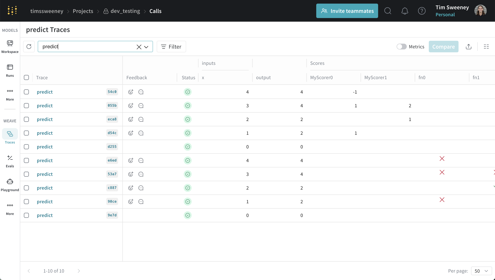
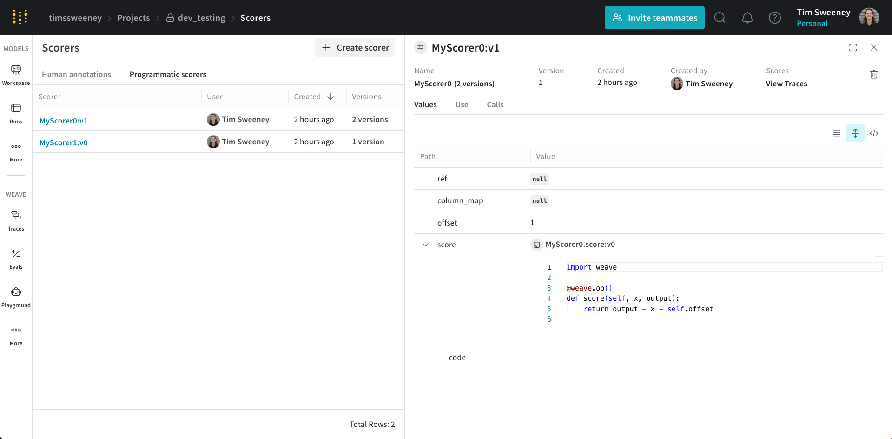
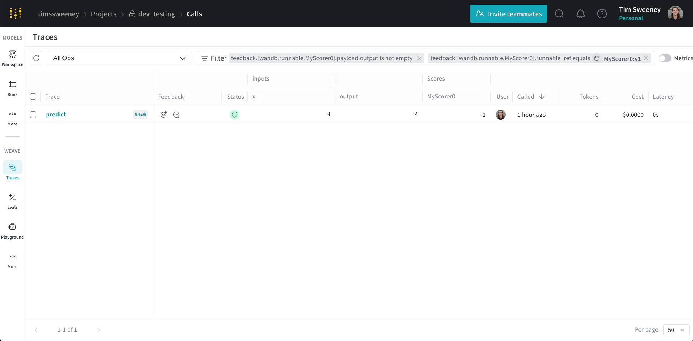
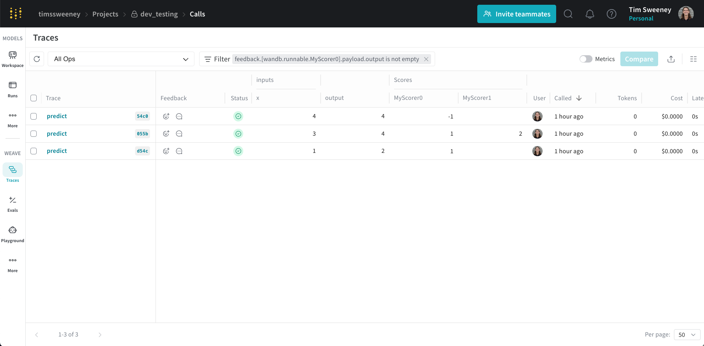

In Weave, Scorers evaluate AI outputs and return evaluation metrics. They take the AI's output, analyze it, and return a dictionary of results. Scorers can use your input data as reference if needed and can also output extra information, such as explanations or reasoning from the evaluation.

This guide is for developers who want to measure the quality of their AI system's outputs. It explains how Scorers fit into Weave evaluations, how to build your own Scorers, how to apply Scorers to individual calls, and how to analyze the resulting scores. By the end, you'll understand which type of Scorer to use for a given evaluation task and how to access the scores it produces.

<Tabs>
  <Tab title="Python">
    Pass Scorers to a `weave.Evaluation` object during evaluation. Weave supports two types of Scorers:

    1. **Function-based Scorers:** Python functions decorated with `@weave.op`.
    2. **Class-based Scorers:** Python classes that inherit from `weave.Scorer` for more complex evaluations.

    Scorers must return a dictionary and can return multiple metrics, nested metrics, and non-numeric values such as text returned from an LLM-evaluator about its reasoning.

  </Tab>
  <Tab title="TypeScript">
    Scorers are special ops that you pass to a `weave.Evaluation` object during evaluation.
  </Tab>
</Tabs>

## Create your own scorers

Custom Scorers let you encode evaluation criteria that are specific to your use case, beyond what the built-in Scorers cover. The following sections describe the two ways to define a Scorer: as a function, or as a class for more complex logic.

<Tip>
**Ready-to-use scorers**
Although this guide shows you how to create custom scorers, Weave comes with [predefined scorers](./builtin_scorers) and [local SLM scorers](./weave_local_scorers) that you can use right away, including:
- [Hallucination detection](./builtin_scorers#hallucinationfreescorer)
- [Summarization quality](./builtin_scorers#summarizationscorer)
- [Embedding similarity](./builtin_scorers#embeddingsimilarityscorer)
- [Toxicity detection (local)](./weave_local_scorers#weavetoxicityscorerv1)
- [Context relevance scoring (local)](./weave_local_scorers#weavecontextrelevancescorerv1)
</Tip>

### Function-based scorers

<Tabs>
  <Tab title="Python">
    Function-based Scorers are functions decorated with `@weave.op` that return a dictionary. They work well for straightforward evaluations like:

    ```python lines
    import weave

    @weave.op
    def evaluate_uppercase(text: str) -> dict:
        return {"text_is_uppercase": text.isupper()}

    my_eval = weave.Evaluation(
        dataset=[{"text": "HELLO WORLD"}],
        scorers=[evaluate_uppercase]
    )
    ```

    When you run the evaluation, `evaluate_uppercase` checks whether the text is all uppercase.

  </Tab>
  <Tab title="TypeScript">
    These are functions wrapped with `weave.op` that accept an object with `modelOutput` and optionally `datasetRow`. They work well for straightforward evaluations like:
    ```typescript lines
    import * as weave from 'weave'

    const evaluateUppercase = weave.op(
        ({modelOutput}) => modelOutput.toUpperCase() === modelOutput,
        {name: 'textIsUppercase'}
    );

    const myEval = new weave.Evaluation({
        dataset: [{text: 'HELLO WORLD'}],
        scorers: [evaluateUppercase],
    })
    ```

  </Tab>
</Tabs>

### Class-based scorers

<Tabs>
  <Tab title="Python">
    For more advanced evaluations, especially when you need to track additional scorer metadata, try different prompts for your LLM-evaluators, or make multiple function calls, use the `Scorer` class.

    **Requirements:**

    1. Inherit from `weave.Scorer`.
    2. Define a `score` method decorated with `@weave.op`.
    3. The `score` method must return a dictionary.

    Example:

    ```python lines {7}
    import weave
    from openai import OpenAI
    from weave import Scorer

    llm_client = OpenAI()

    class SummarizationScorer(Scorer):
        model_id: str = "gpt-4o"
        system_prompt: str = "Evaluate whether the summary is good."

        @weave.op
        def some_complicated_preprocessing(self, text: str) -> str:
            processed_text = "Original text: \n" + text + "\n"
            return processed_text

        @weave.op
        def call_llm(self, summary: str, processed_text: str) -> dict:
            res = llm_client.chat.completions.create(
                messages=[
                    {"role": "system", "content": self.system_prompt},
                    {"role": "user", "content": (
                        f"Analyze how good the summary is compared to the original text."
                        f"Summary: {summary}\n{processed_text}"
                    )}])
            return {"summary_quality": res}

        @weave.op
        def score(self, output: str, text: str) -> dict:
            """Score the summary quality.

            Args:
                output: The summary generated by an AI system
                text: The original text to summarize
            """
            processed_text = self.some_complicated_preprocessing(text)
            eval_result = self.call_llm(summary=output, processed_text=processed_text)
            return {"summary_quality": eval_result}

    evaluation = weave.Evaluation(
        dataset=[{"text": "The quick brown fox jumps over the lazy dog."}],
        scorers=[summarization_scorer])
    ```

    This class evaluates the quality of a summary by comparing it to the original text.

  </Tab>
  <Tab title="TypeScript">
    ```plaintext
    This feature is not available in TypeScript yet.
    ```
  </Tab>
</Tabs>

## How scorers work

This section explains how Scorers receive data from your evaluation, how to map dataset columns to Scorer arguments, how to reference op variables in scoring prompts, and how Weave summarizes per-row scores into a final result.

### Scorer keyword arguments

<Tabs>
  <Tab title="Python">
    Scorers can access both the output from your AI system and the input data from the dataset row.

    - **Input:** If you want your scorer to use data from your dataset row, such as a `label` or `target` column, make this available to the scorer by adding a `label` or `target` keyword argument to your scorer definition.

    For example, if you want to use a column called `label` from your dataset, your scorer function (or `score` class method) has a parameter list like this:

    ```python lines
    @weave.op
    def my_custom_scorer(output: str, label: int) -> dict:
        ...
    ```

    When a Weave `Evaluation` runs, it passes the output of the AI system to the `output` parameter. The `Evaluation` also automatically tries to match any additional scorer argument names to your dataset columns. If customizing your scorer arguments or dataset columns isn't feasible, you can use column mapping. See the following section.

    - **Output:** Include an `output` parameter in your scorer function's signature to access the AI system's output.

    ### Mapping column names with `column_map`

    Sometimes the `score` method's argument names don't match the column names in your dataset. You can fix this using a `column_map`.

    If you're using a class-based scorer, pass a dictionary to the `column_map` attribute of `Scorer` when you initialize your scorer class. This dictionary maps your `score` method's argument names to the dataset's column names, in the order `{scorer_keyword_argument: dataset_column_name}`.

    Example:

    ```python lines
    import weave
    from weave import Scorer

    # A dataset of news articles to summarize
    dataset = [
        {"news_article": "The news today was great...", "date": "2030-04-20", "source": "Bright Sky Network"},
        ...
    ]

    # Scorer class
    class SummarizationScorer(Scorer):

        @weave.op
        def score(self, output, text) -> dict:
            """
                output: output summary from an LLM summarization system
                text: the text to summarize
            """
            ...  # evaluate the quality of the summary

    # create a scorer with a column mapping the `text` argument to the `news_article` data column
    scorer = SummarizationScorer(column_map={"text" : "news_article"})
    ```

    Now, the `text` argument in the `score` method receives data from the `news_article` dataset column.

    **Notes:**

    - Another equivalent option to map your columns is to subclass the `Scorer` and overload the `score` method, mapping the columns explicitly.

    ```python lines
    import weave
    from weave import Scorer

    class MySummarizationScorer(SummarizationScorer):

        @weave.op
        def score(self, output: str, news_article: str) -> dict:  # Added type hints
            # overload the score method and map columns manually
            return super().score(output=output, text=news_article)
    ```

  </Tab>
  <Tab title="TypeScript">
    Scorers can access both the output from your AI system and the contents of the dataset row.

    You can access relevant columns from the dataset row by adding a `datasetRow` keyword argument to your scorer definition.

    ```typescript lines
    const myScorer = weave.op(
        ({modelOutput, datasetRow}) => {
            return modelOutput * 2 === datasetRow.expectedOutputTimesTwo;
        },
        {name: 'myScorer'}
    );
    ```

    ### Mapping column names with `columnMapping`
    <Warning>

    In TypeScript, this feature is on the `Evaluation` object, not individual scorers.

    </Warning>

    Sometimes your `datasetRow` keys don't exactly match the scorer's naming scheme, but they're semantically similar. You can map the columns using the `Evaluation`'s `columnMapping` option.

    The mapping is always from the scorer's perspective, that is, `{scorer_key: dataset_column_name}`.

    Example:

    ```typescript lines
    const myScorer = weave.op(
        ({modelOutput, datasetRow}) => {
            return modelOutput * 2 === datasetRow.expectedOutputTimesTwo;
        },
        {name: 'myScorer'}
    );

    const myEval = new weave.Evaluation({
        dataset: [{expected: 2}],
        scorers: [myScorer],
        columnMapping: {expectedOutputTimesTwo: 'expected'}
    });
    ```

  </Tab>
</Tabs>

### Access variables from your ops in scoring prompts

In scoring prompts for LLM-as-a-judge scorers, you can reference variables from your op. Weave automatically extracts these values when the scorer runs.

For a function like:

```python
@weave.op
def summarize_article(article: str, max_length: int) -> str:
    # Your summarization logic here
    return summary
```

The following variables are available:

| Variable | Description |
|----------|-------------|
| `{article}` | The value of the input argument `article` |
| `{max_length}` | The value of the input argument `max_length` |
| `{inputs}` | A JSON dictionary of all input arguments |
| `{output}` | The result returned by your op |

Example scoring prompt:

```text
Evaluate the quality of this summary.

Original article: {article}
Summary: {output}
Maximum length requested: {max_length}

Rate the summary on a scale of 1-10 based on:
- Accuracy: Does it accurately represent the article?
- Completeness: Does it cover the key points?
- Conciseness: Is it appropriately brief?

Return a JSON object with your rating and reasoning.
```

### Final summarization of the scorer

<Tabs>
  <Tab title="Python">
    During evaluation, Weave computes the scorer for each row of your dataset. To provide a final score for the evaluation, Weave runs `auto_summarize` based on the return type of the output.
    - Weave computes averages for numerical columns.
    - Weave reports count and fraction for boolean columns.
    - Weave ignores other column types.

    You can override the `summarize` method on the `Scorer` class and provide your own way to compute the final scores. The `summarize` function expects:

    - A single parameter `score_rows`: a list of dictionaries, where each dictionary contains the scores returned by the `score` method for a single row of your dataset.
    - It returns a dictionary containing the summarized scores.

    **Why this is useful**

    When you need to score all rows before deciding on the final value of the score for the dataset.

    ```python lines
    class MyBinaryScorer(Scorer):
        """
        Returns True if the full output matches the target, False if not
        """

        @weave.op
        def score(self, output, target):
            return {"match": output == target}

        def summarize(self, score_rows: list) -> dict:
            full_match = all(row["match"] for row in score_rows)
            return {"full_match": full_match}
    ```

    > In this example, the default `auto_summarize` would return the count and proportion of True.

    For more information, see the implementation of [CorrectnessLLMJudge](/weave/tutorial-rag#optional-defining-a-scorer-class).

  </Tab>
  <Tab title="TypeScript">
    During evaluation, Weave computes the scorer for each row of your dataset. To provide a final score, Weave uses an internal `summarizeResults` function that aggregates depending on the output type.
    - Weave computes averages for numerical columns.
    - Weave reports count and fraction for boolean columns.
    - Weave ignores other column types.

    Weave doesn't support custom summarization.

  </Tab>
</Tabs>

### Apply scorers to a call

In addition to running Scorers as part of a `weave.Evaluation`, you can apply them directly to an individual call. This is useful when you want to score production traffic or attach evaluation metrics to a specific op invocation.

To apply scorers to your Weave ops, use the `.call()` method, which provides access to both the operation's result and its tracking information. This lets you associate scorer results with specific calls in Weave's database.

For more information about using the `.call()` method, see the [Calling Ops](../tracking/tracing#getting-a-handle-to-the-call-object-during-execution) guide.

<Tabs>
  <Tab title="Python">
    Here's a basic example:

    ```python lines
    # Get both result and Call object
    result, call = generate_text.call("Say hello")

    # Apply a scorer
    score = await call.apply_scorer(MyScorer())
    ```

    You can also apply multiple scorers to the same call:

    ```python lines
    # Apply multiple scorers in parallel
    await asyncio.gather(
        call.apply_scorer(quality_scorer),
        call.apply_scorer(toxicity_scorer)
    )
    ```

    **Notes:**
    - Weave automatically stores scorer results in its database.
    - Scorers run asynchronously after the main operation completes.
    - You can view scorer results in the UI or query them through the API.

    For more detailed information about using scorers as guardrails or monitors, including production best practices and complete examples, see the [Guardrails and Monitors guide](./monitors).

  </Tab>
  <Tab title="TypeScript">
    ```plaintext
    This feature is not available in TypeScript yet.
    ```
  </Tab>
</Tabs>

### Use `preprocess_model_input`

You can use the `preprocess_model_input` parameter to modify dataset examples before they reach your model during evaluation.

<Important>
The `preprocess_model_input` function only transforms inputs before Weave passes them to the model's prediction function.

Scorer functions always receive the original dataset examples, without any preprocessing applied.
</Important>

For usage information and an example, see [Using `preprocess_model_input` to format dataset rows before evaluating](../core-types/evaluations#using-preprocess_model_input-to-format-dataset-rows-before-evaluating).

## Score analysis

After your Scorers run, you'll often want to inspect the scores they produced to understand model behavior or compare versions. The following sections describe how to analyze the scores for a single call, multiple calls, and all calls scored by a specific Scorer, using both the API and the Weave UI.

### Analyze a single call's scores

#### Single call API

To retrieve a single call, use the `get_call` method.

```python lines
client = weave.init("my-project")

# Get a single call
call = client.get_call("call-uuid-here")

# Get the feedback for the call which contains the scores
feedback = list(call.feedback)
```

#### Single call UI

<Frame>

</Frame>

The Call details panel displays scores for an individual call under the **Scores** tab.

### Analyze multiple calls' scores

#### Multiple calls API

To retrieve multiple calls, use the `get_calls` method.

```python lines
client = weave.init("my-project")

# Get multiple calls - use whatever filters you want and include feedback
calls = client.get_calls(..., include_feedback=True)

# Iterate over the calls and access the feedback which contains the scores
for call in calls:
    feedback = list(call.feedback)
```

#### Multiple calls UI

<Frame>

</Frame>

The traces table displays scores for multiple calls under the **Scores** column.

### Analyze all calls scored by a specific scorer

#### All calls by scorer API

To retrieve all calls scored by a specific scorer, use the `get_calls` method.

```python lines
client = weave.init("my-project")

# To get all the calls scored by any version of a scorer, use the scorer name (typically the class name)
calls = client.get_calls(scored_by=["MyScorer"], include_feedback=True)

# To get all the calls scored by a specific version of a scorer, use the entire ref
# Refs can be obtained from the scorer object or via the UI.
calls = client.get_calls(scored_by=[myScorer.ref.uri()], include_feedback=True)

# Iterate over the calls and access the feedback which contains the scores
for call in calls:
    feedback = list(call.feedback)
```

#### All calls by scorer UI

Finally, if you want to see all the calls scored by a Scorer, navigate to the **Scorers** tab in the UI and select the **Programmatic Scorer** tab. Click your Scorer to open the Scorer details page.

<Frame>

</Frame>

Next, click the **View Traces** button under **Scores** to view all the calls scored by your Scorer.

<Frame>

</Frame>

This defaults to the selected version of the Scorer. You can remove the version filter to see all the calls scored by any version of the Scorer.

<Frame>

</Frame>

