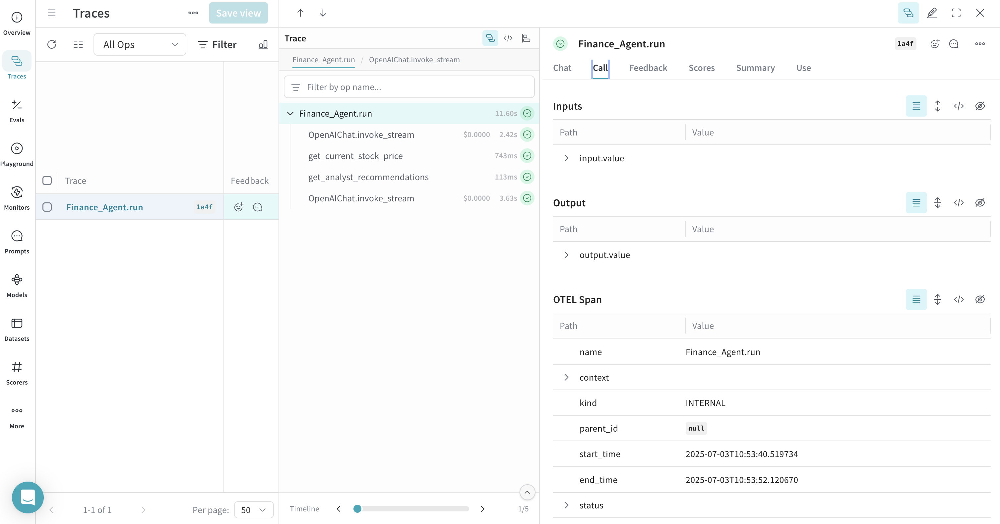
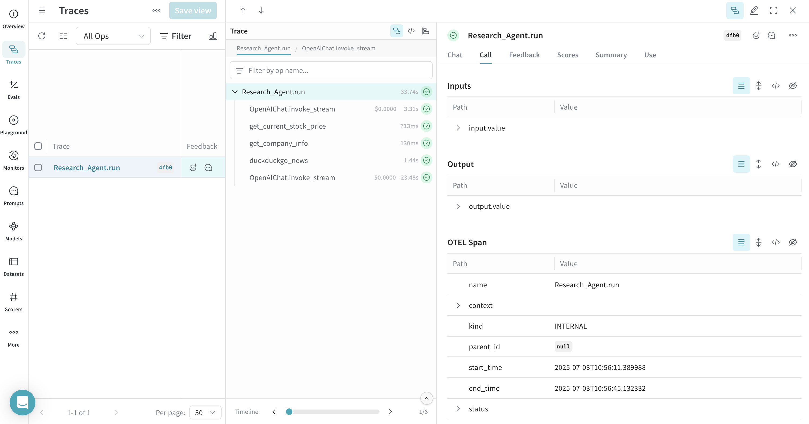
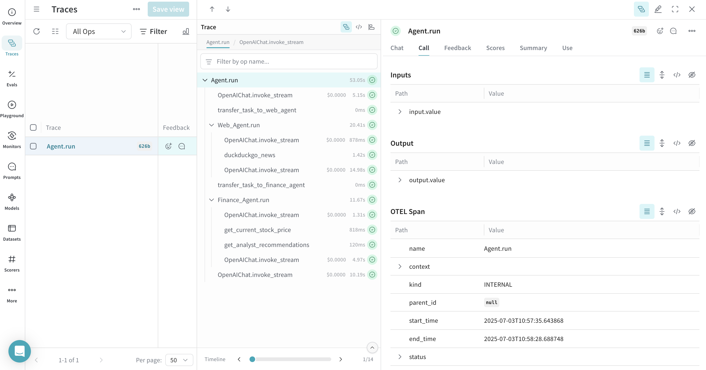
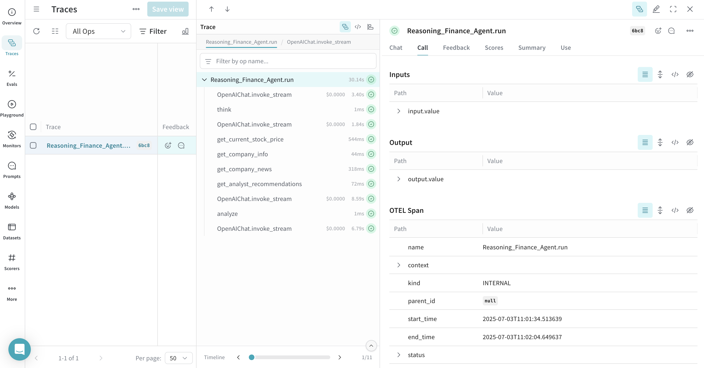
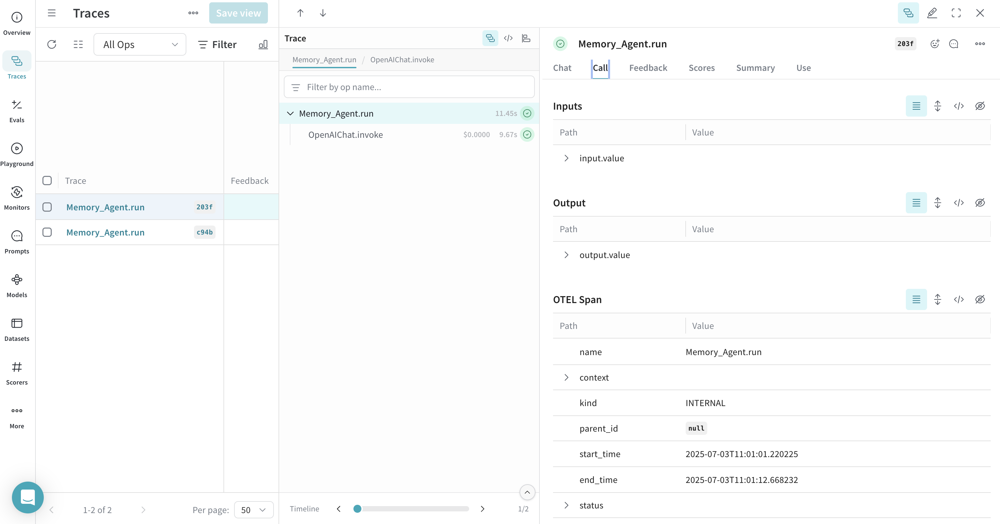

You can trace [Agno](https://docs.agno.com/) agent and tool calls in Weave using [OpenTelemetry (OTEL)](https://opentelemetry.io/). Agno is a Python framework for building multi-agent systems with shared memory, knowledge, and reasoning. It's designed to be lightweight, model-agnostic, and highly performant, supporting multi-modal capabilities including text, image, audio, and video processing.

This guide explains how to trace Agno agent and tool calls using OTEL, and visualize those traces in Weave. You'll learn how to install the required dependencies, configure an OTEL tracer to send data to Weave, and instrument your Agno agents and tools.

<Tip>
For more information on OTEL tracing in Weave, see [Send OTEL Traces to Weave](../tracking/otel).
</Tip>

## Prerequisites

1. Install the required dependencies:

    ```bash
    pip install agno openinference-instrumentation-agno opentelemetry-sdk opentelemetry-exporter-otlp-proto-http
    ```

2. Set your OpenAI API key (or other model provider) as an environment variable:

    ```bash
    export OPENAI_API_KEY=your_api_key_here
    ```

3. [Configure OTEL tracing in Weave](#configure-otel-tracing-in-weave).

### Configure OTEL tracing in Weave

To send traces from Agno to Weave, configure OTEL with a `TracerProvider` and an `OTLPSpanExporter`. Set the exporter to the [correct endpoint and HTTP headers for authentication and project identification](#required-configuration).

<note>
We recommend that you store sensitive environment variables like your API key and project info in an environment file (e.g., `.env`), and load them using `os.environ`. This keeps your credentials secure and out of your codebase.
</note>

#### Required configuration

- **Endpoint:** `https://trace.wandb.ai/otel/v1/traces`
- **Headers:**
  - `Authorization`: Basic auth using your W&B API key
  - `project_id`: Your W&B entity/project name (e.g., `myteam/myproject`)

## Send OTEL traces from Agno to Weave

Once you've completed the [prerequisites](#prerequisites), you can send OTEL traces from Agno to Weave. The following code snippet demonstrates how to configure an OTLP span exporter and tracer provider to send OTEL traces from an Agno application to Weave.

<Warning>
To ensure that Weave traces Agno properly, set the global tracer provider _before_ using Agno components in your code.
</Warning>


## Trace Agno agents with OTEL

After setting up the tracer provider, you can create and run Agno agents with automatic tracing. The following example demonstrates how to create a simple agent with tools:


All agent operations are automatically traced and sent to Weave, allowing you to visualize the execution flow, model calls, reasoning steps, and tool invocations.

<Frame>

</Frame>

## Trace Agno tools with OTEL

When you define and use tools with Agno, these tool calls are also captured in the trace. The OTEL integration automatically instruments both the agent's reasoning process and the individual tool executions, providing a comprehensive view of your agent's behavior.

Here's an example with multiple tools:


<Frame>

</Frame>

## Trace multi-agent teams with OTEL

Agno's powerful multi-agent architecture allows you to create teams of agents that can collaborate and share context. These team interactions are also fully traced:


This multi-agent trace will show the coordination between different agents in Weave, providing visibility into how tasks are distributed and executed across your agent team.

<Frame>

</Frame>

## Work with reasoning agents

Agno provides built-in reasoning capabilities that help agents think through problems step-by-step. These reasoning processes are also captured in traces:


The reasoning steps will be visible in the trace, showing how the agent breaks down complex problems and makes decisions.

<Frame>

</Frame>

## Work with memory and knowledge

Agno agents can maintain memory and access knowledge bases. These operations are also traced:


<Frame>

</Frame>

Memory operations, including storing and retrieving conversation history, will be shown in the trace.

## Learn more

- [Weave documentation: Send OTEL traces to Weave](../tracking/otel)
- [Official Agno documentation](https://docs.agno.com/)
- [Official OTEL documentation](https://opentelemetry.io/)
- [Agno GitHub repository](https://github.com/agno-agi/agno)
- [OpenInference Agno instrumentation](https://pypi.org/project/openinference-instrumentation-agno/)
