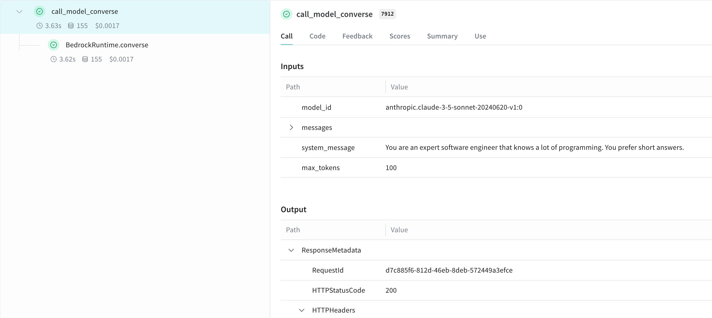

Weave automatically tracks and logs LLM calls made through Amazon Bedrock, AWS's managed service that offers foundation models from multiple AI providers through a unified API. Use this integration to capture Bedrock foundation model interactions and `converse` API usage so you can debug, evaluate, and monitor your Bedrock-based applications.

You can log LLM calls to Weave from Amazon Bedrock in multiple ways. Use `weave.op` to create reusable operations for tracking any calls to a Bedrock model. Optionally, if you're using Anthropic models, you can use Weave's built-in integration with Anthropic.

<Tip>
For the latest tutorials, visit [W&B on Amazon Web Services](https://wandb.ai/site/partners/aws/).
</Tip>

## Traces

Weave automatically captures traces for Bedrock API calls once you patch the client. After you initialize Weave and patch the client, use the Bedrock client as usual:

```python lines
import weave
import boto3
import json
from weave.integrations.bedrock.bedrock_sdk import patch_client

weave.init("my_bedrock_app")

# Create and patch the Bedrock client
client = boto3.client("bedrock-runtime")
patch_client(client)

# Use the client as usual
response = client.invoke_model(
    modelId="anthropic.claude-3-5-sonnet-20240620-v1:0",
    body=json.dumps({
        "anthropic_version": "bedrock-2023-05-31",
        "max_tokens": 100,
        "messages": [
            {"role": "user", "content": "What is the capital of France?"}
        ]
    }),
    contentType='application/json',
    accept='application/json'
)
response_dict = json.loads(response.get('body').read())
print(response_dict["content"][0]["text"])
```

The same patched client also captures traces when using the `converse` API:

```python lines
messages = [{"role": "user", "content": [{"text": "What is the capital of France?"}]}]

response = client.converse(
    modelId="anthropic.claude-3-5-sonnet-20240620-v1:0",
    system=[{"text": "You are a helpful AI assistant."}],
    messages=messages,
    inferenceConfig={"maxTokens": 100},
)
print(response["output"]["message"]["content"][0]["text"])

```

## Wrap calls with your own ops

Wrap Bedrock calls in your own ops to group related logic, capture custom inputs, and reuse the same tracked function across your application. Create reusable operations with the `@weave.op()` decorator. The following example shows both the `invoke_model` and `converse` APIs:

```python lines
@weave.op
def call_model_invoke(
    model_id: str,
    prompt: str,
    max_tokens: int = 100,
    temperature: float = 0.7
) -> dict:
    body = json.dumps({
        "anthropic_version": "bedrock-2023-05-31",
        "max_tokens": max_tokens,
        "temperature": temperature,
        "messages": [
            {"role": "user", "content": prompt}
        ]
    })

    response = client.invoke_model(
        modelId=model_id,
        body=body,
        contentType='application/json',
        accept='application/json'
    )
    return json.loads(response.get('body').read())

@weave.op
def call_model_converse(
    model_id: str,
    messages: str,
    system_message: str,
    max_tokens: int = 100,
) -> dict:
    response = client.converse(
        modelId=model_id,
        system=[{"text": system_message}],
        messages=messages,
        inferenceConfig={"maxTokens": max_tokens},
    )
    return response
```

<Frame>

</Frame>

## Create a `Model` for easier experimentation

A Weave `Model` bundles configuration and prediction logic together so you can iterate on parameters and compare runs side by side. Create a Weave `Model` to better organize your experiments and capture parameters. The following example uses the `converse` API:

```python lines
class BedrockLLM(weave.Model):
    model_id: str
    max_tokens: int = 100
    system_message: str = "You are a helpful AI assistant."

    @weave.op
    def predict(self, prompt: str) -> str:
        "Generate a response using Bedrock's converse API"
        
        messages = [{
            "role": "user",
            "content": [{"text": prompt}]
        }]

        response = client.converse(
            modelId=self.model_id,
            system=[{"text": self.system_message}],
            messages=messages,
            inferenceConfig={"maxTokens": self.max_tokens},
        )
        return response["output"]["message"]["content"][0]["text"]

# Create and use the model
model = BedrockLLM(
    model_id="anthropic.claude-3-5-sonnet-20240620-v1:0",
    max_tokens=100,
    system_message="You are an expert software engineer that knows a lot of programming. You prefer short answers."
)
result = model.predict("What is the best way to handle errors in Python?")
print(result)
```

This approach lets you version your experiments and track different configurations of your Bedrock-based application.

## Learn more

The following resources provide additional ways to explore and evaluate Amazon Bedrock with Weave.

### Try Bedrock in the Weave Playground

To experiment with Amazon Bedrock models in the Weave UI without any setup, try the [LLM Playground](../tools/playground).

### Report: Compare LLMs on Bedrock for text summarization with Weave

The [Evaluating LLMs on Amazon Bedrock](https://wandb.ai/byyoung3/ML_NEWS3/reports/Compare-LLMs-on-Amazon-Bedrock-for-text-summarization-with-W-B-Weave--VmlldzoxMDI1MTIzNw) report explains how to use Bedrock in combination with Weave to evaluate and compare LLMs for summarization tasks. The report includes code samples.
