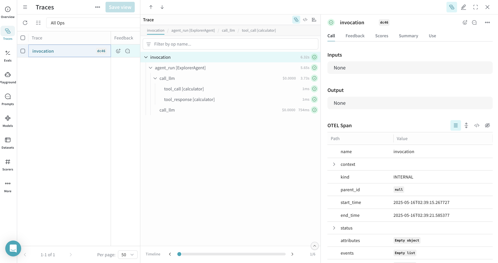
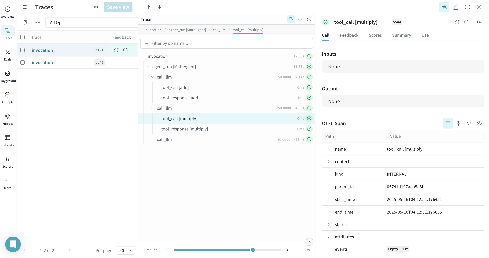
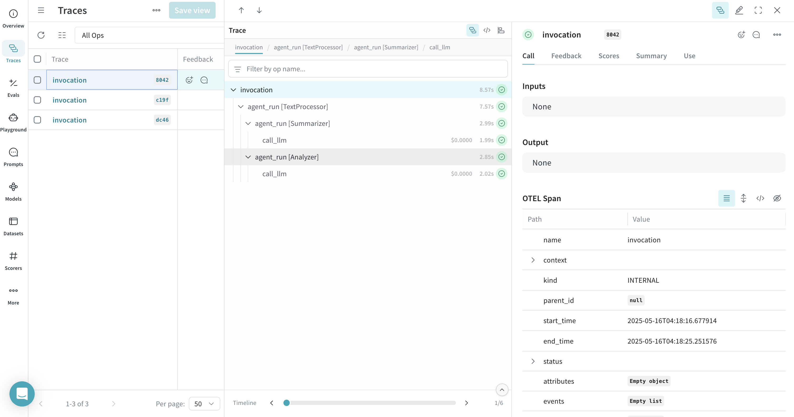

You can trace [Google Agent Development Kit (ADK)](https://google.github.io/adk-docs/) agent and tool calls in Weave using [OpenTelemetry (OTEL)](https://opentelemetry.io/). ADK is a flexible and modular framework for developing and deploying AI agents. While optimized for Gemini and the Google ecosystem, ADK is model-agnostic and deployment-agnostic. It provides tools for creating, deploying, and orchestrating agentic architectures ranging from simple tasks to complex workflows.

This guide explains how to trace ADK agent and tool calls using OTEL, and visualize those traces in Weave. You'll learn how to install the required dependencies, configure an OTEL tracer to send data to Weave, and instrument your ADK agents and tools.

<Tip>
For more information on OTEL tracing in Weave, see [Send OTEL Traces to Weave](../tracking/otel).
</Tip>

## Prerequisites

1. Install the required dependencies:

    ```bash
    pip install google-adk opentelemetry-sdk opentelemetry-exporter-otlp-proto-http
    ```

2. Set your [Google API key](https://cloud.google.com/docs/authentication/api-keys) as an environment variable:

    ```bash
    export GOOGLE_API_KEY=your_api_key_here
    ```

3. [Configure OTEL tracing in Weave](#configure-otel-tracing-in-weave).

### Configure OTEL tracing in Weave

To send traces from ADK to Weave, configure OTEL with a `TracerProvider` and an `OTLPSpanExporter`. Set the exporter to the [correct endpoint and HTTP headers for authentication and project identification](#required-configuration).

<Warning>
It is recommended that you store sensitive environment variables like your API key and project info in an environment file (e.g., `.env`), and load them using `os.environ`. This keeps your credentials secure and out of your codebase.
</Warning>

### Required configuration

- **Endpoint:** `https://trace.wandb.ai/otel/v1/traces`. If you are using a dedicated Weave instance, the URL follows this pattern instead: `{YOUR_WEAVE_HOST}/traces/otel/v1/traces`
- **Headers:**
  - `Authorization`: Basic auth using your W&B API key
  - `project_id`: Your W&B entity/project name (e.g., `myteam/myproject`)

## Send OTEL traces from ADK to Weave

The following code snippet demonstrates how to configure an OTLP span exporter and tracer provider to send OTEL traces from an ADK application to Weave.

<Warning>
To ensure that Weave traces ADK properly, set the global tracer provider _before_ using ADK components in your code.
</Warning>


## Trace ADK Agents with OTEL

After setting up the tracer provider, you can create and run ADK agents with automatic tracing. The following example demonstrates how to create a simple LLM agent with a tool, and run it with an in-memory runner:


All agent operations are automatically traced and sent to Weave, allowing you to visualize the execution flow. You can view model calls, reasoning steps, and tool invocations.

<Frame>

</Frame>

## Trace ADK Tools with OTEL

When you define and use tools with ADK, these tool calls are also captured in the trace. The OTEL integration automatically instruments both the agent's reasoning process and the individual tool executions, providing a comprehensive view of your agent's behavior.

Here's an example with multiple tools:


<Frame>

</Frame>

## Work with workflow agents

ADK provides various [_workflow agents_](https://google.github.io/adk-docs/agents/workflow-agents/) for more complex scenarios. You can trace workflow agents just like regular LLM agents. Here's an example using a [`SequentialAgent`](https://google.github.io/adk-docs/agents/workflow-agents/sequential-agents/):


This workflow agent trace will show the sequential execution of both agents in Weave, providing visibility into how data flows through your multi-agent system.

<Frame>

</Frame>

## Learn more

- [Weave documentation: Send OTEL traces to Weave](../tracking/otel)
- [Official ADK documentation](https://google.github.io/adk-docs/)
- [Official OTEL documentation](https://opentelemetry.io/)
- [ADK GitHub repository](https://github.com/google/adk-python)
