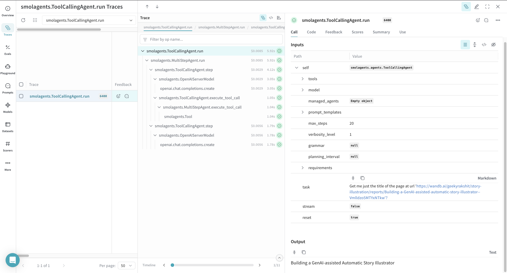
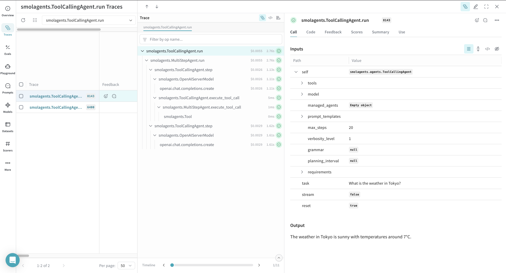

<Warning>
All code samples shown on this page are in Python.
</Warning>

This page explains how to integrate [Smolagents](https://huggingface.co/docs/smolagents/en/index) with W&B Weave to track and analyze your agentic applications. You'll learn how to log model inferences, monitor function calls, and organize experiments using Weave's tracing and versioning capabilities. By following the examples provided, you can capture valuable insights, debug your applications efficiently, and compare different model configurations—all within the Weave web interface.

## Overview

Smolagents is a simple framework that offers minimal abstractions for building powerful agentic applications. It supports multiple LLM providers, such as OpenAI, Hugging Face Transformers, and Anthropic.

Weave automatically captures traces for [Smolagents](https://huggingface.co/docs/smolagents/en/index). To start tracking, call `weave.init()` and use the library as usual.

## Prerequisites

1. Before you can use Smolagents with Weave, install the required libraries or upgrade to the latest versions. The following command installs or upgrades `smolagents`, `openai`, and `weave`, and suppresses output:

    ```python lines
    pip install -U smolagents openai weave -qqq
    ```

2. Smolagents supports multiple LLM providers, such as OpenAI, Hugging Face Transformers, and Anthropic. Set the API key for your chosen provider by setting the corresponding environment variable:

    ```python lines
    import os
    import getpass

    os.environ["OPENAI_API_KEY"] = getpass.getpass("Enter your OpenAI API key: ")
    ```

## Basic tracing

Storing traces of language model applications in a central location is essential during development and production. These traces help with debugging and serve as valuable datasets for improving your application.

Weave automatically captures traces for [Smolagents](https://huggingface.co/docs/smolagents/en/index). To start tracking, initialize Weave by calling `weave.init()`, then use the library as usual.

The following example demonstrates how to log inference calls to a tool-using LLM agent with Weave. In this scenario:

- You define a language model (OpenAI's `gpt-4o`) using Smolagents' `OpenAIServerModel`.
- You configure a search tool (`DuckDuckGoSearchTool`) that the agent can invoke when needed.
- You construct a `ToolCallingAgent`, passing in the tool and model.
- You run a query through the agent that triggers the search tool.
- Weave logs each function and model invocation, making them available for inspection via its web interface.


Once you run the code sample, navigate to your Weave project dashboard to view the traces.

<Frame>

</Frame>

## Tracing custom tools

You can declare custom tools for your agentic workflows by decorating a function with `@tool` from `smolagents` or by inheriting from the `smolagents.Tool` class.

Weave automatically tracks custom tool calls for your Smolagents workflows. The following example shows how to log a custom Smolagents tool call with Weave:

- A custom `get_weather` function is defined and decorated with `@tool` from Smolagents, enabling the agent to invoke it as part of its reasoning process.
- The function accepts a location and an optional flag for Celsius output.
- A language model is instantiated using `OpenAIServerModel`.
- A `ToolCallingAgent` is created with the custom tool and model.
- When the agent runs the query, it selects and invokes the `get_weather` tool.
- Weave logs both the model inference and the custom tool invocation, including arguments and return values.


Once you run the code sample, navigate to your Weave project dashboard to view the traces.

<Frame>

</Frame>
