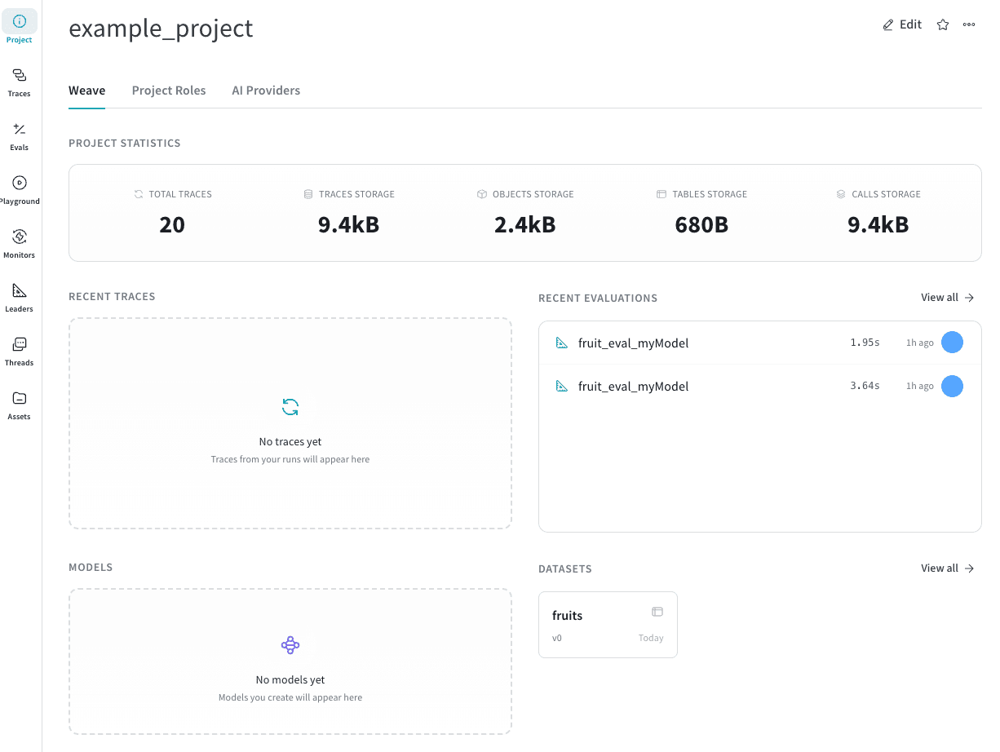

Weave projects are organizational containers that group related traces, evaluations, models, datasets, and other Weave assets together. Projects help you organize your work, collaborate with team members, and track the evolution of your LLM applications over time.

All Weave data is organized within projects, making it easy to find related work and maintain context across your development workflow.

Projects store the following information and resources:

- **[Traces](/weave/guides/tracking/tracing)**: Individual LLM calls, function executions, and application flows that capture inputs, outputs, latency, and token usage for debugging and analysis.
- **[Evaluations](/weave/guides/core-types/evaluations)**: Test results that compare model performance against datasets using scoring functions to measure quality, accuracy, and other metrics.
- **[Monitors](/weave/guides/evaluation/guardrails_and_monitors)**: Background processes that automatically score a subset of function calls using LLM-as-a-judge scorers to track quality metrics over time in production.
- **[Leaderboards](/weave/guides/core-types/leaderboards)**: Ranked comparisons of model performance across different evaluation runs, helping you identify the best-performing configurations.
- **[Threads](/weave/guides/tracking/threads)**: Multi-turn conversations and session-based workflows that group related calls under a shared thread ID for analyzing complete user interactions.
- **Assets**: The Assets tab in the Weave UI stores and organizes the following resources in your project:
    - **[Models](/weave/guides/core-types/models)**: Versioned model definitions that capture prompts, parameters, and configuration, automatically tracking changes for reproducibility and comparison.
    - **[Datasets](/weave/guides/core-types/datasets)**: Collections of test examples stored as Weave objects that can be downloaded, browsed, and used for running evaluations.
    - **[Prompts](/weave/guides/core-types/prompts)**: Versioned system prompts that you can test and reuse in your model configurations.
    - **[Scorers](/weave/guides/evaluation/scorers)**: Functions that evaluate model inputs and outputs to measure quality, safety, or custom metrics.
    - **[Ops](/weave/guides/tracking/ops)**: Automatically versioned and tracked functions decorated with `@weave.op()` that produce calls and maintain a record of function modifications.
    - **Other objects and metadata**: Additional Weave objects, custom types, and associated metadata stored within the project.

## Creating and using projects

Weave projects exist within [teams](/platform/hosting/iam/org_team_struct#team) (also called entities) in your W&B organization. The full project path follows this format:

```
team-name/project-name
```

For example, a team called `my-team` with a project called `llm-chatbot` has the project path `my-team/llm-chatbot`.

To associate traces, evaluations, or any other resources with a project, you must pass the project's path as a string when you initialize Weave in your code, like this:

<Tabs>
    <Tab title="Python">
    ```python
    import weave

    weave.init('my-team/my-llm-app')
    ```
    </Tab>
    <Tab title="TypeScript">
    ```typescript
    import * as weave from 'weave';

    await weave.init('my-team/my-llm-app');
    ```
    </Tab>
</Tabs>

If you don't specify a team name, Weave uses your [default entity](/platform/app/settings-page/user-settings#default-team) (your personal account or default team).

## Viewing projects in the UI

Access your projects in the Weave UI:

1. Navigate to [wandb.ai](https://wandb.ai)
2. Select your project from the **Projects** sidebar. This opens the project's overview page.
3. From the overview page, you can: 
    * Review your projects's statistics, such as the total number of traces logged to the project and how much storage the project is using.
    * Navigate to traces, evaluations, and other resources using the sidebar.
    * Navigate to recently logged traces, evaluations, models, and datasets.

<Frame>

</Frame>