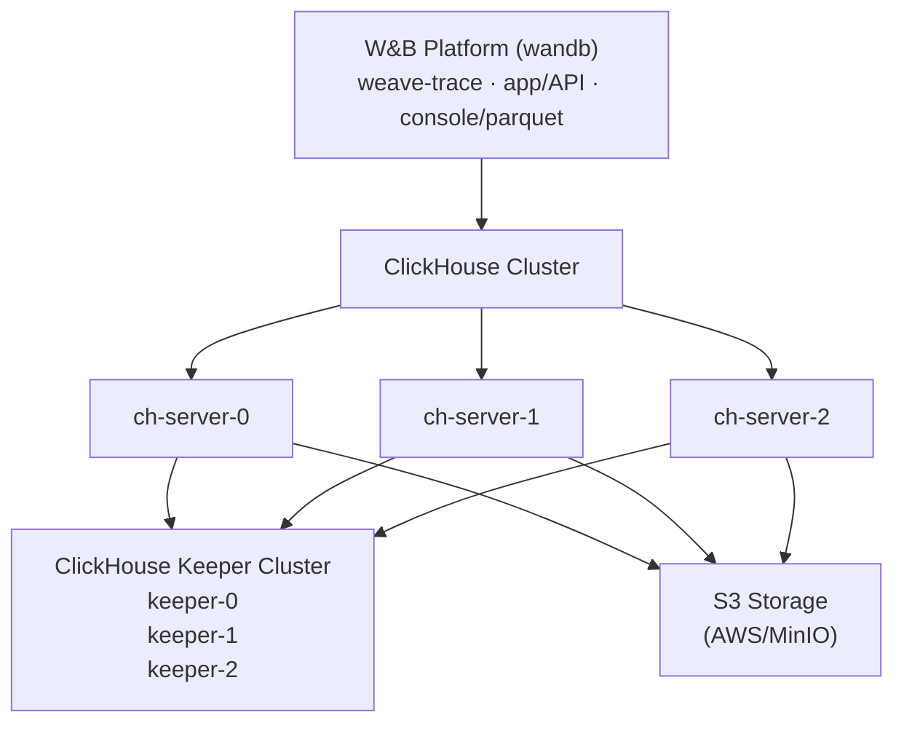

Self-hosting W&B Weave gives you more control over its environment and configuration. This can help you create a more isolated environment and meet additional security compliance. This document guides you through how to deploy the components required to run W&B Weave in a self-managed environment using the Altinity ClickHouse Operator. By the end, you'll have a production-grade Weave instance running on your own Kubernetes cluster, backed by a replicated ClickHouse database and S3-compatible object storage. This guide is for Kubernetes administrators and platform engineers who are responsible for deploying and operating W&B in their organization.

Self-managed Weave deployments rely on [ClickHouseDB](https://clickhouse.com/) to manage its backend. This deployment uses:

- **Altinity ClickHouse Operator**: Enterprise-grade ClickHouse management for Kubernetes.
- **ClickHouse Keeper**: Distributed coordination service (replaces ZooKeeper).
- **ClickHouse Cluster**: High-availability database cluster for trace storage.
- **S3-compatible storage**: Object storage for ClickHouse data persistence.

<Tip>
For a detailed reference architecture, see [W&B Self-Managed Reference Architecture](https://docs.wandb.ai/guides/hosting/self-managed/ref-arch/#models-and-weave).
</Tip>

## Important setup notes

The configuration examples in this guide are for reference only. Because each organization's Kubernetes environment is unique, your self-hosted instance likely requires you to adjust:

- **Security and compliance**: Security contexts, `runAsUser` or `fsGroup` values, and other security settings according to your organization's security policies and Kubernetes or OpenShift requirements.
- **Resource sizing**: The resource allocations shown are starting points. Consult with your W&B Solutions Architect team for proper sizing based on your expected trace volume and performance requirements.
- **Infrastructure specifics**: Update storage classes, node selectors, and other infrastructure-specific settings to match your environment.

Treat these configurations as templates, not prescriptive solutions.

## Architecture

The following diagram shows how the W&B Platform, the ClickHouse cluster, the ClickHouse Keeper coordination service, and S3 storage fit together in a self-managed Weave deployment.



## Prerequisites

Before you begin, ensure your environment meets the following requirements. Self-managed Weave instances require the following resources:

- **Kubernetes cluster**: Version 1.29 or later.
- **Kubernetes nodes**: Multi-node cluster (minimum 3 nodes recommended for high availability).
- **Storage class**: A working StorageClass for persistent volumes (for example, `gp3`, `standard`, or `nfs-csi`).
- **S3 bucket**: Pre-configured S3 or S3-compatible bucket with appropriate access permissions.
- **W&B Platform**: Already installed and running. See the [W&B Self-Managed Deployment Guide](https://docs.wandb.ai/guides/hosting/hosting-options/self-managed/).
- **W&B license**: Weave-enabled license from W&B Support.

<Warning>
Don't make sizing decisions based on this prerequisites list alone. Resource needs vary based on trace volume and usage patterns. For more information, see [Resource requirements](#resource-requirements).
</Warning>

### Required tools

To set up your instance, you need the following tools:

- `kubectl` configured with cluster access.
- `helm` version 3.0 or later.
- AWS credentials (if using S3) or access to S3-compatible storage.

### Network requirements

Your Kubernetes cluster requires the following network setup:

- Pods in the `clickhouse` namespace must communicate with pods in the `wandb` namespace.
- ClickHouse nodes must communicate with each other on ports `8123`, `9000`, `9009`, and `2181`.

## Deploy your self-managed Weave instance

The following steps walk you through deploying the operator, preparing storage, deploying ClickHouse Keeper and the ClickHouse cluster, and enabling Weave in the W&B Platform. Complete the steps in order, since each one builds on the resources created in the previous step.

### Deploy the Altinity ClickHouse Operator

The Altinity ClickHouse Operator manages ClickHouse installations in Kubernetes. Installing the operator first lets the later steps declare ClickHouse Keeper and ClickHouse cluster resources that the operator reconciles for you.

#### Add the Altinity Helm repository

```bash
helm repo add altinity https://helm.altinity.com
helm repo update
```

#### Create the operator configuration

Create a file named `ch-operator.yaml`. This file defines the security context and metadata for the operator deployment:

```yaml
operator:
  image:
    repository: altinity/clickhouse-operator

  # Security context - adjust according to your cluster's requirements
  containerSecurityContext:
    runAsGroup: 0
    runAsNonRoot: true
    runAsUser: 10001 # Update based on your OpenShift/Kubernetes security policies
    allowPrivilegeEscalation: false
    capabilities:
      drop:
        - ALL
    privileged: false
    readOnlyRootFilesystem: false

metrics:
  enabled: false

# Name override - customize if needed
nameOverride: "wandb"
```

The `containerSecurityContext` values shown here work for most Kubernetes distributions. For OpenShift, you may need to adjust `runAsUser` and `fsGroup` to match your project's assigned UID range.

#### Install the operator

```bash
helm upgrade --install ch-operator altinity/altinity-clickhouse-operator \
  --namespace clickhouse \
  --create-namespace \
  -f ch-operator.yaml
```

#### Verify the operator installation

```bash
# Check operator pod is running
kubectl get pods -n clickhouse

# Expected output:
# NAME                                 READY   STATUS    RESTARTS   AGE
# ch-operator-wandb-xxxxx              1/1     Running   0          30s

# Verify operator image version
kubectl get pods -n clickhouse -o jsonpath="{.items[*].spec.containers[*].image}" | \
  tr ' ' '\n' | grep -v 'metrics-exporter' | sort -u

# Expected output:
# altinity/clickhouse-operator:0.25.4
```

With the operator running, you can now provision the persistent storage and coordination services that the ClickHouse cluster depends on.

### Prepare S3 storage

ClickHouse requires S3 or S3-compatible storage for data persistence. In this step you create the bucket and configure how ClickHouse authenticates to it.

#### Create an S3 bucket

Create an S3 bucket in your AWS account or S3-compatible storage provider. Replace `[BUCKET-NAME]` with your bucket name and `[REGION]` with your AWS region:

```bash
# Example for AWS
aws s3 mb s3://[BUCKET-NAME] --region [REGION]
```

#### Configure S3 credentials

ClickHouse requires credentials to read from and write to the bucket. You have two options for providing S3 access credentials. W&B recommends Option A (IRSA) on AWS because it avoids storing long-lived secrets in the cluster.

##### Option A: Use AWS IAM roles (IRSA, recommended for AWS)

If your Kubernetes nodes have an IAM role with S3 access, ClickHouse can use the EC2 instance metadata:

```yaml
# In ch-server.yaml, set:
<use_environment_credentials>true</use_environment_credentials>
```

Required IAM policy (attached to your node IAM role):

```json
{
  "Version": "2012-10-17",
  "Statement": [
    {
      "Effect": "Allow",
      "Action": [
        "s3:GetObject",
        "s3:PutObject",
        "s3:DeleteObject",
        "s3:ListBucket"
      ],
      "Resource": [
        "arn:aws:s3:::[BUCKET-NAME]",
        "arn:aws:s3:::[BUCKET-NAME]/*"
      ]
    }
  ]
}
```

##### Option B: Use access keys

If you prefer using static credentials, create a Kubernetes secret:

Replace `[ACCESS-KEY]` with your AWS access key and `[SECRET-KEY]` with your AWS secret key:

```bash
kubectl create secret generic aws-creds \
  --namespace clickhouse \
  --from-literal aws_access_key=[ACCESS-KEY] \
  --from-literal aws_secret_key=[SECRET-KEY]
```

Then configure ClickHouse to use the secret (see the ch-server.yaml configuration in Step 4).

### Deploy ClickHouse Keeper

[ClickHouse Keeper](https://clickhouse.com/docs/guides/sre/keeper/clickhouse-keeper) provides the coordination system for data replication and distributed DDL queries execution. You must deploy Keeper before the ClickHouse cluster, since the ClickHouse servers in Step 4 connect to Keeper at startup.

#### Create the Keeper configuration

Create a file named `ch-keeper.yaml`. This manifest defines a three-replica Keeper cluster with anti-affinity, persistent storage, and the settings used by the Altinity operator to provision Keeper pods:

```yaml
apiVersion: "clickhouse-keeper.altinity.com/v1"
kind: "ClickHouseKeeperInstallation"
metadata:
  name: wandb
  namespace: clickhouse
  annotations: {}
spec:
  defaults:
    templates:
      podTemplate: default
      dataVolumeClaimTemplate: default

  templates:
    podTemplates:
      - name: keeper
        metadata:
          labels:
            app: clickhouse-keeper
        spec:
          # Pod security context - adjust according to your environment
          securityContext:
            fsGroup: 10001 # Update based on your cluster's security requirements
            fsGroupChangePolicy: Always
            runAsGroup: 0
            runAsNonRoot: true
            runAsUser: 10001 # For OpenShift, use your project's assigned UID range
            seccompProfile:
              type: RuntimeDefault

          # Anti-affinity to spread keepers across nodes (recommended for HA)
          # Customize or remove based on your cluster size and availability requirements
          affinity:
            podAntiAffinity:
              requiredDuringSchedulingIgnoredDuringExecution:
                - labelSelector:
                    matchExpressions:
                      - key: "app"
                        operator: In
                        values:
                          - clickhouse-keeper
                  topologyKey: "kubernetes.io/hostname"

          containers:
            - name: clickhouse-keeper
              imagePullPolicy: IfNotPresent
              image: "clickhouse/clickhouse-keeper:25.10"
              # Resource requests - example values, adjust based on workload
              resources:
                requests:
                  memory: "256Mi"
                  cpu: "0.5"
                limits:
                  memory: "2Gi"
                  cpu: "1"

              securityContext:
                allowPrivilegeEscalation: false
                capabilities:
                  drop:
                    - ALL
                privileged: false
                readOnlyRootFilesystem: false

    volumeClaimTemplates:
      - name: data
        metadata:
          labels:
            app: clickhouse-keeper
        spec:
          storageClassName: gp3 # Change to your StorageClass
          accessModes:
            - ReadWriteOnce
          resources:
            requests:
              storage: 10Gi

  configuration:
    clusters:
      - name: keeper # Keeper cluster name - used in service DNS naming
        layout:
          replicasCount: 3
        templates:
          podTemplate: keeper
          dataVolumeClaimTemplate: data

    settings:
      logger/level: "information"
      logger/console: "true"
      listen_host: "0.0.0.0"
      keeper_server/four_letter_word_white_list: "*"
      keeper_server/coordination_settings/raft_logs_level: "information"
      keeper_server/enable_ipv6: "false"
      keeper_server/coordination_settings/async_replication: "true"
```

Important configuration updates:

- **StorageClass**: Update `storageClassName: gp3` to match your cluster's available StorageClass.
- **Security context**: Adjust `runAsUser` and `fsGroup` values to comply with your organization's security policies.
- **Anti-affinity**: Customize or remove the `affinity` section based on your cluster topology and HA requirements.
- **Resources**: The CPU and memory values are examples. Consult with W&B Solutions Architects for proper sizing.
- **Naming**: If you change `metadata.name` or `configuration.clusters[0].name`, you must update the Keeper hostnames in `ch-server.yaml` (Step 4) to match.

#### Deploy ClickHouse Keeper resources

```bash
kubectl apply -f ch-keeper.yaml
```

#### Verify the Keeper deployment

```bash
# Check Keeper pods
kubectl get pods -n clickhouse -l app=clickhouse-keeper

# Expected output:
# NAME                     READY   STATUS    RESTARTS   AGE
# chk-wandb-keeper-0-0-0   1/1     Running   0          2m
# chk-wandb-keeper-0-1-0   1/1     Running   0          2m
# chk-wandb-keeper-0-2-0   1/1     Running   0          2m

# Check Keeper services
kubectl get svc -n clickhouse | grep keeper

# Expected to see keeper services on port 2181
```

With Keeper running, you can now deploy the ClickHouse cluster that uses it for coordination.

### Deploy the ClickHouse cluster

Now deploy the ClickHouse server cluster that stores Weave trace data. This is the largest step in the guide, since the cluster connects to both the Keeper service from Step 3 and the S3 bucket from Step 2.

#### Create the ClickHouse server configuration

Create a file named `ch-server.yaml`. This manifest declares the ClickHouse cluster, its connection to Keeper, the Weave user account, and the S3 storage policy used for trace data:

```yaml
apiVersion: "clickhouse.altinity.com/v1"
kind: "ClickHouseInstallation"
metadata:
  name: wandb
  namespace: clickhouse
  annotations: {}
spec:
  defaults:
    templates:
      podTemplate: default
      dataVolumeClaimTemplate: default

  templates:
    podTemplates:
      - name: clickhouse
        metadata:
          labels:
            app: clickhouse-server
        spec:
          # Pod security context - customize for your environment
          securityContext:
            fsGroup: 10001 # Adjust based on your security policies
            fsGroupChangePolicy: Always
            runAsGroup: 0
            runAsNonRoot: true
            runAsUser: 10001 # For OpenShift, use assigned UID range
            seccompProfile:
              type: RuntimeDefault

          # Anti-affinity rule - ensures servers run on different nodes (optional but recommended)
          # Adjust or remove based on your cluster size and requirements
          affinity:
            podAntiAffinity:
              requiredDuringSchedulingIgnoredDuringExecution:
                - labelSelector:
                    matchExpressions:
                      - key: "app"
                        operator: In
                        values:
                          - clickhouse-server
                  topologyKey: "kubernetes.io/hostname"

          containers:
            - name: clickhouse
              image: clickhouse/clickhouse-server:25.10
              # Example resource allocation - adjust based on workload
              resources:
                requests:
                  memory: 1Gi
                  cpu: 1
                limits:
                  memory: 16Gi
                  cpu: 4

              # AWS credentials (remove this section if using IRSA)
              env:
                - name: AWS_ACCESS_KEY_ID
                  valueFrom:
                    secretKeyRef:
                      name: aws-creds
                      key: aws_access_key
                - name: AWS_SECRET_ACCESS_KEY
                  valueFrom:
                    secretKeyRef:
                      name: aws-creds
                      key: aws_secret_key

              securityContext:
                allowPrivilegeEscalation: false
                capabilities:
                  drop:
                    - ALL
                privileged: false
                readOnlyRootFilesystem: false

    volumeClaimTemplates:
      - name: data
        metadata:
          labels:
            app: clickhouse-server
        spec:
          accessModes:
            - ReadWriteOnce
          resources:
            requests:
              storage: 50Gi
          storageClassName: gp3 # Change to your StorageClass

  configuration:
    # Keeper (ZooKeeper) configuration
    # IMPORTANT: These hostnames MUST match your Keeper deployment from Step 3
    zookeeper:
      nodes:
        - host: chk-wandb-keeper-0-0.clickhouse.svc.cluster.local
          port: 2181
        - host: chk-wandb-keeper-0-1.clickhouse.svc.cluster.local
          port: 2181
        - host: chk-wandb-keeper-0-2.clickhouse.svc.cluster.local
          port: 2181
      # Optional: Uncomment to adjust timeouts if needed
      # session_timeout_ms: 30000
      # operation_timeout_ms: 10000

    # Users configuration: https://clickhouse.com/docs/operations/configuration-files#user-settings
    # For production, use a SHA-256 hashed password instead of plain text:
    # printf "your-password" | sha256sum
    # Then use: weave/password_sha256_hex: <hash> instead of weave/password
    users:
      weave/password: [WEAVE-PASSWORD]  # Replace with a strong password before deploying
      weave/access_management: 1
      weave/profile: default
      weave/networks/ip:
        - "0.0.0.0/0"
        - "::"

    # Server settings
    settings:
      disable_internal_dns_cache: 1

    # Cluster configuration
    clusters:
      - name: weavecluster # Cluster name - can be customized but must match wandb-cr.yaml
        layout:
          shardsCount: 1
          replicasCount: 3 # Number of replicas - adjust based on HA requirements
        templates:
          podTemplate: clickhouse
          dataVolumeClaimTemplate: data

    # Configuration files
    files:
      config.d/network_configuration.xml: |
        <clickhouse>
            <listen_host>0.0.0.0</listen_host>
            <listen_host>::</listen_host>
        </clickhouse>

      config.d/logger.xml: |
        <clickhouse>
            <logger>
                <level>information</level>
            </logger>
        </clickhouse>

      config.d/storage_configuration.xml: |
        <clickhouse>
            <storage_configuration>
                <disks>
                    <s3_disk>
                        <type>s3</type>
                        <!-- Update with your S3 bucket endpoint and region -->
                        <endpoint>https://[BUCKET-NAME].s3.[REGION].amazonaws.com/s3_disk/{replica}</endpoint>
                        <metadata_path>/var/lib/clickhouse/disks/s3_disk/</metadata_path>
                        <use_environment_credentials>true</use_environment_credentials>
                        <region>[REGION]</region>
                    </s3_disk>
                    <s3_disk_cache>
                        <type>cache</type>
                        <disk>s3_disk</disk>
                        <path>/var/lib/clickhouse/s3_disk_cache/cache/</path>
                        <!-- Cache size MUST be smaller than persistent volume -->
                        <max_size>40Gi</max_size>
                        <cache_on_write_operations>true</cache_on_write_operations>
                    </s3_disk_cache>
                </disks>
                <policies>
                    <s3_main>
                        <volumes>
                            <main>
                                <disk>s3_disk_cache</disk>
                            </main>
                        </volumes>
                    </s3_main>
                </policies>
            </storage_configuration>
            <merge_tree>
                <storage_policy>s3_main</storage_policy>
            </merge_tree>
        </clickhouse>
```

Critical configuration updates required:

1. **StorageClass**: Update `storageClassName: gp3` to match your cluster's StorageClass.
2. **S3 endpoint**: Replace `[BUCKET-NAME]` and `[REGION]` with your actual values.
3. **Cache size**: The `<max_size>40Gi</max_size>` must be smaller than the persistent volume size (50Gi).
4. **Security context**: Adjust `runAsUser`, `fsGroup`, and other security settings to match your organization's policies.
5. **Resource allocation**: The CPU and memory values are examples. Consult with your W&B Solutions Architect for proper sizing based on your expected trace volume.
6. **Anti-affinity rules**: Customize or remove based on your cluster topology and high-availability needs.
7. **Keeper hostnames**: The Keeper node hostnames must match your Keeper deployment naming from Step 3 (see "Keeper naming").
8. **Cluster naming**: The cluster name `weavecluster` can be changed, but it must match the `WF_CLICKHOUSE_REPLICATED_CLUSTER` value in Step 5.
9. **Credentials**:
   - For IRSA: Keep `<use_environment_credentials>true</use_environment_credentials>` or access your secret keys mapped to environment variables.

#### Update the S3 configuration

Edit the `storage_configuration.xml` section in `ch-server.yaml`.

Example for AWS S3:

```xml
<endpoint>https://my-wandb-clickhouse.s3.eu-central-1.amazonaws.com/s3_disk/{replica}</endpoint>
<region>eu-central-1</region>
```

Example for MinIO:

```xml
<endpoint>https://minio.example.com:9000/my-bucket/s3_disk/{replica}</endpoint>
<region>us-east-1</region>
```

<Warning>
Do not remove `{replica}`. This ensures each ClickHouse replica writes to its own folder in the bucket.
</Warning>

#### Configure credentials (Option B only)

If using Option B (access keys) from Step 2, ensure the `env` section in `ch-server.yaml` references the secret:

```yaml
env:
  - name: AWS_ACCESS_KEY_ID
    valueFrom:
      secretKeyRef:
        name: aws-creds
        key: aws_access_key
  - name: AWS_SECRET_ACCESS_KEY
    valueFrom:
      secretKeyRef:
        name: aws-creds
        key: aws_secret_key
```

If using Option A (IRSA), remove the entire `env` section.

#### Keeper naming

Getting the Keeper hostnames right is critical. If they don't match the services created in Step 3, ClickHouse won't start. The Keeper node hostnames in the `zookeeper.nodes` section follow a specific pattern based on your Keeper deployment from Step 3.

Hostname pattern: `chk-[INSTALLATION-NAME]-[CLUSTER-NAME]-[CLUSTER-INDEX]-[REPLICA-INDEX].[NAMESPACE].svc.cluster.local`

Where:

- `chk` is the ClickHouseKeeperInstallation prefix (fixed).
- `[INSTALLATION-NAME]` is the `metadata.name` from `ch-keeper.yaml` (for example, `wandb`).
- `[CLUSTER-NAME]` is the `configuration.clusters[0].name` from `ch-keeper.yaml` (for example, `keeper`).
- `[CLUSTER-INDEX]` is the cluster index, typically `0` for a single cluster.
- `[REPLICA-INDEX]` is the replica number: `0`, `1`, or `2` for 3 replicas.
- `[NAMESPACE]` is the Kubernetes namespace (for example, `clickhouse`).

Example with default names:

```text
chk-wandb-keeper-0-0.clickhouse.svc.cluster.local
chk-wandb-keeper-0-1.clickhouse.svc.cluster.local
chk-wandb-keeper-0-2.clickhouse.svc.cluster.local
```

If you customize the Keeper installation name (for example, `metadata.name: myweave`):

```text
chk-myweave-keeper-0-0.clickhouse.svc.cluster.local
chk-myweave-keeper-0-1.clickhouse.svc.cluster.local
chk-myweave-keeper-0-2.clickhouse.svc.cluster.local
```

If you customize the Keeper cluster name (for example, `clusters[0].name: coordination`):

```text
chk-wandb-coordination-0-0.clickhouse.svc.cluster.local
chk-wandb-coordination-0-1.clickhouse.svc.cluster.local
chk-wandb-coordination-0-2.clickhouse.svc.cluster.local
```

To verify your actual Keeper hostnames:

```bash
# List Keeper services to see the actual names
kubectl get svc -n clickhouse | grep keeper

# List Keeper pods to confirm the naming pattern
kubectl get pods -n clickhouse -l app=clickhouse-keeper
```

<Note>
The Keeper hostnames in `ch-server.yaml` must exactly match the actual service names created by the Keeper deployment, or ClickHouse servers fail to connect to the coordination service.
</Note>

#### Deploy the ClickHouse cluster resources

```bash
kubectl apply -f ch-server.yaml
```

#### Verify the ClickHouse deployment

```bash
# Check ClickHouse pods
kubectl get pods -n clickhouse -l app=clickhouse-server

# Expected output:
# NAME                           READY   STATUS    RESTARTS   AGE
# chi-wandb-weavecluster-0-0-0   1/1     Running   0          3m
# chi-wandb-weavecluster-0-1-0   1/1     Running   0          3m
# chi-wandb-weavecluster-0-2-0   1/1     Running   0          3m

# Test ClickHouse connectivity
kubectl exec -n clickhouse chi-wandb-weavecluster-0-0-0 -- \
  clickhouse-client --user weave --password [WEAVE-PASSWORD] --query "SELECT version()"

# Check cluster status
kubectl exec -n clickhouse chi-wandb-weavecluster-0-0-0 -- \
  clickhouse-client --user weave --password [WEAVE-PASSWORD] --query \
  "SELECT cluster, host_name, port FROM system.clusters WHERE cluster='weavecluster'"
```

At this point you have a running ClickHouse cluster backed by Keeper and S3. The remaining steps connect the W&B Platform to that cluster and confirm that Weave traces flow end-to-end.

### Enable Weave in the W&B Platform

Now configure the W&B Platform to use the ClickHouse cluster for Weave traces. This step informs the W&B operator where to find your externally managed ClickHouse and turns on the `weave-trace` service.

#### Gather ClickHouse connection information

You'll need:

- **Host**: `clickhouse-wandb.clickhouse.svc.cluster.local`
- **Port**: `8123`
- **User**: `weave` (as configured in `ch-server.yaml`)
- **Password**: The password you set in `ch-server.yaml`
- **Database**: `weave` (created automatically)
- **Cluster name**: `weavecluster` (as configured in `ch-server.yaml`)

The host name follows this pattern: `clickhouse-[INSTALLATION-NAME].[NAMESPACE].svc.cluster.local`

#### Update the W&B Custom Resource

Edit your W&B Platform Custom Resource (CR) to add Weave configuration:

```yaml
apiVersion: apps.wandb.com/v1
kind: WeightsAndBiases
metadata:
  name: wandb
  namespace: wandb
spec:
  values:
    global:
      # ... existing configuration ...

      # Add ClickHouse configuration
      clickhouse:
        install: false # We deployed it separately
        host: clickhouse-wandb.clickhouse.svc.cluster.local
        port: 8123
        user: weave
        password: [WEAVE-PASSWORD]
        database: weave
        replicated: true # REQUIRED for multi-replica setup

      # Enable Weave Trace
      weave-trace:
        enabled: true

    # Weave Trace configuration
    weave-trace:
      install: true
      extraEnv:
        WF_CLICKHOUSE_REPLICATED: "true"
        WF_CLICKHOUSE_REPLICATED_CLUSTER: "weavecluster"
      image:
        repository: wandb/weave-trace
        tag: 0.74.1
      replicaCount: 1
      size: "default"
      sizing:
        default:
          autoscaling:
            horizontal:
              enabled: false
          # Example resource allocation - adjust based on workload
          resources:
            limits:
              cpu: 4
              memory: "8Gi"
            requests:
              cpu: 1
              memory: "4Gi"
      # Pod security context - customize for your environment
      podSecurityContext:
        fsGroup: 10001 # Adjust based on your security requirements
        fsGroupChangePolicy: Always
        runAsGroup: 0
        runAsNonRoot: true
        runAsUser: 10001 # For OpenShift, use assigned UID range
        seccompProfile:
          type: RuntimeDefault
      # Container security context
      securityContext:
        allowPrivilegeEscalation: false
        capabilities:
          drop:
            - ALL
        privileged: false
        readOnlyRootFilesystem: false
```

Critical settings:

- `clickhouse.replicated: true`: Required when using 3 replicas.
- `WF_CLICKHOUSE_REPLICATED: "true"`: Required for replicated setup.
- `WF_CLICKHOUSE_REPLICATED_CLUSTER: "weavecluster"`: Must match the cluster name in `ch-server.yaml`.

<Note>
The security contexts, resource allocations, and other Kubernetes-specific configurations shown here are reference examples. Customize them according to your organization's requirements and consult with your W&B Solutions Architect team for proper resource sizing.
</Note>

#### Apply the updated configuration

```bash
kubectl apply -f wandb-cr.yaml
```

#### Verify the Weave Trace deployment

```bash
# Check weave-trace pod status
kubectl get pods -n wandb | grep weave-trace

# Expected output:
# wandb-weave-trace-bc-xxxxx   1/1     Running   0          2m

# Check weave-trace logs for ClickHouse connection
kubectl logs -n wandb [WEAVE-TRACE-POD-NAME] --tail=50

# Look for successful ClickHouse connection messages
```

### Initialize the Weave database

The weave-trace service automatically creates the required database schema on first startup. In this step you confirm that the migration completed successfully before exposing Weave to end users.

#### Monitor the database migration

```bash
# Watch weave-trace logs during startup
kubectl logs -n wandb [WEAVE-TRACE-POD-NAME] -f

# Look for migration messages indicating successful database initialization
```

#### Verify database creation

```bash
# Connect to ClickHouse and check database
kubectl exec -n clickhouse chi-wandb-weavecluster-0-0-0 -- \
  clickhouse-client --user weave --password [WEAVE-PASSWORD] --query \
  "SHOW DATABASES"

# Expected to see 'weave' database listed

# Check tables in weave database
kubectl exec -n clickhouse chi-wandb-weavecluster-0-0-0 -- \
  clickhouse-client --user weave --password [WEAVE-PASSWORD] --query \
  "SHOW TABLES FROM weave"
```

### Verify that Weave is enabled

This final step confirms that Weave is licensed, reachable from the W&B Console, and able to record traces from a client SDK.

#### Access the W&B Console

Navigate to your W&B instance URL in a web browser.

#### Check the Weave license status

In the W&B Console:

1. Go to **Top Right Menu** > **Organization Dashboard**.
2. Verify that **Weave access** is enabled.

#### Test Weave functionality

Create a Python test to verify that Weave is working:

```python
import os
import weave

# Point Weave at your self-managed W&B instance
os.environ["WANDB_BASE_URL"] = "https://[WANDB-HOST]"  # Replace with your W&B URL

weave.init('test-project')

# Create a simple traced function
@weave.op()
def hello_weave(name: str) -> str:
    return f"Hello, {name}!"

# Call the function
result = hello_weave("World")
print(result)
```

After running this, check your W&B UI for traces at the traces page in your organization. When the trace appears, your self-managed Weave deployment is operational.

## Troubleshooting

The following sections describe common deployment problems and how to resolve them, grouped by the component where the symptom first appears.

### ClickHouse Keeper issues

**Problem**: Keeper pods stuck in `Pending` state

**Solution**: Check multiple possible causes:

1. **PVC and StorageClass issues**:

```bash
kubectl get pvc -n clickhouse
kubectl describe pvc -n clickhouse
```

Ensure your StorageClass is configured correctly and has available capacity.

2. **Anti-affinity and node availability**:

```bash
# Check if anti-affinity rules prevent scheduling
kubectl describe pod -n clickhouse [POD-NAME] | grep -A 10 "Events:"

# Check available nodes and their resources
kubectl get nodes
kubectl describe nodes | grep -A 5 "Allocated resources"
```

Common issues:

- Anti-affinity requires 3 separate nodes, but the cluster has fewer nodes.
- Nodes don't have sufficient CPU or memory to meet pod requests.
- Node taints prevent pod scheduling.

**Solutions**:

- Remove or adjust anti-affinity rules if you have fewer than 3 nodes.
- Use `preferredDuringSchedulingIgnoredDuringExecution` instead of `requiredDuringSchedulingIgnoredDuringExecution` for softer anti-affinity.
- Reduce resource requests if nodes are constrained.
- Add more nodes to your cluster.

---

**Problem**: Keeper pods in `CrashLoopBackOff`

**Solution**: Check logs and verify configuration:

```bash
kubectl logs -n clickhouse [KEEPER-POD-NAME]
```

Common issues:

- Incorrect security context (check `runAsUser` and `fsGroup`).
- Volume permission issues.
- Port conflicts.
- Configuration errors in `ch-keeper.yaml`.

### ClickHouse server issues

**Problem**: ClickHouse can't connect to S3

**Solution**: Verify S3 credentials and permissions:

```bash
# Check if secret exists (if using access keys)
kubectl get secret aws-creds -n clickhouse

# Check ClickHouse logs for S3 errors
kubectl logs -n clickhouse [CLICKHOUSE-POD-NAME] | grep -i s3

# Verify S3 endpoint in storage configuration
kubectl get chi wandb -n clickhouse -o yaml | grep -A 10 storage_configuration
```

---

**Problem**: ClickHouse can't connect to Keeper

**Solution**: Verify Keeper endpoints and naming:

```bash
# Check Keeper services and their actual names
kubectl get svc -n clickhouse | grep keeper

# Check Keeper pods to confirm naming pattern
kubectl get pods -n clickhouse -l app=clickhouse-keeper

# Compare with zookeeper.nodes configuration in ch-server.yaml
# The hostnames MUST match the actual service names

# Check ClickHouse logs for connection errors
kubectl logs -n clickhouse chi-wandb-weavecluster-0-0-0 | grep -i keeper
```

If the connection fails, the Keeper hostnames in `ch-server.yaml` likely don't match your actual Keeper deployment. See "Keeper naming" in Step 4 for the naming pattern.

### Weave Trace issues

**Problem**: `weave-trace` pod fails to start

**Solution**: Check ClickHouse connectivity:

```bash
# Get weave-trace pod name
kubectl get pods -n wandb | grep weave-trace

# Check weave-trace logs
kubectl logs -n wandb [WEAVE-TRACE-POD-NAME]

# Common error: "connection refused" or "authentication failed"
# Verify ClickHouse credentials in wandb-cr.yaml match ch-server.yaml
```

---

**Problem**: Weave not showing as enabled in Console

**Solution**: Verify configuration:

1. Check license includes Weave:

   ```bash
   kubectl get secret license-key -n wandb -o jsonpath='{.data.value}' | base64 -d | jq
   ```

2. Ensure that `weave-trace.enabled: true` and `clickhouse.replicated: true` are set in `wandb-cr.yaml`.

3. Check W&B operator logs:
   ```bash
   kubectl logs -n wandb deployment/wandb-controller-manager
   ```

---

**Problem**: Database migration fails

**Solution**: Check cluster name matches:

The `WF_CLICKHOUSE_REPLICATED_CLUSTER` environment variable must match the cluster name in `ch-server.yaml`:

```yaml
# In ch-server.yaml:
clusters:
  - name: weavecluster # <-- This name

# Must match in wandb-cr.yaml:
weave-trace:
  extraEnv:
    WF_CLICKHOUSE_REPLICATED_CLUSTER: "weavecluster" # <-- This value
```

## Resource requirements

This section provides example resource allocations for two common deployment profiles. Use them as starting points when planning your cluster, and refine the numbers based on your observed workload.

<Warning>
The resource allocations in this section are example starting points. Actual requirements vary based on:

- Trace import volume (traces per second)
- Query patterns and concurrency
- Data retention period
- Number of concurrent users

Always consult with your W&B Solutions Architect team to determine appropriate sizing for your specific use case. Under-provisioned resources can lead to performance issues, while over-provisioning wastes infrastructure costs.
</Warning>

### Minimum production setup

| Component         | Replicas   | CPU (request, limit) | Memory (request, limit) | Storage   |
| ----------------- | ---------- | -------------------- | ----------------------- | --------- |
| ClickHouse Keeper | 3          | 0.5, 1               | 256Mi, 2Gi              | 10Gi each |
| ClickHouse Server | 3          | 1, 4                 | 1Gi, 16Gi               | 50Gi each |
| Weave Trace       | 1          | 1, 4                 | 4Gi, 8Gi                | -         |
| **Total**         | **7 pods** | **~4.5, 15 CPU**     | **~7.8Gi, 58Gi**        | **180Gi** |

Suitable for development, testing, or low-volume production environments.

### Recommended production setup

For production workloads with high trace volume:

| Component         | Replicas     | CPU (request, limit) | Memory (request, limit) | Storage    |
| ----------------- | ------------ | -------------------- | ----------------------- | ---------- |
| ClickHouse Keeper | 3            | 1, 2                 | 1Gi, 4Gi                | 20Gi each  |
| ClickHouse Server | 3            | 1, 16                | 8Gi, 64Gi               | 200Gi each |
| Weave Trace       | 2 to 3       | 1, 4                 | 4Gi, 8Gi                | -          |
| **Total**         | **8 to 9 pods** | **~6 to 9, 52 to 64 CPU** | **~27 to 33Gi, 204 to 216Gi** | **660Gi** |

Suitable for high-volume production environments.

For ultra-high volume deployments, contact your W&B Solutions Architect team for custom sizing recommendations based on your specific trace volume and performance requirements.

## Advanced configuration

This section covers customization options for self-managed Weave deployments, including scaling ClickHouse capacity through vertical scaling or horizontal scaling, updating ClickHouse versions by modifying image tags in both keeper and server configurations, and monitoring ClickHouse health.

W&B recommends consulting with your W&B Solutions Architect team when making advanced changes to your instance to ensure that they align with your performance and reliability requirements.

### Scale ClickHouse

To increase ClickHouse capacity, you can:

1. **Vertical scaling**: Increase resources per pod (straightforward approach).

   ```yaml
   resources:
     requests:
       memory: 8Gi
       cpu: 1
     limits:
       memory: 64Gi
       cpu: 16
   ```

   Recommendation: monitor actual resource usage and scale accordingly. For ultra-high volume deployments, contact your W&B Solutions Architect team.

2. **Horizontal scaling**: Add more replicas (requires careful planning).
   - Increasing replicas requires data rebalancing.
   - Consult ClickHouse's documentation for shard management.
   - Contact a W&B Solutions Architect before implementing horizontal scaling in production.

### Use a different ClickHouse version

To use a different ClickHouse version, update the image tag in both `ch-keeper.yaml` and `ch-server.yaml`:

```yaml
image: clickhouse/clickhouse-keeper:25.10   # Keeper version
image: clickhouse/clickhouse-server:25.10   # Server version
```

Keeper and server versions should match, or the Keeper version should be greater than or equal to the server version for compatibility.

<Warning>
When you upgrade ClickHouse Server, upgrade ClickHouse Keeper to a compatible version at the same time. Before you change ClickHouse versions on a Self-Managed deployment that also runs W&B Server, review [ClickHouse compatibility for upgrades](/platform/hosting/self-managed/operator#clickhouse-compatibility-for-upgrades) and the [Supported W&B Server releases](/release-notes/server-releases) page. Models OLAP features and Weave can have different ClickHouse version requirements.
</Warning>

### Monitor ClickHouse

Access ClickHouse system tables for monitoring:

```bash
# Check disk usage
kubectl exec -n clickhouse chi-wandb-weavecluster-0-0-0 -- \
  clickhouse-client --user weave --password [WEAVE-PASSWORD] --query \
  "SELECT name, path, formatReadableSize(free_space) as free, formatReadableSize(total_space) as total FROM system.disks"

# Check replication status
kubectl exec -n clickhouse chi-wandb-weavecluster-0-0-0 -- \
  clickhouse-client --user weave --password [WEAVE-PASSWORD] --query \
  "SELECT database, table, is_leader, total_replicas, active_replicas FROM system.replicas WHERE database='weave'"

# Check ClickHouse server status
kubectl get pods -n clickhouse -l app=clickhouse-server
```

### Backup and recovery

ClickHouse stores data in S3, providing inherent backup capabilities through S3 versioning and bucket replication features. For backup strategies specific to your deployment, consult with your W&B Solutions Architect team and refer to the [ClickHouse backup documentation](https://clickhouse.com/docs/en/operations/backup).

## Security considerations

Production deployments should harden the defaults shown in this guide. The following list highlights the most important areas to review with your security team.

1. **Credentials**: Store ClickHouse passwords in Kubernetes secrets, not plain text.
2. **Network policies**: Consider implementing NetworkPolicies to restrict ClickHouse access.
3. **RBAC**: Ensure service accounts have minimal required permissions.
4. **S3 bucket**: Enable encryption at rest and restrict bucket access to necessary IAM roles.
5. **TLS**: Optional. For production, enable TLS for ClickHouse client connections.

## Upgrade

The following procedures cover routine upgrades for the operator, ClickHouse server, and Weave Trace components. Upgrade one component at a time and confirm that the deployment is healthy before moving on.

<Note>
Self-Managed deployments that use ClickHouse for both Weave and Models OLAP features must satisfy version requirements for both products. See [ClickHouse compatibility for upgrades](/platform/hosting/self-managed/operator#clickhouse-compatibility-for-upgrades) and [Supported W&B Server releases](/release-notes/server-releases) before upgrading ClickHouse or W&B Server. Upgrade ClickHouse Server and ClickHouse Keeper together.
</Note>

### Upgrade the ClickHouse Operator

```bash
helm upgrade ch-operator altinity/altinity-clickhouse-operator \
  --namespace clickhouse \
  -f ch-operator.yaml
```

### Upgrade ClickHouse Server

Update the image version in both `ch-keeper.yaml` and `ch-server.yaml`, then apply the server manifest:

```bash
# Edit ch-keeper.yaml and ch-server.yaml, change image tags
kubectl apply -f ch-keeper.yaml
kubectl apply -f ch-server.yaml

# Monitor the pods
kubectl get pods -n clickhouse
```

### Upgrade Weave Trace

Update the image tag in `wandb-cr.yaml` and apply:

```bash
kubectl apply -f wandb-cr.yaml

# Monitor weave-trace pod restart
kubectl get pods -n wandb | grep weave-trace
```

## Additional resources

- [Altinity ClickHouse Operator Documentation](https://docs.altinity.com/altinitykubernetesoperator/)
- [ClickHouse Documentation](https://clickhouse.com/docs)
- [W&B Weave Documentation](https://docs.wandb.ai/weave)
- [ClickHouse S3 Storage Configuration](https://clickhouse.com/docs/en/engines/table-engines/mergetree-family/mergetree#s3-virtual-hosted-style)

## Support

For production deployments or issues:

- **W&B Support**: `support@wandb.com`
- **Solutions Architects**: For ultra-high volume deployments, custom sizing, and deployment planning.
- **Include in support requests**:
  - Logs from `weave-trace`, ClickHouse pods, and the operator.
  - W&B version, ClickHouse version, and Kubernetes version.
  - Cluster information and trace volume.

## FAQ

**Q: Can I use a single ClickHouse replica instead of 3?**

A: Yes, but it's not recommended for production. Update `replicasCount: 1` in `ch-server.yaml` and set `clickhouse.replicated: false` in `wandb-cr.yaml`.

**Q: Can I use another database instead of ClickHouse?**

A: No, Weave Trace requires ClickHouse for its high-performance columnar storage capabilities.

**Q: How much S3 storage do I need?**

A: S3 storage requirements depend on your trace volume, retention period, and data compression. Monitor your actual usage after deployment and adjust accordingly. ClickHouse's columnar format compresses trace data efficiently.

**Q: Do I need to configure the `database` name in ClickHouse?**

A: No, the weave-trace service creates the `weave` database automatically during initial startup.

**Q: What if my cluster name is not `weavecluster`?**

A: You must set the `WF_CLICKHOUSE_REPLICATED_CLUSTER` environment variable to match your cluster name, otherwise database migrations fail.

**Q: Should I use the exact security contexts shown in the examples?**

A: No. The security contexts such as `runAsUser` and `fsGroup` provided in this guide are reference examples. You must adjust them to comply with your organization's security policies, especially for OpenShift clusters, which have specific UID and GID range requirements.

**Q: How do I know if I've sized my ClickHouse cluster correctly?**

A: Contact your W&B Solutions Architect team with your expected trace volume and usage patterns. They provide sizing recommendations. Monitor your deployment's resource usage and adjust as needed.

**Q: Can I customize the naming conventions used in the examples?**

A: Yes, but you must maintain consistency across all components:

1. **ClickHouse Keeper names**: Must match the Keeper node hostnames in the `zookeeper.nodes` section of `ch-server.yaml`.
2. **ClickHouse cluster name** (`weavecluster`): Must match `WF_CLICKHOUSE_REPLICATED_CLUSTER` in `wandb-cr.yaml`.
3. **ClickHouse installation name**: Affects the service hostname used by `weave-trace`.

See the "Keeper naming" section in Step 4 for details on the naming pattern and how to verify your actual names.

**Q: What if my cluster uses different anti-affinity requirements?**

A: The anti-affinity rules shown are recommendations for high availability. Adjust or remove them based on your cluster size, topology, and availability requirements. For small clusters or development environments, you might not need anti-affinity rules.
