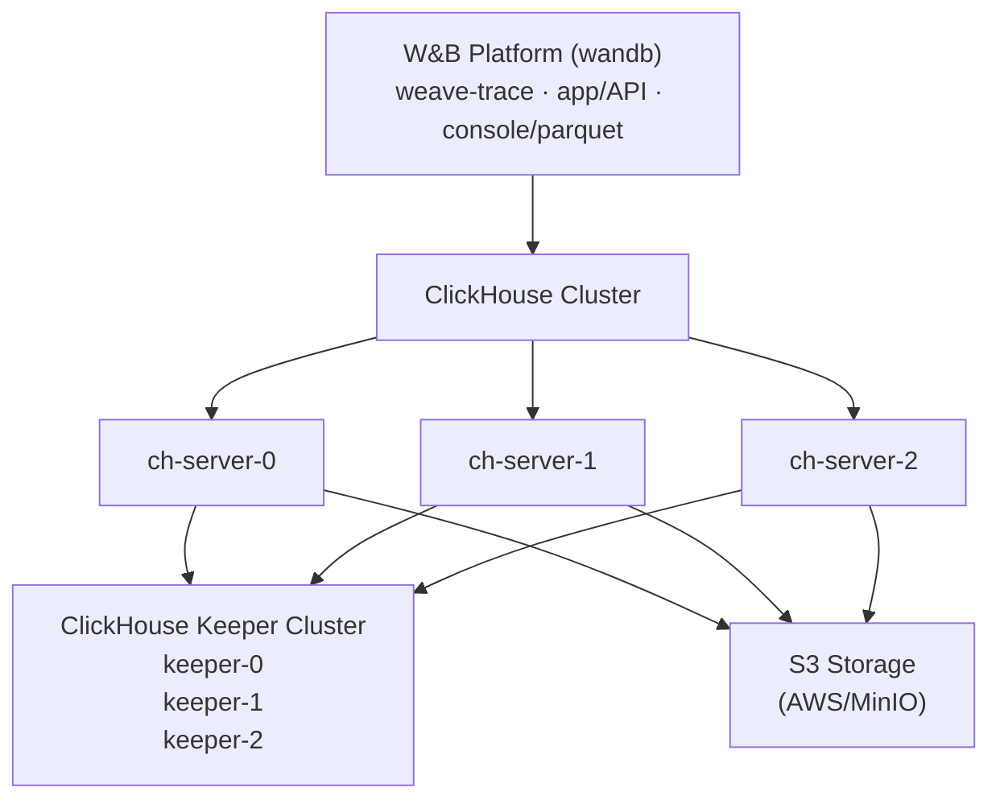

Self-hosting W&B Weave allows you to have more control over its environment and configuration. This can help you create a more isolated environment and meet additional security compliance. This document guides you through how to deploy all the components required to run W&B Weave in a self-managed environment using the Altinity ClickHouse Operator.

Self-managed Weave deployments rely on [ClickHouseDB](https://clickhouse.com/) to manage its backend. This deployment uses:

- **Altinity ClickHouse Operator**: Enterprise-grade ClickHouse management for Kubernetes
- **ClickHouse Keeper**: Distributed coordination service (replaces ZooKeeper)
- **ClickHouse Cluster**: High-availability database cluster for trace storage
- **S3-Compatible Storage**: Object storage for ClickHouse data persistence

<Tip>
For a detailed reference architecture, see [W&B Self-Managed Reference Architecture](https://docs.wandb.ai/guides/hosting/self-managed/ref-arch/#models-and-weave).
</Tip>

## Important setup notes

The configuration examples in this guide are for reference only. Because each organization's Kubernetes environment is unique, your self-hosted instance will likely require you to adjust:

- **Security & Compliance**: Security contexts, `runAsUser`/`fsGroup` values, and other security settings according to your organization's security policies and Kubernetes/OpenShift requirements.
- **Resource Sizing**: The resource allocations shown are starting points. **Consult with your W&B Solutions Architect team** for proper sizing based on your expected trace volume and performance requirements.
- **Infrastructure Specifics**: Update storage classes, node selectors, and other infrastructure-specific settings to match your environment.

These configurations in this guide should be treated like templates, not prescriptive solutions.

## Architecture



## Prerequisites

Self-managed Weave instances require the following resources:

- **Kubernetes Cluster**: Version 1.29+
- **Kubernetes Nodes**: Multi-node cluster (minimum 3 nodes recommended for high availability)
- **Storage Class**: A working StorageClass for persistent volumes (e.g., `gp3`, `standard`, `nfs-csi`)
- **S3 Bucket**: Pre-configured S3 or S3-compatible bucket with appropriate access permissions
- **W&B Platform**: Already installed and running (see [W&B Self-Managed Deployment Guide](https://docs.wandb.ai/guides/hosting/hosting-options/self-managed/))
- **W&B License**: Weave-enabled license from W&B Support

<Warning>
Do not make sizing decisions based on these prerequisites list alone. Resource needs vary significantly based on trace volume and usage patterns. See the detailed [Resource Requirements](#resource-requirements) section for explicit cluster-sizing guidance.
</Warning>

### Required tools

To set up your instance, you need the following tools:

- `kubectl` configured with cluster access
- `helm` v3.0+
- AWS credentials (if using S3) or access to S3-compatible storage

### Network requirements

Your Kubernetes cluster requires the following network setup:

- Pods in the `clickhouse` namespace must communicate with pods in the `wandb` namespace
- ClickHouse nodes must communicate with each other on ports 8123, 9000, 9009, and 2181

## Deploy your self-managed Weave instance

### Step 1: Deploy Altinity ClickHouse Operator

The Altinity ClickHouse Operator manages ClickHouse installations in Kubernetes.

#### 1.1 Add the Altinity Helm repository

```bash
helm repo add altinity https://helm.altinity.com
helm repo update
```

#### 1.2 Create the operator configuration

Create a file named `ch-operator.yaml`:


The `containerSecurityContext` values shown here work for most Kubernetes distributions. For **OpenShift**, you may need to adjust `runAsUser` and `fsGroup` to match your project's assigned UID range.

#### 1.3 Install the operator

```bash
helm upgrade --install ch-operator altinity/altinity-clickhouse-operator \
  --namespace clickhouse \
  --create-namespace \
  -f ch-operator.yaml
```

#### 1.4 Verify the operator installation


### Step 2: Prepare S3 Storage

ClickHouse requires S3 or S3-compatible storage for data persistence.

#### 2.1 Create an S3 bucket

Create an S3 bucket in your AWS account or S3-compatible storage provider:


#### 2.2 Configure S3 credentials

You have two options for providing S3 access credentials:

##### Option A: Using AWS IAM Roles (IRSA - Recommended for AWS)

If your Kubernetes nodes have an IAM role with S3 access, ClickHouse can use the EC2 instance metadata:


**Required IAM Policy** (attached to your node IAM role):

```json
{
  "Version": "2012-10-17",
  "Statement": [
    {
      "Effect": "Allow",
      "Action": [
        "s3:GetObject",
        "s3:PutObject",
        "s3:DeleteObject",
        "s3:ListBucket"
      ],
      "Resource": [
        "arn:aws:s3:::my-wandb-clickhouse-bucket",
        "arn:aws:s3:::my-wandb-clickhouse-bucket/*"
      ]
    }
  ]
}
```

##### Option B: Using Access Keys

If you prefer using static credentials, create a Kubernetes secret:

```bash
kubectl create secret generic aws-creds \
  --namespace clickhouse \
  --from-literal aws_access_key=YOUR_ACCESS_KEY \
  --from-literal aws_secret_key=YOUR_SECRET_KEY
```

Then configure ClickHouse to use the secret (see ch-server.yaml configuration below).

### Step 3: Deploy ClickHouse Keeper

[ClickHouse Keeper](https://clickhouse.com/docs/guides/sre/keeper/clickhouse-keeper) provides the coordination system for data replication and distributed DDL queries execution.

#### 3.1 Create the Keeper configuration

Create a file named `ch-keeper.yaml`:


**Important Configuration Updates**:

- **StorageClass**: Update `storageClassName: gp3` to match your cluster's available StorageClass
- **Security Context**: Adjust `runAsUser`, `fsGroup` values to comply with your organization's security policies
- **Anti-Affinity**: Customize or remove the `affinity` section based on your cluster topology and HA requirements
- **Resources**: The CPU/memory values are examples - consult with W&B Solutions Architects for proper sizing
- **Naming**: If you change `metadata.name` or `configuration.clusters[0].name`, you **must update** the Keeper hostnames in ch-server.yaml (Step 4) to match

#### 3.2 Deploy ClickHouse Keeper

```bash
kubectl apply -f ch-keeper.yaml
```

#### 3.3 Verify Keeper deployment


### Step 4: Deploy ClickHouse Cluster

Now deploy the ClickHouse server cluster that will store Weave trace data.

#### 4.1 Create the ClickHouse server configuration

Create a file named `ch-server.yaml`:


**Critical Configuration Updates Required**:

1. **StorageClass**: Update `storageClassName: gp3` to match your cluster's StorageClass
2. **S3 Endpoint**: Replace `YOUR-BUCKET-NAME` and `YOUR-REGION` with your actual values
3. **Cache Size**: The `<max_size>40Gi</max_size>` must be **smaller** than the persistent volume size (50Gi)
4. **Security Context**: Adjust `runAsUser`, `fsGroup`, and other security settings to match your organization's policies
5. **Resource Allocation**: The CPU/memory values are examples only - **consult with your W&B Solutions Architect** for proper sizing based on your expected trace volume
6. **Anti-Affinity Rules**: Customize or remove based on your cluster topology and high-availability needs
7. **Keeper Hostnames**: The Keeper node hostnames **must match** your Keeper deployment naming from Step 3 (see "Understanding Keeper Naming" below)
8. **Cluster Naming**: The cluster name `weavecluster` can be changed, but it must match the `WF_CLICKHOUSE_REPLICATED_CLUSTER` value in Step 5
9. **Credentials**:
   - For IRSA: Keep `<use_environment_credentials>true</use_environment_credentials>` or access your secret keys mapped to environment variables.

#### 4.2 Update S3 configuration

Edit the `storage_configuration.xml` section in `ch-server.yaml`:

**Example for AWS S3**:

```xml
<endpoint>https://my-wandb-clickhouse.s3.eu-central-1.amazonaws.com/s3_disk/{replica}</endpoint>
<region>eu-central-1</region>
```

**Example for MinIO**:

```xml
<endpoint>https://minio.example.com:9000/my-bucket/s3_disk/{replica}</endpoint>
<region>us-east-1</region>
```

<Warning>
**Do not remove `{replica}`.** This ensures each ClickHouse replica writes to its own folder in the bucket.
</Warning>

#### 4.3 Configure credentials (Option B only)

If using **Option B (Access Keys)** from Step 2, ensure the `env` section in `ch-server.yaml` references the secret:

```yaml
env:
  - name: AWS_ACCESS_KEY_ID
    valueFrom:
      secretKeyRef:
        name: aws-creds
        key: aws_access_key
  - name: AWS_SECRET_ACCESS_KEY
    valueFrom:
      secretKeyRef:
        name: aws-creds
        key: aws_secret_key
```

If using **Option A (IRSA)**, remove the entire `env` section.

#### 4.4 Understanding Keeper Naming

The Keeper node hostnames in the `zookeeper.nodes` section follow a specific pattern based on your Keeper deployment from Step 3:

**Hostname Pattern**: `chk-{installation-name}-{cluster-name}-{cluster-index}-{replica-index}.{namespace}.svc.cluster.local`

Where:

- `chk` = ClickHouseKeeperInstallation prefix (fixed)
- `{installation-name}` = The `metadata.name` from ch-keeper.yaml (e.g., `wandb`)
- `{cluster-name}` = The `configuration.clusters[0].name` from ch-keeper.yaml (e.g., `keeper`)
- `{cluster-index}` = Cluster index, typically `0` for single cluster
- `{replica-index}` = Replica number: `0`, `1`, `2` for 3 replicas
- `{namespace}` = Kubernetes namespace (e.g., `clickhouse`)

**Example with default names**:

```
chk-wandb-keeper-0-0.clickhouse.svc.cluster.local
chk-wandb-keeper-0-1.clickhouse.svc.cluster.local
chk-wandb-keeper-0-2.clickhouse.svc.cluster.local
```

**If you customize the Keeper installation name** (e.g., `metadata.name: myweave`):

```
chk-myweave-keeper-0-0.clickhouse.svc.cluster.local
chk-myweave-keeper-0-1.clickhouse.svc.cluster.local
chk-myweave-keeper-0-2.clickhouse.svc.cluster.local
```

**If you customize the Keeper cluster name** (e.g., `clusters[0].name: coordination`):

```
chk-wandb-coordination-0-0.clickhouse.svc.cluster.local
chk-wandb-coordination-0-1.clickhouse.svc.cluster.local
chk-wandb-coordination-0-2.clickhouse.svc.cluster.local
```

**To verify your actual Keeper hostnames**:


<Note>
The Keeper hostnames in `ch-server.yaml` **must exactly match** the actual service names created by the Keeper deployment, or ClickHouse servers will fail to connect to the coordination service.
</Note>

#### 4.5 Deploy ClickHouse cluster

```bash
kubectl apply -f ch-server.yaml
```

#### 4.6 Verify ClickHouse deployment


### Step 5: Enable Weave in W&B Platform

Now configure the W&B Platform to use the ClickHouse cluster for Weave traces.

#### 5.1 Gather ClickHouse connection information

You'll need:

- **Host**: `clickhouse-wandb.clickhouse.svc.cluster.local`
- **Port**: `8123`
- **User**: `weave` (as configured in ch-server.yaml)
- **Password**: `weave123` (as configured in ch-server.yaml)
- **Database**: `weave` (will be created automatically)
- **Cluster Name**: `weavecluster` (as configured in ch-server.yaml)

The host name follows this pattern: `clickhouse-{installation-name}.{namespace}.svc.cluster.local`

#### 5.2 Update W&B Custom Resource

Edit your W&B Platform Custom Resource (CR) to add Weave configuration:


**Critical Settings**:

- `clickhouse.replicated: true` - **Required** when using 3 replicas
- `WF_CLICKHOUSE_REPLICATED: "true"` - **Required** for replicated setup
- `WF_CLICKHOUSE_REPLICATED_CLUSTER: "weavecluster"` - **Must match** the cluster name in ch-server.yaml

<Note>
Security contexts, resource allocations, and other Kubernetes-specific configurations shown above are reference examples. Customize them according to your organization's requirements and consult with your W&B Solutions Architect team for proper resource sizing.
</Note>

#### 5.3 Apply the updated configuration

```bash
kubectl apply -f wandb-cr.yaml
```

#### 5.4 Verify Weave Trace deployment


### Step 6: Initialize Weave Database

The weave-trace service will automatically create the required database schema on first startup.

#### 6.1 Monitor database migration


#### 6.2 Verify database creation


### Step 7: Verify Weave is Enabled

#### 7.1 Access W&B Console

Navigate to your W&B instance URL in a web browser.

#### 7.2 Check Weave license status

In the W&B Console:

1. Go to **Top Right Menu** → **Organization Dashboard**
2. Verify that **Weave access** is enabled

#### 7.3 Test Weave functionality

Create a simple Python test to verify Weave is working:


After running this, check your W&B UI for traces at the traces page in your organization.

## Troubleshooting

### ClickHouse Keeper Issues

**Problem**: Keeper pods stuck in `Pending` state

**Solution**: Check multiple possible causes:

1. **PVC and StorageClass issues**:

```bash
kubectl get pvc -n clickhouse
kubectl describe pvc -n clickhouse
```

Ensure your StorageClass is configured correctly and has available capacity.

2. **Anti-affinity and node availability**:


Common issues:

- Anti-affinity requires 3 separate nodes, but cluster has fewer nodes
- Nodes don't have sufficient CPU/memory to meet pod requests
- Node taints preventing pod scheduling

**Solutions**:

- Remove or adjust anti-affinity rules if you have fewer than 3 nodes
- Use `preferredDuringSchedulingIgnoredDuringExecution` instead of `requiredDuringSchedulingIgnoredDuringExecution` for softer anti-affinity
- Reduce resource requests if nodes are constrained
- Add more nodes to your cluster

---

**Problem**: Keeper pods in `CrashLoopBackOff`

**Solution**: Check logs and verify configuration:

```bash
kubectl logs -n clickhouse <keeper-pod-name>
```

Common issues:

- Incorrect security context (check runAsUser, fsGroup)
- Volume permission issues
- Port conflicts
- Configuration errors in ch-keeper.yaml

### ClickHouse Server Issues

**Problem**: ClickHouse cannot connect to S3

**Solution**: Verify S3 credentials and permissions:


---

**Problem**: ClickHouse cannot connect to Keeper

**Solution**: Verify Keeper endpoints and naming:


If the connection fails, the Keeper hostnames in ch-server.yaml likely don't match your actual Keeper deployment. See "Understanding Keeper Naming" in Step 4 for the naming pattern.

### Weave Trace Issues

**Problem**: `weave-trace` pod fails to start

**Solution**: Check ClickHouse connectivity:


---

**Problem**: Weave not showing as enabled in Console

**Solution**: Verify configuration:

1. Check license includes Weave:

   ```bash
   kubectl get secret license-key -n wandb -o jsonpath='{.data.value}' | base64 -d | jq
   ```

2. Ensure `weave-trace.enabled: true` and `clickhouse.replicated: true` are set in wandb-cr.yaml

3. Check W&B operator logs:
   ```bash
   kubectl logs -n wandb deployment/wandb-controller-manager
   ```

---

**Problem**: Database migration fails

**Solution**: Check cluster name matches:

The `WF_CLICKHOUSE_REPLICATED_CLUSTER` environment variable **must match** the cluster name in ch-server.yaml:


## Resource requirements

<Warning>
The resource allocations below are **example starting points only**. Actual requirements vary significantly based on:

- Trace ingestion volume (traces per second)
- Query patterns and concurrency
- Data retention period
- Number of concurrent users

**Always consult with your W&B Solutions Architect team** to determine appropriate sizing for your specific use case. Under-provisioned resources can lead to performance issues, while over-provisioning wastes infrastructure costs.
</Warning>

### Minimum production setup

| Component         | Replicas   | CPU Request / Limit | Memory Request / Limit | Storage   |
| ----------------- | ---------- | ------------------- | ---------------------- | --------- |
| ClickHouse Keeper | 3          | 0.5 / 1             | 256Mi / 2Gi            | 10Gi each |
| ClickHouse Server | 3          | 1 / 4               | 1Gi / 16Gi             | 50Gi each |
| Weave Trace       | 1          | 1 / 4               | 4Gi / 8Gi              | -         |
| **Total**         | **7 pods** | **~4.5 / 15 CPU**   | **~7.8Gi / 58Gi**      | **180Gi** |

_Suitable for: Development, testing, or low-volume production environments_

### Recommended production setup

For production workloads with high trace volume:

| Component         | Replicas     | CPU Request / Limit  | Memory Request / Limit   | Storage    |
| ----------------- | ------------ | -------------------- | ------------------------ | ---------- |
| ClickHouse Keeper | 3            | 1 / 2                | 1Gi / 4Gi                | 20Gi each  |
| ClickHouse Server | 3            | 1 / 16               | 8Gi / 64Gi               | 200Gi each |
| Weave Trace       | 2-3          | 1 / 4                | 4Gi / 8Gi                | -          |
| **Total**         | **8-9 pods** | **~6-9 / 52-64 CPU** | **~27-33Gi / 204-216Gi** | **660Gi**  |

_Suitable for: High-volume production environments_

For ultra-high volume deployments, contact your W&B Solutions Architect team for custom sizing recommendations based on your specific trace volume and performance requirements.

## Advanced configuration

This section covers customization options for self-managed Weave deployments, including scaling ClickHouse capacity through vertical scaling or horizontal scaling, updating ClickHouse versions by modifying image tags in both keeper and server configurations, and monitoring ClickHouse health.

We recommend consulting with your W&B Solutions Architect team when making advanced changes to your instance to ensure they align with your performance and reliability requirements.

### Scaling ClickHouse

To increase ClickHouse capacity, you can:

1. **Vertical Scaling**: Increases resources per pod (simpler approach)

   ```yaml
   resources:
     requests:
       memory: 8Gi
       cpu: 1
     limits:
       memory: 64Gi
       cpu: 16
   ```

   **Recommendation**: Monitor actual resource usage and scale accordingly. For ultra-high volume deployments, contact your W&B Solutions Architect team.

2. **Horizontal Scaling**: Adds more replicas (requires careful planning)
   - Increasing replicas requires data rebalancing
   - Consult ClickHouse's documentation for shard management
   - **Contact a W&B Solutions Architect** before implementing horizontal scaling in production

### Using different ClickHouse versions

To use a different ClickHouse version, update the image tag in both ch-keeper.yaml and ch-server.yaml:


Keeper and server versions should match or keeper version should be >= server version for compatibility.

### Monitoring ClickHouse

Access ClickHouse system tables for monitoring:


### Backup and Recovery

ClickHouse data is stored in S3, providing inherent backup capabilities through S3 versioning and bucket replication features. For backup strategies specific to your deployment, consult with your W&B Solutions Architect team and refer to the [ClickHouse backup documentation](https://clickhouse.com/docs/en/operations/backup).

## Security considerations

1. **Credentials**: Store ClickHouse passwords in Kubernetes secrets, not plain text
2. **Network Policies**: Consider implementing NetworkPolicies to restrict ClickHouse access
3. **RBAC**: Ensure service accounts have minimal required permissions
4. **S3 Bucket**: Enable encryption at rest and restrict bucket access to necessary IAM roles
5. **TLS** (Optional): For production, enable TLS for ClickHouse client connections

## Upgrading

### Upgrading ClickHouse Operator

```bash
helm upgrade ch-operator altinity/altinity-clickhouse-operator \
  --namespace clickhouse \
  -f ch-operator.yaml
```

### Upgrading ClickHouse Server

Update the image version in `ch-server.yaml` and apply:


### Upgrading Weave Trace

Update the image tag in `wandb-cr.yaml` and apply:


## Additional resources

- [Altinity ClickHouse Operator Documentation](https://docs.altinity.com/altinitykubernetesoperator/)
- [ClickHouse Documentation](https://clickhouse.com/docs)
- [W&B Weave Documentation](https://docs.wandb.ai/weave)
- [ClickHouse S3 Storage Configuration](https://clickhouse.com/docs/en/engines/table-engines/mergetree-family/mergetree#s3-virtual-hosted-style)

## Support

For production deployments or issues:

- **W&B Support**: `support@wandb.com`
- **Solutions Architects**: For ultra-high volume deployments, custom sizing, and deployment planning
- **Include in support requests**:
  - Logs from weave-trace, ClickHouse pods, and operator
  - W&B version, ClickHouse version, Kubernetes version
  - Cluster information and trace volume

## FAQ

**Q: Can I use a single ClickHouse replica instead of 3?**

A: Yes, but it's not recommended for production. Update `replicasCount: 1` in ch-server.yaml and set `clickhouse.replicated: false` in wandb-cr.yaml.

**Q: Can I use another database instead of ClickHouse?**

A: No, Weave Trace requires ClickHouse for its high-performance columnar storage capabilities.

**Q: How much S3 storage will I need?**

A: S3 storage requirements depend on your trace volume, retention period, and data compression. Monitor your actual usage after deployment and adjust accordingly. ClickHouse's columnar format provides excellent compression for trace data.

**Q: Do I need to configure the `database` name in ClickHouse?**

A: No, the `weave` database will be created automatically by the weave-trace service during initial startup.

**Q: What if my cluster name is not `weavecluster`?**

A: You must set the `WF_CLICKHOUSE_REPLICATED_CLUSTER` environment variable to match your cluster name, otherwise database migrations will fail.

**Q: Should I use the exact security contexts shown in the examples?**

A: No. The security contexts (runAsUser, fsGroup, etc.) provided in this guide are reference examples. You must adjust them to comply with your organization's security policies, especially for OpenShift clusters which have specific UID/GID range requirements.

**Q: How do I know if I've sized my ClickHouse cluster correctly?**

A: Contact your W&B Solutions Architect team with your expected trace volume and usage patterns. They will provide specific sizing recommendations. Monitor your deployment's resource usage and adjust as needed.

**Q: Can I customize the naming conventions used in the examples?**

A: Yes, but you must maintain consistency across all components:

1. **ClickHouse Keeper names** → Must match the Keeper node hostnames in ch-server.yaml's `zookeeper.nodes` section
2. **ClickHouse cluster name** (`weavecluster`) → Must match `WF_CLICKHOUSE_REPLICATED_CLUSTER` in wandb-cr.yaml
3. **ClickHouse installation name** → Affects the service hostname used by weave-trace

See the "Understanding Keeper Naming" section in Step 4 for details on the naming pattern and how to verify your actual names.

**Q: What if my cluster uses different anti-affinity requirements?**

A: The anti-affinity rules shown are recommendations for high availability. Adjust or remove them based on your cluster size, topology, and availability requirements. For small clusters or development environments, you may not need anti-affinity rules.
