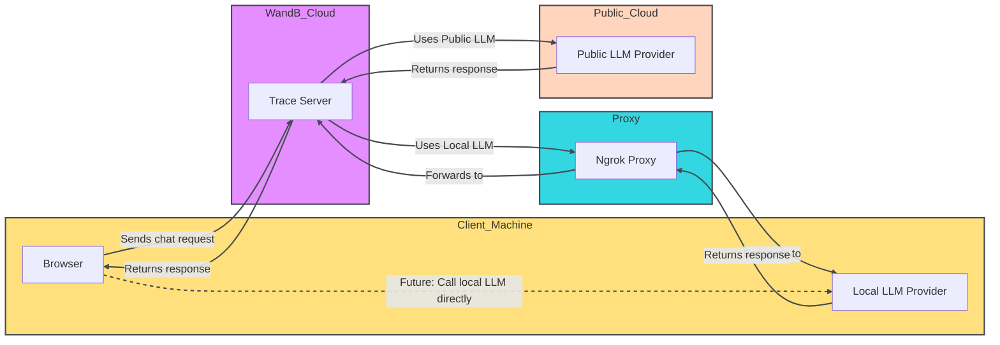

<Tip>
For a limited time, W&B Inference is included in your free tier. W&B Inference provides access to leading open-source foundation models via API and the Weave Playground. 
- [Developer documentation](../integrations/inference)
- [Product page](https://wandb.ai/site/inference) 
</Tip>

Evaluating LLM prompts and responses is challenging. The Weave Playground is designed to simplify the process of iterating on LLM prompts and responses, making it easier to experiment with different models and prompts. With features like prompt editing, message retrying, and model comparison, Playground helps you to quickly test and improve your LLM applications. Playground currently supports models from providers such as OpenAI, Anthropic, and Google, as well as [custom providers](#add-a-custom-provider).

- **Quick access:** Open the Playground from the W&B sidebar for a fresh session or from the Call page to test an existing project.
- **Message controls:** Edit, retry, or delete messages directly within the chat.
- **Flexible messaging:** Add new messages as either user or system inputs, and send them to the LLM.
- **Customizable settings:** Configure your preferred LLM provider and adjust model settings.
- **Multi-LLM support:** Switch between models, with team-level API key management.
- **Compare models:** Compare how different models respond to prompts.
- **Custom providers:** Test OpenAI compatible API endpoints for custom models.
- **Saved models:** Create and configure a reusable model preset for your workflow

Get started with the Playground to optimize your LLM interactions and streamline your prompt engineering process and LLM application development.

- [Add provider credentials and information](#add-provider-credentials-and-information)
- [Access the Playground](#access-the-playground)
- [Select an LLM](#select-an-llm)
- [Customize settings](#customize-settings)
- [Message controls](#message-controls)
- [Compare LLMs](#compare-llms)
- [Custom providers](#custom-providers)
- [Saved models](#saved-models) 


## Add provider credentials and information

Before you can use Playground, you must add provider credentials.  Playground currently supports models from many providers. To use one of the available models, add the appropriate information to your team secrets in W&B settings.

- Amazon Bedrock:
  - `AWS_ACCESS_KEY_ID`
  - `AWS_SECRET_ACCESS_KEY`
  - `AWS_REGION_NAME`
- Anthropic: `ANTHROPIC_API_KEY`
- Azure:
  - `AZURE_API_KEY`
  - `AZURE_API_BASE`
  - `AZURE_API_VERSION`
- Deepseek: `DEEPSEEK_API_KEY`
- Google: `GEMINI_API_KEY`
- Groq: `GROQ_API_KEY`
- Mistral: `MISTRAL_API_KEY`
- OpenAI: `OPENAI_API_KEY`
- X.AI: `XAI_API_KEY`

## Access the Playground

There are two ways to access the Playground:

1. _Open a fresh Playground page with a simple system prompt_: In the sidebar of a Weave project, select **Playground**. Playground opens in the same tab.
2. _Open Playground for a specific call_:
   1. In the sidebar, select the **Traces** tab. A list of traces displays.
   2. In the list of traces, click the name of the call that you want to view. The call's details page opens.
   3. Click **Open chat in Playground**. Playground opens in a new tab.

<Frame>

</Frame>

## Select an LLM

You can switch the LLM using the **Select a model** dropdown at the top of the Playground. The available models from various providers are listed below:

- [Amazon Bedrock]
- [Anthropic]
- [Azure]
- [Deepseek]
- [Google]
- [Groq]
- [Mistral]
- [OpenAI]
- [X.AI]


{/* USE make update_playground_models */}
{/* LLM_LIST_START, DON'T EDIT THIS SECTION */}
{/*  Removed list of models since it changes so frequently 1/2026. Leaving surrounding wrapper because it implies there is a script to pull this from somewhere? in case we want it back someday. */}
{/* LLM_LIST_END, DON'T EDIT THIS SECTION */}

The available models depend on the providers configured for your team.

## Customize settings

### Adjust LLM parameters

You can experiment with different parameter values for your selected model. To adjust parameters, do the following:

1. In the upper right corner of the Playground, click the **Chat settings** button to open the chat settings panel.
2. In the **Chat settings** panel, adjust parameters as desired. You can also toggle Weave call tracking on or off, and [add a function](#add-a-function).
3. Changes are applied automatically.  Click **Chat settings** again, or the **x** in the upper right corner, to close the panel.  The hover text for the **Chat settings** button updates to display the settings you have changed.


If you leave the page, your settings will be lost.  To save your settings, [save your model](#save-a-model).
If you want to discard your changed settings and start over, refresh the page.

<Frame>

</Frame>

### Add a function

You can test how different models use functions based on input it receives from the user. To add a function for testing in Playground, do the following:

1. In the upper right corner of the Playground, click the **Chat settings** button to open the chat settings panel.
2. In the **Chat settings** panel, click **+ Add function**.
3. In the **Add Function** panel, add your function information.
4. To save your changes and close the function panel, click **Add**.
5. Click **Chat settings** again, or the **x** in the upper right corner, to close the settings panel.

### Adjust the number of trials

Playground allows you to generate multiple outputs for the same input by setting the number of trials. The default setting is `1`. To adjust the number of trials, do the following:

1. In the Playground, open the settings sidebar if it is not already open.
2. Adjust the **Number of trials**.

## Message controls

### Add a new message

To add a new message to the chat, do the following:

1. In the chat box, select one of the available roles (**System**, **Assistant**, or **User** role).
2. Click **+ Add**.
3. To send a new message to the LLM, click the **Send** button. Alternatively, press the **Enter** key.

<Frame>

</Frame>

### Retry, edit, and delete messages

With Playground, you can retry, edit, and delete messages. To use this feature, hover over the message you want to edit, retry, or delete. Several buttons display: **Copy**, **Delete**, **Edit**, and **Retry**.

- **Copy**: Copy entire contents of the message.
- **Delete**: Remove the message from the chat.
- **Edit**: Modify the message content.
- **Retry**: Delete all subsequent messages and retry the chat from the selected message.

<Frame>

</Frame>
<Frame>

</Frame>


### View message history

To view message history, click the **History** icon to the upper right of the Playground.  This opens a History panel showing all messages sent for the current project.  
Selecting an item from the history automatically loads it into an additional chat panel for comparison. 

## Compare LLMs

Playground allows you to compare LLMs. To perform a comparison, do the following:

1. To the upper right of the Playground, click **+** (Add Chat). A second chat opens next to the original chat.
2. In the second chat, you have the same functionality as the original chat, such as choosing the model, adjusting the settings, and adding functions.
3. In the message box, enter a message that you want to test with both models and press **Send**.

## Custom providers

### Add a custom provider

In addition to the built-in providers, you can use the Playground to test OpenAI compatible API endpoints for custom models. Examples include:

- Older versions of supported model providers
- Local models

To add a custom provider to the Playground, do the following:

1. In the top of the Playground, click the **Select a model** dropdown.
2. Select **+ Add AI provider**.
3. Select **Custom Provider**.
4. In the pop-up modal, enter the provider information:

- **Provider name**: A name for the provider, such as `openai` or `ollama`.
- **API key**: The API key for the provider, such as an OpenAI API key.
- **Base URL**: The base endpoint for the provider, such as `https://api.openai.com/v1/` or an ngrok URL like `https://e452-2600-1700-45f0-3e10-2d3f-796b-d6f2-8ba7.ngrok-free.app`.
- **Headers**: (Optional) One or more custom HTTP header key-value pairs.
- **Models**: One or more models for the provider, such as `deepseek-r1` or `qwq`.
- **Max tokens**: (Optional) For each model, the maximum number of tokens the model can generate in a response.

5. Once you've entered your provider information, click **Add provider**.
6. Select your new provider and available model(s) from the **Select a model** dropdown in the upper left corner of the Playground.

<Warning>
Because of CORS restrictions, you can't call localhost or 127.0.0.1 URLs directly from the Playground. If you're running a local model server (such as Ollama), use a tunneling service like ngrok to expose it securely. For details, see [Use ngrok with Ollama](#use-a-local-model-as-a-custom-provider).
</Warning>

Now, you can test the custom provider model(s) using standard Playground features. You can also [edit](#edit-a-custom-provider) or [remove](#remove-a-custom-provider) the custom provider.

### Edit a custom provider

To edit information for a [previously created custom provider](#add-a-custom-provider), do the following:

1. At the top of the Playground, click the **Select a model** dropdown.  Then select **+Configure providers**.
  * Alternatively, in the menu sidebar, you can select **Project**, and then select the **AI Providers** tab.
2. In the **Custom providers** table, find the custom provider you want to update.
3. In the **Last Updated** column of the entry for your custom provider, click the edit button (the pencil icon).
4. In the pop-up modal, edit the provider information.
5. Click **Save**.

### Remove a custom provider

To remove a [previously created custom provider](#add-a-custom-provider), do the following:

1. At the top of the Playground, click the **Select a model** dropdown.  Then select **+Configure providers**.
  * Alternatively, in the menu sidebar, you can select **Project**, and then select the **AI Providers** tab.
2. In the **Custom providers** table, find the custom provider you want to update.
3. In the **Last Updated** column of the entry for your custom provider, click the delete button (the trashcan icon).
4. In the pop-up modal, confirm that you want to delete the provider. This action cannot be undone.
5. Click **Delete**.

### Use a local model as a custom provider

To test a locally running model in the Playground, use ngrok and Ollama to create a temporary public URL that bypasses CORS restrictions.

To set it up, do the following:

1. [Install ngrok](https://ngrok.com/docs/getting-started/#step-1-install) for your operating system.
2. Start your Ollama model:

   ```bash
   ollama run <model>
   ```

3. In a separate terminal, create an ngrok tunnel with the required CORS headers:

   ```bash
   ngrok http 11434 --response-header-add "Access-Control-Allow-Origin: *" --host-header rewrite
   ```
4. After ngrok starts, it will display a public URL, such as `https://xxxx-xxxx.ngrok-free.app`. Use this URL as the **Base URL** when you [add a custom provider](#add-a-custom-provider) in the Playground.

The following diagram illustrates the data flow between your local environment, the ngrok proxy, and the W&B cloud services:



## Saved models

### Save a model

You can create and configure a reusable model preset for your workflow. Saving a model lets you quickly load it with your preferred settings, parameters, and function hooks.

1. At the top of the Playground, click the **Select a model** dropdown.  Then select a provider and model.
2. In the upper right corner of the Playground, click the **Chat settings** button to open the chat settings panel.
3. In the chat settings panel:
   - In the **Model Name** field, enter a name for your saved model. 
   - Adjust parameters as desired. You can also toggle Weave call tracking on or off, and [add a function](#add-a-function).
4. Click **Publish Model**. The model is saved and accessible from **Saved Models** in the **Select a model** dropdown. You can now [use](#use-a-saved-model) and [update](#update-a-saved-model) the saved model.

<Frame>

</Frame>

### Use a saved model 

Quickly switch to a previously [saved model](#save-a-model) to maintain consistency across experiments or sessions. This way you can pick up right where you left off.

1. From the **Select a model** dropdown, select **Saved Models**.
2. From the list of saved models, select the saved model you want to load. The model loads and is ready for use in the Playground.

<Frame>

</Frame>

### Update a saved model

Edit an existing [saved model](#save-a-model) to fine-tune parameters or refresh its configuration. This ensures your saved models evolve alongside your use cases.

1. From the **Select a model** dropdown, select **Saved Models**.
2. From the list of saved models, select the saved model you want to update. 
3. In the upper right corner of the Playground, click the **Chat settings** button to open the chat settings panel.
4. In the chat settings panel, adjust parameters as desired. You can also toggle Weave call tracking on or off, and [add a function](#add-a-function).
5. Click **Update model**. The model is updated and accessible from **Saved Models** in the **Select a model** dropdown.  The version of your saved model is automatically incremented.