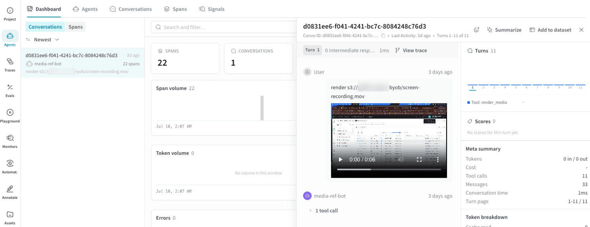

import ByobReferenceSetup from "/snippets/_includes/byob-reference-setup.mdx";

<ByobReferenceSetup />

## Log a media reference using agent spans

Return a bucket URI as an agent tool result and Weave renders it inline in the **Agents** view, on the tool call that produced it. The following example opens a conversation, a turn, and a tool span, and sets a bucket URI as the tool's result. Replace `[YOUR-TEAM]`, `[YOUR-PROJECT]`, and `[YOUR-BUCKET]` with your own values.

<Tabs>
<Tab title="Python">

```python lines
import weave

weave.init("[YOUR-TEAM]/[YOUR-PROJECT]")

# A tool that returns an object that already lives in your bucket.
def get_frame(frame_id: int) -> str:
    return f"s3://[YOUR-BUCKET]/frames/{frame_id:06d}.png"

with weave.start_conversation(agent_name="frame-labeler") as conversation:
    with weave.start_turn(user_message="Show me frame 123", model="gpt-4o-mini"):
        with weave.start_tool(
            name="get_frame",
            arguments='{"frame_id": 123}',
            tool_call_id="call_1",
        ) as tool:
            # The result is a bucket URI string; it renders inline in the Agents view.
            tool.result = get_frame(123)
```

</Tab>
<Tab title="TypeScript">

```typescript lines
import * as weave from 'weave';

await weave.init('[YOUR-TEAM]/[YOUR-PROJECT]');

// A tool that returns an object that already lives in your bucket.
function getFrame(frameId: number): string {
  return `s3://[YOUR-BUCKET]/frames/${String(frameId).padStart(6, '0')}.png`;
}

const conversation = weave.startConversation({agentName: 'frame-labeler'});
const turn = weave.startTurn({model: 'gpt-4o-mini'});
const tool = weave.startTool({
  name: 'getFrame',
  args: JSON.stringify({frameId: 123}),
  toolCallId: 'call_1',
});
// The result is a bucket URI string; it renders inline in the Agents view.
tool.result = getFrame(123);
tool.end();
turn.end();
conversation.end();
```

</Tab>
</Tabs>

<Note>
This example uses Weave agent spans. For the full multi-turn setup, including LLM calls and a complete agent loop, see the [custom agents quickstart](/weave/custom-agents-quickstart).
</Note>

## View the reference in Weave Agents

Open the conversation from the link that `weave.init()` prints. The referenced image or video renders inline in the **Agents** view, on the tool call that returned the URI. If Weave can't resolve a URI, for example because the object is missing or the bucket isn't registered, it shows the plain URI string.

<Frame>
  
</Frame>


