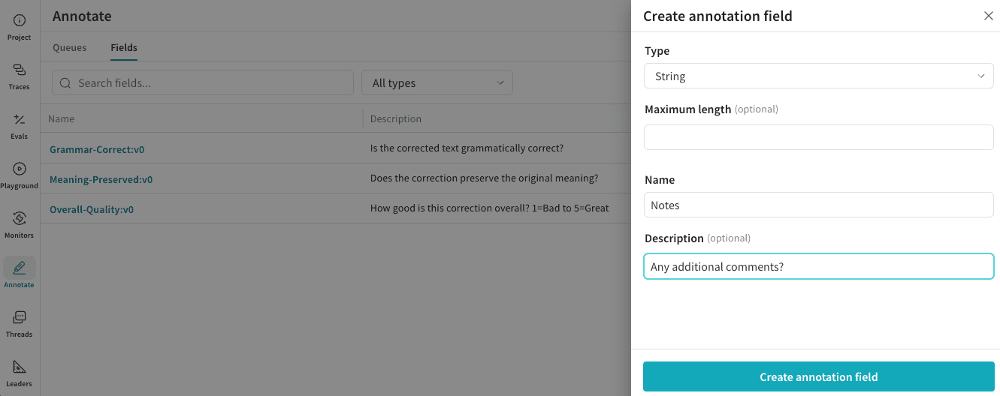
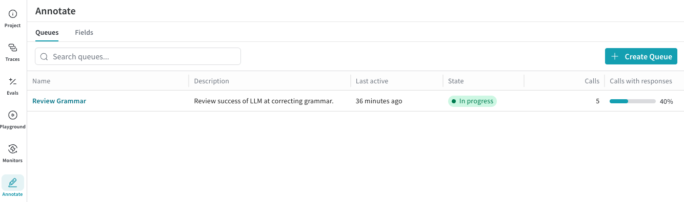
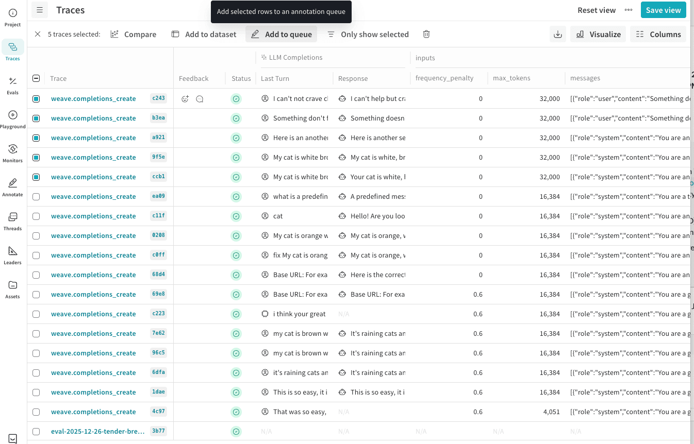
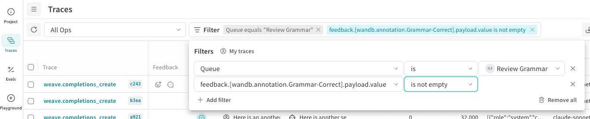

## Overview

Annotation queues let you route selected traces to domain experts for structured review without requiring them to navigate the full Weave UI. As an engineer, you define what feedback is collected, select which traces require review, and later can export completed annotations for analysis or dataset creation.

- **Manual trace scoring**: Have SMEs rate model outputs on correctness, quality, or style.
- **Failure analysis**: Annotate failure modes (hallucinations, refusals, loops) to understand where your model breaks.
- **Domain expert review**: Enable medical, legal, or safety experts to review content with a task-focused interface.
- **Dataset creation**: Turn annotated traces into evaluation or training datasets.


## End-to-end workflow

As the engineer, you are responsible for the following lifecycle:

1. Define annotation fields and create an annotation queue.
2. Load traces into the queue for review.
3. Monitor progress while domain experts complete reviews.
4. Filter and export completed annotations.


## Define annotation fields

Annotation fields define the feedback that the annotator provides for each trace item. Fields are reusable across queues and projects.

Field types include:
- Boolean judgments such as correctness or acceptability.
- Numeric or integer values such as quality or confidence.
- Categorical labels such as failure mode or intent.
- Free-form text for qualitative feedback.

Define all fields before creating a queue so they can be selected during queue setup.

To create an annotation field:
1. Navigate to [wandb.ai](https://wandb.ai).
2. In the Weave sidebar menu, click **Annotate**.
3. In the tab bar, click the **Fields** tab.
4. In the Fields table toolbar, click **New Field**.
5. In the **Create annotation field** modal dialog, configure:
    - **Type**: Boolean, Integer, Number, String, or categorical options
    - **Name** 
    - **Description** (Optional)
6. Click **Create annotation field** to save the field.

<Frame>
  
</Frame>


## Create an annotation queue

An annotation queue consists of:
- A set of annotation fields.
- Guidelines that provide task instructions for annotators.
- A collection of trace items awaiting review.

To create an annotation queue:
1. In the Weave sidebar menu, click **Annotate**.
2. In the tab bar, click the **Queues** tab.
3. In the Queues table toolbar, click **Create Queue**.
4. In the **Create Annotation Queue** modal dialog, configure:
    - **Queue name**: This is the queue name the annotator will select to complete their work.
    - **Guidelines** (Optional): Any additional instructions for the annotator.
5. Click **Next**.
6. Click **Manage fields** and choose what Annotation Fields should be included in this review work. All existing Annotation Fields for the Project are available for selection.
7. After you have selected all the Fields for the queue, click **Create Queue** to save the queue.

All annotation queues for the project are listed in the Annotation Queues page.
<Frame>
  
</Frame>


Creating an annotation queue defines the fields and guidelines for evaluation, but you still need to add traces to the queue to identify what data should be evaluated.

### Add traces to a queue

Traces can be added to an annotation queue directly from the **Traces** page:
1. In the Weave sidebar menu, click **Traces**.
2. In the Traces table toolbar, filter traces as needed (such as by hallucination scores, failure modes, or specific ops).
3. In the table, select the traces you want annotated.
4. In the table's action bar, click **Add to queue** to add the selected rows to an annotation queue.
<Frame>
  
</Frame>
5. In the **Add to annotation queue** modal dialog, configure:
    - **Queue Name**: In the dropdown, select the name of the existing queue to add these traces to.
    - **Select trace data to display**: Select the Weave trace data elements to display to the annotator as they are evaluating the results.
        - **Inputs**: Select which trace input fields to show during annotation.
        - **Outputs**: Select which trace output fields to show during annoation.
6. Click **Add ***[Count]*** traces to annotation queue** to assign these traces as a part of the annotation queue review.


When adding traces, you control which trace inputs and which outputs or model responses are reviewed. This way you can present annotators with only the context needed to make accurate judgments.


## Monitor review progress

Once the annotation queue has been created, and traces added, share the queue name with your annotator for them to begin their review. See [Review items in an annotation queue](/weave/guides/tracking/annotation-review) for details on the review process.

To share a direct link to the annotation queue with an annotator:
1. In the Weave sidebar menu, click **Annotate**.
2. In the tab bar, click the **Queues** tab.
3. In the Annotation Queues table, click the name of your queue to open the queue items.
4. In the Queue header bar, click the link button to copy a direct link to this queue.  You can also copy the URL from the browser address bar.

In the Annotation Queues table, the **State** column indicates reviewing progress:
- **Not started**: Queue has items but no annotations have been submitted.
- **In progress**: At least one item has been reviewed.
- **Completed**: All items have been reviewed.


## Filter and export annotations

Completed annotations are stored as structured metadata on traces.

You can:
- Filter traces by queue assignment and annotation completion.
- Save filtered views for reuse.
- Export annotated traces to datasets for evaluation or training workflows.

This connects expert human feedback directly to model evaluation and iteration.

### Filter annotated traces

1. In the Weave sidebar menu, click **Traces**.
2. In the Traces table toolbar, click **Filter**.
3. Add three values to a filter row:
    - For **Column**, type "Queue", then press **Enter**.
    - For the second dropdown, choose **Text: "is"**.
    - For **Select a queue**, choose your annotation queue name.
4. To also filter on 'completed' queue items only, click **+ Add Filter**:
    - For **Column**, type "feedback".  A popup will populate with Annotations and include your Annotation Field names.  Choose a required Field from your queue.
    - For the second dropdown, choose **Other: "is not empty"**.
<Frame>
  
</Frame>
4. Filter rows are automatically applied; click elsewhere in the page for the filter entry to close.
5. (Optional) Save as a view for quick access. In the Traces table header, click **Save View**.

### Export annotated traces to datasets

You can export annotated traces either through the UI or programmatically, depending on how you plan to use the data.

#### Add annotated traces to a dataset

Select annotated traces and click **Add to Dataset** to include expert labels in your eval or training data.

1. In the Weave sidebar menu, click **Traces**.
2. In the Traces table, select the traces that you want to export.
3. In the table toolbar, click **Add to dataset**. Follow the on-screen prompts to complete the addition.

To learn more about using datasets, see [Collect and track datasets](/weave/guides/core-types/datasets).

#### Access annotations programmatically

If you want to integrate annotations programmatically, you must know your project name and queue ID:
 - **Project**: The W&B project name (can be project or team/project). If you don’t specify a W&B team (such as "team/project"), your default team is used.
 - **Queue ID**: The queue ID is the unique identifier for an annotation queue.

To find the queue ID:
1. In the **Annotation Queues** table, select the name of the queue to open its items.
2. Copy the ID from the end of the page URL.

**Example**
```
https://wandb.ai/.../annotation-queues/019c0f63-7acb-7497-8f87-08873368fcd4
```

In this example, the queue ID is:

019c0f63-7acb-7497-8f87-08873368fcd4

You can iterate through the traces (calls) in your queue using the following code.

```python
import weave
from weave.trace_server.trace_server_interface import AnnotationQueueItemsQueryReq

# Update project and queue identifiers to your own values.
PROJECT = "your-team-name/your-project-name"
QUEUE_ID = "019c0f63-7acb-7497-8f87-08873368fcd4"

# Initialize Weave.
client = weave.init(PROJECT)

# Get call IDs from calls in a queue.
res = client.server.annotation_queue_items_query(
    AnnotationQueueItemsQueryReq(
        project_id=PROJECT,
        queue_id=QUEUE_ID,
    )
)

# Get feedback for first item.
call = client.get_call(call_id=res.items[0].call_id, include_feedback=True) 
call.feedback
```