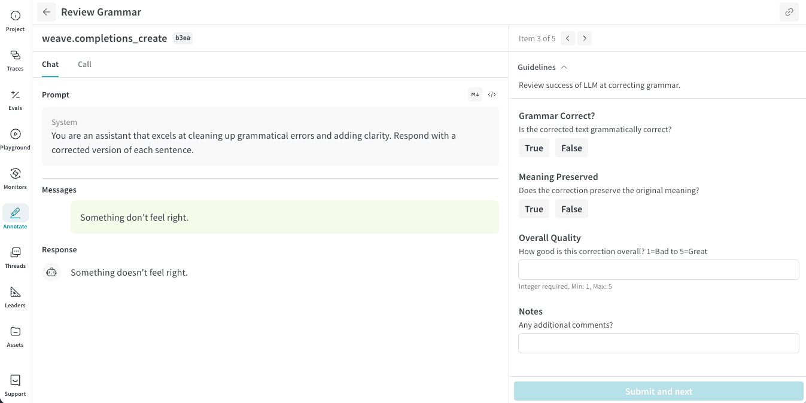

Annotation queues provide a focused review interface for domain experts. You review one item at a time, examine the provided context, and submit structured feedback using predefined fields.

You do not need to understand the underlying model or tracing system to complete reviews.

## Annotation workflow

As an annotator, your task consists of:

1. Open the shared annotation queue.
2. Review each item. You can move forward and backward through items in the queue at any time.
3. Submit feedback using the provided annotation fields.

Your progress is saved automatically after you submit an item. If you need to pause and resume your work later, the review automatically resumes at the first incomplete item. Once all items have been reviewed, the Annotation Queue table reflects completion of the work.

### Review a queue item

For each item, the review interface shows two panes:
- A trace pane showing selected input context (such as prompts, documents, or images) and the corresponding model response or decision.
- An item pane containing an annotation entry form containing annotation fields.

Complete each annotation field according to the instructions provided for the queue, then click **Submit and next** to save this item and continue to the next.

<Frame>
  
</Frame>

<Tip>
In the trace pane header, you can click the Trace ID suffix (for example, "b3ea") to open a panel showing the full trace details for the call.
</Tip>

If any annotator has already reviewed an item in the queue, both pane headers of the review interface are decorated with "Has feedback" and "Response submitted" indicators.
