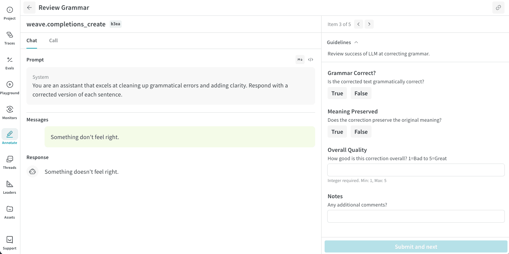

Annotation queues provide a focused review interface for domain experts. You review one item at a time, examine the provided context, and submit structured feedback using predefined fields. By completing a queue, you contribute expert judgments that your team can use to evaluate and improve LLM outputs.

You don't need to understand the underlying model or tracing system to complete reviews. This lets external experts review the data without needing broader project context.

## Annotation workflow

This section walks through the end-to-end process of reviewing items in a queue that has been shared with you.

As an annotator, your task is to review the accuracy of the LLM responses. Weave saves your feedback as annotations to the data.

To review an annotation queue:
1. Open the shared annotation queue using a queue link provided by your team.
2. Review each item. You can move forward and backward through items in the queue at any time.
3. Submit an annotation using the provided annotation fields.

Weave saves your progress automatically after you submit an item. If you need to pause and resume your work later, the review automatically resumes at the first incomplete item. After you review all items, the Annotation Queue table reflects completion of the work.

### Review a queue item

The following describes the review interface and how to submit an annotation for a single item in the queue.

For each item, the review interface shows two panes:
- A trace pane that shows selected input context (such as prompts, documents, or images) and the corresponding model response or decision.
- An item pane that contains an annotation entry form with annotation fields.

Complete each annotation field according to the instructions provided for the queue, then click **Submit and next** to save this item and continue to the next.

<Frame>
  
</Frame>

<Tip>
In the trace pane header, you can click the trace ID suffix (for example, "b3ea") to open a panel that shows the full trace details for the call, where you can inspect the trace and view or compare the annotation provided.
</Tip>

If any annotator has already reviewed an item in the queue, both pane headers of the review interface display **Has annotation** and **Response submitted** indicators.

You can still provide an annotation for an item that someone else has already reviewed. In this case, the annotation submission button still displays **Edit annotation**, but submitting creates a new annotation entry with your responses.

<Note> If you submit feedback for an item that someone else has already reviewed, your feedback is stored in addition to the original annotator's feedback. </Note>
