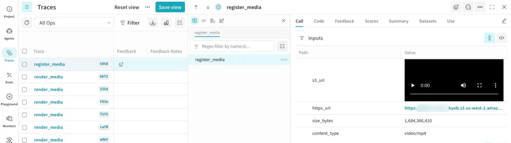

import ByobReferenceSetup from "/snippets/_includes/byob-reference-setup.mdx";

<ByobReferenceSetup />

## Log a media reference using Weave Op function tracing

Log the URI as a string value in a trace. Any string field whose value is a bucket URI renders. No content annotation is needed because the bytes stay in your bucket. The following example Op captions images that already live in your bucket and logs each URI alongside its caption. Replace `[YOUR-TEAM]`, `[YOUR-PROJECT]`, and `[YOUR-BUCKET]` with your own values.

<Tip>
If you're adding reference media to an agentic application, see [Reference media in agent spans](/weave/guides/tracking/agents-byob-references) instead.
</Tip>

<Tabs>
<Tab title="Python">

```python lines
import weave

weave.init("[YOUR-TEAM]/[YOUR-PROJECT]")

@weave.op
def caption_image(image_uri: str) -> dict:
    caption = my_captioner(image_uri)  # Your model or API call.
    # image_uri renders inline from its value; the field name is arbitrary
    # and the extension (.png here) decides image vs video.
    return {"image": image_uri, "caption": caption}

caption_image("s3://[YOUR-BUCKET]/photos/cat.png")
```

</Tab>
<Tab title="TypeScript">

```typescript lines
import * as weave from 'weave';

await weave.init('[YOUR-TEAM]/[YOUR-PROJECT]');

const captionImage = weave.op(async function captionImage(imageUri: string) {
  const caption = await myCaptioner(imageUri); // Your model or API call.
  // imageUri renders inline from its value; the field name is arbitrary.
  return {image: imageUri, caption};
});

await captionImage('s3://[YOUR-BUCKET]/photos/cat.png');
```

</Tab>
</Tabs>

## View the reference in Weave Traces

Open the trace from the link that `weave.init()` prints. The referenced image or video renders inline in the **Traces** view. If Weave can't resolve a URI, for example because the object is missing or the bucket isn't registered, it shows the plain URI string.

<Frame>
  
</Frame>


