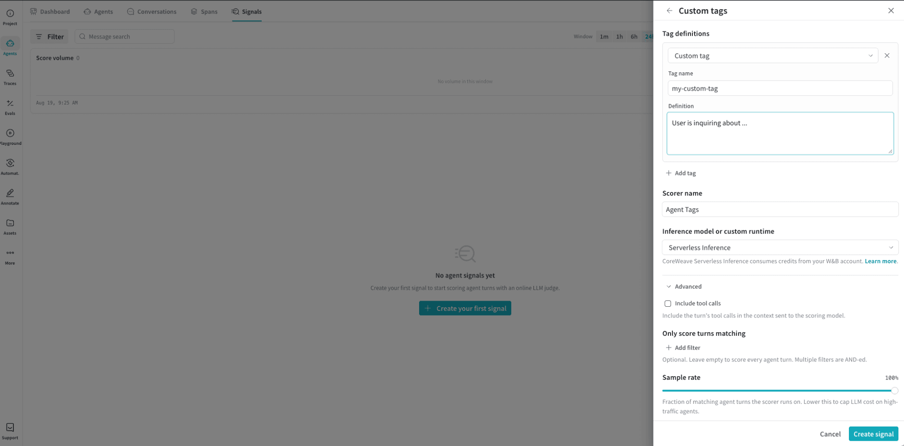

A custom signal scores agent turns against a behavior you define, then shows that result as a tag in the [Agents view](/weave/guides/tracking/view-agent-activity). W&B Weave also provides [built-in signals](/weave/guides/tracking/view-agent-signals) for common cases, such as user frustration and jailbreaking. When those built-in signals don't cover what you want to monitor, create a custom signal. This page shows you how to create that custom tag signal in the Weave UI.

## Create a custom tag signal

To create a custom tag signal:

1. Navigate to [wandb.ai](https://wandb.ai/) and select your project.
1. In the **Weave project sidebar**, click **Agents**.
1. In the tab bar, click **Signals**.
1. On the Signals tab, click **+ Create your first signal**, or **New signal**.
1. In the drawer, click **Custom Signal**.

<Frame>
  
</Frame>

1. In the **Custom tags** drawer, configure the following fields:
    - **Tag name**: The label that appears in the Agents view for the behavior you want to monitor.
    - **Definition**: A prompt that describes the behavior you want the signal to detect. Weave sends this prompt to an LLM judge, which scores each agent turn and applies the tag when the turn matches the behavior. For example, to catch a specific product failure: "The user is discussing errors or issues regarding Product X."
    - **+ Add tag** (Optional): Click to define another tag on the same signal. For example, if you support multiple products, add a separate tag for each product so you can track frustration per product instead of only in aggregate.
    - **Scorer name**: The name for the underlying scorer object.
    - **Inference model or custom runtime**: The model used to score matching turns. [Serverless Inference](/inference/) is the default. CoreWeave Serverless Inference consumes credits from your W&B account.
    - **Include tool calls** (Optional): Expand **Advanced**, then check the box to include the turn's tool calls in the context sent to the scoring model.
    - **Only score turns matching** (Optional): Expand **Advanced**, then add one or more filters to restrict which turns the signal scores, for example by agent, operation, tool, or model. Leave empty to score every agent turn. Weave combines multiple filters with `AND` logic.
    - **Sample rate** (Optional): Expand **Advanced**, then set the fraction of matching agent turns the signal scores. For high-traffic agents, lower the sample rate to score a fraction of matching turns instead of every turn and reduce cost.
1. In the **Custom tags** drawer, click **Create signal**.

After you create the signal, Weave scores matching turns. The tag appears in the Agents view, including on the Signals tab.
