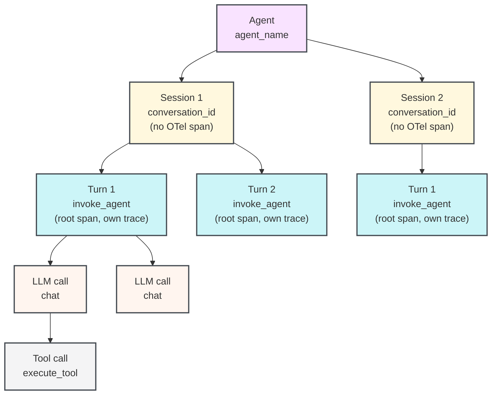

import AgentsPreview from '/snippets/_includes/agents-public-preview.mdx';

<AgentsPreview />

Learn how to instrument a multi-turn agentic application using the W&B Weave SDK so that you can view, debug, and evaluate your agent's behavior. This guide is intended for developers who build or integrate agents and want structured visibility into sessions, turns, LLM calls, and tool executions.

The Weave SDK for Agents models the full lifecycle of a multi-turn agent conversation: the agent that owns many sessions, the session that groups turns together, each user-agent exchange (turn), the LLM calls within a turn, and the tool executions that an LLM triggers. Traces appear in the **Agents** tab of your Weave project. Each session shows a multi-turn timeline with nested tool calls, token usage, and feedback.

Weave is built on [OpenTelemetry (OTel)](https://opentelemetry.io/docs/concepts/), the open standard for distributed tracing. Every turn, LLM call, and tool call emits an OTel _span_ (a structured record of one operation). Each span is tagged with [GenAI semantic-convention](https://opentelemetry.io/docs/specs/semconv/gen-ai/) attributes like `gen_ai.agent.name` and `gen_ai.conversation.id`.

If you're tracing individual functions as Ops with the `@weave.op` decorator, see [Trace LLM applications](/weave/guides/tracking/tracing) instead.

## Before you begin

To get started, install the `weave` package and initialize your project. This step registers your team and project with Weave so that the SDK routes spans to the correct location in the UI.

<Tabs>
<Tab title="Python">

```bash lines
pip install weave
```

Replace `[YOUR-TEAM]` with your W&B team name and `[YOUR-PROJECT]` with your W&B project name.

```python lines
import weave

weave.init("[YOUR-TEAM]/[YOUR-PROJECT]")
```

Call `weave.init()` before any `start_session()`, `start_turn()`, `start_llm()`, `start_tool()`, or `start_subagent()` call. All agent tracing functions no-op silently when tracing is disabled or the init call is absent, so you can leave instrumentation in production code and control it through configuration.

</Tab>
<Tab title="TypeScript">

```bash lines
npm install weave
```

Replace `[YOUR-TEAM]` with your W&B team name and `[YOUR-PROJECT]` with your W&B project name.

```typescript lines twoslash
// @noErrors
import * as weave from 'weave';

await weave.init('[YOUR-TEAM]/[YOUR-PROJECT]');
```

Call `weave.init()` before any `startSession()`, `startTurn()`, `startLLM()`, `startTool()`, or `startSubagent()` call. All agent tracing functions no-op silently when tracing is disabled or the init call is absent, so you can leave instrumentation in production code and control it through configuration.

</Tab>
</Tabs>

## The agent data model

Weave models agent behavior as a hierarchy of one-to-many relationships. Each agent can have many sessions, each session can have many turns, each turn can have many LLM calls, and each LLM call can trigger many tool calls.

| Concept | Weave SDK class | OTel span type | Description | Reference page |
|---|---|---|---|---|
| Agent | *(no class)* | *(no span, grouped by the `agent_name` attribute)* | An agentic application in the Agents tab that contains one or more sessions. | 
| Session | `Conversation` | *(no span, turns are grouped by the `conversation_id` attribute)* | A conversation or run that contains one or more turns. | [Python](/weave/reference/python-sdk#class-conversation) <br /> [TypeScript](/weave/reference/typescript-sdk/classes/conversation) |  
| Turn | `Turn` | `invoke_agent` | One user message and the agent's complete response. | [Python](/weave/reference/python-sdk#class-turn) <br /> [TypeScript](/weave/reference/typescript-sdk/classes/turn) |
| LLM call | `LLM` | `chat` | One call to a language model API. | [Python](/weave/reference/python-sdk#class-llm) <br /> [TypeScript](/weave/reference/typescript-sdk/classes/llm) |
| Tool call | `Tool` | `execute_tool` | One tool call triggered by an LLM response. | [Python](/weave/reference/python-sdk#class-tool) <br /> [TypeScript](/weave/reference/typescript-sdk/classes/tool) |
| Sub-agent call | `SubAgent` | `invoke_agent` | A nested agent invocation, typically when one agent delegates to another. | [Python](/weave/reference/python-sdk#class-subagent) <br /> [TypeScript](/weave/reference/typescript-sdk/classes/subagent) |

The following diagram shows how one agent spans many sessions, one session spans many turns, and so on.



A session groups turns by a shared `conversation_id` attribute rather than a parent span, so each turn starts its own OTel trace. This design supports distributed tracing and parallel execution. The client sends spans directly to the OTel collector without any server-side aggregation.

<Tip>
To integrate Weave with SDKs or harnesses such as the Claude Agent SDK or Codex, see [Trace agent integrations](/weave/guides/tracking/trace-agent-integrations). Weave autopatches into several agent-building SDKs and agent harnesses for quick integration.
</Tip>

## Agent tracing APIs

The following sections describe each top-level tracing function and the arguments it accepts. Use them to instrument the session, turn, LLM call, and tool call layers of the data model described in the previous section.

Weave exposes the following top-level functions. Each function returns an object that works as a context manager (using `with` in Python, or `try/finally` in TypeScript) or that you can close manually by calling `.end()`.

### Start a session

`start_session()` (Python) or `startSession()` (TypeScript) stamps a `conversation_id` attribute on every child span so that turns are grouped in the Agents tab. If you pass a `session_id` / `sessionId`, it must be stable across the lifetime of the conversation. Reuse the same ID to add new turns to an existing session. When you omit it, the SDK generates a UUID automatically.

The active session is stored in context (a Python `ContextVar` or Node.js `AsyncLocalStorage`), so any code running in the same async context can retrieve it with `weave.get_current_session()` / `weave.getCurrentSession()` without passing the session object explicitly.

<Tabs>
<Tab title="Python">

```python lines
session = weave.start_session(
    agent_name="my-agent",    # Optional: identifies the agent in the UI. Omit it and the session isn't grouped under a named agent.
    session_id="",            # Optional: stable ID to group turns; auto-generated when empty.
    model="",                 # Optional: default model for turns in this session.
    session_name="",          # Optional: human-readable label shown in the UI.
    include_content=True,     # Optional: set False to omit message bodies from spans.
    continue_parent_trace=False,  # Optional: attach to an existing OTel trace instead of starting a new one.
)
```

</Tab>
<Tab title="TypeScript">

```typescript lines twoslash
// @noErrors
const session = weave.startSession({
  agentName: 'my-agent',  // Optional: identifies the agent in the UI. Omit it and the session isn't grouped under a named agent.
  sessionId: '',          // Optional: stable ID to group turns, auto-generated when empty.
  model: '',              // Optional: default model for turns in this session.
});
```

</Tab>
</Tabs>

### Start a turn

`start_turn()` (Python) and `startTurn()` (TypeScript) create a new `invoke_agent` span that becomes the root of a new OTel trace. Weave uses this span to represent one complete user-agent exchange in the timeline view.

You can call it two ways:

- **As a top-level function** (`weave.start_turn(...)` / `weave.startTurn(...)`), shown in the examples below. It resolves the active session from context and inherits its conversation ID. If no session is active, the turn is created without a `conversation_id` and isn't grouped with other turns.
- **As an instance method** on a session you hold a reference to (`session.start_turn(...)` / `session.startTurn(...)`). Useful when you have an explicit session object in scope, such as inside a context-manager block. The "Context manager or try-finally pattern" example below uses this form. See the data-model table above for direct links to the `Session`, `Turn`, `LLM`, `Tool`, and `SubAgent` reference pages in both SDKs.

<Tabs>
<Tab title="Python">

```python lines
turn = weave.start_turn(
    user_message="What is the weather in Tokyo?",  # The user's input text.
    agent_name="my-agent",   # Optional: overrides the session-level agent name.
    model="gpt-4o",          # Optional: model used for this turn.
)
```

</Tab>
<Tab title="TypeScript">

```typescript lines twoslash
// @noErrors
const turn = weave.startTurn({
  agentName: 'my-agent',  // Optional: overrides the session-level agent name.
  model: 'gpt-4o',        // Optional: model used for this turn.
});
```

</Tab>
</Tabs>

### Start an LLM call

`start_llm()` / `startLLM()` creates a `chat` span nested under the current turn. Weave uses this span to display token usage, model name, input and output messages, and reasoning in the Agents view.

<Tabs>
<Tab title="Python">

```python lines
llm = weave.start_llm(
    model="gpt-4o",             # The model identifier.
    provider_name="openai",     # Optional: provider name, for example "openai", "anthropic". See note below.
    system_instructions=["Be concise."],  # Optional: system prompt strings.
)
```

</Tab>
<Tab title="TypeScript">

```typescript lines twoslash
// @noErrors
const llm = weave.startLLM({
  model: 'gpt-4o',          // The model identifier.
  providerName: 'openai',   // Optional: provider name, for example "openai", "anthropic". See note below.
});
```

</Tab>
</Tabs>

After the LLM call completes, assign the response data to the `llm` object before it closes:

<Tabs>
<Tab title="Python">

```python lines
with weave.start_llm(model="gpt-4o", provider_name="openai") as llm:
    response = openai_client.chat.completions.create(...)
    llm.input_messages = [Message(role="user", content="...")]
    llm.output_messages = [Message(role="assistant", content=response.choices[0].message.content)]
    llm.usage = Usage(
        input_tokens=response.usage.prompt_tokens,
        output_tokens=response.usage.completion_tokens,
    )
```

</Tab>
<Tab title="TypeScript">

```typescript lines twoslash
// @noErrors
const llm = weave.startLLM({ model: 'gpt-4o', providerName: 'openai' });
try {
  const response = await openaiClient.chat.completions.create({ ... });
  llm.record({
    inputMessages: [{ role: 'user', content: '...' }],
    outputMessages: [{ role: 'assistant', content: response.choices[0].message.content ?? '' }],
    usage: {
      inputTokens: response.usage?.prompt_tokens,
      outputTokens: response.usage?.completion_tokens,
    },
  });
} finally {
  llm.end();
}
```

`llm.record()` is a shortcut for assigning `inputMessages`, `outputMessages`, `usage`, and `reasoning` in one call. You can still set the properties individually if you prefer. The Python SDK exposes the same method as `llm.record(...)` with snake_case keyword arguments.

</Tab>
</Tabs>

Pass `provider_name` / `providerName` explicitly. Weave doesn't infer it from the model string.

### Start a tool call

`start_tool()` / `startTool()` creates an `execute_tool` span. The span becomes a child of whatever OTel span is active in context (typically the `chat` span of the LLM call that produced the tool call).

<Tabs>
<Tab title="Python">

```python lines
tool = weave.start_tool(
    name="get_weather",                  # Tool name as declared to the LLM.
    arguments='{"city": "Tokyo"}',       # JSON string of the tool arguments.
    tool_call_id="call_abc123",          # Optional: tool call ID from the LLM response.
)
```

</Tab>
<Tab title="TypeScript">

```typescript lines twoslash
// @noErrors
const tool = weave.startTool({
  name: 'get_weather',            // Tool name as declared to the LLM.
  args: '{"city": "Tokyo"}',      // Optional: JSON string of the tool arguments.
  toolCallId: 'call_abc123',      // Optional: tool call ID from the LLM response.
});
```

</Tab>
</Tabs>

Assign the tool result before closing:

<Tabs>
<Tab title="Python">

```python lines
with weave.start_tool(name="get_weather", arguments='{"city": "Tokyo"}') as tool:
    result = get_weather_api("Tokyo")
    tool.result = result  # Accepts dict, list, or string. JSON-encoded automatically.
```

</Tab>
<Tab title="TypeScript">

```typescript lines twoslash
// @noErrors
const tool = weave.startTool({ name: 'get_weather', args: '{"city": "Tokyo"}' });
try {
  tool.result = await getWeatherApi('Tokyo');
} finally {
  tool.end();
}
```

</Tab>
</Tabs>

## Usage patterns for agent tracing

The following sections describe how to combine these functions depending on how your agent code is structured.

The following examples use two types from the Weave SDK:

- `Message` ([Python](/weave/reference/python-sdk#class-message) · [TypeScript](/weave/reference/typescript-sdk/interfaces/message)) represents a single entry in a conversation: a user input, an assistant response, a system prompt, or a tool result. Assign a list of messages to `llm.input_messages` / `llm.inputMessages` to record what the model received, and to `llm.output_messages` / `llm.outputMessages` to record what it produced.
- `Usage` ([Python](/weave/reference/python-sdk#class-usage) · [TypeScript](/weave/reference/typescript-sdk/interfaces/usage)) captures token counts from the LLM response and is assigned to `llm.usage`.

Weave uses both to populate the Agents view with the inputs, outputs, and token usage of each LLM call.

### Context manager or try-finally pattern

For most agents, use a context manager pattern in Python or a try-finally pattern in TypeScript. The span closes and sends at the end of the block, even if an exception occurs.

Weave stores the active session, turn, and LLM call in context, so any function called within a block can call `start_llm()` / `startLLM()` or `start_tool()` / `startTool()` without holding an explicit reference to the parent. This works across module boundaries as long as the code runs in the same async context. To retrieve the active objects from anywhere in the call stack, use `weave.get_current_session()` / `weave.getCurrentSession()`, `weave.get_current_turn()` / `weave.getCurrentTurn()`, and `weave.get_current_llm()` / `weave.getCurrentLLM()`.

<Tabs>
<Tab title="Python">

```python lines highlight="13,14,17,25,29"
import weave
from weave.session.session import Message, Usage

# Placeholder functions: replace with your own implementations.
def call_openai(*args, **kwargs):
    pass  # Replace with your LLM client call.

def get_weather_api(city: str) -> str:
    return "24°C, sunny"  # Replace with your weather API call.

weave.init("[YOUR-TEAM]/[YOUR-PROJECT]")

with weave.start_session(agent_name="weather-bot") as session:
    with session.start_turn(user_message="What is the weather in Tokyo?") as turn:

        # First LLM call: returns a tool call.
        with weave.start_llm(model="gpt-4o", provider_name="openai") as llm:
            response = call_openai(...)
            llm.input_messages = [Message(role="user", content="What is the weather?")]
            llm.think("User wants weather data, I should call get_weather.")
            llm.output("Let me check the weather for you.")
            llm.usage = Usage(input_tokens=100, output_tokens=20)

            # Tool call: child of the LLM call that requested it.
            with weave.start_tool(name="get_weather", arguments='{"city":"Tokyo"}') as tool:
                tool.result = get_weather_api("Tokyo")  # Returns "24°C, sunny".

        # Second LLM call: synthesizes the final answer.
        with weave.start_llm(model="gpt-4o", provider_name="openai") as llm:
            llm.input_messages = [Message(role="user", content="What is the weather?")]
            llm.output("It is 24°C and sunny in Tokyo today.")
            llm.usage = Usage(input_tokens=150, output_tokens=30)
```

</Tab>
<Tab title="TypeScript">

```typescript lines highlight="11,13,16,24,35" twoslash
// @noErrors
import * as weave from 'weave';
import type { Message, Usage } from 'weave';

// Placeholder function: replace with your own implementation.
async function getWeatherApi(city: string): Promise<string> {
  return '24°C, sunny';  // Replace with your weather API call.
}

await weave.init('[YOUR-TEAM]/[YOUR-PROJECT]');

const session = weave.startSession({ agentName: 'weather-bot' });
try {
  const turn = session.startTurn({ agentName: 'weather-bot' });
  try {
    // First LLM call: returns a tool call.
    const llm = weave.startLLM({ model: 'gpt-4o', providerName: 'openai' });
    try {
      llm.inputMessages = [{ role: 'user', content: 'What is the weather?' }];
      llm.think('User wants weather data, I should call get_weather.');
      llm.output('Let me check the weather for you.');
      llm.usage = { inputTokens: 100, outputTokens: 20 };

      // Tool call: child of the LLM call that requested it.
      const tool = weave.startTool({ name: 'get_weather', args: '{"city":"Tokyo"}' });
      try {
        tool.result = await getWeatherApi('Tokyo');  // Returns "24°C, sunny".
      } finally {
        tool.end();
      }
    } finally {
      llm.end();
    }

    // Second LLM call: synthesizes the final answer.
    const llm2 = weave.startLLM({ model: 'gpt-4o', providerName: 'openai' });
    try {
      llm2.inputMessages = [{ role: 'user', content: 'What is the weather?' }];
      llm2.output('It is 24°C and sunny in Tokyo today.');
      llm2.usage = { inputTokens: 150, outputTokens: 30 };
    } finally {
      llm2.end();
    }
  } finally {
    turn.end();
  }
} finally {
  session.end();
}
```

</Tab>
</Tabs>

### Manual start and end pattern

Use `.end()` explicitly when you can't use `with` blocks or `try/finally`. For example, when you open and close spans in different function calls, or when you manage async lifecycle outside a coroutine. You're responsible for calling `.end()` on every object you create, so that spans close and flush to the collector.

<Tabs>
<Tab title="Python">

```python lines highlight="1,2,4,9,15"
session = weave.start_session(agent_name="weather-bot")
turn = session.start_turn(user_message="What is the weather?")

llm = weave.start_llm(model="gpt-4o", provider_name="openai")
llm.input_messages = [Message(role="user", content="What is the weather?")]
llm.output("Let me check.")
llm.usage = Usage(input_tokens=100, output_tokens=20)

tool = weave.start_tool(name="get_weather", arguments='{"city": "Tokyo"}')
tool.result = "24°C, sunny"
tool.end()   # end() is idempotent — safe to call more than once.

llm.end()

llm2 = weave.start_llm(model="gpt-4o", provider_name="openai")
llm2.output("It is 24°C and sunny in Tokyo.")
llm2.usage = Usage(input_tokens=150, output_tokens=30)
llm2.end()

turn.end()
session.end()
```

</Tab>
<Tab title="TypeScript">

```typescript lines highlight="1,2,4,9,15" twoslash
// @noErrors
const session = weave.startSession({ agentName: 'weather-bot' });
const turn = session.startTurn({ agentName: 'weather-bot' });

const llm = weave.startLLM({ model: 'gpt-4o', providerName: 'openai' });
llm.inputMessages = [{ role: 'user', content: 'What is the weather?' }];
llm.output('Let me check.');
llm.usage = { inputTokens: 100, outputTokens: 20 };

const tool = weave.startTool({ name: 'get_weather', args: '{"city": "Tokyo"}' });
tool.result = '24°C, sunny';
tool.end();  // end() is idempotent: safe to call more than once.

llm.end();

const llm2 = weave.startLLM({ model: 'gpt-4o', providerName: 'openai' });
llm2.output('It is 24°C and sunny in Tokyo.');
llm2.usage = { inputTokens: 150, outputTokens: 30 };
llm2.end();

turn.end();
session.end();
```

</Tab>
</Tabs>

## Semantic conventions

The Weave SDK emits OTel spans that conform to the [GenAI semantic conventions](https://opentelemetry.io/docs/specs/semconv/gen-ai/gen-ai-spans/) and [GenAI agent span conventions](https://opentelemetry.io/docs/specs/semconv/gen-ai/gen-ai-agent-spans/). Weave accepts any OTel span, stores all attributes, and makes them queryable. You can add arbitrary attributes to spans with the standard OTel span API alongside Weave's tracing objects.

## How spans appear in the Weave UI

After you instrument your agent with the preceding patterns and run it, your traces appear in the **Agents** tab of your Weave project at `https://wandb.ai/[YOUR-TEAM]/[YOUR-PROJECT]/weave/agents`.

- The **Sessions list** shows all sessions with a minimap of turn activity.
- The **multi-turn session view** opens when you click a session and shows each turn, its LLM calls, tool executions, token counts, and any attached feedback.
- Each `chat` span shows the input messages, output messages, model name, and usage.
- Each `execute_tool` span shows the tool name, arguments, and result.

For details on viewing Agents data in Weave, see [View agent activity](/weave/guides/tracking/view-agent-activity).
