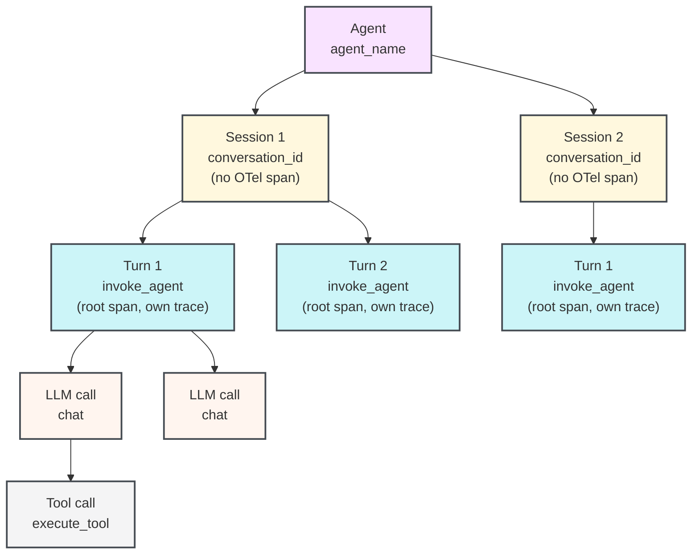

import AgentsPreview from '/snippets/_includes/agents-public-preview.mdx';

<AgentsPreview />

Learn how to instrument a multi-turn agentic application using the W&B Weave SDK so that you can view, debug, and evaluate your agent's behavior. This is intended for developers who are building or integrating agents and want structured visibility into sessions, turns, LLM calls, and tool executions.

The Weave SDK for Agents models the full lifecycle of a multi-turn agent conversation: the agent that owns many sessions, the session that groups turns together, each user-agent exchange (turn), the LLM calls within a turn, and the tool executions that an LLM triggers. Traces appear in the **Agents** tab of your Weave project. Each session shows a multi-turn timeline with nested tool calls, token usage, and feedback.

If you are tracing individual functions as Ops with the `@weave.op` decorator, see [Trace LLM applications](/weave/guides/tracking/tracing) instead.

## Before you begin

To get started, install the `weave` package and initialize your project. This makes Weave aware of your team and project so that spans are routed to the correct location in the UI.

Install Weave and initialize your project:

<Tabs>
<Tab title="Python">

```bash lines
pip install weave
```

Replace `[YOUR-TEAM]` with your W&B team name and `[YOUR-PROJECT]` with your W&B project name.

```python lines
import weave

weave.init("[YOUR-TEAM]/[YOUR-PROJECT]")
```

Call `weave.init()` before any `start_session()`, `start_turn()`, `start_llm()`, or `start_tool()` call. All agent tracing functions no-op silently when tracing is disabled or the init call is absent, so you can leave instrumentation in production code and control it through configuration.

</Tab>
<Tab title="TypeScript">

```bash lines
npm install weave
```

Replace `[YOUR-TEAM]` with your W&B team name and `[YOUR-PROJECT]` with your W&B project name.

```typescript lines
import * as weave from 'weave';

await weave.init('[YOUR-TEAM]/[YOUR-PROJECT]');
```

Call `weave.init()` before any `startSession()`, `startTurn()`, `startLLM()`, or `startTool()` call. All agent tracing functions no-op silently when tracing is disabled or the init call is absent, so you can leave instrumentation in production code and control it through configuration.

</Tab>
</Tabs>

## The agent data model

Weave models agent behavior as a hierarchy of one-to-many relationships. Each agent can have many sessions, each session can have many turns, each turn can have many LLM calls, and each LLM call can trigger many tool calls.

| Concept | Weave SDK class | OTel span type | Description |
|---|---|---|---|
| Agent | *(no class)* | *(no span; grouped by `agent_name`)* | An agentic application in the Agents tab; contains one or more sessions |
| Session | `Session` | *(no span; turns are grouped by `conversation_id`)* | A conversation or run that contains one or more turns |
| Turn | `Turn` | `invoke_agent` | One user message and the agent's complete response |
| LLM call | `LLM` | `chat` | One call to a language model API |
| Tool call | `Tool` | `execute_tool` | One tool call triggered by an LLM response |

The following diagram shows how one agent spans many sessions, one session spans many turns, and so on.



A session groups turns by a shared `conversation_id` attribute rather than a parent span, so each turn starts its own OTel trace. This design supports distributed tracing and parallel execution. The client sends spans directly to the OTel collector without any server-side aggregation.

<Tip>
If you are looking to integrate Weave with popular SDKs or harnesses, such as the Claude Agent SDK or Codex, see the [Weave integration section](/weave/guides/integrations). Weave autopatches into several popular agent-building SDKs and agent harnesses for quick integration.
</Tip>

## Agent tracing APIs

Weave exposes the following top-level functions. Each function returns an object that works as a context manager (using `with` in Python, or `try/finally` in TypeScript) or that you can close manually by calling `.end()`.

### Start a session

`start_session()` / `startSession()` sets a `conversation_id` attribute on all child spans so that turns are grouped in the Agents tab. If you pass a `session_id`, it must be stable across the lifetime of the conversation. Reuse the same ID to add new turns to an existing session. When you omit `session_id`, the SDK generates a UUID automatically.

The active session is stored in context (a Python `ContextVar` or Node.js `AsyncLocalStorage`), so any code running in the same async context can retrieve it with `weave.get_current_session()` / `weave.getCurrentSession()` without passing the session object explicitly.

<Tabs>
<Tab title="Python">

```python lines
session = weave.start_session(
    agent_name="my-agent",    # Required: identifies the agent in the UI.
    session_id="",            # Optional: stable ID to group turns; auto-generated when empty.
    model="",                 # Optional: default model for turns in this session.
    session_name="",          # Optional: human-readable label shown in the UI.
    include_content=True,     # Optional: set False to omit message bodies from spans.
    continue_parent_trace=False,  # Optional: attach to an existing OTel trace instead of starting a new one.
)
```

</Tab>
<Tab title="TypeScript">

```typescript lines
const session = weave.startSession({
  agentName: 'my-agent',  // Optional: identifies the agent in the UI.
  sessionId: '',          // Optional: stable ID to group turns, auto-generated when empty.
  model: '',              // Optional: default model for turns in this session.
});
```

</Tab>
</Tabs>


### Start a turn

`start_turn()` / `startTurn()` creates a new `invoke_agent` span that becomes the root of a new OTel trace. Weave uses this span to represent one complete user-agent exchange in the timeline view.

When called as a top-level function, it resolves the active session from context and inherits its conversation ID. If no session is active, the turn is created without a `conversation_id` and won't be grouped with other turns.

<Tabs>
<Tab title="Python">

```python lines
turn = weave.start_turn(
    user_message="What is the weather in Tokyo?",  # The user's input text.
    agent_name="my-agent",   # Optional: overrides the session-level agent name.
    model="gpt-4o",          # Optional: model used for this turn.
)
```

</Tab>
<Tab title="TypeScript">

```typescript lines
const turn = weave.startTurn({
  agentName: 'my-agent',  // Optional: overrides the session-level agent name.
  model: 'gpt-4o',        // Optional: model used for this turn.
});
```

</Tab>
</Tabs>


### Start an LLM call

`start_llm()` / `startLLM()` creates a `chat` span nested under the current turn. Weave uses this span to display token usage, model name, input and output messages, and reasoning in the Agents view.

<Tabs>
<Tab title="Python">

```python lines
llm = weave.start_llm(
    model="gpt-4o",             # The model identifier.
    provider_name="openai",     # Required: provider name, for example "openai", "anthropic".
    system_instructions=["Be concise."],  # Optional: system prompt strings.
)
```

</Tab>
<Tab title="TypeScript">

```typescript lines
const llm = weave.startLLM({
  model: 'gpt-4o',          // The model identifier.
  providerName: 'openai',   // Optional: provider name, for example "openai", "anthropic".
});
```

</Tab>
</Tabs>


After the LLM call completes, assign the response data to the `llm` object before it closes:

<Tabs>
<Tab title="Python">

```python lines
with weave.start_llm(model="gpt-4o", provider_name="openai") as llm:
    response = openai_client.chat.completions.create(...)
    llm.input_messages = [Message(role="user", content="...")]
    llm.output_messages = [Message(role="assistant", content=response.choices[0].message.content)]
    llm.usage = Usage(
        input_tokens=response.usage.prompt_tokens,
        output_tokens=response.usage.completion_tokens,
    )
```

</Tab>
<Tab title="TypeScript">

```typescript lines
const llm = weave.startLLM({ model: 'gpt-4o', providerName: 'openai' });
try {
  const response = await openaiClient.chat.completions.create({ ... });
  llm.inputMessages = [{ role: 'user', content: '...' }];
  llm.outputMessages = [{ role: 'assistant', content: response.choices[0].message.content ?? '' }];
  llm.usage = {
    inputTokens: response.usage?.prompt_tokens,
    outputTokens: response.usage?.completion_tokens,
  };
} finally {
  llm.end();
}
```

</Tab>
</Tabs>

Pass `provider_name` / `providerName` explicitly. Weave doesn't infer it from the model string.

### Start a tool call

`start_tool()` / `startTool()` creates an `execute_tool` span. The span becomes a child of whatever OTel span is active in context (typically the `chat` span of the LLM call that produced the tool call).

<Tabs>
<Tab title="Python">

```python lines
tool = weave.start_tool(
    name="get_weather",                  # Tool name as declared to the LLM.
    arguments='{"city": "Tokyo"}',       # JSON string of the tool arguments.
    tool_call_id="call_abc123",          # Optional: tool call ID from the LLM response.
)
```

</Tab>
<Tab title="TypeScript">

```typescript lines
const tool = weave.startTool({
  name: 'get_weather',            // Tool name as declared to the LLM.
  args: '{"city": "Tokyo"}',      // Optional: JSON string of the tool arguments.
  toolCallId: 'call_abc123',      // Optional: tool call ID from the LLM response.
});
```

</Tab>
</Tabs>

Assign the tool result before closing:

<Tabs>
<Tab title="Python">

```python lines
with weave.start_tool(name="get_weather", arguments='{"city": "Tokyo"}') as tool:
    result = get_weather_api("Tokyo")
    tool.result = result  # Accepts dict, list, or string. JSON-encoded automatically.
```

</Tab>
<Tab title="TypeScript">

```typescript lines
const tool = weave.startTool({ name: 'get_weather', args: '{"city": "Tokyo"}' });
try {
  tool.result = await getWeatherApi('Tokyo');
} finally {
  tool.end();
}
```

</Tab>
</Tabs>

## Usage patterns for agent tracing

The following sections describe how to combine these functions depending on how your agent code is structured.

The examples below use two types from the Weave SDK:

- `Message` represents a single entry in a conversation: a user input, an assistant response, a system prompt, or a tool result. Assign to `llm.input_messages` / `llm.inputMessages` to record what the model received and produced.
- `Usage` captures token counts from the LLM response and is assigned to `llm.usage`.

Weave uses both to populate the Agents view with the inputs, outputs, and token usage of each LLM call. For all supported data types, see the API reference.

### Context manager / try-finally pattern

The recommended approach for most agents is using a context manager pattern in Python or a try-finally pattern in TypeScript. The span closes and sends at the end of the block, even if an exception occurs.

Weave stores the active session, turn, and LLM call in context, so any function called within a block can call `start_llm()` / `startLLM()` or `start_tool()` / `startTool()` without holding an explicit reference to the parent. This works across module boundaries as long as the code runs in the same async context. To retrieve the active objects from anywhere in the call stack, use `weave.get_current_session()` / `weave.getCurrentSession()`, `weave.get_current_turn()` / `weave.getCurrentTurn()`, and `weave.get_current_llm()` / `weave.getCurrentLLM()`.

<Tabs>
<Tab title="Python">

```python lines highlight="13,14,17,25,29"
import weave
from weave.session.session import Message, Usage

# Placeholder functions: replace with your own implementations.
def call_openai(*args, **kwargs):
    pass  # Replace with your LLM client call.

def get_weather_api(city: str) -> str:
    return "24°C, sunny"  # Replace with your weather API call.

weave.init("[YOUR-TEAM]/[YOUR-PROJECT]")

with weave.start_session(agent_name="weather-bot") as session:
    with session.start_turn(user_message="What is the weather in Tokyo?") as turn:

        # First LLM call: returns a tool call.
        with weave.start_llm(model="gpt-4o", provider_name="openai") as llm:
            response = call_openai(...)
            llm.input_messages = [Message(role="user", content="What is the weather?")]
            llm.think("User wants weather data, I should call get_weather.")
            llm.output("Let me check the weather for you.")
            llm.usage = Usage(input_tokens=100, output_tokens=20)

            # Tool call: child of the LLM call that requested it.
            with weave.start_tool(name="get_weather", arguments='{"city":"Tokyo"}') as tool:
                tool.result = get_weather_api("Tokyo")  # Returns "24°C, sunny".

        # Second LLM call: synthesizes the final answer.
        with weave.start_llm(model="gpt-4o", provider_name="openai") as llm:
            llm.input_messages = [Message(role="user", content="What is the weather?")]
            llm.output("It is 24°C and sunny in Tokyo today.")
            llm.usage = Usage(input_tokens=150, output_tokens=30)
```

</Tab>
<Tab title="TypeScript">

```typescript lines highlight="11,13,16,24,35"
import * as weave from 'weave';
import type { Message, Usage } from 'weave';

// Placeholder function: replace with your own implementation.
async function getWeatherApi(city: string): Promise<string> {
  return '24°C, sunny';  // Replace with your weather API call.
}

await weave.init('[YOUR-TEAM]/[YOUR-PROJECT]');

const session = weave.startSession({ agentName: 'weather-bot' });
try {
  const turn = session.startTurn({ agentName: 'weather-bot' });
  try {
    // First LLM call: returns a tool call.
    const llm = weave.startLLM({ model: 'gpt-4o', providerName: 'openai' });
    try {
      llm.inputMessages = [{ role: 'user', content: 'What is the weather?' }];
      llm.think('User wants weather data, I should call get_weather.');
      llm.output('Let me check the weather for you.');
      llm.usage = { inputTokens: 100, outputTokens: 20 };

      // Tool call: child of the LLM call that requested it.
      const tool = weave.startTool({ name: 'get_weather', args: '{"city":"Tokyo"}' });
      try {
        tool.result = await getWeatherApi('Tokyo');  // Returns "24°C, sunny".
      } finally {
        tool.end();
      }
    } finally {
      llm.end();
    }

    // Second LLM call: synthesizes the final answer.
    const llm2 = weave.startLLM({ model: 'gpt-4o', providerName: 'openai' });
    try {
      llm2.inputMessages = [{ role: 'user', content: 'What is the weather?' }];
      llm2.output('It is 24°C and sunny in Tokyo today.');
      llm2.usage = { inputTokens: 150, outputTokens: 30 };
    } finally {
      llm2.end();
    }
  } finally {
    turn.end();
  }
} finally {
  session.end();
}
```

</Tab>
</Tabs>

### Manual start and end pattern

Use `.end()` explicitly when you can't use `with` blocks or `try/finally`. For example, when spans are opened and closed in different function calls, or when managing async lifecycle outside a coroutine.

<Tabs>
<Tab title="Python">

```python lines highlight="1,2,4,9,15"
session = weave.start_session(agent_name="weather-bot")
turn = session.start_turn(user_message="What is the weather?")

llm = weave.start_llm(model="gpt-4o", provider_name="openai")
llm.input_messages = [Message(role="user", content="What is the weather?")]
llm.output("Let me check.")
llm.usage = Usage(input_tokens=100, output_tokens=20)

tool = weave.start_tool(name="get_weather", arguments='{"city": "Tokyo"}')
tool.result = "24°C, sunny"
tool.end()   # end() is idempotent — safe to call more than once.

llm.end()

llm2 = weave.start_llm(model="gpt-4o", provider_name="openai")
llm2.output("It is 24°C and sunny in Tokyo.")
llm2.usage = Usage(input_tokens=150, output_tokens=30)
llm2.end()

turn.end()
session.end()
```

</Tab>
<Tab title="TypeScript">

```typescript lines highlight="1,2,4,9,15"
const session = weave.startSession({ agentName: 'weather-bot' });
const turn = session.startTurn({ agentName: 'weather-bot' });

const llm = weave.startLLM({ model: 'gpt-4o', providerName: 'openai' });
llm.inputMessages = [{ role: 'user', content: 'What is the weather?' }];
llm.output('Let me check.');
llm.usage = { inputTokens: 100, outputTokens: 20 };

const tool = weave.startTool({ name: 'get_weather', args: '{"city": "Tokyo"}' });
tool.result = '24°C, sunny';
tool.end();  // end() is idempotent: safe to call more than once.

llm.end();

const llm2 = weave.startLLM({ model: 'gpt-4o', providerName: 'openai' });
llm2.output('It is 24°C and sunny in Tokyo.');
llm2.usage = { inputTokens: 150, outputTokens: 30 };
llm2.end();

turn.end();
session.end();
```

</Tab>
</Tabs>

## Semantic conventions

The Weave SDK emits OTel spans that conform to the [GenAI semantic conventions](https://opentelemetry.io/docs/specs/semconv/gen-ai/gen-ai-spans/) and [GenAI agent span conventions](https://opentelemetry.io/docs/specs/semconv/gen-ai/gen-ai-agent-spans/). Any OTel span is accepted. Weave stores all attributes and makes them queryable. You can add arbitrary attributes to spans using the standard OTel span API alongside Weave's tracing objects.

## How spans appear in the Weave UI

Once you run instrumented code, your traces appear in the **Agents** tab of your Weave project at `https://wandb.ai/[YOUR-TEAM]/[YOUR-PROJECT]/weave/agents`.

- The **Sessions list** shows all sessions with a minimap of turn activity.
- Clicking a session opens the **multi-turn session view** showing each turn, its LLM calls, tool executions, token counts, and any attached feedback.
- Each `chat` span shows the input messages, output messages, model name, and usage.
- Each `execute_tool` span shows the tool name, arguments, and result.

For details on viewing Agents data in Weave, see [View agent activity](/weave/guides/tracking/view-agent-activity).
