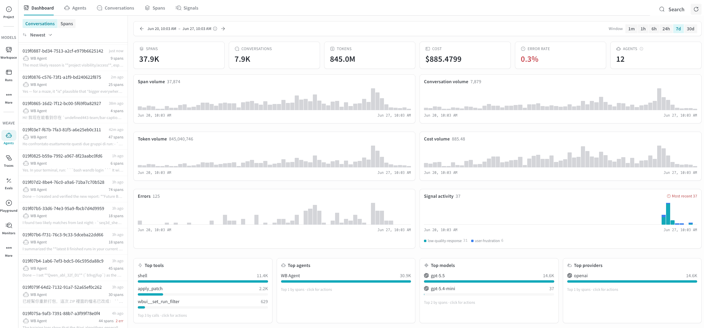
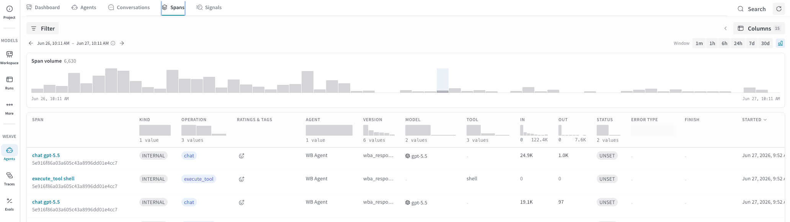

import AgentsPreview from '/snippets/_includes/agents-public-preview.mdx';

<AgentsPreview />

The Agents view gives you a turn-by-turn record of every conversation your agent had, along with token usage, tool invocations, and execution spans.

Agent applications are hard to debug because the interesting behavior happens between the user's request and the final response. The Agents view in W&B Weave makes that middle layer visible. Every conversation your agent had is captured here, with the full message history, span-level execution detail, and token costs attached. You can see at a glance whether an agent completed its task, how many tool calls it made, and where time or budget was spent. For teams building and iterating on agents, this is the starting point for understanding behavior in production.

## Get started

To open the Agents view for your project:

1. Navigate to [https://wandb.ai](https://wandb.ai) and select your project.
2. In the sidebar menu, select **Agents** to view all agent conversations saved for your project.

The Agents view is organized into a row of tabs across the top: **Dashboard**, **Agents**, **Conversations**, **Spans**, and **Signals**. The **Dashboard** tab gives a project-wide overview of agent activity, while the other tabs let you drill into individual agents, conversations, spans, and signals.

## Dashboard tab

The **Dashboard** tab is a project-wide overview of all agent activity. It's designed to be read at a glance, so teams use it as the starting point for a daily health check before drilling into a specific agent or conversation.

At the top, summary cards report totals for the selected time window: **Spans**, **Conversations**, **Tokens**, **Cost**, **Error rate**, and **Agents**. Below the cards, time-series charts plot span, conversation, token, and cost volume over time, alongside error counts and signal activity. The bottom row breaks down the top tools, agents, models, and providers by usage. A list of recent conversations or spans appears on the left, toggleable between **Conversations** and **Spans**, and the time window selector controls the period that every panel reflects.

## Agents tab

The **Agents** tab gives you a high-level view of all agents that have logged
traces to this project. Use it to spot which agents are active and to compare
latency and error rates across agents. It also helps you identify agents that need
attention before drilling into individual conversations.

It's useful for scenarios such as:

- **Monitoring a fleet of agents.** The card grid lets you compare latency and
  error rate across all agents at once without opening individual conversations.
  A latency spike or a newly red error rate on one card signals a regression
  worth investigating.
- **Identifying stale agents.** Sorting by **Last seen** highlights agents that
  haven't recorded activity recently. This is useful for confirming a deployment
  is live or spotting agents that may have stopped logging traces unexpectedly.
- **Comparing versions.** The version count on each card shows how many
  distinct versions of that agent have been deployed. A high version count
  alongside a rising error rate may indicate a regression introduced in a recent
  deployment.
- **Drilling into an agent.** Click any card to open the detail panel for that
  agent, from which you can navigate to its conversations or spans:

### Agent cards

Each agent is represented as a card showing:

| Field | Description |
|---|---|
| **Agent name** | The name logged with the agent's traces. |
| **Last seen** | How long ago the agent last recorded activity. |
| **Version** | The number of distinct `agent_version` values recorded across the agent's spans. |
| **Activity histogram** | A bar chart of recent conversation volume, giving a quick sense of usage trends. |
| **Conversations** | Total number of conversations recorded. |
| **Spans** | Total number of spans recorded across all conversations. |
| **Cost** | Total cost incurred across the agent's conversations. Shows a dash (`-`) when cost data isn't available. |
| **Latency (avg.)** | Average end-to-end duration per invocation. |
| **Error rate** | Percentage of invocations that returned an error. Displays in red when greater than 0%. |

### Find and sort agents

Use the **Search and filter agents** field to find agents by name.

Use the sort dropdown (default: **Last seen**) to reorder the grid. The
available sort options are:

- **Last seen**: Most recently active agents first.
- **Most invocations**: Highest conversation volume first.
- **Most input tokens**: Highest token consumption first.
- **Most errors**: Highest error count first.

Sorting by **Most errors** is useful for a quick daily health check: agents
with non-zero error rates surface immediately, and the red error rate on the
card confirms at a glance which need investigation.

## Conversations tab

The **Conversations** tab on the Agents page lets you browse, filter, and
inspect individual agent runs. Use it to investigate failures, measure token
costs, and understand the sequence of LLM calls and tool executions that made
up a run.

For high-level questions about what an agent said and did across a conversation, start with the Conversations tab.

### Conversations table

The conversation table shows one row per conversation. The following columns
appear by default:

| Column | Description |
|---|---|
| **Conversation** | The conversation ID and a preview of the first message. |
| **Last message** | A preview of the most recent message, with a role indicator. |
| **Spans** | Total number of spans recorded, shown alongside a color-coded strip (described below). Higher span counts indicate more branching or tool use. |
| **Tags** | Signal tags and ratings applied to the conversation. |
| **Agent** | The name of the agent or agents involved. |
| **Invocations** | How many times the agent was invoked during the conversation. |
| **In tokens** | Input tokens consumed. |
| **Out tokens** | Output tokens generated. |
| **Cost** | Total cost of the conversation. |
| **Started** | When the conversation began. |
| **Last activity** | How long ago the last message was recorded. |

The **Spans** column also renders a color-coded strip that previews the
sequence of events in the conversation, using the same event colors as the
[Events timeline](#events). This lets you tell at a glance whether a
conversation was tool-heavy, LLM-heavy, or involved sub-agent delegation
without opening it.

To show or hide additional columns, click **Columns** in the toolbar.

### Filters and time window

Use the **Filter** bar to narrow results by agent, model, error status, or
other attributes.

Custom attributes that you stamp on agent spans with the SDK are also
filterable here. You can filter the conversation
list to a specific value for a specific attribute. 

To show a custom attribute as its own column, click
**Columns** in the toolbar. For how to set these attributes, see [Set
attributes and events on agent spans](/weave/guides/tracking/trace-agents-attributes).

Use the time window selector (**1m**, **1h**, **6h**, **24h**, **7d**, or
**30d**) to restrict the list to conversations that were active within that
period. The conversation volume histogram above the list updates to reflect the
selected window.

Hover over any column header in the conversation list to filter that column to
a specific value or range.

### Agent conversation detail

Click a conversation row to open a detail panel with two sub-panels: **Turns** and **Events**. The panel header shows the agent name and conversation ID, along with **Summarize** (to generate a summary of the conversation) and **Add to dataset** actions.

#### Turns

The conversation detail turns panel shows each turn in chronological order, numbered from 1.

Each turn displays the number of intermediate responses and tool calls, and
the total wall-clock duration. Expand a turn to see the full message thread.

##### Messages

Within a turn, messages are grouped by role.

**User messages** show the message text and any attached media or content
references.

**Assistant messages** show the following:

- The agent name and the model used (for example, `gpt-5.5-2026-04-23`).
- Timestamp and duration.
- Input and output token counts and cost (for example, `18823 in · 96 out · $0.0717`).
- An expandable **Reasoning** section when the model used extended thinking.
- The response text, which collapses automatically for long responses.

**Tool calls** show the tool name, timestamp, and duration. If argument or
result data is available, the tool call is expandable and shows **Args** and
**Result** in a key-value table. If the call failed, an **ERROR** badge
appears.

##### Error states

When a tool call returns an error status, a red **ERROR** badge appears inline
next to it. In the Events timeline, that event also displays in red regardless
of its type.

#### Events

The **Events** panel on the right shows a color-coded strip that represents
the sequence of events within the selected turn.

In the Events timeline, each segment's color indicates the event type.

| Color | Event type |
|---|---|
| Purple | User message |
| Green | Assistant message |
| Blue | Tool call |
| Sienna | Sub-agent invocation |
| Magenta | Agent handoff |
| Gray | Context compaction |
| Red | Any event that returned an error |

Use the Events timeline to get a quick sense of how a turn was structured. For
example, you can see whether it was LLM-heavy, tool-heavy, or involved sub-agent
delegation before reading the full message thread.

##### Scores

If any signals are active for the project, a **Scores** section provides metrics for the conversation. It shows the signal scorer name, an overall numeric rating
from 0 to 1, a confidence percentage, and the individual rubric points that
contributed to the score. Each rubric point also shows its own confidence. Use this to
understand not just whether a turn scored well, but which specific rubric
criteria passed or failed.

##### Meta summary

The **Meta summary** section shows aggregate statistics for the selected
conversation.

| Field | Description |
|---|---|
| **Tokens** | Total input and output tokens. |
| **Cost** | Total cost of the conversation. |
| **Tool calls** | Number of tool calls across all turns. |
| **Messages** | Total message count. |
| **Conversation time** | Wall-clock duration from first to last message. |
| **Turn page** | Which turns are currently displayed, and the total turn count. |

##### Token breakdown

The **Token breakdown** section shows cache and reasoning details for the
selected conversation.

| Field | Description |
|---|---|
| **Cache read** | Tokens served from the prompt cache. |
| **Cache written** | Tokens written to the prompt cache. |
| **Cache hit rate** | Percentage of input tokens served from cache. A higher rate reduces cost and latency. |
| **Reasoning** | Tokens spent on extended thinking. |
| **Reasoning ratio** | Percentage of output tokens spent on extended thinking. |

##### Participants

The **Participants** section lists the agents and models involved in the
conversation. In multi-agent conversations, different turns may show different
model names here.

## Spans tab

The **Spans** tab shows every individual span recorded across all agent
activity in the project. The Conversations tab aggregates activity into
dialogue-level rows. The Spans tab exposes the raw operations underneath: each
LLM call, tool execution, and agent invocation as its own row. Use it to trace
exactly which call was slow, which model consumed unexpected tokens, or which
tool invocation failed.

### Spans table

The span table shares most columns with the Conversations table (agent, model,
tool, token counts, status). Some columns unique to this view are:

| Column | Description |
|---|---|
| **Span** | The span name and ID, with its trace ID below. |
| **Kind** | The OpenTelemetry span kind for this operation (such as `INTERNAL`, `SERVER`, or `CLIENT`). |
| **Operation** | The operation type (such as `chat`, `execute_tool`, or `invoke_agent`). |
| **Ratings & Tags** | Signal ratings and tags applied to the span. |
| **Finish** | The finish reason returned by the model (such as `stop` or `max_tokens`). Populated only for `chat` spans where the model reports a finish reason. |
| **Error type** | The type of error returned by the span, when one occurred. |

Additional columns for cache token breakdowns, reasoning tokens, LLM
parameters, and W&B run metadata are available through the **Columns** button.

The Spans tab is most useful when you need operation-level precision that the
Conversations tab doesn't provide:

- **Identifying expensive calls.** Sort by **In** or **Out** tokens to find
  which individual LLM calls are driving cost, rather than seeing totals at
  the conversation level.
- **Debugging a specific operation type.** Filter by **Operation** to isolate
  all `execute_tool` spans and check error rates, or all `chat` spans for a
  specific model.
- **Investigating truncation.** Filter **Finish** by `max_tokens` to find
  spans where the model hit its token limit rather than completing normally.
- **Correlating with a W&B run.** Hidden-by-default columns expose W&B run IDs
  and run steps, letting you link a specific span back to a training or
  evaluation run in W&B.

### Trace groups

Click any row to select its trace and highlight all other spans that share the same trace ID. This shows you the full set of operations that ran as part of one agent invocation. Grouping here is by trace, not by conversation. This means a single conversation may contain multiple traces if it involved sub-agent delegation.

### Agent invocation detail

Click a row in the **Spans** table to open a detail panel populated with data from the complete agent invocation.

At the top of the detail panel, a bar chart shows the wall-clock
position and relative duration of every span in the selected trace, arranged as
a waterfall. The parent invocation spans the full width, and each child span
appears below it as a colored bar scaled to its actual duration, positioned at
its start time in milliseconds from the beginning of the trace. Use the timeline
to:

- **Spot the longest operation at a glance.** Wide bars indicate spans that
  dominated total latency.
- **See parallelism.** Overlapping bars indicate spans that executed
  concurrently rather than sequentially.
- **Inspect any span inline.** Click a bar in the timeline to load that
  span's details into view, including its input messages and output messages,
  token counts, and other metadata.

You can alternatively view the child spans as a hierarchical trace tree by selecting the **Show trace tree** icon in the detail panel header.

## Signals tab

The **Signals** tab shows tags and ratings for your agent's conversations. Signals surface quality and safety issues to flag problems, find patterns, and highlight the traces that need your attention. Use signals to automatically score the quality of your agent's responses, notice when a user is frustrated, or flag NSFW content.

For setup and detailed usage, see [Monitor your agents with signals](/weave/guides/tracking/view-agent-signals).
