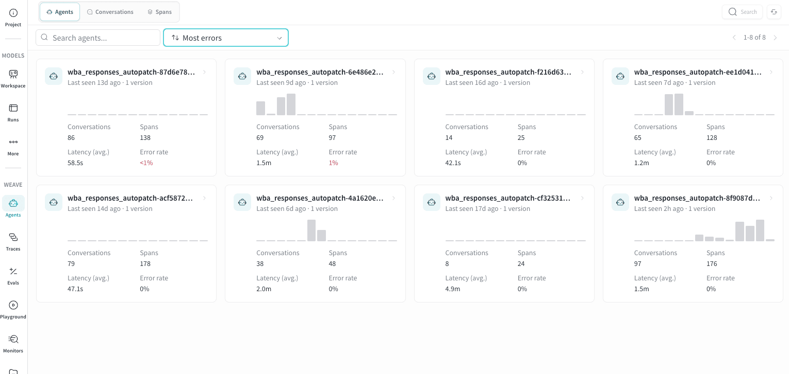
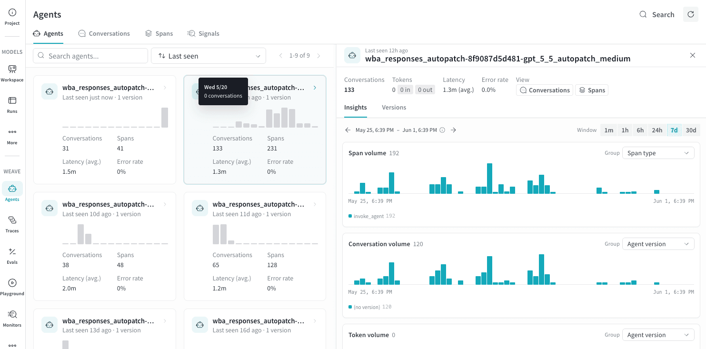
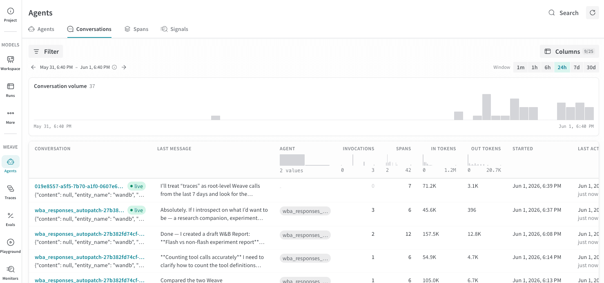
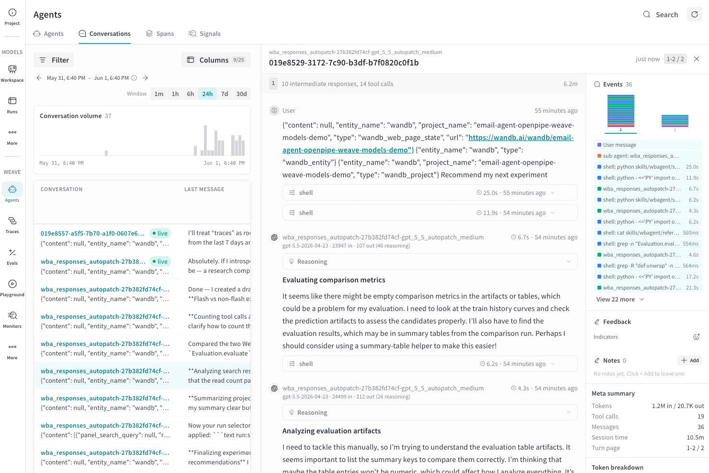
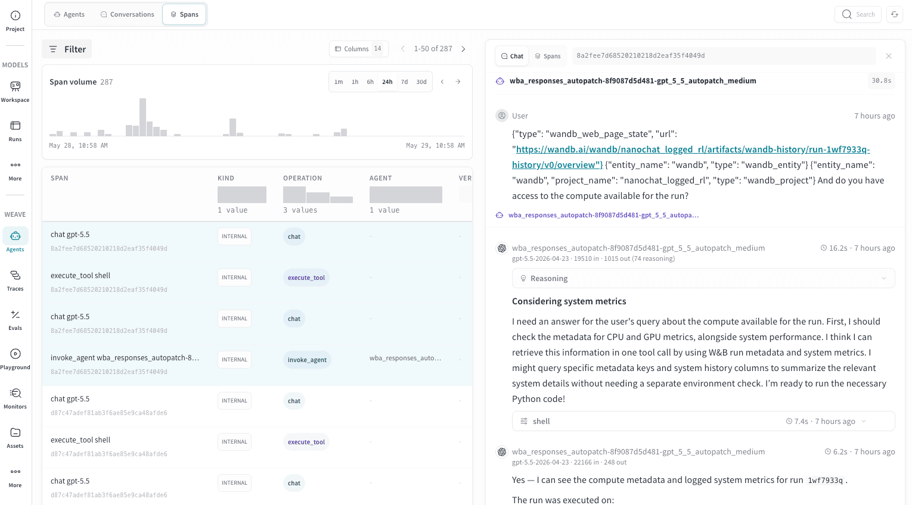
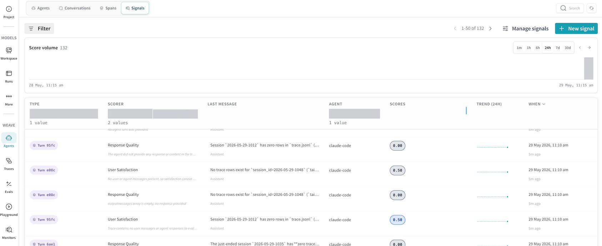

import AgentsPreview from '/snippets/_includes/agents-public-preview.mdx';

<AgentsPreview />

The Agents view gives you a turn-by-turn record of every conversation your agent had, along with token usage, tool invocations, and execution spans.

Agent applications are hard to debug because the interesting behavior happens between the user's request and the final response. The Agents view in W&B Weave makes that middle layer visible. Every conversation your agent had is captured here, with the full message history, span-level execution detail, and token costs attached. You can see at a glance whether an agent completed its task, how many tool calls it made, and where time or budget was spent. For teams building and iterating on agents, this is the starting point for understanding behavior in production.

## Get started

To enter the Agents view:

1. Navigate to [https://wandb.ai](https://wandb.ai) and select your project.
2. In the sidebar menu, select **Agents** to view all agent conversations saved for your project.

## Agents tab

The **Agents** tab gives you a high-level view of all agents that have logged
traces to this project. Use it to spot which agents are active, compare
latency and error rates across agents, and identify agents that need
attention before drilling into individual conversations.

It is useful for scenarios such as:

- **Monitoring a fleet of agents.** The card grid lets you compare latency and
  error rate across all agents at once without opening individual conversations.
  A latency spike or a newly red error rate on one card signals a regression
  worth investigating.
- **Identifying stale agents.** Sorting by **Last seen** highlights agents that
  haven't recorded activity recently. This is useful for confirming a deployment
  is live or spotting agents that may have stopped logging traces unexpectedly.
- **Comparing versions.** The version count on each card tells you how many
  distinct versions of that agent have been deployed. A high version count
  alongside a rising error rate may indicate a regression introduced in a recent
  deployment.
- **Drilling into an agent.** Click any card to open the detail panel for that
  agent, from which you can navigate to its conversations or spans.

### Agent cards

Each agent is represented as a card showing:

| Field | Description |
|---|---|
| **Agent name** | The name logged with the agent's traces. |
| **Last seen** | How long ago the agent last recorded activity. |
| **Version** | The number of distinct `agent_version` values recorded across the agent's spans. |
| **Activity histogram** | A bar chart of recent conversation volume, giving a quick sense of usage trends. |
| **Conversations** | Total number of conversations recorded. |
| **Spans** | Total number of spans recorded across all conversations. |
| **Latency (avg.)** | Average end-to-end duration per invocation. |
| **Error rate** | Percentage of invocations that returned an error. Displays in red when greater than 0%. |

### Find and sort agents

Use the **Search agents** field to filter cards by agent name.

Use the sort dropdown (default: **Last seen**) to reorder the grid. The
available sort options are:

- **Last seen**: Most recently active agents first.
- **Most invocations**: Highest conversation volume first.
- **Most input tokens**: Highest token consumption first.
- **Most errors**: Highest error count first.

Sorting by **Most errors** is useful for a quick daily health check: agents
with non-zero error rates surface immediately, and the red error rate on the
card confirms at a glance which need investigation.

## Conversations tab

The **Conversations** tab on the Agents page lets you browse, filter, and
inspect individual agent runs. Use it to investigate failures, measure token
costs, and understand the sequence of LLM calls and tool executions that made
up a run.

For high-level questions about what an agent said and did across a conversation, start with the Conversations tab.

### Conversations table

The conversation table shows one row per conversation. The following columns
appear by default.

| Column | Description |
|---|---|
| **Conversation** | The conversation ID and a preview of the first message. |
| **Last message** | A preview of the most recent message, with a role indicator. |
| **Agent** | The name of the agent or agents involved. |
| **Invocations** | How many times the agent was invoked during the conversation. |
| **Spans** | Total number of spans recorded. Higher span counts indicate more branching or tool use. |
| **In tokens** | Input tokens consumed. |
| **Out tokens** | Output tokens generated. |
| **Started** | When the conversation began. |
| **Last activity** | How long ago the last message was recorded. |

To show or hide additional columns, click **Columns** in the toolbar.

### Filtering and time window

Use the **Filter** bar to narrow results by agent, model, error status, or
other attributes.

Use the time window selector (**1m**, **1h**, **6h**, **24h**, **7d**, or
**30d**) to restrict the list to conversations that were active within that
period. The conversation volume histogram above the list updates to reflect the
selected window.

Hover over any column header in the conversation list to filter that column to
a specific value or range.

### Agent conversation detail

Click a conversation row to open a detail panel with two sub-tabs: turns and events.

#### Turns

The conversation detail turns panel shows each turn in chronological order, numbered from 1.

Each turn displays the number of intermediate responses and tool calls, and
the total wall-clock duration. Expand a turn to see the full message thread.

##### Messages

Within a turn, messages are grouped by role.

**User messages** show the message text and any attached media or content
references.

**Assistant messages** show:

- The agent name and the model used (for example, `gpt-5.5-2026-04-23`).
- Timestamp and duration.
- Input and output token counts (for example, `16086 in  295 out`).
- An expandable **Reasoning** section when the model used extended thinking.
- The response text, which collapses automatically for long responses.

**Tool calls** show the tool name, timestamp, and duration. If argument or
result data is available, the tool call is expandable and shows **Args** and
**Result** in a key-value table. If the call failed, an **ERROR** badge
appears.

##### Error states

When a tool call returns an error status, a red **ERROR** badge appears inline
next to it. In the Events timeline, that event also displays in red regardless
of its type.

#### Events

The **Events** panel on the right shows a color-coded strip that represents
the sequence of events within the selected turn.

In the events timeline, each segment's color indicates the event type.

| Color | Event type |
|---|---|
| Purple | User message |
| Green | Assistant message |
| Blue | Tool call |
| Sienna | Sub-agent invocation |
| Magenta | Agent handoff |
| Gray | Context compaction |
| Red | Any event that returned an error |

Use the Events timeline to get a quick sense of how a turn was structured. For
example, you can see whether it was LLM-heavy, tool-heavy, or involved sub-agent
delegation before reading the full message thread.

##### Scores

If any signals are active for this project, a **Scores** section provides metrics for the conversation. It shows the signal scorer name, an overall numeric rating
from 0 to 1, a confidence percentage, and the individual rubric points that
contributed to the score. Each rubric point also shows its own confidence. Use this to
understand not just whether a turn scored well, but which specific rubric
criteria passed or failed.

##### Meta summary

The **Meta summary** section shows aggregate statistics for the selected
conversation.

| Field | Description |
|---|---|
| **Tokens** | Total input and output tokens. |
| **Tool calls** | Number of tool calls across all turns. |
| **Messages** | Total message count. |
| **Session time** | Wall-clock duration from first to last message. |
| **Turn page** | Which turns are currently displayed, and the total turn count. |

##### Token breakdown

The **Token breakdown** section shows cache and reasoning details for the
selected conversation.

| Field | Description |
|---|---|
| **Cache read** | Tokens served from the prompt cache. |
| **Cache written** | Tokens written to the prompt cache. |
| **Cache hit rate** | Percentage of input tokens served from cache. A higher rate reduces cost and latency. |
| **Reasoning** | Tokens spent on extended thinking. |
| **Reasoning ratio** | Percentage of output tokens spent on extended thinking. |

##### Participants

The **Participants** section lists the agents and models involved in the
conversation. In multi-agent conversations, different turns may show different
model names here.

## Spans tab

The **Spans** tab shows every individual span recorded across all agent
activity in the project. Where the Conversations tab aggregates activity into
dialogue-level rows, the Spans tab exposes the raw operations underneath: each
LLM call, tool execution, and agent invocation as its own row. Use it to trace
exactly which call was slow, which model consumed unexpected tokens, or which
tool invocation failed.

### Spans table

The span table shares most columns with the Conversations table (agent, model,
tool, token counts, status). Some columns unique to this view are:

| Column | Description |
|---|---|
| **Span** | The span name and ID, with its trace ID below. |
| **Kind** | The OpenTelemetry span kind for this operation (such as `INTERNAL`, `SERVER`, or `CLIENT`). |
| **Operation** | The operation type (such as `chat`, `execute_tool`, or `invoke_agent`). |
| **Finished** | The finish reason returned by the model (such as `stop` or `max_tokens`). Populated only for `chat` spans where the model reports a finish reason. |

Additional columns for cache token breakdowns, reasoning tokens, LLM
parameters, and W&B run metadata are available through the **Columns** button.

The Spans tab is most useful when you need operation-level precision that the
Conversations tab doesn't provide:

- **Identifying expensive calls.** Sort by **In** or **Out** tokens to find
  which individual LLM calls are driving cost, rather than seeing totals at
  the conversation level.
- **Debugging a specific operation type.** Filter by **Operation** to isolate
  all `execute_tool` spans and check error rates, or all `chat` spans for a
  specific model.
- **Investigating truncation.** Filter **Finished** by `max_tokens` to find
  spans where the model hit its token limit rather than completing normally.
- **Correlating with a W&B run.** Hidden-by-default columns expose W&B run IDs
  and run steps, letting you link a specific span back to a training or
  evaluation run in W&B.

### Trace grouping

Click any row to select its trace and highlight all other spans that share the same trace ID. This shows you the full set of operations that were executed as part of one agent invocation. Grouping here is by trace, not by conversation. This means a single conversation may contain multiple traces if it involved sub-agent delegation.

### Agent invocation detail

Click a row in the **Spans** table to open a detail panel with two sub-tabs that are populated with data from the complete agent invocation.

 - **Chat** sub-tab shows the reconstructed conversation for the selected trace, giving
narrative context for the spans you're inspecting.

 - **Spans** sub-tab shows the individual spans belonging to that trace with their
operation, model, and duration. This is useful for comparing timings within a single
trace without scrolling the full list.

## Signals tab

The **Signals** tab shows the output of automated behavioral scoring applied
to your agent's turns. Where the Conversations and Spans tabs tell you *what*
happened, Signals tell you *how well* it happened. They surface quality issues
like low-effort responses or hallucinations, and error conditions like rate
limiting or bugs, without requiring you to read individual traces.

### Signals table

Each row represents one signal score applied to a turn. The following columns
appear by default.

| Column | Description |
|---|---|
| **Type** | The level at which the signal was scored. |
| **Scorer** | The name of the signal that produced this score (for example, **Response Quality** or **User Satisfaction**). |
| **Last message** | A preview of the last message in the scored turn, with the role shown below. |
| **Agent** | The agent associated with the scored turn. |
| **Scores** | The numeric score from 0 to 1. Scores near 0 indicate a detected issue. Scores near 1 indicate no issue detected. |
| **Trend (24h)** | Score trend for this scorer over the past 24 hours. |
| **When** | When the signal was scored. |

- Use the time window selector and **Filter** bar to narrow results by scorer, agent, score range, or time period.
- To add or remove which signals are active for this project, select **Manage signals**.
- To add a new scorer to your agent activity, select **+ New signal**.

For more details on configuring signals, see [Monitor using built-in signals](/weave/guides/evaluation/monitors).
